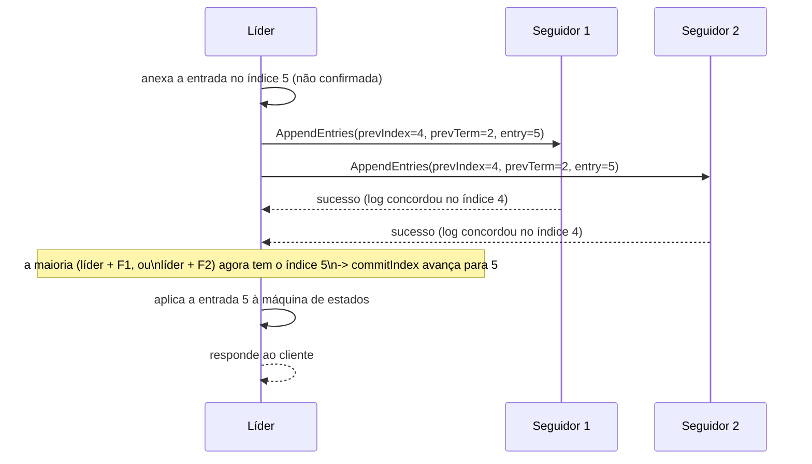

## Objetivos de Aprendizagem

- Descrever como um líder Raft anexa comandos de clientes ao seu próprio log e os replica via RPCs AppendEntries.
- Explicar com precisão quando um líder avança o seu índice de commit, e por que esse limiar específico (uma maioria do cluster, incluindo o líder) é o que torna durável uma entrada confirmada.
- Enunciar a Propriedade de Correspondência de Logs e explicar por que ela permite que a única checagem de consistência de índice/termo anterior do AppendEntries substitua a comparação de históricos de log inteiros.
- Rastrear o que acontece com um seguidor cujo log ficou para trás ou divergiu, e como o líder o traz de volta ao acordo.

## Contexto e Motivação

`raft-leader-election` cobriu como um cluster escolhe um único líder; este conceito cobre o que esse líder de fato faz com a sua autoridade, o coração da propriedade de Ordem da abordagem de máquina de estados replicada, aplicada concretamente. Todo mecanismo aqui existe para garantir uma coisa específica: uma vez que uma entrada é marcada como confirmada, ela vai aparecer, exatamente na mesma posição do log, no log de todo líder futuro, para sempre. É a garantia que `raft-safety-the-election-restriction-and-log-completeness`, a seguir, prova formalmente.

## Teoria Central

### Anexando e replicando: AppendEntries

Uma vez eleito, um líder Raft é o único servidor do cluster que aceita requisições de clientes. Para cada novo comando de cliente, o líder o anexa como uma nova entrada ao seu próprio log local (marcada com o termo atual e o índice da entrada no log), marcando-a, por ora, como **não confirmada**. O líder então envia RPCs **AppendEntries** a todo seguidor, cada um carregando a nova entrada (ou entradas: o AppendEntries pode agrupar várias de uma vez por eficiência) mais o índice e o termo da entrada imediatamente anterior a ela no log do líder. RPCs AppendEntries sem entrada nova alguma também servem de **heartbeats**, que é exatamente o mecanismo no qual `raft-leader-election` se apoia para impedir que os seguidores comecem eleições desnecessárias.

### A Propriedade de Correspondência de Logs

Os logs do Raft são mantidos coesos por uma garantia estrutural forte e demonstrável, a **Propriedade de Correspondência de Logs** (Log Matching Property): se os logs de dois servidores contêm ambos uma entrada com o mesmo índice e o mesmo termo, então os seus logs têm garantia de serem *idênticos* em toda entrada até aquele índice, inclusive. Isso vale porque um líder cria no máximo uma entrada por índice de log por termo (ele nunca reescreve o seu próprio log numa posição que já atribuiu), e porque (como coberto a seguir) a checagem de consistência de uma chamada AppendEntries se recusa a anexar qualquer coisa a menos que o log do seguidor já concorde com o do líder na posição imediatamente anterior às novas entradas. A propriedade significa que um único par (índice, termo) acordado basta para garantir que tudo antes dele também já concorda: comparar um par substitui comparar históricos de log arbitrariamente longos.

### A checagem de consistência do AppendEntries

Quando o líder envia um AppendEntries carregando novas entradas no índice `N`, ele inclui o índice e o termo da entrada `N-1` (a imediatamente anterior). Um seguidor **rejeita** o RPC a menos que o seu próprio log já contenha uma entrada exatamente naquele índice com exatamente aquele termo: se faltar essa entrada no log do seguidor, ou se ele guardar ali um termo diferente (um sinal de que os logs divergiram), ele recusa o anexo e reporta falha. Em caso de falha, o líder decrementa o índice com o qual está tentando casar e tenta de novo com uma entrada anterior, repetindo até encontrar um ponto em que os dois logs concordam (pela Correspondência de Logs, tudo até esse ponto agora tem garantia de ser idêntico), e nesse ponto o líder sobrescreve qualquer coisa no log do seguidor depois desse ponto com as suas próprias entradas, trazendo o seguidor de volta ao acordo.

### Confirmação: quando uma entrada é durável com segurança?

Uma entrada é **confirmada** (committed) quando o líder confirmou que ela foi replicada para (armazenada no log de) uma maioria do cluster, o próprio líder incluído. O líder rastreia isso via o seu **índice de commit** (o maior índice de log que ele sabe estar confirmado) e o avança precisamente quando uma maioria dos valores de `matchIndex` (o registro do líder, por seguidor, de até onde o log de cada seguidor está confirmado como correspondendo ao seu) alcança aquele índice. Crucialmente, confirmar a entrada `N` também garante, por construção, que toda entrada *antes* de `N` no mesmo log esteja confirmada (elas foram necessariamente replicadas para essa mesma maioria primeiro, em ordem). Uma vez confirmada, uma entrada é aplicada à máquina de estados replicada, e o líder pode com segurança responder ao cliente que emitiu o comando correspondente.



## Exemplos Resolvidos

### Exemplo 1: um índice de commit avançando num cluster real de 3 nós

```text
Cluster: Líder L, Seguidores F1, F2. Log inicialmente vazio.

O cliente envia o comando "SET x=1". L o anexa no índice 1 (termo 3, não
confirmado). L envia AppendEntries(prevIndex=0, prevTerm=0 [ou seja,
"nenhuma entrada anterior"], entry=(1,3,"SET x=1")) para F1 e F2.

F1 responde sucesso (o seu log também estava vazio, então prevIndex=0
casa trivialmente). F2 demora a responder.

L agora tem: ele mesmo (tem o índice 1) + F1 (confirmou o índice 1) = 2
de 3 -- uma MAIORIA do cluster de 3 nós. O commitIndex avança para 1,
MESMO QUE F2 ainda não tenha confirmado. L aplica "SET x=1" à sua máquina
de estados e responde ao cliente.

F2 eventualmente responde sucesso também -- L agora sabe que as 3
réplicas têm o índice 1, mas o commitIndex já tinha avançado corretamente
no momento em que uma maioria (2 de 3) confirmou, sem precisar esperar
por F2.
```

### Exemplo 2: trazendo um seguidor divergente de volta ao acordo

```text
Log do líder: [1:"A", 2:"B", 3:"C", 4:"D"] (índice:comando, termos
omitidos por brevidade, suponha todos no termo 5).
Log do seguidor F (divergiu depois que um líder anterior caiu no meio da
replicação): [1:"A", 2:"B", 3:"X"]  <- a entrada 3 é DIFERENTE do "C"
                                          do líder

O líder tenta: AppendEntries(prevIndex=3, prevTerm=5, entries=[4:"D"])
-- F checa o índice 3: F TEM uma entrada no índice 3, mas com um termo
DIFERENTE do que o líder espera ali (a entrada antiga e errada "X" veio
de um termo diferente e anterior) -> F REJEITA.

O líder decrementa, tenta: AppendEntries(prevIndex=2, prevTerm=5,
entries=[3:"C", 4:"D"]) -- F checa o índice 2: a entrada 2 de F ("B")
CASA (mesmo termo) -> F ACEITA e, pelas instruções do líder, APAGA a sua
própria entrada 3 ("X") e tudo depois dela, e então anexa o [3:"C",
4:"D"] do líder.

O log de F agora é [1:"A", 2:"B", 3:"C", 4:"D"] -- idêntico ao do líder,
exatamente como a Propriedade de Correspondência de Logs prevê quando o
acordo é encontrado em algum ponto anterior.
```

### Exemplo 3: por que confirmar a entrada N garante que tudo antes dela também está confirmado

```text
O log do líder tem entradas nos índices de 1 a 5. Suponha que as entradas
1-4 já foram confirmadas em rodadas anteriores (uma maioria anterior já
confirmou cada uma). Agora a entrada 5 é confirmada pela MESMA maioria
(Líder + F1, digamos).

Como o matchIndex de F1 agora é 5, e o log de F1 precisa (pela checagem
de consistência do AppendEntries ter tido sucesso para CHEGAR ao índice
5) já conter as entradas de 1 a 4 também -- F1 não poderia ter aceitado
uma entrada no índice 5 sem que a checagem de consistência do líder
confirmasse primeiro o acordo no índice 4, o que por sua vez exigiu
acordo no índice 3, e assim por diante. Confirmar a 5, portanto, não
precisa reconfirmar separadamente as 1-4 -- a confirmação delas já
estava garantida transitivamente, e é exatamente por isso que o
commitIndex do líder avança para o ÚNICO maior índice confirmado por uma
maioria, sem exigir uma checagem de maioria por índice todo o caminho de
volta até o 1.
```

## Equívocos Comuns e Armadilhas

- **"Uma entrada precisa ser confirmada por TODO seguidor antes de poder ser confirmada."** O Exemplo 1 mostra que a confirmação só exige uma MAIORIA (líder incluído): L confirmou o índice 1 no momento em que F1 (e não F2) confirmou, sem esperar pelo F2 mais lento. Exigir unanimidade faria o sistema inteiro travar em qualquer seguidor isolado lento ou falho, exatamente a fraqueza de ponto único de travamento que a replicação baseada em quórum (`primary-backup-vs-quorum-based-replication`) foi projetada para evitar.
- **"A checagem de consistência do AppendEntries precisa comparar o histórico INTEIRO do log do seguidor com o do líder, entrada por entrada, toda vez."** A Propriedade de Correspondência de Logs é exatamente o que torna isso desnecessário: o Exemplo 2 mostra que o líder só precisa encontrar UM ponto de acordo (trabalhando de trás para frente a partir das entradas mais recentes) para garantir, por essa propriedade, que tudo antes dele já corresponde também.
- **"Um seguidor com log divergente tem um problema sério e difícil de consertar."** O Exemplo 2 mostra que o mecanismo de recuperação do Raft trata isso como um processo inteiramente rotineiro e automático: o líder simplesmente decrementa o seu índice de busca até encontrar acordo, e então sobrescreve o sufixo conflitante do seguidor, sem nenhum tratamento de caso especial além do que o protocolo AppendEntries comum já cobre.

## Resumo

Um líder Raft anexa todo comando de cliente primeiro ao seu próprio log, e depois o replica para os seguidores via RPCs AppendEntries, que também servem de heartbeats quando não carregam entradas novas. A Propriedade de Correspondência de Logs (dois logs que concordam sobre o índice e o termo de uma entrada têm garantia de concordar sobre tudo antes dela também) é o que permite que uma única checagem de consistência da entrada anterior substitua a comparação de históricos de log inteiros, e é exatamente o que permite ao líder localizar e reparar com eficiência um seguidor cujo log divergiu, andando para trás até encontrar acordo e então sobrescrevendo o sufixo conflitante do seguidor. Uma entrada é confirmada, e aplicada com segurança à máquina de estados, no momento em que uma maioria do cluster (líder incluído) a armazenou, sem exigir confirmação unânime, e confirmar uma entrada garante transitivamente que toda entrada anterior já está confirmada também. `raft-safety-the-election-restriction-and-log-completeness`, a seguir, é a prova formal de que esses mecanismos, combinados com a restrição de eleição, nunca deixam dois valores diferentes serem confirmados na mesma posição do log.

## Documentation Links

- [Ongaro & Ousterhout: In Search of an Understandable Consensus Algorithm (Raft, USENIX ATC 2014)](https://raft.github.io/raft.pdf): o artigo fonte da mecânica de replicação de log (AppendEntries, a Propriedade de Correspondência de Logs, a confirmação por maioria via matchIndex) que este conceito percorre por completo.
