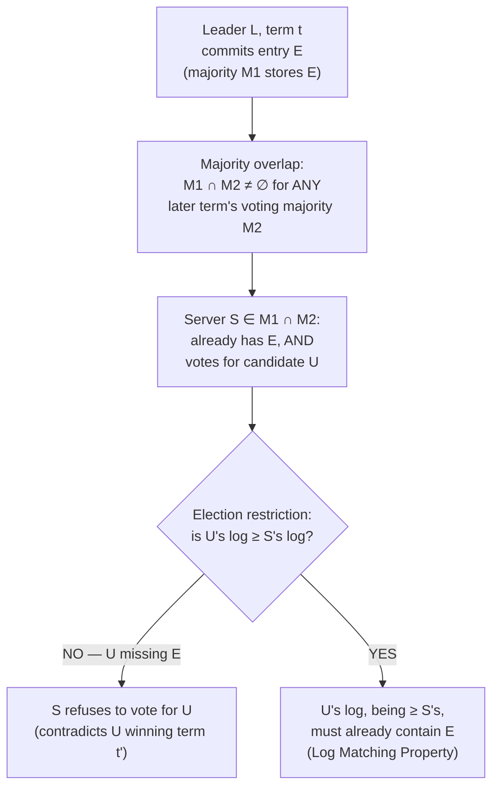

## Learning Objectives

- State the election restriction precisely: a server refuses a RequestVote unless the candidate's log is at least as up-to-date as its own, compared first by the term of each log's last entry, then by length.
- State the Leader Completeness Property: any entry committed in some term is guaranteed to be present in the log of every leader of every later term.
- Walk through the proof of Leader Completeness by contradiction, and identify exactly which single server the majority-overlap argument produces, and why that server's existence is what makes the assumed counter-scenario impossible.
- Explain why this proof, combined with the Log Matching Property from `raft-log-replication-and-commitment`, is exactly the guarantee that two different values can never be committed at the same log position — the guarantee `raft-leader-election` named this concept as covering, by name, from the start.

## Context & Motivation

`raft-leader-election` introduced this concept by name, describing safety as "the actual guarantee, and proof, that these mechanisms never let two different values get committed at the same log position." `raft-log-replication-and-commitment` then sharpened exactly what that guarantee has to deliver: "once an entry is marked committed, it will appear, at the exact same log position, in the log of every future leader, forever." Both of those concepts described the election and replication *mechanisms* — RequestVote, AppendEntries, the commit index — without proving that those mechanisms actually enforce that guarantee. This concept is that proof. It rests on one small, easy-to-miss rule enforced during voting, and one majority-overlap argument that, by now, should look structurally familiar — it is the same overlap idea Paxos's own safety argument used, applied here to logs instead of proposal values.

## Core Theory

### The election restriction: comparing "up-to-dateness"

Every RequestVote RPC a candidate sends carries the index and term of the last entry in the candidate's own log. A voter grants its vote only if, in addition to not having already voted for someone else this term, the candidate's log is **at least as up-to-date** as the voter's own — a comparison made in exactly this order:

```text
1. Compare the TERM of each log's last entry.
   Higher last-entry term wins outright — that log is more
   up-to-date, regardless of length.

2. If the last-entry terms are EQUAL, compare LENGTH.
   The longer log (more entries at that same last term) wins.

If the candidate's log loses this comparison against the
voter's own log, the voter REFUSES the vote, no matter how
high the candidate's term number is.
```

Term is compared before length deliberately: a longer log ending in an older term can still hold entries from a stale, superseded leadership attempt that never got fully replicated, while a shorter log ending in a newer term reflects more recent, more broadly-agreed-upon activity — comparing length first would let exactly the wrong log win.

### The Leader Completeness Property

The election restriction exists to guarantee one specific property: **if a log entry is committed in a given term, that entry is present in the logs of the leaders of every later term.** Equivalently, a server whose log is missing some already-committed entry can never win an election held after that entry was committed — the restriction filters it out before it can become leader at all. This is the property that, combined with the Log Matching Property (two logs agreeing on one entry's index and term are identical up to and including that entry), finally delivers Raft's overall safety guarantee: since every future leader's log already contains every previously committed entry, at the correct index, no future leader can ever overwrite a committed entry with something different, at that same position.

### The proof, by contradiction

Assume, for contradiction, that Leader Completeness fails: some entry `E` was committed in term `t` by leader `L`, but some leader `U` of a later term `t' > t` — take `t'` to be the *smallest* such term — does **not** have `E` in its log.

```text
1. For L to have committed E in term t, a MAJORITY of the
   cluster, M1, must have already stored E (the commitment
   rule from raft-log-replication-and-commitment).

2. For U to have become leader in term t', a MAJORITY of the
   cluster, M2, must have voted for U.

3. M1 and M2 are both majorities of the SAME fixed cluster, so
   they must overlap in at least one server — call it S.

4. S is in M1, so S stored E before L committed it.
   S is in M2, so S voted for U in term t'.

5. But the election restriction says S would only grant that
   vote if U's log, AT THE TIME OF THE VOTE, was already at
   least as up-to-date as S's own log — and S's log already
   contained E at that point. Combined with the Log Matching
   Property, a log that is at least as up-to-date as one
   already containing E, at E's index, cannot itself be
   missing E: it would need a DIFFERENT, non-agreeing entry
   at that same index to be "shorter or equal-term" instead,
   which is exactly what Log Matching rules out once any later
   agreement point exists between the two logs.

6. So U's log must already have contained E — directly
   contradicting the assumption that U was missing E.
```

No such `U` can exist. Every leader of every term after `t` must already hold `E`, which is exactly the Leader Completeness Property. The argument never needed to reason about arbitrarily many future terms one at a time — the smallest counterexample term is enough, because the same overlap argument would apply again to disprove the next one, and the one after that.



## Worked Examples

### Example 1 — the election restriction denying a vote to a stale-log candidate

```text
Cluster: S1..S5. Current leader S1 (term 6) has committed
entries up through index 9. S2, S3 each have index 9 too;
S4 and S5 are lagging, only up to index 7.

S1 crashes. S4's timeout fires first; S4 becomes Candidate for
term 7, sends RequestVote with lastLogIndex=7, lastLogTerm=6.

S2 (lastLogIndex=9, lastLogTerm=6) compares: same last term (6),
but S2's log is LONGER (9 > 7) — S4's log loses the comparison.
S2 REFUSES the vote. S3 does the same. S4 cannot reach a
majority (only S5, itself, plus whichever of S2/S3 it might
still get — neither will grant it) and its election fails,
exactly as the restriction is designed to guarantee: S4 could
never become leader while missing entries 8 and 9, which per
this concept's proof might already be committed.
```

### Example 2 — the restriction granting a vote based on a higher term, despite a shorter log

```text
S3 (lastLogIndex=8, lastLogTerm=7) requests a vote from S2
(lastLogIndex=9, lastLogTerm=6).

Comparison: S3's last-entry TERM (7) is HIGHER than S2's (6) —
S3's log wins the comparison outright, length is never even
consulted. S2 GRANTS the vote. This is deliberate: S3's log
ending in a newer term reflects participation in a more recent
leadership attempt (even if that attempt only got as far as
index 8) and is treated as more authoritative than S2's longer
but older-terminating log, which may hold entries from a
leadership attempt that was itself superseded before finishing
replication.
```

### Example 3 — the contradiction proof made concrete

```text
Term 4: leader S1 commits entry at index 10 ("SET x=1") after
a majority {S1, S2, S3} store it. S1 then crashes.

Suppose (for contradiction, as the proof assumes) some future
leader U for term 5 does NOT have index 10 in its log — say U
is S4, which only ever saw entries up to index 9.

For S4 to win term 5's election, it needs votes from a
majority — 3 of 5. The prior committing majority was
{S1, S2, S3}; S1 is down, so S4's voting majority must be drawn
from {S2, S3, S4, S5}, and MUST include at least one of S2 or
S3 (a 3-of-4 majority among {S2,S3,S4,S5} cannot exclude BOTH
S2 and S3, since that would leave only {S4, S5} — 2 servers,
short of the required 3).

Say S2 is the overlapping server. S2 already has index 10
("SET x=1", term 4). For S2 to vote for S4, S4's log must be
at least as up-to-date as S2's — but S2's log has a later
entry (index 10, term 4) than anything S4 has (only up to
index 9). S2 REFUSES S4's vote. S4 cannot reach a majority
without S2 or S3, and both would refuse for the identical
reason — so S4 (or any server missing index 10) can never
become leader of term 5. The assumed counter-scenario is
impossible, exactly as the general proof predicts.
```

## Common Misconceptions & Pitfalls

- **"The election restriction protects against a server lying about its log."** It does not — the entire argument assumes a voter reports its own log truthfully and a candidate reports its own log's term/index truthfully. This is a **crash-fault** assumption, not a defense against dishonesty; `crash-faults-vs-byzantine-faults`, next, names exactly this assumption and what breaks if a server can lie.
- **"Comparing log length is enough; term doesn't matter."** Example 2 shows the opposite is true — term is compared first and decides the outcome outright when it differs, precisely because a longer log ending in an older, superseded term is a worse (less up-to-date) candidate than a shorter log reflecting more recent activity.
- **"The proof has to separately check every later term, one at a time, forever."** The proof picks the *smallest* offending term `t'` and derives a contradiction from it alone — there is no need to reason about term `t'+1`, `t'+2`, and so on separately, since the same argument, reapplied, would rule out any of those as the smallest offender too.

## Summary

Raft's entire safety case rests on one rule enforced during voting: a server refuses to vote for a candidate whose log is less up-to-date than its own, comparing the term of each log's last entry first, then length. That restriction is exactly what makes the Leader Completeness Property provable — if an entry was committed in some term, every later leader's log must already contain it — via a majority-overlap argument: the majority that stored the committed entry and the majority that voted for any later leader must share at least one server, and that server's own vote would have been refused had the later leader's log been missing the entry. Combined with the Log Matching Property from `raft-log-replication-and-commitment`, this is precisely the guarantee `raft-leader-election` promised this concept would deliver: two different values can never be committed at the same log position, because no future leader can ever exist that would let that happen.

## Documentation Links

- [Ongaro & Ousterhout — In Search of an Understandable Consensus Algorithm (Raft, USENIX ATC 2014)](https://raft.github.io/raft.pdf) — the source paper for the election restriction and the Leader Completeness proof by contradiction this concept works through in full (Section 5.4).
