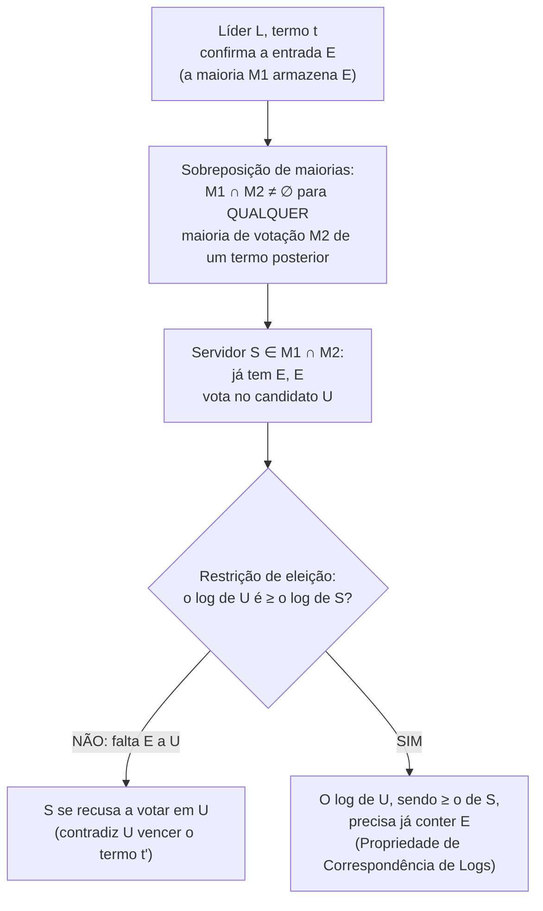

## Objetivos de Aprendizagem

- Enunciar com precisão a restrição de eleição: um servidor recusa um RequestVote a menos que o log do candidato seja pelo menos tão atualizado quanto o seu, comparando primeiro o termo da última entrada de cada log, depois o tamanho.
- Enunciar a Propriedade de Completude do Líder: qualquer entrada confirmada em algum termo tem garantia de estar presente no log de todo líder de todo termo posterior.
- Percorrer a prova da Completude do Líder por contradição, e identificar exatamente qual servidor isolado o argumento de sobreposição de maiorias produz, e por que a existência desse servidor é o que torna impossível o contracenário suposto.
- Explicar por que esta prova, combinada com a Propriedade de Correspondência de Logs de `raft-log-replication-and-commitment`, é exatamente a garantia de que dois valores diferentes nunca podem ser confirmados na mesma posição do log, a garantia que `raft-leader-election` atribuiu pelo nome a este conceito desde o início.

## Contexto e Motivação

`raft-leader-election` apresentou este conceito pelo nome, descrevendo a segurança como "a garantia de fato, e a prova, de que esses mecanismos nunca deixam dois valores diferentes serem confirmados na mesma posição do log". `raft-log-replication-and-commitment` então afiou exatamente o que essa garantia precisa entregar: "uma vez que uma entrada é marcada como confirmada, ela vai aparecer, exatamente na mesma posição do log, no log de todo líder futuro, para sempre". Os dois conceitos descreveram os *mecanismos* de eleição e replicação (RequestVote, AppendEntries, o índice de commit) sem provar que esses mecanismos de fato impõem essa garantia. Este conceito é essa prova. Ela se apoia numa regra pequena e fácil de passar despercebida, imposta durante a votação, e num argumento de sobreposição de maiorias que, a esta altura, deveria parecer estruturalmente familiar: é a mesma ideia de sobreposição que o próprio argumento de segurança do Paxos usava, aplicada aqui a logs em vez de valores de proposta.

## Teoria Central

### A restrição de eleição: comparando o quão "atualizado" está

Todo RPC RequestVote que um candidato envia carrega o índice e o termo da última entrada do próprio log do candidato. Um eleitor concede o seu voto apenas se, além de não ter votado em outra pessoa neste termo, o log do candidato for **pelo menos tão atualizado** quanto o seu, uma comparação feita exatamente nesta ordem:

```text
1. Compare o TERMO da última entrada de cada log.
   O maior termo de última entrada vence de imediato -- esse log é mais
   atualizado, independentemente do tamanho.

2. Se os termos das últimas entradas forem IGUAIS, compare o TAMANHO.
   O log mais longo (mais entradas naquele mesmo último termo) vence.

Se o log do candidato perder esta comparação contra o próprio log do
eleitor, o eleitor RECUSA o voto, não importa quão alto seja o número
de termo do candidato.
```

O termo é comparado antes do tamanho deliberadamente: um log mais longo terminando num termo mais antigo ainda pode guardar entradas de uma tentativa de liderança desatualizada e substituída que nunca chegou a ser totalmente replicada, enquanto um log mais curto terminando num termo mais novo reflete uma atividade mais recente e mais amplamente acordada. Comparar o tamanho primeiro deixaria vencer exatamente o log errado.

### A Propriedade de Completude do Líder

A restrição de eleição existe para garantir uma propriedade específica: **se uma entrada de log é confirmada num dado termo, essa entrada está presente nos logs dos líderes de todo termo posterior.** De forma equivalente, um servidor cujo log não tem alguma entrada já confirmada nunca pode vencer uma eleição realizada depois que essa entrada foi confirmada: a restrição o filtra antes que ele possa sequer se tornar líder. Esta é a propriedade que, combinada com a Propriedade de Correspondência de Logs (dois logs que concordam sobre o índice e o termo de uma entrada são idênticos até aquela entrada, inclusive), finalmente entrega a garantia geral de segurança do Raft: como o log de todo líder futuro já contém toda entrada confirmada anteriormente, no índice correto, nenhum líder futuro pode jamais sobrescrever uma entrada confirmada com algo diferente, naquela mesma posição.

### A prova, por contradição

Suponha, por contradição, que a Completude do Líder falha: alguma entrada `E` foi confirmada no termo `t` pelo líder `L`, mas algum líder `U` de um termo posterior `t' > t` (tome `t'` como o *menor* termo assim) **não** tem `E` no seu log.

```text
1. Para L ter confirmado E no termo t, uma MAIORIA do cluster, M1,
   precisa já ter armazenado E (a regra de confirmação de
   raft-log-replication-and-commitment).

2. Para U ter se tornado líder no termo t', uma MAIORIA do cluster,
   M2, precisa ter votado em U.

3. M1 e M2 são ambas maiorias do MESMO cluster fixo, então precisam
   se sobrepor em pelo menos um servidor -- chame-o de S.

4. S está em M1, então S armazenou E antes que L a confirmasse.
   S está em M2, então S votou em U no termo t'.

5. Mas a restrição de eleição diz que S só concederia esse voto se o
   log de U, NO MOMENTO DO VOTO, já estivesse pelo menos tão
   atualizado quanto o próprio log de S -- e o log de S já continha E
   naquele momento. Combinado com a Propriedade de Correspondência de
   Logs, um log que é pelo menos tão atualizado quanto um que já
   contém E, no índice de E, não pode ele mesmo estar sem E: ele
   precisaria de uma entrada DIFERENTE, que não concorda, naquele
   mesmo índice para ser "mais curto ou de termo igual" em vez disso,
   que é exatamente o que a Correspondência de Logs descarta assim que
   existe qualquer ponto de acordo posterior entre os dois logs.

6. Então o log de U precisa já ter contido E -- contradizendo
   diretamente a suposição de que faltava E a U.
```

Nenhum `U` assim pode existir. Todo líder de todo termo depois de `t` precisa já guardar `E`, que é exatamente a Propriedade de Completude do Líder. O argumento nunca precisou raciocinar sobre arbitrariamente muitos termos futuros um por vez: o menor termo contraexemplo basta, porque o mesmo argumento de sobreposição se aplicaria de novo para refutar o próximo, e o seguinte.



## Exemplos Resolvidos

### Exemplo 1: a restrição de eleição negando um voto a um candidato com log desatualizado

```text
Cluster: S1..S5. O líder atual S1 (termo 6) confirmou entradas até o
índice 9. S2 e S3 também têm o índice 9; S4 e S5 estão atrasados, só até
o índice 7.

S1 cai. O timeout de S4 dispara primeiro; S4 se torna Candidato para o
termo 7, envia RequestVote com lastLogIndex=7, lastLogTerm=6.

S2 (lastLogIndex=9, lastLogTerm=6) compara: mesmo último termo (6), mas
o log de S2 é MAIS LONGO (9 > 7) -- o log de S4 perde a comparação. S2
RECUSA o voto. S3 faz o mesmo. S4 não consegue alcançar uma maioria (só
S5, ele mesmo, mais qualquer um de S2/S3 que ainda pudesse conseguir --
nenhum dos dois vai concedê-lo) e a sua eleição falha, exatamente como a
restrição é projetada para garantir: S4 nunca poderia se tornar líder
sem as entradas 8 e 9, que pela prova deste conceito podem já estar
confirmadas.
```

### Exemplo 2: a restrição concedendo um voto com base num termo maior, apesar de um log mais curto

```text
S3 (lastLogIndex=8, lastLogTerm=7) pede um voto a S2 (lastLogIndex=9,
lastLogTerm=6).

Comparação: o TERMO da última entrada de S3 (7) é MAIOR que o de S2 (6)
-- o log de S3 vence a comparação de imediato, o tamanho nem chega a ser
consultado. S2 CONCEDE o voto. Isto é deliberado: o log de S3 terminando
num termo mais novo reflete a participação numa tentativa de liderança
mais recente (mesmo que essa tentativa só tenha chegado até o índice 8)
e é tratado como mais autoritativo que o log de S2, mais longo mas
terminando num termo mais antigo, que pode guardar entradas de uma
tentativa de liderança que foi ela mesma substituída antes de terminar
a replicação.
```

### Exemplo 3: a prova por contradição tornada concreta

```text
Termo 4: o líder S1 confirma a entrada no índice 10 ("SET x=1") depois
que uma maioria {S1, S2, S3} a armazena. S1 então cai.

Suponha (por contradição, como a prova supõe) que algum líder futuro U
do termo 5 NÃO tem o índice 10 no seu log -- digamos que U é S4, que só
viu entradas até o índice 9.

Para S4 vencer a eleição do termo 5, ele precisa de votos de uma maioria
-- 3 de 5. A maioria que confirmou antes foi {S1, S2, S3}; S1 está fora,
então a maioria de votação de S4 precisa vir de {S2, S3, S4, S5}, e
PRECISA incluir pelo menos um de S2 ou S3 (uma maioria de 3 dentro de
{S2,S3,S4,S5} não pode excluir AMBOS S2 e S3, já que isso deixaria só
{S4, S5} -- 2 servidores, abaixo dos 3 exigidos).

Digamos que S2 é o servidor da sobreposição. S2 já tem o índice 10
("SET x=1", termo 4). Para S2 votar em S4, o log de S4 precisa ser pelo
menos tão atualizado quanto o de S2 -- mas o log de S2 tem uma entrada
posterior (índice 10, termo 4) a qualquer coisa que S4 tenha (só até o
índice 9). S2 RECUSA o voto de S4. S4 não consegue alcançar uma maioria
sem S2 ou S3, e os dois recusariam pela razão idêntica -- então S4 (ou
qualquer servidor sem o índice 10) nunca pode se tornar líder do termo 5.
O contracenário suposto é impossível, exatamente como a prova geral prevê.
```

## Equívocos Comuns e Armadilhas

- **"A restrição de eleição protege contra um servidor mentir sobre o seu log."** Não protege. O argumento inteiro presume que um eleitor reporta o seu próprio log com veracidade e que um candidato reporta com veracidade o termo/índice do seu próprio log. Esta é uma suposição de **falha por queda**, e não uma defesa contra a desonestidade; `crash-faults-vs-byzantine-faults`, a seguir, nomeia exatamente esta suposição e o que quebra se um servidor puder mentir.
- **"Comparar o tamanho do log basta; o termo não importa."** O Exemplo 2 mostra que o oposto é verdade: o termo é comparado primeiro e decide o resultado de imediato quando difere, justamente porque um log mais longo terminando num termo mais antigo e substituído é um candidato pior (menos atualizado) que um log mais curto refletindo atividade mais recente.
- **"A prova precisa checar separadamente cada termo posterior, um por vez, para sempre."** A prova escolhe o *menor* termo infrator `t'` e deriva uma contradição só a partir dele. Não há necessidade de raciocinar separadamente sobre os termos `t'+1`, `t'+2` e assim por diante, já que o mesmo argumento, reaplicado, descartaria qualquer um deles como o menor infrator também.

## Resumo

Todo o argumento de segurança do Raft depende de uma regra imposta durante a votação: um servidor se recusa a votar num candidato cujo log é menos atualizado que o seu, comparando primeiro o termo da última entrada de cada log, depois o tamanho. Essa restrição é exatamente o que torna demonstrável a Propriedade de Completude do Líder (se uma entrada foi confirmada em algum termo, o log de todo líder posterior precisa já contê-la), via um argumento de sobreposição de maiorias: a maioria que armazenou a entrada confirmada e a maioria que votou em qualquer líder posterior precisam compartilhar pelo menos um servidor, e o voto desse servidor teria sido recusado se faltasse a entrada ao log do líder posterior. Combinada com a Propriedade de Correspondência de Logs de `raft-log-replication-and-commitment`, esta é precisamente a garantia que `raft-leader-election` prometeu que este conceito entregaria: dois valores diferentes nunca podem ser confirmados na mesma posição do log, porque nunca pode existir um líder futuro que deixaria isso acontecer.

## Documentation Links

- [Ongaro & Ousterhout: In Search of an Understandable Consensus Algorithm (Raft, USENIX ATC 2014)](https://raft.github.io/raft.pdf): o artigo fonte da restrição de eleição e da prova por contradição da Completude do Líder que este conceito percorre por completo (Seção 5.4).
