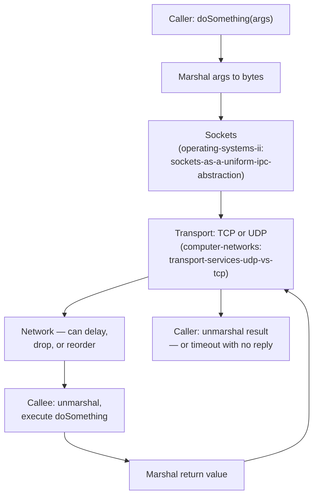

## Learning Objectives

- Explain what an RPC framework has to do that a local function call never has to do: marshal arguments, choose a transport, and handle a callee (or the network to it) that may fail mid-call.
- Name the OS-level and network-level layers a real RPC implementation sits on top of, and what each one does and does not guarantee.
- Distinguish the three distinct things that can go wrong in an RPC (request lost, server crashes, reply lost) and explain why a caller cannot always tell which one happened.
- State honestly what "RPC makes remote calls look local" does and does not achieve.

## Context & Motivation

`why-distributed-systems-are-hard-partial-failure-and-no-shared-state` named the problem: a caller and a callee on different machines share no memory and can't observe each other's failures directly. Remote Procedure Call, first given a rigorous implementation treatment by Birrell & Nelson in 1984, is the abstraction built directly on top of that reality: it lets a programmer write `result = doSomething(args)` and have that call actually execute on a different machine, with the network communication, argument serialization, and dispatch hidden behind ordinary-looking function-call syntax. The abstraction is genuinely useful — it is the single most common way distributed systems are actually built, including every consensus protocol this discipline covers later — but it is an abstraction over something with real cracks, and understanding RPC well is entirely about understanding exactly where those cracks show through.

## Core Theory

### What a local call never has to do

A local function call passes arguments by pushing them (or references to them) onto a stack the callee can read directly, transfers control via a single machine instruction, and is guaranteed either to execute or to not have been reached at all — there is no in-between state where "the call was sort of issued." None of this holds once caller and callee are different machines.

### Marshalling: turning arguments into bytes

Since the callee cannot read the caller's memory, every argument (and eventually the return value, in the other direction) has to be serialized into a byte stream the network can carry and the other side can reconstruct — this includes handling different machine representations (byte order, structure layout) if caller and callee run on different hardware. This step alone has no equivalent in a local call at all.

### The layers underneath: sockets and transport

`sockets-as-a-uniform-ipc-abstraction` (`operating-systems-ii`) is precisely what a real RPC implementation is built on: the OS-level abstraction that lets a process send and receive byte streams to a remote process without caring whether "remote" means another process on the same machine or a machine across the world. On top of that socket, the RPC layer has to make a real, consequential choice of transport — `transport-services-udp-vs-tcp` (`computer-networks`) already laid out the trade-off in general terms: TCP gives a reliable, ordered, in-order byte stream (at the cost of connection setup and head-of-line blocking), while UDP gives no delivery guarantee at all but avoids that overhead. An RPC framework built on TCP still has to handle the callee crashing before or after processing a request; an RPC framework built on UDP additionally has to handle plain packet loss itself, on top of that. Neither choice makes the "did my call actually happen" question in the next concept go away — they only change which layer is responsible for retransmitting lost bytes versus lost *calls*.



### The three things that can actually go wrong

Birrell & Nelson's original paper already had to confront this directly: when a caller's RPC times out waiting for a reply, exactly one of three things happened, and the caller has no local way to know which:

```text
1. The request was lost before it reached the server — the
   server never executed anything.
2. The request arrived and the server executed it fully, but
   the REPLY was lost on the way back — the server's state
   changed, the caller just doesn't know it.
3. The server received the request and is still working on it
   — nothing is lost, the timeout simply fired too early.
```

This is exactly the same silent ambiguity named abstractly in `why-distributed-systems-are-hard-partial-failure-and-no-shared-state`'s Example 1, now attached to the specific mechanism (a timed-out RPC) that makes it concrete and unavoidable in practice. `at-least-once-at-most-once-and-exactly-once-semantics`, next, is entirely about the precise contracts an RPC layer can offer in response to this ambiguity.

## Worked Examples

### Example 1 — a local call vs. the same call made remote

```text
LOCAL:   result = accountService.getBalance(accountId);
  - args passed by reference/value on the shared stack
  - either executes fully, or the whole process (caller
    included) has already crashed — no partial-execution
    state reachable from the caller's perspective

REMOTE (RPC): result = accountService.getBalance(accountId);
  - accountId is MARSHALLED into a byte buffer
  - sent over a socket, over a chosen transport (TCP/UDP)
  - the network can delay, drop, or (with UDP) reorder or
    duplicate the request
  - the server unmarshals it, executes getBalance, marshals
    the result back
  - the caller can observe: a correct reply, a timeout with
    NO way to know if the server actually ran it, or (rarely,
    with certain transports/retries) a duplicate reply
```

Same syntax at the call site in both cases — entirely different failure surface underneath.

### Example 2 — choosing UDP vs. TCP changes WHERE loss is handled, not WHETHER it can happen

```text
RPC built on TCP:
  - TCP guarantees the BYTES of one request/reply round-trip,
    once the connection is established, arrive reliably and
    in order (tcp-reliable-data-transfer-in-practice already
    covers exactly how: sequence numbers, ACKs, retransmission)
  - but TCP cannot promise the SERVER PROCESS was alive to
    receive them, or that it finished executing before crashing
  - the RPC layer still needs its own timeout/retry logic on
    top of TCP's own reliability, at the level of "did my
    CALL succeed", not "did my BYTES arrive"

RPC built on UDP:
  - no delivery guarantee for the request OR the reply at all
  - the RPC layer must implement its own retransmission,
    exactly duplicating some of what TCP already does — but
    with full control over timing, useful for RPCs that need
    an at-most-once cache keyed per-request (see the next
    concept) rather than TCP's generic byte-level retransmission
```

### Example 3 — a request that visibly executes twice

```text
Caller sends withdraw(amount=100) over an RPC built naively on
UDP with a simple "retry after 2 seconds with no reply" policy.

t=0.0s   caller sends withdraw(100)
t=0.3s   server receives it, applies it (balance -= 100),
         sends reply — but the reply packet is lost
t=2.0s   caller's timeout fires (no reply seen), RETRIES:
         sends withdraw(100) AGAIN
t=2.2s   server receives this as a brand new request (it has
         no idea it's a retry) and applies it AGAIN
         (balance -= 100 a second time)

Net effect: the account was debited twice for one logical
withdrawal. This is a naive at-least-once retry with no
de-duplication — exactly the failure mode the next concept's
at-most-once and exactly-once contracts exist to prevent.
```

## Common Misconceptions & Pitfalls

- **"RPC makes remote calls exactly like local calls, so I can reason about them the same way."** RPC makes remote calls *look syntactically* like local calls — it does not, and cannot, make them behave identically underneath: a local call can't partially execute or duplicate itself, a remote one genuinely can (Example 3). Code that assumes RPC failure modes are the same as local exceptions will handle exactly the wrong set of cases.
- **"If I use TCP under my RPC, I don't need to worry about lost requests."** TCP guarantees the bytes of an established connection arrive reliably, but it says nothing about the server process's liveness or about what happens if the connection itself is torn down and re-established mid-call (Example 2) — TCP solves byte-level reliability, not call-level "did my RPC actually happen" semantics.
- **"A timeout means the server didn't do anything."** As Example 1 and the parent concept's ambiguous-silence example both show, a timeout is consistent with the server having fully executed the request and only the reply being lost — assuming otherwise and blindly retrying non-idempotent operations (like a withdrawal) causes real duplicate-execution bugs, exactly as in Example 3.

## Summary

Remote Procedure Call gives a caller ordinary function-call syntax for an operation that actually executes on a different machine, but underneath that syntax it has to do real work with no local equivalent: marshalling arguments into bytes, choosing and living with the guarantees (or lack of them) of a transport built on top of `sockets-as-a-uniform-ipc-abstraction` and `transport-services-udp-vs-tcp`, and confronting a genuine, unavoidable ambiguity whenever a call times out — the request may never have arrived, may have executed fully with only the reply lost, or may simply still be in progress. This ambiguity cannot be resolved by better engineering at the RPC layer alone; it can only be given a precise, named contract, which is exactly what the next concept, at-least-once/at-most-once/exactly-once semantics, provides.

## Documentation Links

- [Birrell & Nelson — Implementing Remote Procedure Calls (1984)](http://www.bitsavers.org/pdf/xerox/parc/techReports/CSL-83-7_Implementing_Remote_Procedure_Calls.pdf) — the original, rigorous RPC implementation paper this concept's marshalling, transport-layering, and three-way timeout-ambiguity treatment is based on.
- [MIT 6.5840 — Lecture Schedule](https://pdos.csail.mit.edu/6.824/schedule.html) — the course syllabus that grounds RPC's failure semantics in the same distributed-systems curriculum this discipline draws its protocol coverage from.
