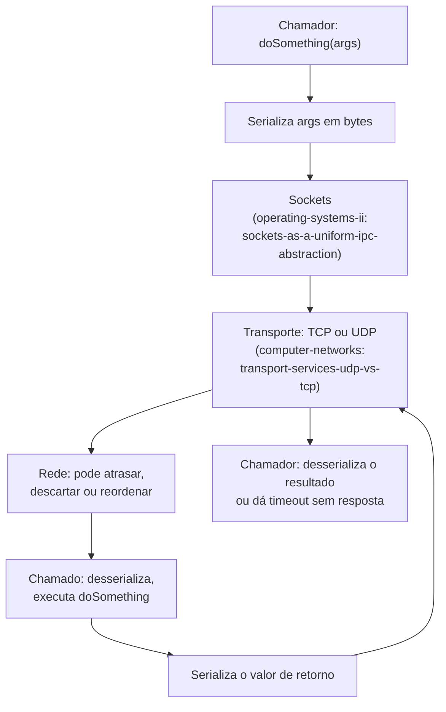

## Objetivos de Aprendizagem

- Explicar o que um framework de RPC precisa fazer que uma chamada de função local nunca precisa: serializar argumentos, escolher um transporte e lidar com um chamado (ou a rede até ele) que pode falhar no meio da chamada.
- Nomear as camadas no nível do SO e no nível da rede sobre as quais uma implementação real de RPC se apoia, e o que cada uma garante e não garante.
- Distinguir as três coisas distintas que podem dar errado num RPC (requisição perdida, servidor cai, resposta perdida) e explicar por que um chamador nem sempre consegue saber qual delas aconteceu.
- Enunciar honestamente o que "o RPC faz chamadas remotas parecerem locais" alcança e não alcança.

## Contexto e Motivação

`why-distributed-systems-are-hard-partial-failure-and-no-shared-state` nomeou o problema: um chamador e um chamado em máquinas diferentes não compartilham memória e não conseguem observar diretamente as falhas um do outro. A Remote Procedure Call (chamada de procedimento remoto), que recebeu pela primeira vez um tratamento de implementação rigoroso de Birrell & Nelson em 1984, é a abstração construída diretamente sobre essa realidade: ela permite a um programador escrever `result = doSomething(args)` e fazer essa chamada de fato executar numa máquina diferente, com a comunicação de rede, a serialização de argumentos e o despacho escondidos atrás de uma sintaxe de chamada de função de aparência comum. A abstração é genuinamente útil (é a forma mais comum de fato de construir sistemas distribuídos, incluindo todo protocolo de consenso que esta disciplina cobre mais adiante), mas é uma abstração sobre algo com rachaduras reais, e entender bem RPC é inteiramente uma questão de entender exatamente onde essas rachaduras aparecem.

## Teoria Central

### O que uma chamada local nunca precisa fazer

Uma chamada de função local passa argumentos empilhando-os (ou referências a eles) numa pilha que o chamado consegue ler diretamente, transfere o controle via uma única instrução de máquina, e tem a garantia de ou executar ou não ter sido alcançada de forma alguma: não existe estado intermediário em que "a chamada foi meio que emitida". Nada disso se sustenta quando chamador e chamado são máquinas diferentes.

### Marshalling: transformando argumentos em bytes

Como o chamado não consegue ler a memória do chamador, todo argumento (e, em algum momento, o valor de retorno, na outra direção) precisa ser serializado num fluxo de bytes que a rede consiga carregar e que o outro lado consiga reconstruir, o que inclui tratar representações de máquina diferentes (ordem de bytes, layout de estruturas) se chamador e chamado rodarem em hardware diferente. Só este passo já não tem equivalente algum numa chamada local.

### As camadas por baixo: sockets e transporte

`sockets-as-a-uniform-ipc-abstraction` (`operating-systems-ii`) é precisamente aquilo sobre o qual uma implementação real de RPC é construída: a abstração no nível do SO que permite a um processo enviar e receber fluxos de bytes para um processo remoto sem se importar se "remoto" significa outro processo na mesma máquina ou uma máquina do outro lado do mundo. Sobre esse socket, a camada de RPC precisa fazer uma escolha real e com consequências sobre o transporte. `transport-services-udp-vs-tcp` (`computer-networks`) já expôs o trade-off em termos gerais: o TCP dá um fluxo de bytes confiável e ordenado (ao custo do estabelecimento de conexão e do bloqueio head-of-line), enquanto o UDP não dá garantia de entrega alguma, mas evita esse overhead. Um framework de RPC construído sobre TCP ainda precisa tratar o chamado caindo antes ou depois de processar uma requisição; um framework de RPC construído sobre UDP precisa, além disso, tratar ele mesmo a simples perda de pacotes. Nenhuma das escolhas faz a pergunta "minha chamada de fato aconteceu?" do próximo conceito desaparecer; elas só mudam qual camada é responsável por retransmitir bytes perdidos versus *chamadas* perdidas.



### As três coisas que podem de fato dar errado

O artigo original de Birrell & Nelson já precisou enfrentar isso diretamente: quando o RPC de um chamador dá timeout esperando uma resposta, exatamente uma de três coisas aconteceu, e o chamador não tem forma local de saber qual:

```text
1. A requisição se perdeu antes de chegar ao servidor -- o
   servidor nunca executou nada.
2. A requisição chegou e o servidor a executou por completo, mas
   a RESPOSTA se perdeu no caminho de volta -- o estado do
   servidor mudou, o chamador só não sabe disso.
3. O servidor recebeu a requisição e ainda está trabalhando nela
   -- nada se perdeu, o timeout simplesmente disparou cedo demais.
```

Esta é exatamente a mesma ambiguidade silenciosa nomeada em abstrato no Exemplo 1 de `why-distributed-systems-are-hard-partial-failure-and-no-shared-state`, agora presa ao mecanismo específico (um RPC que deu timeout) que a torna concreta e inevitável na prática. `at-least-once-at-most-once-and-exactly-once-semantics`, a seguir, trata inteiramente dos contratos precisos que uma camada de RPC pode oferecer em resposta a essa ambiguidade.

## Exemplos Resolvidos

### Exemplo 1: uma chamada local vs. a mesma chamada feita remota

```text
LOCAL:   result = accountService.getBalance(accountId);
  - args passados por referência/valor na pilha compartilhada
  - ou executa por completo, ou o processo inteiro (incluindo o
    chamador) já caiu -- nenhum estado de execução parcial
    alcançável da perspectiva do chamador

REMOTA (RPC): result = accountService.getBalance(accountId);
  - accountId é SERIALIZADO num buffer de bytes
  - enviado por um socket, sobre um transporte escolhido (TCP/UDP)
  - a rede pode atrasar, descartar ou (com UDP) reordenar ou
    duplicar a requisição
  - o servidor a desserializa, executa getBalance, serializa o
    resultado de volta
  - o chamador pode observar: uma resposta correta, um timeout SEM
    forma de saber se o servidor de fato a executou, ou (raramente,
    com certos transportes/retentativas) uma resposta duplicada
```

Mesma sintaxe no ponto de chamada nos dois casos, superfície de falhas inteiramente diferente por baixo.

### Exemplo 2: escolher UDP vs. TCP muda ONDE a perda é tratada, não SE ela pode acontecer

```text
RPC construído sobre TCP:
  - o TCP garante que os BYTES de uma ida e volta de requisição/resposta,
    uma vez estabelecida a conexão, cheguem de forma confiável e em
    ordem (tcp-reliable-data-transfer-in-practice já cobre exatamente
    como: números de sequência, ACKs, retransmissão)
  - mas o TCP não consegue prometer que o PROCESSO SERVIDOR estava vivo
    para recebê-los, ou que terminou de executar antes de cair
  - a camada de RPC ainda precisa da sua própria lógica de timeout/
    retentativa em cima da confiabilidade do próprio TCP, no nível de
    "minha CHAMADA deu certo", e não de "meus BYTES chegaram"

RPC construído sobre UDP:
  - nenhuma garantia de entrega nem para a requisição NEM para a resposta
  - a camada de RPC precisa implementar a sua própria retransmissão,
    duplicando exatamente parte do que o TCP já faz -- mas com controle
    total sobre o timing, útil para RPCs que precisam de um cache
    at-most-once indexado por requisição (veja o próximo conceito) em
    vez da retransmissão genérica no nível de bytes do TCP
```

### Exemplo 3: uma requisição que visivelmente executa duas vezes

```text
O chamador envia withdraw(amount=100) por um RPC construído ingenuamente
sobre UDP com uma política simples de "tentar de novo depois de 2 segundos
sem resposta".

t=0.0s   o chamador envia withdraw(100)
t=0.3s   o servidor a recebe, a aplica (balance -= 100),
         envia a resposta -- mas o pacote de resposta se perde
t=2.0s   o timeout do chamador dispara (nenhuma resposta vista), TENTA
         DE NOVO: envia withdraw(100) OUTRA VEZ
t=2.2s   o servidor recebe isto como uma requisição novinha (ele não faz
         ideia de que é uma retentativa) e a aplica OUTRA VEZ
         (balance -= 100 uma segunda vez)

Efeito líquido: a conta foi debitada duas vezes por um único saque
lógico. Isto é uma retentativa at-least-once ingênua sem deduplicação --
exatamente o modo de falha que os contratos at-most-once e exactly-once
do próximo conceito existem para evitar.
```

## Equívocos Comuns e Armadilhas

- **"O RPC torna chamadas remotas exatamente iguais a chamadas locais, então posso raciocinar sobre elas do mesmo jeito."** O RPC faz chamadas remotas *parecerem sintaticamente* chamadas locais; ele não faz, e não consegue fazer, que elas se comportem de forma idêntica por baixo: uma chamada local não consegue executar parcialmente nem se duplicar, uma remota genuinamente consegue (Exemplo 3). Código que presume que os modos de falha do RPC são os mesmos de exceções locais vai tratar exatamente o conjunto errado de casos.
- **"Se eu usar TCP por baixo do meu RPC, não preciso me preocupar com requisições perdidas."** O TCP garante que os bytes de uma conexão estabelecida cheguem de forma confiável, mas não diz nada sobre a vivacidade do processo servidor nem sobre o que acontece se a própria conexão for derrubada e restabelecida no meio da chamada (Exemplo 2). O TCP resolve a confiabilidade no nível de bytes, e não a semântica no nível de chamada de "meu RPC de fato aconteceu?".
- **"Um timeout significa que o servidor não fez nada."** Como o Exemplo 1 e o exemplo do silêncio ambíguo do conceito pai mostram, um timeout é consistente com o servidor ter executado a requisição por completo e só a resposta ter se perdido. Presumir o contrário e tentar de novo às cegas operações não idempotentes (como um saque) causa bugs reais de execução duplicada, exatamente como no Exemplo 3.

## Resumo

A Remote Procedure Call dá a um chamador a sintaxe comum de chamada de função para uma operação que de fato executa numa máquina diferente, mas por baixo dessa sintaxe ela precisa fazer um trabalho real sem equivalente local: serializar argumentos em bytes, escolher e conviver com as garantias (ou a falta delas) de um transporte construído sobre `sockets-as-a-uniform-ipc-abstraction` e `transport-services-udp-vs-tcp`, e enfrentar uma ambiguidade genuína e inevitável sempre que uma chamada dá timeout: a requisição pode nunca ter chegado, pode ter executado por completo com só a resposta perdida, ou pode simplesmente ainda estar em andamento. Essa ambiguidade não pode ser resolvida só com engenharia melhor na camada de RPC; ela só pode receber um contrato preciso e nomeado, que é exatamente o que o próximo conceito, a semântica at-least-once/at-most-once/exactly-once, fornece.

## Documentation Links

- [Birrell & Nelson: Implementing Remote Procedure Calls (1984)](http://www.bitsavers.org/pdf/xerox/parc/techReports/CSL-83-7_Implementing_Remote_Procedure_Calls.pdf): o artigo original e rigoroso de implementação de RPC no qual se baseia o tratamento deste conceito sobre marshalling, camadas de transporte e a ambiguidade de timeout em três vias.
- [MIT 6.5840: Lecture Schedule](https://pdos.csail.mit.edu/6.824/schedule.html): o programa do curso que fundamenta a semântica de falhas do RPC no mesmo currículo de sistemas distribuídos do qual esta disciplina extrai a sua cobertura de protocolos.
