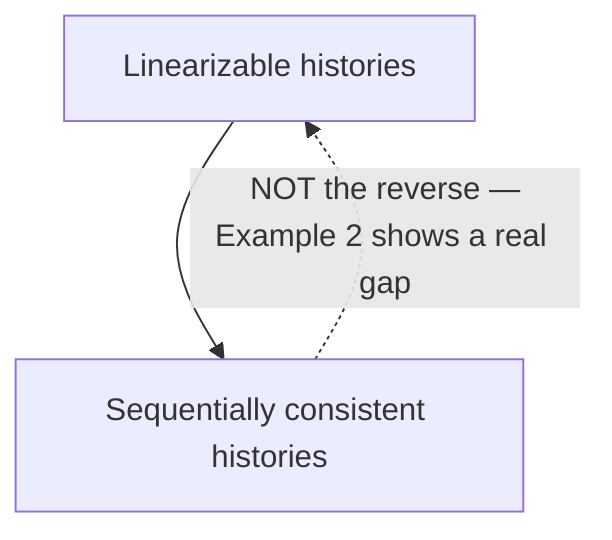

## Learning Objectives

- Define sequential consistency: a single global interleaving of all operations that preserves each process's own program order, with no real-time constraint across processes.
- Prove, by construction, that every linearizable history is sequentially consistent.
- Construct a concrete counterexample showing a sequentially consistent history that is not linearizable — the exact point where the two models diverge.
- Explain why a system might deliberately choose sequential consistency over linearizability, and what it gains by doing so.

## Context & Motivation

`linearizability-a-rigorous-definition` established the strongest common consistency model, anchored by a real-time constraint: non-overlapping operations must be linearized in the real-time order they actually occurred. Sequential consistency, defined earlier by Lamport in a different context (multiprocessor memory models) and contrasted directly against linearizability in Herlihy & Wing's own paper, keeps almost everything about linearizability except that one real-time constraint — and understanding exactly what is lost by dropping it is the entire content of this concept.

## Core Theory

### The definition: one global order, respecting only per-process program order

A history is **sequentially consistent** if there exists *some* legal sequential interleaving of all operations from all processes such that:

```text
1. The interleaving is a legal sequential history (same
   condition 1 as linearizability — a legal single-copy
   execution).
2. Each individual process's own operations appear in the
   interleaving in the SAME order that process issued them
   (program order is preserved, per-process).
```

Notice what is missing compared to linearizability: there is no requirement that this global interleaving respect the *real-time* order of non-overlapping operations issued by *different* processes. As long as each process's own operations stay in its own order, the interleaving is free to place two different processes' non-overlapping operations in an order that contradicts when they actually, observably occurred in real time.

### Every linearizable history is sequentially consistent

This follows directly from the definitions: linearizability already requires a legal sequential interleaving (condition 1, shared with sequential consistency) that additionally respects real-time ordering for non-overlapping operations (condition 2). Because each process's own operations, issued one at a time by that single process, can never overlap with each other, linearizability's condition 2 already forces them into their own real, and therefore also into their own issued, order — satisfying sequential consistency's program-order requirement as a strict subset of what linearizability already guarantees. A linearizable history therefore automatically satisfies both of sequential consistency's requirements.

### Not every sequentially consistent history is linearizable

The reverse direction fails precisely because sequential consistency drops the cross-process real-time constraint. A system can be sequentially consistent while allowing an interleaving that looks, from an external, real-time-aware observer's point of view, like it silently reordered two different clients' non-overlapping operations — as long as neither client's own sequence of operations is internally reordered. Example 2 below makes this concrete.



### Why a real system might deliberately choose the weaker model

Sequential consistency is strictly easier to implement efficiently than linearizability precisely because it does not need to track or enforce real-time ordering across processes — a system can, for instance, let each process talk to a nearby replica and only needs to guarantee that replica's own operations, and every other replica's own operations, get merged into one order that respects each process's private sequence, without needing a global, real-time-synchronized coordination point for every single operation. This is a genuine engineering trade-off, not a compromise made only out of necessity — some applications (traditional multiprocessor memory models, which is where Lamport originally defined sequential consistency, are the classic example) never actually need the stronger real-time guarantee and benefit from the extra implementation freedom.

## Worked Examples

### Example 1 — confirming the "every linearizable history is sequentially consistent" direction

```text
From linearizability-a-rigorous-definition's Example 1:
  Op A: write(x=1)  [invoke=0, respond=3]
  Op B: read(x)     [invoke=2, respond=4]  -> returns 1
Linearized order: A then B (both single-process operations,
trivially in their own program order). This same order (A
then B) is ALSO a valid sequentially-consistent interleaving
— it's a legal sequential history, and it's the only operation
each process issued, so program order is trivially preserved.
Every linearizable history hands sequential consistency its
interleaving for free, exactly as the general argument above
predicts.
```

### Example 2 — a sequentially consistent history that is NOT linearizable

```text
Process P1: write(x=1) [invoke=0, respond=1]
Process P2: write(x=2) [invoke=2, respond=3]
             — P1's write fully completes BEFORE P2's write
               even starts; they do NOT overlap.

Process P3: read(x) [invoke=4, respond=5] -> returns 2
Process P4: read(x) [invoke=6, respond=7] -> returns 1

LINEARIZABILITY check: P1's write (finishes at t=1) and P2's
write (starts at t=2) don't overlap, so linearizability's
condition 2 FORCES P1's write to linearize before P2's write.
Once x=2 is written (linearized) before P3 and P4's reads (at
t=4 and t=6, both strictly after P2's write completed at t=3),
BOTH reads must return 2 in ANY linearizable history — so P4
returning 1 makes this history NOT linearizable.

SEQUENTIAL CONSISTENCY check: is there SOME legal sequential
interleaving, respecting only each process's own (trivial,
single-operation) program order, that's consistent? Try:
  write(x=1) [P1], read(x)->1 [P4], write(x=2) [P2], read(x)->2 [P3]
This is a legal single-copy sequence (each read sees the most
recent preceding write) and trivially respects each process's
own program order (each process only issued one operation).
This history IS sequentially consistent — even though it is
NOT linearizable, because the chosen interleaving places P4's
read BEFORE P2's write, contradicting the real-time fact that
P2's write (finishing at t=3) occurred well before P4's read
(starting at t=6).
```

### Example 3 — why the gap matters in practice

```text
A client (P4 above) that just finished reading x=1 might
reasonably assume, in a linearizable system, "any write that
completed before my read started must be visible to me" — and
build logic on that assumption (e.g., "if I don't see my
friend's post, they haven't actually posted yet"). In a merely
sequentially consistent system, Example 2 shows this
assumption can be VIOLATED: P2's write genuinely completed
(at t=3) well before P4's read even started (at t=6), yet P4
still observed the OLD value. This is exactly the kind of
surprising, hard-to-debug behavior that motivates being
precise about which consistency model a system actually
provides, rather than assuming "consistent" always means the
strongest version.
```

## Common Misconceptions & Pitfalls

- **"Sequential consistency and linearizability are basically the same thing in practice."** Example 2 is a concrete, real counterexample where the two definitively diverge — a system correctly described as sequentially consistent can produce a result (P4 reading a stale value well after the fresh write completed) that a linearizable system is specifically guaranteed never to produce.
- **"Preserving program order for each process is the hard part, and dropping the real-time constraint doesn't really change much."** The real-time constraint is precisely the part that lets a real-time-aware external observer's expectations (Example 3) be trusted — dropping it is what gives sequential consistency its implementation freedom, but it is a genuine, observable weakening, not a minor technicality.
- **"A weaker consistency model is just a worse, cheaper version of a stronger one, so always prefer the strongest available."** As the "why a real system might choose it" section argues, sequential consistency's weaker guarantee buys real implementation freedom (no need to coordinate real-time ordering globally) that some applications never actually need — the right choice depends on what the application actually requires, a theme the CAP theorem, next but one, makes unavoidable.

## Summary

Sequential consistency requires a single, legal sequential interleaving of every process's operations that preserves each process's own program order — but, unlike linearizability, imposes no requirement that this interleaving respect the real-time order of non-overlapping operations issued by different processes. Every linearizable history is automatically sequentially consistent (each process's own operations trivially stay in their own real-time, and therefore issued, order), but the reverse fails, as a concrete counterexample shows: a sequentially consistent system can let a read observe a stale value well after a fresher write has already fully completed, exactly the surprising behavior linearizability is specifically designed to rule out. This genuine gap is the reason a distributed system's documentation naming its actual consistency model precisely — not just calling it "consistent" — matters.

## Documentation Links

- [Herlihy & Wing — Linearizability: A Correctness Condition for Concurrent Objects (1990)](https://cs.brown.edu/people/mph/HerlihyW90/p463-herlihy.pdf) — the paper this concept contrasts sequential consistency against directly, specifically the real-time constraint (its condition 2) that sequential consistency drops.
