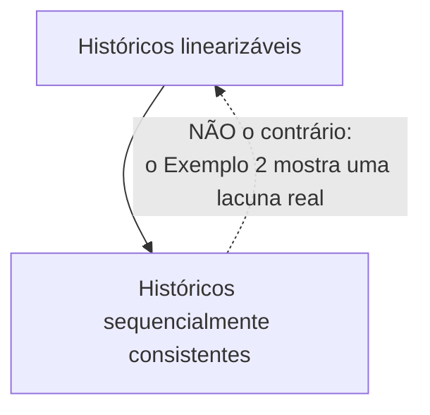

## Objetivos de Aprendizagem

- Definir consistência sequencial: uma única intercalação global de todas as operações que preserva a própria ordem de programa de cada processo, sem restrição de tempo real entre processos.
- Provar, por construção, que todo histórico linearizável é sequencialmente consistente.
- Construir um contraexemplo concreto mostrando um histórico sequencialmente consistente que não é linearizável, o ponto exato onde os dois modelos divergem.
- Explicar por que um sistema poderia escolher deliberadamente a consistência sequencial em vez da linearizabilidade, e o que ele ganha ao fazer isso.

## Contexto e Motivação

`linearizability-a-rigorous-definition` estabeleceu o modelo de consistência comum mais forte, ancorado por uma restrição de tempo real: operações não sobrepostas precisam ser linearizadas na ordem de tempo real em que de fato ocorreram. A consistência sequencial, definida antes por Lamport num contexto diferente (modelos de memória de multiprocessadores) e contrastada diretamente com a linearizabilidade no próprio artigo de Herlihy & Wing, mantém quase tudo da linearizabilidade, exceto essa única restrição de tempo real, e entender exatamente o que se perde ao descartá-la é todo o conteúdo deste conceito.

## Teoria Central

### A definição: uma ordem global, respeitando apenas a ordem de programa de cada processo

Um histórico é **sequencialmente consistente** se existe *alguma* intercalação sequencial legal de todas as operações de todos os processos tal que:

```text
1. A intercalação é um histórico sequencial legal (a mesma condição
   1 da linearizabilidade -- uma execução legal de cópia única).
2. As operações de cada processo individual aparecem na intercalação
   na MESMA ordem em que aquele processo as emitiu (a ordem de
   programa é preservada, por processo).
```

Note o que falta em comparação com a linearizabilidade: não há nenhuma exigência de que esta intercalação global respeite a ordem de *tempo real* de operações não sobrepostas emitidas por processos *diferentes*. Desde que as próprias operações de cada processo fiquem na sua própria ordem, a intercalação é livre para colocar operações não sobrepostas de dois processos diferentes numa ordem que contradiz quando elas de fato, observavelmente, ocorreram no tempo real.

### Todo histórico linearizável é sequencialmente consistente

Isto decorre diretamente das definições: a linearizabilidade já exige uma intercalação sequencial legal (condição 1, compartilhada com a consistência sequencial) que adicionalmente respeita a ordem de tempo real de operações não sobrepostas (condição 2). Como as próprias operações de cada processo, emitidas uma por vez por aquele único processo, nunca podem se sobrepor entre si, a condição 2 da linearizabilidade já as força para a sua própria ordem real e, portanto, também para a sua própria ordem de emissão, satisfazendo o requisito de ordem de programa da consistência sequencial como um subconjunto estrito do que a linearizabilidade já garante. Um histórico linearizável, portanto, satisfaz automaticamente os dois requisitos da consistência sequencial.

### Nem todo histórico sequencialmente consistente é linearizável

A direção inversa falha justamente porque a consistência sequencial descarta a restrição de tempo real entre processos. Um sistema pode ser sequencialmente consistente e ao mesmo tempo permitir uma intercalação que parece, do ponto de vista de um observador externo ciente do tempo real, ter reordenado silenciosamente as operações não sobrepostas de dois clientes diferentes, desde que a sequência de operações de nenhum cliente seja reordenada internamente. O Exemplo 2 abaixo torna isso concreto.



### Por que um sistema real poderia escolher deliberadamente o modelo mais fraco

A consistência sequencial é estritamente mais fácil de implementar com eficiência do que a linearizabilidade justamente porque não precisa rastrear nem impor a ordem de tempo real entre processos. Um sistema pode, por exemplo, deixar cada processo falar com uma réplica próxima e só precisa garantir que as próprias operações daquela réplica, e as próprias operações de toda outra réplica, sejam mescladas numa ordem que respeite a sequência privada de cada processo, sem precisar de um ponto de coordenação global e sincronizado em tempo real para cada operação. Este é um trade-off de engenharia genuíno, e não uma concessão feita só por necessidade: algumas aplicações (os modelos de memória tradicionais de multiprocessadores, onde Lamport originalmente definiu a consistência sequencial, são o exemplo clássico) nunca precisam de fato da garantia mais forte de tempo real e se beneficiam da liberdade extra de implementação.

## Exemplos Resolvidos

### Exemplo 1: confirmando a direção "todo histórico linearizável é sequencialmente consistente"

```text
Do Exemplo 1 de linearizability-a-rigorous-definition:
  Op A: write(x=1)  [invocação=0, resposta=3]
  Op B: read(x)     [invocação=2, resposta=4]  -> retorna 1
Ordem linearizada: A depois B (ambas operações de um único processo,
trivialmente na sua própria ordem de programa). Esta mesma ordem (A
depois B) é TAMBÉM uma intercalação sequencialmente consistente válida
-- é um histórico sequencial legal, e é a única operação que cada
processo emitiu, então a ordem de programa é trivialmente preservada.
Todo histórico linearizável entrega de graça a sua intercalação à
consistência sequencial, exatamente como o argumento geral acima prevê.
```

### Exemplo 2: um histórico sequencialmente consistente que NÃO é linearizável

```text
Processo P1: write(x=1) [invocação=0, resposta=1]
Processo P2: write(x=2) [invocação=2, resposta=3]
             -- a escrita de P1 completa por inteiro ANTES que a
                escrita de P2 sequer comece; elas NÃO se sobrepõem.

Processo P3: read(x) [invocação=4, resposta=5] -> retorna 2
Processo P4: read(x) [invocação=6, resposta=7] -> retorna 1

Checagem de LINEARIZABILIDADE: a escrita de P1 (termina em t=1) e a
escrita de P2 (começa em t=2) não se sobrepõem, então a condição 2 da
linearizabilidade FORÇA a escrita de P1 a linearizar antes da de P2.
Uma vez que x=2 é escrito (linearizado) antes das leituras de P3 e P4
(em t=4 e t=6, ambas estritamente depois que a escrita de P2 completou
em t=3), AMBAS as leituras precisam retornar 2 em QUALQUER histórico
linearizável -- então P4 retornar 1 torna este histórico NÃO
linearizável.

Checagem de CONSISTÊNCIA SEQUENCIAL: existe ALGUMA intercalação
sequencial legal, respeitando só a ordem de programa (trivial, de uma
operação) de cada processo, que seja consistente? Tente:
  write(x=1) [P1], read(x)->1 [P4], write(x=2) [P2], read(x)->2 [P3]
Esta é uma sequência legal de cópia única (cada leitura vê a escrita
precedente mais recente) e trivialmente respeita a própria ordem de
programa de cada processo (cada processo só emitiu uma operação).
Este histórico É sequencialmente consistente -- mesmo NÃO sendo
linearizável, porque a intercalação escolhida coloca a leitura de P4
ANTES da escrita de P2, contradizendo o fato de tempo real de que a
escrita de P2 (terminando em t=3) ocorreu bem antes da leitura de P4
(começando em t=6).
```

### Exemplo 3: por que a lacuna importa na prática

```text
Um cliente (P4 acima) que acabou de ler x=1 poderia razoavelmente
presumir, num sistema linearizável, "qualquer escrita que completou
antes de a minha leitura começar precisa estar visível para mim" -- e
construir lógica sobre essa suposição (ex.: "se eu não vejo o post do
meu amigo, ele ainda não postou de fato"). Num sistema meramente
sequencialmente consistente, o Exemplo 2 mostra que essa suposição pode
ser VIOLADA: a escrita de P2 genuinamente completou (em t=3) bem antes
de a leitura de P4 sequer começar (em t=6), e mesmo assim P4 observou
o valor ANTIGO. Este é exatamente o tipo de comportamento surpreendente
e difícil de depurar que motiva ser preciso sobre qual modelo de
consistência um sistema de fato fornece, em vez de presumir que
"consistente" sempre significa a versão mais forte.
```

## Equívocos Comuns e Armadilhas

- **"Consistência sequencial e linearizabilidade são basicamente a mesma coisa na prática."** O Exemplo 2 é um contraexemplo concreto e real em que as duas definitivamente divergem: um sistema corretamente descrito como sequencialmente consistente pode produzir um resultado (P4 lendo um valor desatualizado bem depois que a escrita nova completou) que um sistema linearizável tem a garantia específica de nunca produzir.
- **"Preservar a ordem de programa de cada processo é a parte difícil, e descartar a restrição de tempo real não muda muita coisa."** A restrição de tempo real é justamente a parte que permite confiar nas expectativas de um observador externo ciente do tempo real (Exemplo 3). Descartá-la é o que dá à consistência sequencial a sua liberdade de implementação, mas é um enfraquecimento genuíno e observável, e não um detalhe técnico menor.
- **"Um modelo de consistência mais fraco é só uma versão pior e mais barata de um mais forte, então prefira sempre o mais forte disponível."** Como a seção "por que um sistema real poderia escolhê-lo" argumenta, a garantia mais fraca da consistência sequencial compra uma liberdade de implementação real (nenhuma necessidade de coordenar a ordem de tempo real globalmente) da qual algumas aplicações nunca de fato precisam. A escolha certa depende do que a aplicação de fato exige, um tema que o teorema CAP, logo depois do próximo, torna inescapável.

## Resumo

A consistência sequencial exige uma única intercalação sequencial legal das operações de todos os processos que preserve a própria ordem de programa de cada processo, mas, diferente da linearizabilidade, não impõe nenhuma exigência de que essa intercalação respeite a ordem de tempo real de operações não sobrepostas emitidas por processos diferentes. Todo histórico linearizável é automaticamente sequencialmente consistente (as próprias operações de cada processo trivialmente ficam na sua própria ordem de tempo real e, portanto, de emissão), mas o inverso falha, como um contraexemplo concreto mostra: um sistema sequencialmente consistente pode deixar uma leitura observar um valor desatualizado bem depois que uma escrita mais nova já completou por inteiro, exatamente o comportamento surpreendente que a linearizabilidade é especificamente projetada para descartar. Esta lacuna genuína é a razão pela qual importa que a documentação de um sistema distribuído nomeie com precisão o seu modelo de consistência real, e não apenas o chame de "consistente".

## Documentation Links

- [Herlihy & Wing: Linearizability: A Correctness Condition for Concurrent Objects (1990)](https://cs.brown.edu/people/mph/HerlihyW90/p463-herlihy.pdf): o artigo com o qual este conceito contrasta diretamente a consistência sequencial, especificamente a restrição de tempo real (a sua condição 2) que a consistência sequencial descarta.
