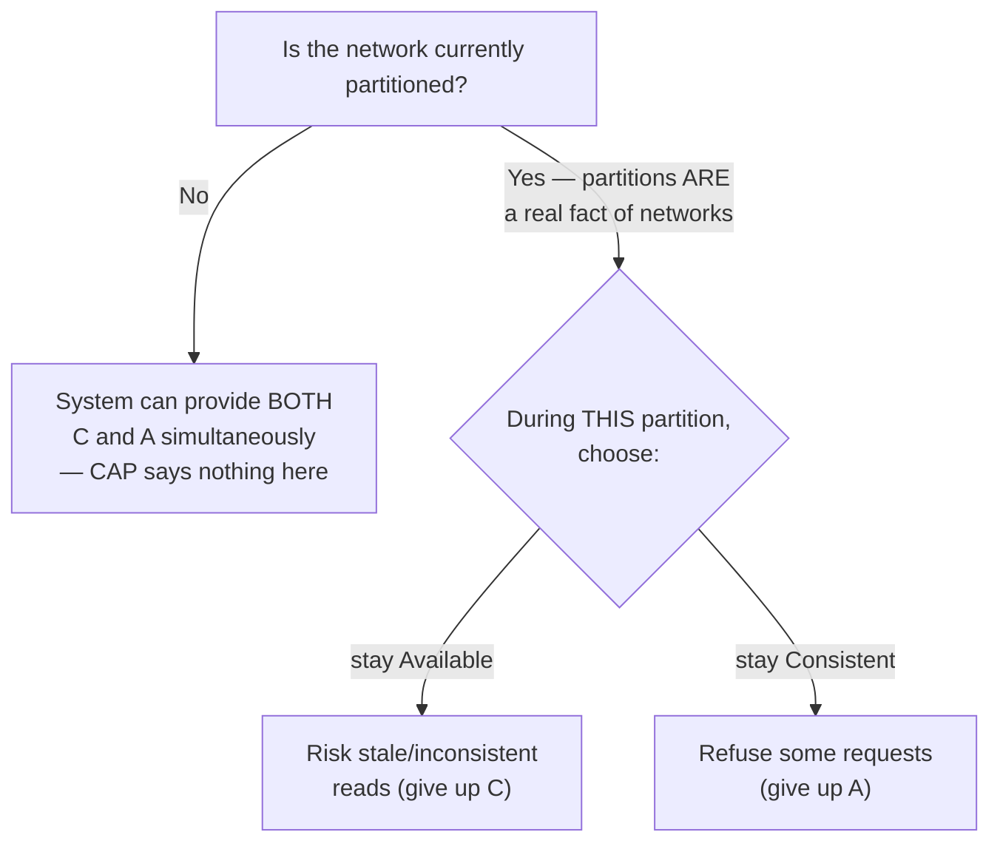

## Learning Objectives

- State Gilbert & Lynch's precise definitions of Consistency (linearizability), Availability (every request to a non-failed node receives a response), and Partition tolerance (the system continues operating despite arbitrary message loss between nodes).
- Reconstruct the proof-by-contradiction that no system can provide all three simultaneously.
- Explain Brewer's own 2012 clarification: partition tolerance is not a symmetric third choice, and the real, moment-by-moment decision is between C and A only during an actual partition.
- Explain why "pick two of three" is a real oversimplification of a real theorem, not the theorem itself.

## Context & Motivation

The previous three concepts built up exactly the vocabulary the CAP theorem needs to be stated precisely: linearizability (`linearizability-a-rigorous-definition`) is the formal notion of Consistency the theorem uses, and eventual consistency (`eventual-consistency-and-its-real-guarantees`) is what a system commonly falls back to when it gives up Consistency to keep serving requests during a Partition. Gilbert & Lynch's 2002 paper gives Brewer's originally informal 2000 conjecture an actual formal statement and a real proof — this concept works through both, and through Brewer's own later clarification of the theorem's most commonly misunderstood nuance.

## Core Theory

### The three properties, defined precisely

```text
Consistency (C):  every operation behaves as if it executed
                   on a single, correct copy of the data —
                   exactly linearizability, already defined
                   in linearizability-a-rigorous-definition.

Availability (A): every request received by a non-failed node
                   MUST result in a response — a node cannot
                   simply refuse to answer, even if it can't
                   currently confirm it has the freshest data.

Partition tolerance (P): the system continues to operate
                   correctly even when the network arbitrarily
                   loses or delays every message between two
                   sets of nodes — i.e., a partition can happen
                   and the system doesn't just halt entirely.
```

### The proof: consistency and availability cannot both survive a real partition

Gilbert & Lynch's proof is a direct proof by contradiction, structurally the same technique already covered in `proof-by-contradiction` (`discrete-math-logic`), applied here to a genuinely new object:

```text
ASSUME, for contradiction, a system provides Consistency,
Availability, AND Partition tolerance simultaneously.

Construct a partition: split the system's nodes into two
groups, G1 and G2, with EVERY message between the two groups
lost (this is exactly what Partition tolerance requires the
system to survive, so this scenario must be handled).

A client writes a value v to a node in G1. By Availability,
that node MUST respond — it cannot wait for confirmation from
G2, because no message can reach G2 at all during this
partition.

A different client then reads from a node in G2. By
Availability, that node MUST also respond immediately — it
cannot wait to hear about G1's write, because, again, no
message can cross the partition.

G2's node has no way to know about the write to v that just
happened in G1 (the partition blocked that information
entirely) — so it can only respond with a STALE value, or with
no value at all if the key was never written to G2's side.
Either way, this contradicts Consistency: a truly linearizable
system, by definition, could NOT let this read return anything
other than the freshly written value v, since real time places
the write strictly before the read.

CONTRADICTION — so no system can provide all three
simultaneously; at least one of C, A, or P must be given up.
```

### Brewer's own clarification: P isn't a symmetric, optional third choice

Brewer's 2012 retrospective, "CAP Twelve Years Later," directly addresses the theorem's most common misreading: the popular "pick two of three" framing suggests C, A, and P are three equally optional knobs, as if a system could simply decide to "not have" partition tolerance the way it might decide to trade away consistency. But real networks genuinely do partition — cables get cut, switches fail, packets get dropped — partition tolerance is not something a real, physically deployed distributed system gets to opt out of; it is a fact about the environment the system runs in, not a design choice made by the system's authors. The actual, meaningful design decision only happens *during* an actual partition, and it is specifically a choice between C and A for that duration: stay available and risk returning stale or inconsistent data, or refuse to answer (sacrifice availability) to preserve consistency. Outside of an actual partition, a well-designed system can, and typically does, provide both C and A simultaneously — CAP says nothing at all about the normal, non-partitioned case.



### Cross-link forward: where this plays out in applied system design

This concept proves the theorem and states its precise nuance; `cap-theorem` (`system-design-concepts`) is where the same result is applied to real, concrete system-design decisions — choosing between a CP database (like a strongly-consistent configuration store) and an AP database (like a store that prioritizes uptime during partitions) for a specific application's actual requirements. This discipline proves *why* the trade-off is unavoidable; that applied treatment shows *how* real engineers actually navigate it.

## Worked Examples

### Example 1 — the proof's construction, walked with concrete node names

```text
Nodes: N1, N2 (group G1) and N3, N4 (group G2). Network
partition: ALL messages between {N1,N2} and {N3,N4} are lost.

Client A writes account balance = 500 to N1.
  N1 is Availability-obligated to respond — it does, saying
  "OK, balance is now 500" — WITHOUT waiting for N3 or N4,
  since no message could reach them anyway.

Client B reads the account balance from N3.
  N3 is Availability-obligated to respond too — it does,
  returning its own last-known value, say 300 (the value
  before Client A's write, since N3 has no way to have
  learned about it during the partition).

Client B just observed balance=300, strictly AFTER Client A's
write (balance=500) already completed — a direct
linearizability (Consistency) violation, exactly as the
general proof predicts once both N1 and N3 are forced to obey
Availability during a real partition.
```

### Example 2 — the same scenario, choosing C over A instead

```text
Same partition as Example 1. This time, N3 is configured to
prioritize Consistency: when Client B reads from N3, N3
recognizes it cannot confirm it has the latest data (it can't
reach N1/N2 to check) and REFUSES to answer — returning an
explicit error/timeout rather than a possibly-stale value.

Consistency is preserved (N3 never returned a wrong value),
but Availability is sacrificed (N3, a non-failed node, failed
to respond to a request it received) — this is the real,
concrete trade Brewer's clarification describes as the only
genuine choice CAP forces, and it only had to be made because
an actual partition was happening.
```

### Example 3 — outside a partition, CAP imposes no trade at all

```text
No partition is occurring — every node can reach every other
node normally. A well-designed system (e.g. one running Raft,
covered later in this discipline) can provide BOTH:
  - Consistency: reads reflect the latest committed write
    (Raft's own linearizable read/write guarantee)
  - Availability: requests get answered promptly, since a
    healthy majority of nodes can always coordinate

CAP's theorem does not forbid this — its proof specifically
required constructing an ACTUAL partition to derive the
contradiction. The trade-off is a partition-time phenomenon
only, exactly Brewer's point: "pick two of three" as a
permanent, standing choice is the oversimplification; "pick
between C and A, but only during an actual partition" is the
theorem's real content.
```

## Common Misconceptions & Pitfalls

- **"CAP means every distributed system must always sacrifice one of the three, all the time."** Example 3 shows this is false — the trade-off is specifically forced only during an actual network partition; outside of one, a well-designed system can and does provide both C and A, exactly Brewer's own clarification.
- **"Partition tolerance is a design choice a system can decide not to make, like choosing not to support a feature."** Real networks partition regardless of what any system's designers decide — P isn't optional in the way C and A trade-offs are; Brewer's retrospective is explicit that treating it as a symmetric third knob alongside C and A is the theorem's most common misreading.
- **"CAP theorem was proven informally by Brewer's 2000 keynote, so it's more of a rule of thumb than an actual theorem."** Brewer's original talk was an informal conjecture; Gilbert & Lynch's 2002 paper gave it the precise definitions and the actual proof-by-contradiction this concept walks through — it is a genuine, proven theorem, not folklore, even though the popular "pick two of three" phrasing that grew around it does oversimplify its real content.

## Summary

The CAP theorem, given a precise statement and proof by Gilbert & Lynch, shows that Consistency (linearizability), Availability (every non-failed node must respond), and Partition tolerance (surviving arbitrary message loss between node groups) cannot all hold simultaneously — the proof constructs an actual partition and shows Availability on both sides forces at least one side to violate Consistency. Brewer's own 2012 retrospective adds the essential real-world nuance: partition tolerance is not a symmetric, optional third choice, since real networks genuinely do partition — the only real, moment-by-moment decision a system makes is between C and A, and only for the duration of an actual partition; outside of one, both can be provided together. This proven, careful result is exactly what `cap-theorem` (`system-design-concepts`) applies to real, concrete database and system-design choices next.

## Documentation Links

- [Gilbert & Lynch — Brewer's Conjecture and the Feasibility of Consistent, Available, Partition-Tolerant Web Services (2002)](https://groups.csail.mit.edu/tds/papers/Gilbert/Brewer2.pdf) — the paper that gives Brewer's originally informal conjecture its precise C/A/P definitions and the proof-by-contradiction this concept walks through in full.
- [Brewer — CAP Twelve Years Later: How the "Rules" Have Changed (2012)](https://sites.cs.ucsb.edu/~rich/class/cs293b-cloud/papers/brewer-cap.pdf) — Brewer's own retrospective clarifying that partition tolerance is not a symmetric third choice, the exact nuance this concept's second half is built around.
- [ACM/IEEE — CS2013, Parallel and Distributed Computing Knowledge Area](https://csed.acm.org/knowledge-areas-parallel-and-distributed-computing-pd-cs2013-version/) — the curriculum guideline listing the CAP trade-off as a core parallel-and-distributed-computing topic.
