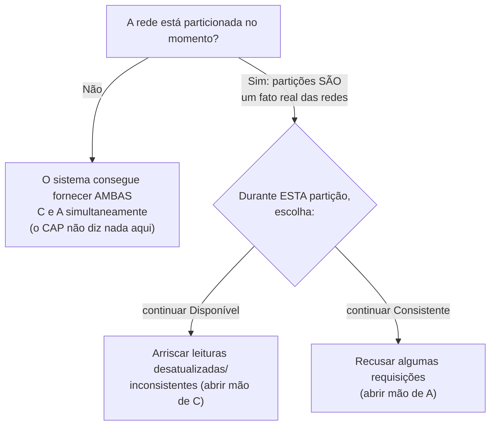

## Objetivos de Aprendizagem

- Enunciar as definições precisas de Gilbert & Lynch para Consistência (linearizabilidade), Disponibilidade (toda requisição a um nó que não falhou recebe uma resposta) e tolerância a Partições (o sistema continua operando apesar de perda arbitrária de mensagens entre nós).
- Reconstruir a prova por contradição de que nenhum sistema consegue fornecer as três simultaneamente.
- Explicar o esclarecimento do próprio Brewer em 2012: a tolerância a partições não é uma terceira escolha simétrica, e a decisão real, momento a momento, é entre C e A apenas durante uma partição real.
- Explicar por que "escolha dois dos três" é uma simplificação excessiva real de um teorema real, e não o próprio teorema.

## Contexto e Motivação

Os três conceitos anteriores construíram exatamente o vocabulário de que o teorema CAP precisa para ser enunciado com precisão: a linearizabilidade (`linearizability-a-rigorous-definition`) é a noção formal de Consistência que o teorema usa, e a consistência eventual (`eventual-consistency-and-its-real-guarantees`) é aquilo a que um sistema comumente recorre quando abre mão da Consistência para continuar atendendo requisições durante uma Partição. O artigo de Gilbert & Lynch de 2002 dá à conjectura originalmente informal de Brewer de 2000 um enunciado formal de fato e uma prova real; este conceito percorre os dois, e o esclarecimento posterior do próprio Brewer sobre a nuance mais comumente mal compreendida do teorema.

## Teoria Central

### As três propriedades, definidas com precisão

```text
Consistência (C):  toda operação se comporta como se tivesse executado
                   numa única cópia correta dos dados -- exatamente a
                   linearizabilidade, já definida em
                   linearizability-a-rigorous-definition.

Disponibilidade (A): toda requisição recebida por um nó que não falhou
                   PRECISA resultar numa resposta -- um nó não pode
                   simplesmente se recusar a responder, mesmo que não
                   consiga confirmar no momento que tem os dados mais
                   recentes.

Tolerância a partições (P): o sistema continua operando corretamente
                   mesmo quando a rede perde ou atrasa arbitrariamente
                   toda mensagem entre dois conjuntos de nós -- ou seja,
                   uma partição pode acontecer e o sistema não
                   simplesmente para por inteiro.
```

### A prova: consistência e disponibilidade não conseguem sobreviver juntas a uma partição real

A prova de Gilbert & Lynch é uma prova direta por contradição, estruturalmente a mesma técnica já coberta em `proof-by-contradiction` (`discrete-math-logic`), aplicada aqui a um objeto genuinamente novo:

```text
SUPONHA, por contradição, que um sistema fornece Consistência,
Disponibilidade E tolerância a Partições simultaneamente.

Construa uma partição: divida os nós do sistema em dois grupos, G1 e
G2, com TODA mensagem entre os dois grupos perdida (isto é exatamente
o que a tolerância a Partições exige que o sistema sobreviva, então
este cenário precisa ser tratado).

Um cliente escreve um valor v num nó de G1. Pela Disponibilidade, esse
nó PRECISA responder -- ele não pode esperar confirmação de G2, porque
nenhuma mensagem consegue alcançar G2 durante esta partição.

Um cliente diferente então lê de um nó de G2. Pela Disponibilidade,
esse nó TAMBÉM precisa responder imediatamente -- ele não pode esperar
para saber da escrita de G1, porque, de novo, nenhuma mensagem
consegue atravessar a partição.

O nó de G2 não tem como saber da escrita em v que acabou de acontecer
em G1 (a partição bloqueou essa informação por completo) -- então ele
só consegue responder com um valor DESATUALIZADO, ou com valor nenhum
se a chave nunca foi escrita do lado de G2. De qualquer forma, isto
contradiz a Consistência: um sistema verdadeiramente linearizável, por
definição, NÃO poderia deixar esta leitura retornar nada além do valor
v recém-escrito, já que o tempo real coloca a escrita estritamente
antes da leitura.

CONTRADIÇÃO -- então nenhum sistema consegue fornecer as três
simultaneamente; pelo menos uma de C, A ou P precisa ser sacrificada.
```

### O esclarecimento do próprio Brewer: P não é uma terceira escolha simétrica e opcional

A retrospectiva de Brewer de 2012, "CAP Twelve Years Later", trata diretamente a leitura errada mais comum do teorema: o enquadramento popular "escolha dois dos três" sugere que C, A e P são três botões igualmente opcionais, como se um sistema pudesse simplesmente decidir "não ter" tolerância a partições do jeito que poderia decidir trocar a consistência. Mas redes reais genuinamente se particionam (cabos são cortados, switches falham, pacotes são descartados); a tolerância a partições não é algo de que um sistema distribuído real, fisicamente implantado, possa optar por sair; ela é um fato sobre o ambiente em que o sistema roda, e não uma escolha de projeto feita pelos autores do sistema. A decisão de projeto de fato significativa só acontece *durante* uma partição real, e é especificamente uma escolha entre C e A por essa duração: continuar disponível e arriscar retornar dados desatualizados ou inconsistentes, ou se recusar a responder (sacrificar a disponibilidade) para preservar a consistência. Fora de uma partição real, um sistema bem projetado consegue, e tipicamente consegue de fato, fornecer C e A simultaneamente; o CAP não diz absolutamente nada sobre o caso normal, sem partição.



### Ligação adiante: onde isto acontece no projeto de sistemas aplicado

Este conceito prova o teorema e enuncia a sua nuance precisa; `cap-theorem` (`system-design-concepts`) é onde o mesmo resultado é aplicado a decisões reais e concretas de projeto de sistemas: escolher entre um banco de dados CP (como um armazenamento de configuração fortemente consistente) e um banco de dados AP (como um armazenamento que prioriza o tempo de atividade durante partições) para os requisitos reais de uma aplicação específica. Esta disciplina prova *por que* o trade-off é inevitável; aquele tratamento aplicado mostra *como* engenheiros reais de fato o navegam.

## Exemplos Resolvidos

### Exemplo 1: a construção da prova, percorrida com nomes de nós concretos

```text
Nós: N1, N2 (grupo G1) e N3, N4 (grupo G2). Partição de rede: TODAS
as mensagens entre {N1,N2} e {N3,N4} são perdidas.

O Cliente A escreve saldo da conta = 500 em N1.
  N1 tem a obrigação de Disponibilidade de responder -- ele responde,
  dizendo "OK, o saldo agora é 500" -- SEM esperar por N3 ou N4, já
  que nenhuma mensagem conseguiria alcançá-los de qualquer jeito.

O Cliente B lê o saldo da conta de N3.
  N3 tem a obrigação de Disponibilidade de responder também -- ele
  responde, retornando o seu próprio último valor conhecido, digamos
  300 (o valor anterior à escrita do Cliente A, já que N3 não tem como
  ter ficado sabendo dela durante a partição).

O Cliente B acabou de observar saldo=300, estritamente DEPOIS que a
escrita do Cliente A (saldo=500) já tinha completado -- uma violação
direta de linearizabilidade (Consistência), exatamente como a prova
geral prevê quando N1 e N3 são ambos forçados a obedecer à
Disponibilidade durante uma partição real.
```

### Exemplo 2: o mesmo cenário, escolhendo C em vez de A

```text
Mesma partição do Exemplo 1. Desta vez, N3 está configurado para
priorizar a Consistência: quando o Cliente B lê de N3, N3 reconhece
que não consegue confirmar que tem os dados mais recentes (não
consegue alcançar N1/N2 para conferir) e SE RECUSA a responder --
retornando um erro/timeout explícito em vez de um valor possivelmente
desatualizado.

A Consistência é preservada (N3 nunca retornou um valor errado), mas a
Disponibilidade é sacrificada (N3, um nó que não falhou, deixou de
responder a uma requisição que recebeu) -- este é o trade-off real e
concreto que o esclarecimento de Brewer descreve como a única escolha
genuína que o CAP força, e ele só precisou ser feito porque uma
partição real estava acontecendo.
```

### Exemplo 3: fora de uma partição, o CAP não impõe trade-off algum

```text
Nenhuma partição está ocorrendo -- todo nó consegue alcançar todo outro
nó normalmente. Um sistema bem projetado (ex.: um rodando Raft, coberto
mais adiante nesta disciplina) consegue fornecer AMBAS:
  - Consistência: as leituras refletem a última escrita confirmada
    (a própria garantia de leitura/escrita linearizável do Raft)
  - Disponibilidade: as requisições são respondidas prontamente, já
    que uma maioria saudável de nós sempre consegue se coordenar

O teorema CAP não proíbe isto -- a sua prova exigiu especificamente
construir uma partição REAL para derivar a contradição. O trade-off é
um fenômeno exclusivo do momento de partição, exatamente o ponto de
Brewer: "escolha dois dos três" como uma escolha permanente e fixa é a
simplificação excessiva; "escolha entre C e A, mas só durante uma
partição real" é o conteúdo real do teorema.
```

## Equívocos Comuns e Armadilhas

- **"O CAP significa que todo sistema distribuído precisa sempre sacrificar uma das três, o tempo todo."** O Exemplo 3 mostra que isso é falso: o trade-off só é forçado especificamente durante uma partição de rede real; fora de uma, um sistema bem projetado consegue fornecer, e fornece, C e A, exatamente o esclarecimento do próprio Brewer.
- **"A tolerância a partições é uma escolha de projeto que um sistema pode decidir não fazer, como escolher não suportar um recurso."** Redes reais se particionam independentemente do que os projetistas de qualquer sistema decidam. P não é opcional do jeito que os trade-offs de C e A são; a retrospectiva de Brewer é explícita ao dizer que tratá-la como um terceiro botão simétrico ao lado de C e A é a leitura errada mais comum do teorema.
- **"O teorema CAP foi provado informalmente pela palestra de Brewer em 2000, então é mais uma regra prática do que um teorema de fato."** A palestra original de Brewer era uma conjectura informal; o artigo de Gilbert & Lynch de 2002 deu a ela as definições precisas e a prova por contradição de fato que este conceito percorre. É um teorema genuíno e provado, e não folclore, mesmo que a frase popular "escolha dois dos três" que cresceu ao seu redor simplifique demais o seu conteúdo real.

## Resumo

O teorema CAP, que recebeu um enunciado e uma prova precisos de Gilbert & Lynch, mostra que Consistência (linearizabilidade), Disponibilidade (todo nó que não falhou precisa responder) e tolerância a Partições (sobreviver à perda arbitrária de mensagens entre grupos de nós) não conseguem valer todas simultaneamente: a prova constrói uma partição real e mostra que a Disponibilidade dos dois lados força pelo menos um lado a violar a Consistência. A retrospectiva do próprio Brewer de 2012 acrescenta a nuance essencial do mundo real: a tolerância a partições não é uma terceira escolha simétrica e opcional, já que redes reais genuinamente se particionam; a única decisão real, momento a momento, que um sistema faz é entre C e A, e só pela duração de uma partição real; fora de uma, as duas podem ser fornecidas juntas. Este resultado provado e cuidadoso é exatamente o que `cap-theorem` (`system-design-concepts`) aplica a seguir a escolhas reais e concretas de banco de dados e de projeto de sistemas.

## Documentation Links

- [Gilbert & Lynch: Brewer's Conjecture and the Feasibility of Consistent, Available, Partition-Tolerant Web Services (2002)](https://groups.csail.mit.edu/tds/papers/Gilbert/Brewer2.pdf): o artigo que dá à conjectura originalmente informal de Brewer as suas definições precisas de C/A/P e a prova por contradição que este conceito percorre por completo.
- [Brewer: CAP Twelve Years Later: How the "Rules" Have Changed (2012)](https://sites.cs.ucsb.edu/~rich/class/cs293b-cloud/papers/brewer-cap.pdf): a retrospectiva do próprio Brewer esclarecendo que a tolerância a partições não é uma terceira escolha simétrica, a nuance exata em torno da qual a segunda metade deste conceito é construída.
- [ACM/IEEE: CS2013, Parallel and Distributed Computing Knowledge Area](https://csed.acm.org/knowledge-areas-parallel-and-distributed-computing-pd-cs2013-version/): a diretriz curricular que lista o trade-off do CAP como um tópico central de computação paralela e distribuída.
