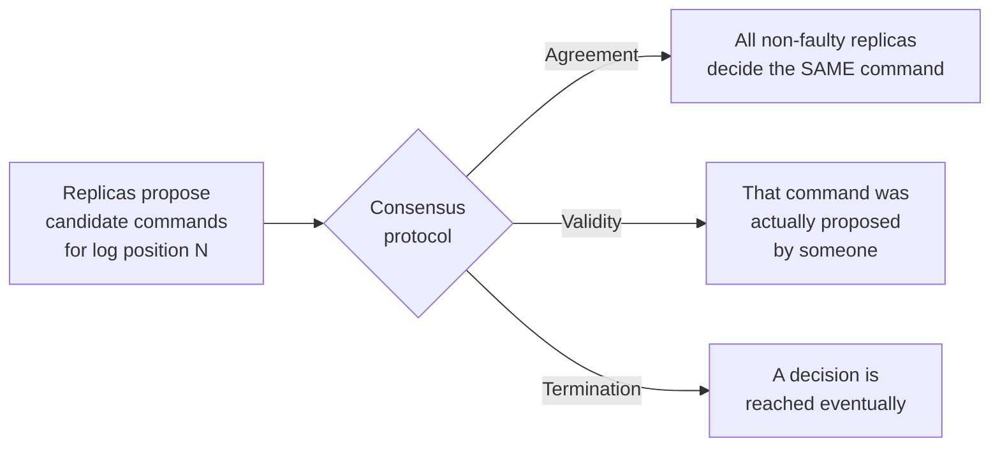

## Learning Objectives

- State the three properties a correct consensus protocol must guarantee: Agreement, Validity, and Termination.
- Explain why each property is independently necessary — what a protocol satisfying only two of the three would fail to actually solve.
- Connect the consensus problem back to the Order property from the replicated state machine approach, and explain why "the next command to apply" is the value processes are really reaching consensus on.
- Explain, using real examples, why coordination services like ZooKeeper and etcd exist as reusable infrastructure built specifically to provide consensus, rather than each application re-solving it.

## Context & Motivation

`the-replicated-state-machine-approach` reduced replication to two properties, Agreement and Order, and identified Order — agreeing on the next command in a shared, growing sequence — as exactly the consensus problem. Fischer, Lynch & Paterson's 1985 paper (better known for the impossibility result covered next) opens by giving consensus its precise, formal shape, and this concept works through that shape carefully before the next concept shows the genuinely hard limit on solving it.

## Core Theory

### The three properties, precisely

Consensus asks: given a set of processes, each proposing some value, can they all agree on exactly one of the proposed values? A correct protocol must guarantee all three of:

```text
AGREEMENT:  no two non-faulty processes decide on different
            values — everyone who decides, decides the SAME
            value.

VALIDITY:   the value decided must actually be one of the
            values SOMEONE proposed — this rules out a
            trivially "correct-looking" protocol that just
            always decides some fixed constant regardless of
            what anyone proposed.

TERMINATION: every non-faulty process eventually decides SOME
            value — the protocol can't just stall forever,
            leaving processes waiting indefinitely.
```

### Why each property is independently necessary

A protocol satisfying only Agreement and Validity but not Termination would be "correct whenever it finishes," but could simply hang forever and never actually decide anything — not useful for a system that needs an actual answer to keep running. A protocol satisfying Agreement and Termination but not Validity could satisfy both by simply having every process decide some fixed, hard-coded value (say, always decide "0") regardless of what anyone actually proposed — trivially safe and trivially terminating, but useless, since it never actually reflects what was proposed. A protocol satisfying Validity and Termination but not Agreement could have different processes decide different proposed values independently and quickly — but that's exactly the outcome consensus is trying to prevent. All three together, and only together, define a problem that is both meaningful and actually hard.

### Reconnecting to Order: what value are processes actually agreeing on?

In the replicated-state-machine context, "the value" processes reach consensus on, for the Order property, is specifically "what is the next command to append to the shared, growing log" — every replica proposes (or forwards a client's proposal for) a command, and consensus, run once per log position, decides which single command actually gets that position. Running consensus repeatedly, once per position, is exactly how Paxos and Raft — covered over the next several concepts — build an entire ordered, ever-growing log rather than deciding just one isolated value.



### Why coordination services exist: consensus as reusable infrastructure

Real applications constantly need exactly this guarantee for much smaller, more specific purposes than replicating an entire service's state — agreeing on who currently holds a distributed lock, on the current value of a small piece of shared configuration, or on which node is currently the leader for some other, unrelated task. Building a correct consensus protocol from scratch for each of these needs is exactly the kind of hard, easy-to-get-subtly-wrong problem this discipline is building toward showing the real difficulty of (`the-flp-impossibility-result`, next, and the full Raft treatment after it) — which is precisely why coordination services like ZooKeeper and etcd exist: they implement a correct consensus protocol once, correctly, and expose it as reusable infrastructure (locks, leader election, small configuration values) that applications call into via RPC rather than re-implementing consensus themselves. `consensus-and-coordination-services` (`system-design-concepts`) covers exactly this applied, real-world angle — how ZooKeeper and etcd are actually used in production system design — building directly on the formal guarantee defined here.

## Worked Examples

### Example 1 — a protocol that fails Validity, made concrete

```text
"Consensus" protocol: every process, upon starting, simply
decides the value 0, ignoring whatever value it was actually
asked to propose.

Process P1 proposes 7. Process P2 proposes 12. Both "decide" 0.

AGREEMENT: satisfied (both decided the same value, 0).
TERMINATION: satisfied (both decided immediately).
VALIDITY: VIOLATED — neither P1 nor P2 proposed 0; the decided
value has no relationship to what anyone actually proposed.
This "protocol" is useless for anything real (e.g. electing an
actual leader from among real candidates) despite satisfying
2 of the 3 properties.
```

### Example 2 — a protocol that fails Agreement, made concrete

```text
"Consensus" protocol: each process independently decides on
whichever value IT proposed, with no coordination at all.

P1 proposes and decides 7. P2 proposes and decides 12.

VALIDITY: satisfied (each decided value was actually proposed
by someone — specifically, by the process itself).
TERMINATION: satisfied (both decided immediately).
AGREEMENT: VIOLATED — P1 and P2 decided DIFFERENT values. If
this were being used to elect a single leader, the system now
has two processes both believing they are the leader — exactly
the split-brain scenario real consensus protocols are built to
prevent.
```

### Example 3 — why a real coordination service saves real engineering effort

```text
An application team building a new distributed job scheduler
needs: (a) a way for scheduler instances to agree on which one
is currently the active leader, and (b) a way to store a small
piece of shared configuration (say, the current job-priority
threshold) that all instances agree on.

WITHOUT a coordination service: the team would need to
implement a correct consensus protocol (handling process
crashes, message loss and reordering, and the FLP-impossibility-
adjacent subtleties covered next) themselves, for BOTH use
cases, and get all of the safety arguments right independently.

WITH a coordination service (ZooKeeper or etcd): the team
creates a lock/leader-election node and a small configuration
key via ordinary RPC calls into the coordination service, which
has ALREADY implemented a correct consensus protocol (etcd
uses Raft directly; ZooKeeper uses a Paxos-derived protocol
called Zab) underneath — the hard part (Agreement, Validity,
Termination, done correctly) is solved once, centrally, and
reused across every application that needs it, exactly the
real-world payoff `consensus-and-coordination-services`
(system-design-concepts) covers in full.
```

## Common Misconceptions & Pitfalls

- **"Consensus just means 'everyone eventually agrees,' so Agreement alone is basically the whole problem."** Example 1 shows a protocol can trivially satisfy Agreement (and Termination) while being completely useless, because it ignores Validity — all three properties are independently required for the problem to have any real content.
- **"If every process just decides its own proposed value immediately, that's fast and correct."** Example 2 shows this satisfies Validity and Termination but is a textbook Agreement violation — real consensus specifically has to prevent different processes reaching different decisions, which is exactly what makes the problem hard (and is why it can't be solved by "everyone just decides for themselves").
- **"Every distributed application needs to implement its own consensus protocol from scratch."** Example 3 shows this is exactly what coordination services like ZooKeeper and etcd exist to prevent — a correctly-implemented consensus protocol, built once, is reused as infrastructure rather than re-derived per application.

## Summary

Consensus requires Agreement (no two non-faulty processes decide differently), Validity (the decided value was actually proposed by someone, ruling out trivial fixed-answer protocols), and Termination (every non-faulty process eventually decides) — all three simultaneously, since any two alone permit a trivial, useless "solution." In the replicated-state-machine context, the value being agreed on is specifically the next command for a given position in a shared, growing log, and running consensus repeatedly, once per position, is how Paxos and Raft build an entire replicated log. Because implementing this correctly is hard enough that real teams shouldn't re-derive it per application, coordination services like ZooKeeper and etcd exist specifically to provide it as reusable infrastructure — the applied version of exactly this guarantee, covered in `consensus-and-coordination-services` (`system-design-concepts`). The next concept shows precisely how hard "correctly" really is, with a genuine, honest impossibility result.

## Documentation Links

- [Fischer, Lynch & Paterson — Impossibility of Distributed Consensus with One Faulty Process (JACM 1985)](https://groups.csail.mit.edu/tds/papers/Lynch/jacm85.pdf) — cited here for its opening section, which gives consensus its precise Agreement/Validity/Termination definition before the paper's own impossibility result, covered in the next concept.
- [Ongaro & Ousterhout — In Search of an Understandable Consensus Algorithm (Raft, USENIX ATC 2014)](https://raft.github.io/raft.pdf) — cited for how Raft runs this same consensus definition repeatedly, once per log position, to build an entire ordered, ever-growing log.
