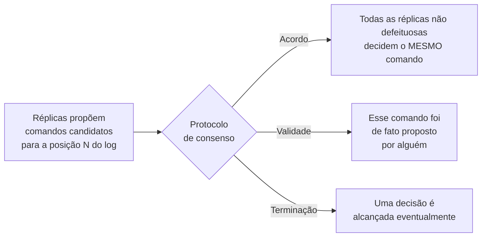

## Objetivos de Aprendizagem

- Enunciar as três propriedades que um protocolo de consenso correto precisa garantir: Acordo, Validade e Terminação.
- Explicar por que cada propriedade é independentemente necessária: o que um protocolo que satisfizesse só duas das três deixaria de de fato resolver.
- Conectar o problema do consenso à propriedade de Ordem da abordagem de máquina de estados replicada, e explicar por que "o próximo comando a aplicar" é o valor sobre o qual os processos estão de fato chegando a consenso.
- Explicar, usando exemplos reais, por que serviços de coordenação como ZooKeeper e etcd existem como infraestrutura reutilizável construída especificamente para fornecer consenso, em vez de cada aplicação resolvê-lo de novo.

## Contexto e Motivação

`the-replicated-state-machine-approach` reduziu a replicação a duas propriedades, Acordo e Ordem, e identificou a Ordem (concordar sobre o próximo comando numa sequência compartilhada e crescente) como exatamente o problema do consenso. O artigo de Fischer, Lynch & Paterson de 1985 (mais conhecido pelo resultado de impossibilidade coberto a seguir) abre dando ao consenso a sua forma precisa e formal, e este conceito percorre essa forma com cuidado antes que o próximo conceito mostre o limite genuinamente difícil de resolvê-lo.

## Teoria Central

### As três propriedades, com precisão

O consenso pergunta: dado um conjunto de processos, cada um propondo algum valor, eles conseguem todos concordar sobre exatamente um dos valores propostos? Um protocolo correto precisa garantir as três:

```text
ACORDO:      nenhum par de processos não defeituosos decide valores
             diferentes -- todo mundo que decide, decide o MESMO valor.

VALIDADE:    o valor decidido precisa de fato ser um dos valores que
             ALGUÉM propôs -- isto descarta um protocolo trivialmente
             "de aparência correta" que sempre decide alguma constante
             fixa independentemente do que qualquer um propôs.

TERMINAÇÃO:  todo processo não defeituoso eventualmente decide ALGUM
             valor -- o protocolo não pode simplesmente travar para
             sempre, deixando os processos esperando indefinidamente.
```

### Por que cada propriedade é independentemente necessária

Um protocolo que satisfizesse só Acordo e Validade, mas não Terminação, seria "correto sempre que termina", mas poderia simplesmente travar para sempre e nunca decidir nada de fato, o que não serve para um sistema que precisa de uma resposta real para continuar rodando. Um protocolo que satisfizesse Acordo e Terminação, mas não Validade, poderia satisfazer as duas simplesmente fazendo todo processo decidir algum valor fixo e embutido no código (digamos, sempre decidir "0") independentemente do que qualquer um de fato propôs: trivialmente seguro e trivialmente terminante, mas inútil, já que nunca reflete de fato o que foi proposto. Um protocolo que satisfizesse Validade e Terminação, mas não Acordo, poderia ter processos diferentes decidindo valores propostos diferentes, de forma independente e rápida, mas esse é exatamente o resultado que o consenso está tentando evitar. As três juntas, e só juntas, definem um problema que é ao mesmo tempo significativo e de fato difícil.

### Reconectando à Ordem: sobre que valor os processos estão de fato concordando?

No contexto da máquina de estados replicada, "o valor" sobre o qual os processos chegam a consenso, para a propriedade de Ordem, é especificamente "qual é o próximo comando a anexar ao log compartilhado e crescente": toda réplica propõe (ou encaminha a proposta de um cliente para) um comando, e o consenso, rodado uma vez por posição do log, decide qual único comando de fato ganha essa posição. Rodar o consenso repetidamente, uma vez por posição, é exatamente como o Paxos e o Raft (cobertos nos próximos vários conceitos) constroem um log ordenado e sempre crescente inteiro, em vez de decidir só um valor isolado.



### Por que serviços de coordenação existem: o consenso como infraestrutura reutilizável

Aplicações reais precisam o tempo todo exatamente desta garantia para propósitos muito menores e mais específicos do que replicar o estado de um serviço inteiro: concordar sobre quem detém atualmente um lock distribuído, sobre o valor atual de um pequeno pedaço de configuração compartilhada, ou sobre qual nó é atualmente o líder de alguma outra tarefa, sem relação. Construir do zero um protocolo de consenso correto para cada uma dessas necessidades é exatamente o tipo de problema difícil e fácil de errar sutilmente cuja dificuldade real esta disciplina está construindo para mostrar (`the-flp-impossibility-result`, a seguir, e o tratamento completo do Raft depois dele), e é justamente por isso que serviços de coordenação como ZooKeeper e etcd existem: eles implementam um protocolo de consenso correto uma vez, corretamente, e o expõem como infraestrutura reutilizável (locks, eleição de líder, pequenos valores de configuração) que as aplicações chamam via RPC em vez de reimplementar o consenso por conta própria. `consensus-and-coordination-services` (`system-design-concepts`) cobre exatamente este ângulo aplicado, do mundo real (como ZooKeeper e etcd são de fato usados no projeto de sistemas em produção), construindo diretamente sobre a garantia formal definida aqui.

## Exemplos Resolvidos

### Exemplo 1: um protocolo que falha na Validade, tornado concreto

```text
Protocolo de "consenso": todo processo, ao iniciar, simplesmente decide
o valor 0, ignorando qualquer valor que lhe tenha sido de fato pedido
para propor.

O processo P1 propõe 7. O processo P2 propõe 12. Ambos "decidem" 0.

ACORDO: satisfeito (ambos decidiram o mesmo valor, 0).
TERMINAÇÃO: satisfeita (ambos decidiram imediatamente).
VALIDADE: VIOLADA -- nem P1 nem P2 propuseram 0; o valor decidido não
tem relação alguma com o que qualquer um de fato propôs. Este
"protocolo" é inútil para qualquer coisa real (ex.: eleger um líder de
verdade dentre candidatos reais), apesar de satisfazer 2 das 3
propriedades.
```

### Exemplo 2: um protocolo que falha no Acordo, tornado concreto

```text
Protocolo de "consenso": cada processo decide independentemente o valor
que ELE MESMO propôs, sem coordenação alguma.

P1 propõe e decide 7. P2 propõe e decide 12.

VALIDADE: satisfeita (cada valor decidido foi de fato proposto por
alguém -- especificamente, pelo próprio processo).
TERMINAÇÃO: satisfeita (ambos decidiram imediatamente).
ACORDO: VIOLADO -- P1 e P2 decidiram valores DIFERENTES. Se isto
estivesse sendo usado para eleger um único líder, o sistema agora tem
dois processos acreditando ambos serem o líder -- exatamente o cenário
de split-brain que protocolos de consenso reais são construídos para
evitar.
```

### Exemplo 3: por que um serviço de coordenação real economiza esforço real de engenharia

```text
Um time de aplicação construindo um novo agendador de jobs distribuído
precisa de: (a) uma forma de as instâncias do agendador concordarem
sobre qual delas é atualmente o líder ativo, e (b) uma forma de guardar
um pequeno pedaço de configuração compartilhada (digamos, o limite atual
de prioridade de jobs) com o qual todas as instâncias concordem.

SEM um serviço de coordenação: o time precisaria implementar ele mesmo
um protocolo de consenso correto (tratando quedas de processos, perda e
reordenação de mensagens, e as sutilezas próximas da impossibilidade FLP
cobertas a seguir), para AMBOS os casos de uso, e acertar todos os
argumentos de segurança de forma independente.

COM um serviço de coordenação (ZooKeeper ou etcd): o time cria um nó de
lock/eleição de líder e uma pequena chave de configuração via chamadas
RPC comuns ao serviço de coordenação, que JÁ implementou por baixo um
protocolo de consenso correto (o etcd usa o Raft diretamente; o
ZooKeeper usa um protocolo derivado do Paxos chamado Zab) -- a parte
difícil (Acordo, Validade, Terminação, feitos corretamente) é resolvida
uma vez, centralmente, e reutilizada por toda aplicação que precisar,
exatamente o retorno do mundo real que `consensus-and-coordination-services`
(system-design-concepts) cobre por completo.
```

## Equívocos Comuns e Armadilhas

- **"Consenso só significa 'todo mundo eventualmente concorda', então o Acordo sozinho é basicamente o problema inteiro."** O Exemplo 1 mostra que um protocolo pode satisfazer trivialmente o Acordo (e a Terminação) sendo completamente inútil, porque ignora a Validade. As três propriedades são independentemente necessárias para que o problema tenha algum conteúdo real.
- **"Se todo processo simplesmente decide o próprio valor proposto imediatamente, isso é rápido e correto."** O Exemplo 2 mostra que isso satisfaz a Validade e a Terminação, mas é uma violação de Acordo de livro-texto. O consenso real precisa especificamente impedir que processos diferentes cheguem a decisões diferentes, que é exatamente o que torna o problema difícil (e é por isso que ele não pode ser resolvido com "cada um decide por si").
- **"Toda aplicação distribuída precisa implementar o seu próprio protocolo de consenso do zero."** O Exemplo 3 mostra que é exatamente isso que serviços de coordenação como ZooKeeper e etcd existem para evitar: um protocolo de consenso implementado corretamente, construído uma vez, é reutilizado como infraestrutura em vez de rederivado por aplicação.

## Resumo

O consenso exige Acordo (nenhum par de processos não defeituosos decide de forma diferente), Validade (o valor decidido foi de fato proposto por alguém, descartando protocolos triviais de resposta fixa) e Terminação (todo processo não defeituoso eventualmente decide), as três simultaneamente, já que quaisquer duas sozinhas permitem uma "solução" trivial e inútil. No contexto da máquina de estados replicada, o valor sobre o qual se concorda é especificamente o próximo comando para uma dada posição de um log compartilhado e crescente, e rodar o consenso repetidamente, uma vez por posição, é como o Paxos e o Raft constroem um log replicado inteiro. Como implementar isso corretamente é difícil o suficiente para que times reais não devam rederivá-lo por aplicação, serviços de coordenação como ZooKeeper e etcd existem especificamente para fornecê-lo como infraestrutura reutilizável, a versão aplicada exatamente desta garantia, coberta em `consensus-and-coordination-services` (`system-design-concepts`). O próximo conceito mostra precisamente quão difícil "corretamente" de fato é, com um resultado de impossibilidade genuíno e honesto.

## Documentation Links

- [Fischer, Lynch & Paterson: Impossibility of Distributed Consensus with One Faulty Process (JACM 1985)](https://groups.csail.mit.edu/tds/papers/Lynch/jacm85.pdf): citado aqui pela sua seção de abertura, que dá ao consenso a sua definição precisa de Acordo/Validade/Terminação antes do próprio resultado de impossibilidade do artigo, coberto no próximo conceito.
- [Ongaro & Ousterhout: In Search of an Understandable Consensus Algorithm (Raft, USENIX ATC 2014)](https://raft.github.io/raft.pdf): citado por mostrar como o Raft roda esta mesma definição de consenso repetidamente, uma vez por posição do log, para construir um log ordenado e sempre crescente inteiro.
