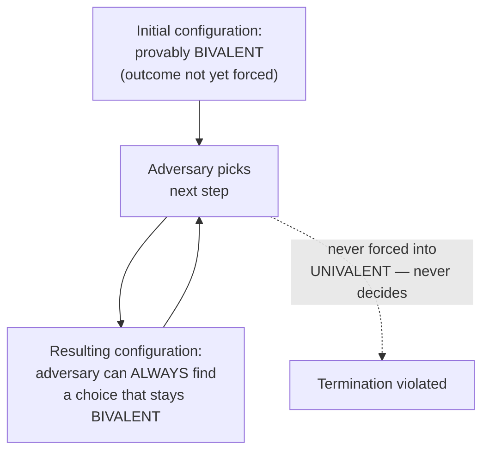

## Learning Objectives

- State the FLP theorem precisely: in a completely asynchronous system, no deterministic protocol can guarantee Agreement, Validity, and Termination all at once, even tolerating just one crash failure.
- Explain the shape of the proof — bivalent configurations and an adversary that can always find a next step keeping the system bivalent — and why this is a different, subtler style of argument than a direct proof by contradiction.
- Explain why every real consensus protocol (Paxos, Raft) survives this result in practice by giving up strict asynchrony, via timeouts and randomization, rather than by refuting the theorem.
- State honestly what FLP does and does not claim — it is not a claim that consensus is impossible in practice, only that guaranteed termination is impossible under the strict asynchronous model.

## Context & Motivation

`the-consensus-problem-agreement-validity-and-termination` gave consensus its precise, three-part definition. FLP's 1985 theorem is the honest, rigorous limit this discipline promised from the outset — a real, proven, foundational result showing that under a precise and realistic-sounding set of assumptions, consensus's three properties cannot all be guaranteed simultaneously, no matter how clever the protocol. Understanding exactly what this result does and does not say is essential before looking at Paxos and Raft, both of which exist and work in real systems specifically because they make a deliberate, acknowledged departure from FLP's assumptions.

## Core Theory

### The precise assumptions

FLP's result applies to a system that is **completely asynchronous**: there is no bound whatsoever on message delivery time (a message can take arbitrarily, unboundedly long, though it is eventually delivered) and no bound on relative process speeds. Faults are the simplest kind, **crash faults**: a faulty process simply stops executing at some point and never sends anything again — it does not send corrupted or contradictory messages (that harder model is `crash-faults-vs-byzantine-faults`, later in this discipline). The protocol itself is assumed **deterministic** — no coin flips or random choices.

### The theorem

Under exactly those assumptions, **no deterministic consensus protocol can guarantee Termination, even tolerating just a single crash failure** — Agreement and Validity can be maintained forever, but there exist executions (adversarial schedules of message delivery) in which no process ever decides.

### The shape of the proof: bivalence, not simple contradiction

Unlike the CAP theorem's proof (a direct proof by contradiction: assume all three properties hold, construct one specific scenario, derive an immediate contradiction), FLP's argument is a subtler, constructive adversary argument. It defines a configuration (the current local state of every process, plus messages in flight) as **bivalent** if, depending on how the system proceeds from there, it could still end up deciding either 0 or 1 — the outcome isn't determined yet. A configuration is **univalent** if the outcome is already inevitable no matter what happens next. The proof shows two things: first, some initial configuration must be bivalent (essentially because Validity requires different possible starting configurations to be capable of reaching different decisions, so the very first step can't already have decided everything). Second — the technical heart of the proof — from any bivalent configuration, an adversary controlling which process runs next and which messages get delivered when can always find some next step that keeps the resulting configuration bivalent too. Since a bivalent configuration by definition has not yet decided, and the adversary can keep the system bivalent forever, the adversary can force the protocol to run forever without ever reaching a decision — directly violating Termination.



This is a fundamentally different proof technique from the direct contradiction used for CAP: it does not assume the theorem is false and derive an immediate absurdity — it constructively describes an adversary's strategy and proves that strategy always succeeds in delaying a decision forever, for *any* proposed protocol, not just one specific one.

### How real protocols survive this result in practice

Paxos and Raft, covered over the next several concepts, are both real, working consensus protocols — and both are entirely compatible with FLP, because both make a genuine, explicit departure from FLP's strict asynchronous model, rather than somehow refuting the theorem. Real protocols use **timeouts** (a process that hasn't heard from a leader within some time bound assumes it has failed and starts a new election) — this implicitly assumes *some* practical bound on message delay exists most of the time, even though it isn't formally guaranteed, which is exactly the kind of assumption strict asynchrony forbids. Raft additionally uses **randomization** (randomized election timeouts, covered in `raft-leader-election`, next) specifically because FLP's proof relies on the protocol being deterministic — a randomized protocol can be shown to terminate with probability 1 (eventually, almost surely) even under a fully asynchronous adversary, converting a hard impossibility into a race the adversary is overwhelmingly likely to eventually lose, rather than making the impossibility disappear.

## Worked Examples

### Example 1 — the ambiguity a crash creates for any protocol, concretely

```text
Process P1 sends a message M to P2 and then, before receiving
any reply, appears to stop responding to everyone.

Under FLP's model, the rest of the system cannot distinguish:
  (a) P1 actually crashed, and will never send anything again.
  (b) P1 is alive but the network is simply delaying its next
      message by an arbitrarily long (but finite) amount —
      completely legal under strict asynchrony, which places
      NO upper bound on message delay.

Any protocol that decides to "move on without P1" after some
fixed waiting period is implicitly assuming scenario (a) — but
under strict asynchrony, that waiting period, however long, is
never actually long enough to RULE OUT scenario (b), since no
finite wait can exceed an unbounded delay. This exact
ambiguity is the raw material the adversary in FLP's proof
exploits to keep delaying a decision indefinitely.
```

### Example 2 — how a timeout-based protocol departs from FLP's model, concretely

```text
Raft's leader-election mechanism (raft-leader-election, next)
assumes: if a follower hears no heartbeat from a leader within
its election timeout, the leader has failed (or is unreachable
enough to treat as failed) and starts a new election.

This ALREADY assumes something FLP's strict asynchronous model
explicitly forbids assuming: that under normal conditions,
message delay stays below some practical bound most of the
time, so a timeout firing is USUALLY a reliable (if imperfect)
signal of failure, rather than being indistinguishable from
"just a slow but healthy leader" the way Example 1 shows it
must be under pure asynchrony. Raft doesn't claim this
assumption is a formal guarantee (a badly-behaved network can
still fool it, forcing extra election rounds) — it claims the
assumption is realistic enough, in practice, that termination
happens quickly almost always, converting FLP's impossibility
into an acceptable, bounded practical risk rather than
eliminating it.
```

### Example 3 — what FLP does NOT claim, stated explicitly

```text
FLP does NOT claim:
  "Consensus is impossible to achieve in real systems."
  Real systems achieve consensus successfully every day
  (etcd, ZooKeeper, and every Raft-based system in production).

FLP DOES claim:
  "No DETERMINISTIC protocol can GUARANTEE termination under
  STRICT, UNBOUNDED asynchrony, tolerating even one crash."

The gap between these two statements is exactly filled by
real protocols giving up one of FLP's precise assumptions —
Raft gives up strict determinism (via randomized timeouts) and
implicitly assumes practical, if unguaranteed, bounds on
message delay — not by finding a clever protocol that
satisfies FLP's original assumptions after all, which the
theorem proves is impossible.
```

## Common Misconceptions & Pitfalls

- **"FLP proves distributed consensus doesn't work."** Example 3 states this directly: FLP proves a precise negative result about a specific, strict model (deterministic protocols, fully asynchronous, tolerating crash faults) — it says nothing about randomized protocols or systems that make practical timing assumptions, which is exactly how Raft and Paxos both operate successfully in the real world.
- **"FLP's proof is basically a proof by contradiction, like the CAP theorem's."** The two are genuinely different proof techniques — CAP's proof assumes the theorem is false and derives one specific, immediate contradiction; FLP's proof constructively describes an adversary strategy (maintaining bivalence indefinitely) and proves that strategy always succeeds, for any candidate protocol — a subtler, more general style of argument.
- **"Since Raft uses randomization to avoid FLP, it isn't really 'solving' consensus, just getting lucky."** Randomization converts FLP's hard impossibility (guaranteed termination is provably impossible deterministically) into a probabilistic guarantee (termination with probability 1, i.e., it will happen eventually with overwhelming likelihood) — this is a genuine, principled, well-understood technique for working around the theorem, not luck, and it's exactly why Raft's election timeouts are specifically randomized rather than fixed, as the next concept covers in detail.

## Summary

FLP's 1985 theorem proves that in a completely asynchronous system (no bound on message delay), no deterministic consensus protocol can guarantee Agreement, Validity, and Termination all at once, even tolerating just a single crash failure — proved not by a direct contradiction but by a constructive adversary argument showing that from any "bivalent" (undecided) configuration, an adversary controlling message scheduling can always find a next step that keeps the system bivalent, indefinitely postponing any decision. This is a genuine, honest limit, not a popularized overstatement — but it applies to a precise, strict model, and every real consensus protocol, including Paxos and Raft covered next, survives it in practice by deliberately departing from that model: via timeouts that implicitly assume practical (if unguaranteed) bounds on message delay, and, in Raft's case, via randomization that converts guaranteed termination into termination with overwhelming probability.

## Documentation Links

- [Fischer, Lynch & Paterson — Impossibility of Distributed Consensus with One Faulty Process (JACM 1985)](https://groups.csail.mit.edu/tds/papers/Lynch/jacm85.pdf) — the original impossibility proof, source of the bivalent-configuration adversary argument this concept works through in detail.
- [ACM/IEEE — CS2013, Parallel and Distributed Computing Knowledge Area](https://csed.acm.org/knowledge-areas-parallel-and-distributed-computing-pd-cs2013-version/) — the curriculum guideline listing consensus and its fundamental limits as core parallel-and-distributed-computing topics.
