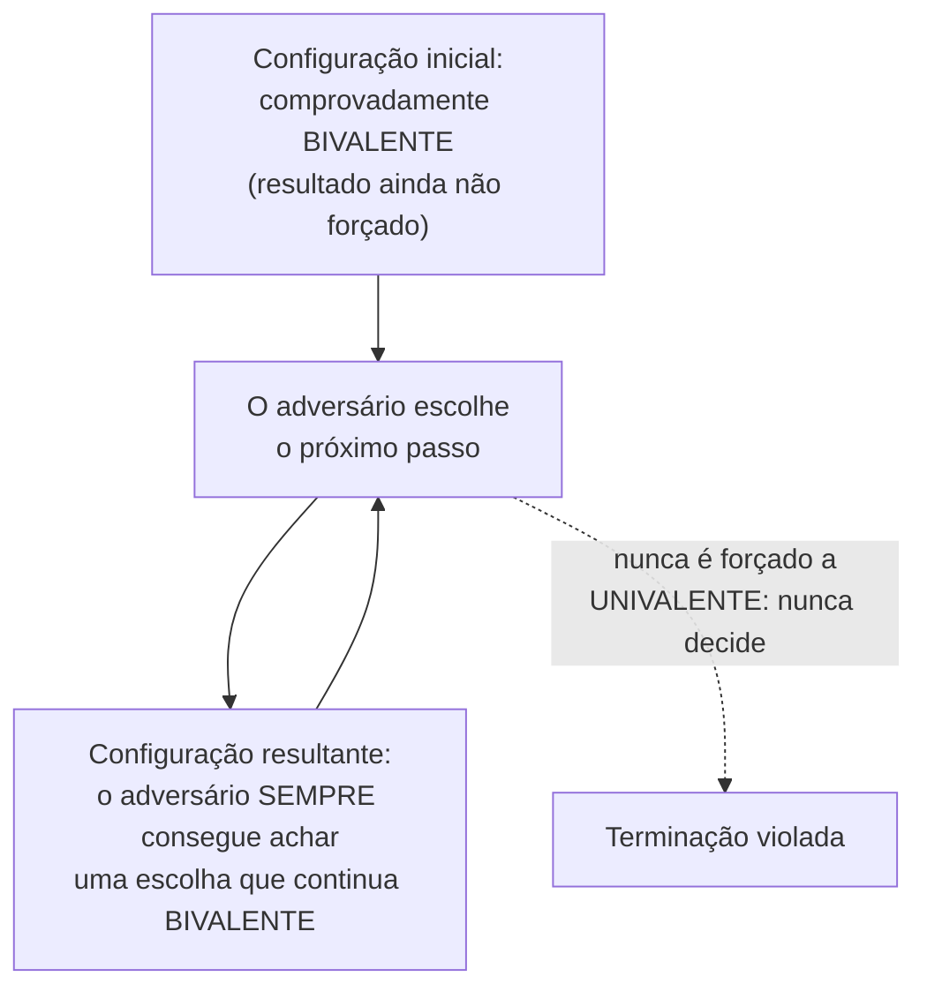

## Objetivos de Aprendizagem

- Enunciar o teorema FLP com precisão: num sistema completamente assíncrono, nenhum protocolo determinístico consegue garantir Acordo, Validade e Terminação ao mesmo tempo, mesmo tolerando apenas uma falha por queda.
- Explicar o formato da prova (configurações bivalentes e um adversário que sempre consegue encontrar um próximo passo que mantém o sistema bivalente) e por que este é um estilo de argumento diferente e mais sutil do que uma prova direta por contradição.
- Explicar por que todo protocolo de consenso real (Paxos, Raft) sobrevive a este resultado na prática abrindo mão da assincronia estrita, via timeouts e randomização, e não refutando o teorema.
- Enunciar honestamente o que o FLP afirma e não afirma: não é uma afirmação de que o consenso é impossível na prática, apenas de que a terminação garantida é impossível sob o modelo assíncrono estrito.

## Contexto e Motivação

`the-consensus-problem-agreement-validity-and-termination` deu ao consenso a sua definição precisa em três partes. O teorema FLP de 1985 é o limite honesto e rigoroso que esta disciplina prometeu desde o início: um resultado real, provado e fundamental, mostrando que sob um conjunto preciso e de aparência realista de suposições, as três propriedades do consenso não podem ser todas garantidas simultaneamente, não importa quão esperto seja o protocolo. Entender exatamente o que este resultado diz e não diz é essencial antes de olhar para o Paxos e o Raft, que existem e funcionam em sistemas reais especificamente porque fazem um desvio deliberado e reconhecido das suposições do FLP.

## Teoria Central

### As suposições precisas

O resultado do FLP se aplica a um sistema **completamente assíncrono**: não há limite algum para o tempo de entrega de mensagens (uma mensagem pode levar um tempo arbitrário, sem limite, embora seja eventualmente entregue) e nenhum limite para as velocidades relativas dos processos. As falhas são do tipo mais simples, **falhas por queda**: um processo defeituoso simplesmente para de executar em algum ponto e nunca mais envia nada; ele não envia mensagens corrompidas ou contraditórias (esse modelo mais difícil é `crash-faults-vs-byzantine-faults`, mais adiante nesta disciplina). O próprio protocolo é suposto **determinístico**: sem jogadas de moeda nem escolhas aleatórias.

### O teorema

Sob exatamente essas suposições, **nenhum protocolo de consenso determinístico consegue garantir a Terminação, mesmo tolerando apenas uma única falha por queda**. O Acordo e a Validade podem ser mantidos para sempre, mas existem execuções (agendamentos adversariais da entrega de mensagens) em que nenhum processo jamais decide.

### O formato da prova: bivalência, não contradição simples

Diferente da prova do teorema CAP (uma prova direta por contradição: suponha que as três propriedades valem, construa um cenário específico, derive uma contradição imediata), o argumento do FLP é um argumento construtivo de adversário, mais sutil. Ele define uma configuração (o estado local atual de todo processo, mais as mensagens em trânsito) como **bivalente** se, dependendo de como o sistema prossegue a partir dali, ele ainda pode acabar decidindo tanto 0 quanto 1: o resultado ainda não está determinado. Uma configuração é **univalente** se o resultado já é inevitável, não importa o que aconteça a seguir. A prova mostra duas coisas. Primeiro, alguma configuração inicial precisa ser bivalente (essencialmente porque a Validade exige que configurações iniciais diferentes sejam capazes de chegar a decisões diferentes, então o primeiríssimo passo não pode já ter decidido tudo). Segundo (o coração técnico da prova), a partir de qualquer configuração bivalente, um adversário que controla qual processo roda em seguida e quais mensagens são entregues quando sempre consegue encontrar algum próximo passo que mantém a configuração resultante bivalente também. Como uma configuração bivalente, por definição, ainda não decidiu, e o adversário consegue manter o sistema bivalente para sempre, o adversário consegue forçar o protocolo a rodar para sempre sem jamais chegar a uma decisão, violando diretamente a Terminação.



Esta é uma técnica de prova fundamentalmente diferente da contradição direta usada para o CAP: ela não supõe que o teorema é falso e deriva um absurdo imediato; ela descreve construtivamente a estratégia de um adversário e prova que essa estratégia sempre consegue adiar uma decisão para sempre, para *qualquer* protocolo proposto, e não só para um específico.

### Como protocolos reais sobrevivem a este resultado na prática

O Paxos e o Raft, cobertos nos próximos vários conceitos, são ambos protocolos de consenso reais e funcionais, e ambos são inteiramente compatíveis com o FLP, porque ambos fazem um desvio genuíno e explícito do modelo assíncrono estrito do FLP, em vez de de alguma forma refutar o teorema. Protocolos reais usam **timeouts** (um processo que não ouviu de um líder dentro de algum limite de tempo presume que ele falhou e começa uma nova eleição), o que implicitamente presume que existe *algum* limite prático para o atraso de mensagens na maior parte do tempo, embora isso não seja formalmente garantido, que é exatamente o tipo de suposição que a assincronia estrita proíbe. O Raft adicionalmente usa **randomização** (timeouts de eleição randomizados, cobertos em `raft-leader-election`, a seguir) especificamente porque a prova do FLP depende de o protocolo ser determinístico: pode-se mostrar que um protocolo randomizado termina com probabilidade 1 (eventualmente, quase certamente) mesmo sob um adversário totalmente assíncrono, convertendo uma impossibilidade rígida numa corrida que o adversário tem probabilidade esmagadora de eventualmente perder, em vez de fazer a impossibilidade desaparecer.

## Exemplos Resolvidos

### Exemplo 1: a ambiguidade que uma queda cria para qualquer protocolo, concretamente

```text
O processo P1 envia uma mensagem M para P2 e então, antes de receber
qualquer resposta, parece parar de responder a todos.

Sob o modelo do FLP, o resto do sistema não consegue distinguir:
  (a) P1 de fato caiu, e nunca mais vai enviar nada.
  (b) P1 está vivo, mas a rede está simplesmente atrasando a sua
      próxima mensagem por uma quantidade arbitrariamente longa (mas
      finita) -- completamente legal sob assincronia estrita, que não
      coloca NENHUM limite superior no atraso de mensagens.

Qualquer protocolo que decida "seguir em frente sem P1" depois de algum
período fixo de espera está implicitamente presumindo o cenário (a) --
mas, sob assincronia estrita, esse período de espera, por mais longo,
nunca é de fato longo o suficiente para DESCARTAR o cenário (b), já que
nenhuma espera finita consegue exceder um atraso ilimitado. Esta exata
ambiguidade é a matéria-prima que o adversário da prova do FLP explora
para continuar adiando uma decisão indefinidamente.
```

### Exemplo 2: como um protocolo baseado em timeout se desvia do modelo do FLP, concretamente

```text
O mecanismo de eleição de líder do Raft (raft-leader-election, a seguir)
presume: se um seguidor não ouve nenhum heartbeat de um líder dentro do
seu timeout de eleição, o líder falhou (ou está inalcançável o suficiente
para ser tratado como falho) e começa uma nova eleição.

Isso JÁ presume algo que o modelo assíncrono estrito do FLP proíbe
explicitamente presumir: que, sob condições normais, o atraso de
mensagens fica abaixo de algum limite prático na maior parte do tempo,
então um timeout disparando é GERALMENTE um sinal confiável (ainda que
imperfeito) de falha, em vez de ser indistinguível de "só um líder lento
mas saudável", como o Exemplo 1 mostra que precisa ser sob assincronia
pura. O Raft não afirma que esta suposição é uma garantia formal (uma
rede mal comportada ainda pode enganá-lo, forçando rodadas extras de
eleição) -- ele afirma que a suposição é realista o suficiente, na
prática, para que a terminação aconteça rápido quase sempre, convertendo
a impossibilidade do FLP num risco prático aceitável e limitado em vez de
eliminá-la.
```

### Exemplo 3: o que o FLP NÃO afirma, enunciado explicitamente

```text
O FLP NÃO afirma:
  "O consenso é impossível de alcançar em sistemas reais."
  Sistemas reais alcançam consenso com sucesso todo dia (etcd,
  ZooKeeper e todo sistema baseado em Raft em produção).

O FLP AFIRMA:
  "Nenhum protocolo DETERMINÍSTICO consegue GARANTIR a terminação sob
  assincronia ESTRITA e ILIMITADA, tolerando até uma única queda."

A lacuna entre estes dois enunciados é exatamente preenchida por
protocolos reais abrindo mão de uma das suposições precisas do FLP -- o
Raft abre mão do determinismo estrito (via timeouts randomizados) e
presume implicitamente limites práticos, ainda que não garantidos, para
o atraso de mensagens -- e não por encontrar um protocolo esperto que
satisfaça as suposições originais do FLP afinal, o que o teorema prova
ser impossível.
```

## Equívocos Comuns e Armadilhas

- **"O FLP prova que o consenso distribuído não funciona."** O Exemplo 3 diz isso diretamente: o FLP prova um resultado negativo preciso sobre um modelo específico e estrito (protocolos determinísticos, totalmente assíncronos, tolerando falhas por queda). Ele não diz nada sobre protocolos randomizados ou sistemas que fazem suposições práticas de timing, que é exatamente como o Raft e o Paxos operam com sucesso no mundo real.
- **"A prova do FLP é basicamente uma prova por contradição, como a do teorema CAP."** As duas são técnicas de prova genuinamente diferentes: a prova do CAP supõe que o teorema é falso e deriva uma contradição específica e imediata; a prova do FLP descreve construtivamente uma estratégia de adversário (manter a bivalência indefinidamente) e prova que essa estratégia sempre tem sucesso, para qualquer protocolo candidato, um estilo de argumento mais sutil e mais geral.
- **"Como o Raft usa randomização para evitar o FLP, ele não está de fato 'resolvendo' o consenso, só tendo sorte."** A randomização converte a impossibilidade rígida do FLP (a terminação garantida é comprovadamente impossível de forma determinística) numa garantia probabilística (terminação com probabilidade 1, ou seja, ela vai acontecer eventualmente com probabilidade esmagadora). Esta é uma técnica genuína, fundamentada e bem compreendida para contornar o teorema, e não sorte, e é exatamente por isso que os timeouts de eleição do Raft são especificamente randomizados em vez de fixos, como o próximo conceito cobre em detalhe.

## Resumo

O teorema FLP de 1985 prova que, num sistema completamente assíncrono (sem limite para o atraso de mensagens), nenhum protocolo de consenso determinístico consegue garantir Acordo, Validade e Terminação ao mesmo tempo, mesmo tolerando apenas uma única falha por queda. A prova não é por contradição direta, mas por um argumento construtivo de adversário, mostrando que a partir de qualquer configuração "bivalente" (não decidida), um adversário que controla o agendamento das mensagens sempre consegue encontrar um próximo passo que mantém o sistema bivalente, adiando indefinidamente qualquer decisão. Este é um limite genuíno e honesto, e não um exagero popularizado, mas ele se aplica a um modelo preciso e estrito, e todo protocolo de consenso real, incluindo o Paxos e o Raft cobertos a seguir, sobrevive a ele na prática desviando-se deliberadamente desse modelo: via timeouts que presumem implicitamente limites práticos (ainda que não garantidos) para o atraso de mensagens e, no caso do Raft, via randomização que converte a terminação garantida em terminação com probabilidade esmagadora.

## Documentation Links

- [Fischer, Lynch & Paterson: Impossibility of Distributed Consensus with One Faulty Process (JACM 1985)](https://groups.csail.mit.edu/tds/papers/Lynch/jacm85.pdf): a prova de impossibilidade original, fonte do argumento de adversário com configurações bivalentes que este conceito percorre em detalhe.
- [ACM/IEEE: CS2013, Parallel and Distributed Computing Knowledge Area](https://csed.acm.org/knowledge-areas-parallel-and-distributed-computing-pd-cs2013-version/): a diretriz curricular que lista o consenso e os seus limites fundamentais como tópicos centrais de computação paralela e distribuída.
