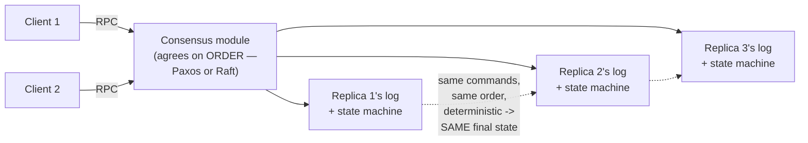

## Learning Objectives

- State the two conditions Schneider's state machine approach requires: determinism, and identical initial state.
- Explain why, given those two conditions, "every replica applies the same commands in the same order" is exactly sufficient for every replica to end up in the same state.
- Decompose that single requirement into Schneider's two named properties, Agreement and Order, and explain why Order is exactly the consensus problem.
- Explain how RPC and clients fit into this architecture as the interface clients actually use to submit commands.

## Context & Motivation

Every concept in this discipline so far has either named a problem (partial failure, no shared clock) or defined a precise goal (linearizability, the CAP trade-off). This concept names the actual *architecture* that Paxos and Raft, later in this discipline, are both implementations of — a single, reusable idea that reduces "keep several machines' copies of some data consistent despite failures" to exactly two clean, separately-solvable properties.

## Core Theory

### The two conditions the approach requires

Schneider's 1990 tutorial names the state machine approach precisely: model the service being replicated as a **state machine** — some internal state, plus a deterministic transition function that, given the current state and a command, produces a new state (and possibly an output). The approach then requires exactly two things of every replica:

```text
1. DETERMINISM: given the same starting state and the same
   command, every replica's transition function produces the
   EXACTLY same new state and output — no randomness, no
   dependence on anything replica-local like the current wall-
   clock time or a local random number generator.

2. IDENTICAL INITIAL STATE: every replica starts from the
   exact same state before any commands are applied.
```

### Why "same commands, same order" is then exactly sufficient

Given those two conditions, a remarkably simple fact follows: if every replica applies the *exact same sequence* of commands, starting from the *exact same* initial state, every replica ends up in the *exact same* final state at every point along the way — determinism guarantees each individual transition is reproducible, and starting from the same state guarantees there's no accumulated divergence to begin with. This reduces the entire replication problem to guaranteeing that one single fact: every replica sees the same sequence of commands.

### Agreement and Order: the two properties that guarantee "same sequence"

Schneider decomposes "every replica sees the same sequence of commands" into two properties that can be reasoned about, and solved, separately:

```text
AGREEMENT: every non-faulty replica applies the same SET of
  commands — no replica silently skips a command another
  replica applies, and no replica applies an extra command
  no other replica sees.

ORDER: every non-faulty replica applies that same set of
  commands in the same SEQUENCE relative to one another.
```

Order is exactly the consensus problem, formalized precisely in `the-consensus-problem-agreement-validity-and-termination`, next: agreeing, despite possible failures and an asynchronous network, on what the next command in the sequence is. Agreement (in Schneider's sense — every replica applies the same set) is what a correct consensus protocol, layered underneath, is responsible for delivering as a byproduct of correctly solving Order.



### RPC and clients: how commands actually get in

Clients do not communicate with the replicated state machine's internals directly — they submit commands via ordinary `remote-procedure-calls-and-the-illusion-of-a-local-call`, exactly as covered earlier in this discipline, and the client-facing contract for what happens to a command that seems to have failed is exactly the `at-least-once-at-most-once-and-exactly-once-semantics` question, now applied to an entire replicated system rather than a single server — a client's retried command needs to be recognized as a retry (not a new, duplicate command) by whichever mechanism eventually assigns it a position in the agreed-upon sequence, a concrete concern the capstone at the end of this discipline traces explicitly.

## Worked Examples

### Example 1 — determinism, concretely required and concretely violated

```text
DETERMINISTIC command (safe to replicate):
  SET balance = balance + 100
  Applied to state {balance: 500} on any replica -> {balance: 600}
  Every replica, given the same starting state and this same
  command, produces the exact same result.

NON-DETERMINISTIC command (breaks the approach if used as-is):
  SET timestamp = System.currentTimeMillis()
  Applied on Replica 1 at real time T1 -> timestamp = T1
  Applied on Replica 2, a few milliseconds later in real time,
  even though it's "the same command" in the log -> timestamp = T2 ≠ T1
  Replicas have now DIVERGED, even though they applied the
  "same" command in the "same" order — this is exactly why
  real replicated state machines require commands to be
  deterministic, e.g. by having the CLIENT (or the leader,
  once, before replicating) compute any such value and embed
  it as part of the command itself, rather than letting each
  replica compute it independently.
```

### Example 2 — Agreement and Order, violated separately

```text
AGREEMENT violated (different SETS of commands applied):
  Replica 1 applies: [cmd1, cmd2, cmd3]
  Replica 2 applies: [cmd1, cmd3]        <- missing cmd2!
  Replica 2 has now diverged from Replica 1's state, even
  though the commands it DID apply were in a consistent
  relative order — this is a pure Agreement failure.

ORDER violated (same SET, different sequence):
  Replica 1 applies: [cmd1, cmd2, cmd3]
  Replica 2 applies: [cmd1, cmd3, cmd2]  <- same 3 commands,
                                             different order!
  If cmd2 and cmd3 don't commute (e.g. cmd2 = "set x=1", cmd3
  = "set x=2"), Replica 1 ends with x=2, Replica 2 ends with
  x=1 — diverged, despite BOTH replicas seeing the exact same
  SET of commands. This is a pure Order failure — exactly the
  consensus problem, next, exists to prevent.
```

### Example 3 — why solving Order (consensus) is enough, once Agreement is guaranteed as its byproduct

```text
A correct consensus protocol (Raft, later in this discipline)
guarantees that every replica's LOG ends up holding the exact
same sequence of committed entries, in the exact same order,
at the same indices — by construction, this simultaneously
satisfies Order (obviously — it IS the sequence) and Agreement
(every replica's log holds the same SET of entries, since it's
literally the same sequence). This is why Raft's own safety
guarantee, worked out in detail several concepts ahead, is
stated purely in terms of LOG ordering — it is, in Schneider's
terms, solving Order directly, and getting Agreement for free
as an immediate consequence of the log being identical.
```

## Common Misconceptions & Pitfalls

- **"The state machine approach requires every replica to somehow have the same physical hardware or run the same code binary."** Determinism only requires that, given the SAME state and command, the transition function produces the same result — it says nothing about the underlying hardware or implementation, only about behavioral reproducibility (Example 1's currentTimeMillis() failure has nothing to do with hardware, and everything to do with a genuinely non-deterministic operation).
- **"Agreement and Order are really the same property just described twice."** Example 2 shows they are genuinely separable failure modes — a system can fail Agreement while preserving relative Order among the commands it did apply, or preserve the exact same set of commands (Agreement holds) while still diverging because the order differs (Order fails) — Schneider's decomposition is not redundant.
- **"Once you have a consensus protocol, replication is basically solved, no other conditions needed."** The consensus protocol solves Order (and Agreement as its byproduct, per Example 3), but the state machine approach's OTHER requirement — determinism — is a separate obligation on however the actual application logic is written; a perfect consensus protocol replicating a non-deterministic command still produces diverged replicas, exactly as Example 1 shows.

## Summary

The replicated state machine approach reduces "keep several machines' copies of a service consistent despite failures" to two conditions (determinism of the transition function, and identical initial state) plus one guarantee about how commands are delivered: every replica must apply the same commands, in the same order. Schneider decomposes that guarantee into Agreement (same set of commands) and Order (same sequence), and Order is exactly the consensus problem this discipline formalizes next — a correct consensus protocol delivers Agreement as an automatic byproduct of correctly solving Order, which is exactly why Raft's own safety argument, several concepts ahead, is phrased purely in terms of keeping every replica's log identical.

## Documentation Links

- [Schneider — Implementing Fault-Tolerant Services Using the State Machine Approach: A Tutorial (1990)](https://cdn.nakamotoinstitute.org/docs/implementing-fault-tolerant-services.pdf) — the tutorial this concept's determinism/identical-initial-state conditions and its Agreement/Order decomposition are drawn directly from.
- [Ongaro & Ousterhout — In Search of an Understandable Consensus Algorithm (Raft, USENIX ATC 2014)](https://raft.github.io/raft.pdf) — cited for how Raft's own safety guarantee is phrased purely in terms of keeping every replica's log identical, exactly the Order-with-Agreement-as-byproduct structure this concept describes.
