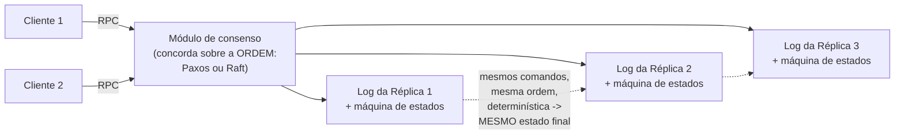

## Objetivos de Aprendizagem

- Enunciar as duas condições que a abordagem de máquina de estados de Schneider exige: determinismo e estado inicial idêntico.
- Explicar por que, dadas essas duas condições, "toda réplica aplica os mesmos comandos na mesma ordem" é exatamente suficiente para que toda réplica termine no mesmo estado.
- Decompor esse único requisito nas duas propriedades nomeadas de Schneider, Acordo e Ordem, e explicar por que a Ordem é exatamente o problema do consenso.
- Explicar como o RPC e os clientes se encaixam nesta arquitetura como a interface que os clientes de fato usam para submeter comandos.

## Contexto e Motivação

Todo conceito desta disciplina até agora ou nomeou um problema (falha parcial, nenhum relógio compartilhado) ou definiu um objetivo preciso (linearizabilidade, o trade-off do CAP). Este conceito nomeia a *arquitetura* de fato da qual o Paxos e o Raft, mais adiante nesta disciplina, são ambos implementações: uma ideia única e reutilizável que reduz "manter consistentes, apesar de falhas, as cópias de alguns dados em várias máquinas" a exatamente duas propriedades limpas e solucionáveis separadamente.

## Teoria Central

### As duas condições que a abordagem exige

O tutorial de Schneider de 1990 nomeia com precisão a abordagem de máquina de estados: modele o serviço sendo replicado como uma **máquina de estados**, algum estado interno mais uma função de transição determinística que, dado o estado atual e um comando, produz um novo estado (e possivelmente uma saída). A abordagem então exige exatamente duas coisas de toda réplica:

```text
1. DETERMINISMO: dado o mesmo estado inicial e o mesmo comando, a
   função de transição de toda réplica produz EXATAMENTE o mesmo novo
   estado e a mesma saída -- sem aleatoriedade, sem dependência de
   nada local à réplica, como o horário de relógio atual ou um gerador
   local de números aleatórios.

2. ESTADO INICIAL IDÊNTICO: toda réplica começa exatamente do mesmo
   estado antes que qualquer comando seja aplicado.
```

### Por que "mesmos comandos, mesma ordem" é então exatamente suficiente

Dadas essas duas condições, um fato notavelmente simples decorre: se toda réplica aplica *exatamente a mesma sequência* de comandos, começando *exatamente do mesmo* estado inicial, toda réplica termina *exatamente no mesmo* estado final em todo ponto do caminho. O determinismo garante que cada transição individual é reproduzível, e começar do mesmo estado garante que não há divergência acumulada, para começo de conversa. Isso reduz todo o problema de replicação a garantir um único fato: toda réplica vê a mesma sequência de comandos.

### Acordo e Ordem: as duas propriedades que garantem a "mesma sequência"

Schneider decompõe "toda réplica vê a mesma sequência de comandos" em duas propriedades sobre as quais se pode raciocinar, e que se podem resolver, separadamente:

```text
ACORDO: toda réplica não defeituosa aplica o mesmo CONJUNTO de
  comandos -- nenhuma réplica pula silenciosamente um comando que
  outra réplica aplica, e nenhuma réplica aplica um comando extra que
  nenhuma outra réplica vê.

ORDEM: toda réplica não defeituosa aplica esse mesmo conjunto de
  comandos na mesma SEQUÊNCIA relativa entre eles.
```

A Ordem é exatamente o problema do consenso, formalizado com precisão em `the-consensus-problem-agreement-validity-and-termination`, a seguir: concordar, apesar de possíveis falhas e de uma rede assíncrona, sobre qual é o próximo comando da sequência. O Acordo (no sentido de Schneider: toda réplica aplica o mesmo conjunto) é o que um protocolo de consenso correto, em camada por baixo, é responsável por entregar como um subproduto de resolver corretamente a Ordem.



### RPC e clientes: como os comandos de fato entram

Os clientes não se comunicam diretamente com o interior da máquina de estados replicada: eles submetem comandos via `remote-procedure-calls-and-the-illusion-of-a-local-call` comuns, exatamente como coberto antes nesta disciplina, e o contrato voltado ao cliente sobre o que acontece com um comando que parece ter falhado é exatamente a questão de `at-least-once-at-most-once-and-exactly-once-semantics`, agora aplicada a um sistema replicado inteiro em vez de a um único servidor. O comando retentado de um cliente precisa ser reconhecido como uma retentativa (e não um comando novo e duplicado) por qualquer que seja o mecanismo que eventualmente lhe atribui uma posição na sequência acordada, uma preocupação concreta que o capstone no fim desta disciplina rastreia explicitamente.

## Exemplos Resolvidos

### Exemplo 1: o determinismo, exigido concretamente e violado concretamente

```text
Comando DETERMINÍSTICO (seguro de replicar):
  SET balance = balance + 100
  Aplicado ao estado {balance: 500} em qualquer réplica -> {balance: 600}
  Toda réplica, dado o mesmo estado inicial e este mesmo comando,
  produz exatamente o mesmo resultado.

Comando NÃO DETERMINÍSTICO (quebra a abordagem se usado como está):
  SET timestamp = System.currentTimeMillis()
  Aplicado na Réplica 1 no tempo real T1 -> timestamp = T1
  Aplicado na Réplica 2, alguns milissegundos depois no tempo real,
  mesmo sendo "o mesmo comando" no log -> timestamp = T2 ≠ T1
  As réplicas agora DIVERGIRAM, mesmo tendo aplicado o "mesmo" comando
  na "mesma" ordem -- é exatamente por isso que máquinas de estados
  replicadas reais exigem que os comandos sejam determinísticos, por
  exemplo fazendo o CLIENTE (ou o líder, uma vez, antes de replicar)
  calcular qualquer valor desse tipo e embuti-lo como parte do próprio
  comando, em vez de deixar cada réplica calculá-lo independentemente.
```

### Exemplo 2: Acordo e Ordem, violados separadamente

```text
ACORDO violado (CONJUNTOS diferentes de comandos aplicados):
  A Réplica 1 aplica: [cmd1, cmd2, cmd3]
  A Réplica 2 aplica: [cmd1, cmd3]        <- falta o cmd2!
  A Réplica 2 agora divergiu do estado da Réplica 1, mesmo que os
  comandos que ela DE FATO aplicou estivessem numa ordem relativa
  consistente -- esta é uma falha pura de Acordo.

ORDEM violada (mesmo CONJUNTO, sequência diferente):
  A Réplica 1 aplica: [cmd1, cmd2, cmd3]
  A Réplica 2 aplica: [cmd1, cmd3, cmd2]  <- os mesmos 3 comandos,
                                              ordem diferente!
  Se cmd2 e cmd3 não comutam (ex.: cmd2 = "set x=1", cmd3 = "set x=2"),
  a Réplica 1 termina com x=2, a Réplica 2 termina com x=1 --
  divergiram, apesar de AMBAS as réplicas verem exatamente o mesmo
  CONJUNTO de comandos. Esta é uma falha pura de Ordem -- exatamente o
  que o problema do consenso, a seguir, existe para evitar.
```

### Exemplo 3: por que resolver a Ordem (consenso) basta, já que o Acordo é garantido como o seu subproduto

```text
Um protocolo de consenso correto (o Raft, mais adiante nesta disciplina)
garante que o LOG de toda réplica acabe guardando exatamente a mesma
sequência de entradas confirmadas, exatamente na mesma ordem, nos
mesmos índices -- por construção, isso satisfaz simultaneamente a Ordem
(obviamente -- ela É a sequência) e o Acordo (o log de toda réplica
guarda o mesmo CONJUNTO de entradas, já que é literalmente a mesma
sequência). É por isso que a própria garantia de segurança do Raft,
trabalhada em detalhe vários conceitos adiante, é enunciada puramente
em termos de ordenação de LOG -- ela está, nos termos de Schneider,
resolvendo a Ordem diretamente, e obtendo o Acordo de graça como
consequência imediata de o log ser idêntico.
```

## Equívocos Comuns e Armadilhas

- **"A abordagem de máquina de estados exige que toda réplica de alguma forma tenha o mesmo hardware físico ou rode o mesmo binário."** O determinismo só exige que, dados o MESMO estado e o MESMO comando, a função de transição produza o mesmo resultado. Ele não diz nada sobre o hardware ou a implementação subjacentes, apenas sobre a reprodutibilidade de comportamento (a falha do currentTimeMillis() do Exemplo 1 não tem nada a ver com hardware, e tudo a ver com uma operação genuinamente não determinística).
- **"Acordo e Ordem são na verdade a mesma propriedade descrita duas vezes."** O Exemplo 2 mostra que elas são modos de falha genuinamente separáveis: um sistema pode falhar no Acordo enquanto preserva a Ordem relativa entre os comandos que aplicou, ou preservar exatamente o mesmo conjunto de comandos (o Acordo vale) e ainda assim divergir porque a ordem difere (a Ordem falha). A decomposição de Schneider não é redundante.
- **"Uma vez que você tem um protocolo de consenso, a replicação está basicamente resolvida, nenhuma outra condição é necessária."** O protocolo de consenso resolve a Ordem (e o Acordo como subproduto, pelo Exemplo 3), mas o OUTRO requisito da abordagem de máquina de estados (o determinismo) é uma obrigação separada sobre como quer que a lógica de aplicação de fato seja escrita. Um protocolo de consenso perfeito replicando um comando não determinístico ainda produz réplicas divergentes, exatamente como o Exemplo 1 mostra.

## Resumo

A abordagem de máquina de estados replicada reduz "manter consistentes, apesar de falhas, as cópias de um serviço em várias máquinas" a duas condições (determinismo da função de transição e estado inicial idêntico) mais uma garantia sobre como os comandos são entregues: toda réplica precisa aplicar os mesmos comandos, na mesma ordem. Schneider decompõe essa garantia em Acordo (mesmo conjunto de comandos) e Ordem (mesma sequência), e a Ordem é exatamente o problema do consenso que esta disciplina formaliza a seguir. Um protocolo de consenso correto entrega o Acordo como subproduto automático de resolver corretamente a Ordem, e é exatamente por isso que o próprio argumento de segurança do Raft, vários conceitos adiante, é formulado puramente em termos de manter idêntico o log de toda réplica.

## Documentation Links

- [Schneider: Implementing Fault-Tolerant Services Using the State Machine Approach: A Tutorial (1990)](https://cdn.nakamotoinstitute.org/docs/implementing-fault-tolerant-services.pdf): o tutorial do qual as condições de determinismo/estado inicial idêntico e a decomposição em Acordo/Ordem deste conceito são extraídas diretamente.
- [Ongaro & Ousterhout: In Search of an Understandable Consensus Algorithm (Raft, USENIX ATC 2014)](https://raft.github.io/raft.pdf): citado por mostrar como a própria garantia de segurança do Raft é formulada puramente em termos de manter idêntico o log de toda réplica, exatamente a estrutura de Ordem com o Acordo como subproduto que este conceito descreve.
