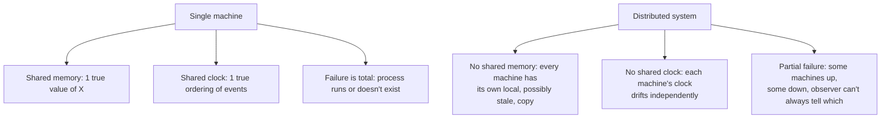

## Learning Objectives

- Name the three properties that distinguish a distributed system from concurrent programming on a single machine: partial failure, no shared memory, and no shared clock.
- Explain why a node in a distributed system cannot reliably distinguish "that machine crashed" from "that machine (or the network to it) is merely slow."
- Connect this problem to the single-machine coordination problems (locks, atomicity, deadlock) already solved on one machine, and explain concretely why those solutions do not transfer.
- State, as an honest scope statement, what this discipline builds toward: abstractions and protocols (RPC, replication, consensus) that let a system built from unreliable parts behave, from the outside, like it is reliable.

## Context & Motivation

`computer/operating-systems-i` and `computer/operating-systems-ii` already solved hard coordination problems — mutual exclusion, deadlock avoidance, safe concurrent access to shared data — but every one of those solutions leans on an assumption that is simply true on a single machine and simply false across a network: all the cooperating parties share the same memory, the same clock, and the same fate. A lock is a location in shared memory every thread can see and atomically test-and-set. A deadlock-detection algorithm can freeze the world and inspect every thread's wait-for edges at once. None of that is available the moment "the other thread" is a different physical machine, reachable only by sending messages that can be delayed, dropped, duplicated, or reordered by the network in between.

This concept does not solve anything yet — it names, precisely, what is different, so that every later concept in this discipline can be understood as a direct response to one of these three properties rather than an arbitrary added complexity.

## Core Theory

### Partial failure

On a single machine, failure is total: the process either continues running with a valid state, or it crashes and nothing runs at all — a caller invoking a function on a crashed process will simply never happen, because a crashed process doesn't accept function calls, it doesn't exist as a callable thing anymore. A distributed system's failure mode is qualitatively different: some machines can be up and correctly running while others are down, and — critically — an outside observer sending a message and getting no reply cannot locally distinguish between "the recipient machine crashed," "the recipient machine is alive but overloaded and slow to reply," and "the recipient replied, but the network lost the reply on the way back." All three produce the exact same observation: silence. Every protocol in this discipline (timeouts, retries, majority votes) exists because this ambiguity cannot be resolved by better local reasoning — it has to be designed around.

### No shared memory

A single machine's threads coordinate by reading and writing the same physical memory, so establishing "the current value of X" is a matter of where to look. In a distributed system, there is no such thing as "the current value of X" without first defining a protocol for it: each machine only has its own local memory, and any information about another machine's state is, by construction, stale the instant it's observed — it travelled through the network to get here, taking some non-zero and unpredictable amount of time. Replication (`the-replicated-state-machine-approach`, several concepts ahead) exists specifically to build the illusion of one logical piece of shared state on top of several machines that have no physical memory in common at all.

### No shared clock

A single machine has one hardware clock all its threads implicitly agree on, so "event A happened before event B" is unambiguous. Across machines, each has its own independently drifting physical clock (`physical-clock-synchronization-and-drift`, next), so timestamping events with local wall-clock time and comparing timestamps across machines does not reliably tell you which one actually happened first — this is exactly the gap Lamport's logical clocks (two concepts ahead) are built to close, by defining "happened before" directly from observable message exchange rather than from clocks at all.



### Why this is a genuinely different problem, not just "concurrency with extra latency"

A tempting but wrong mental model treats a distributed system as a concurrent program where messages are just slow function calls. Latency alone would only ever make a correct concurrent protocol slower, never wrong. What actually breaks correctness is that messages can be lost entirely (not just delayed), that a remote participant can fail independently of everyone else mid-protocol, and that no single participant ever has certainty about the current global state of the whole system — only about messages it has personally sent or received so far. `remote-procedure-calls-and-the-illusion-of-a-local-call`, next, is the first concept built directly on top of this reality: an RPC call is designed to look exactly like a local function call, and understanding RPC well means understanding exactly which of these three properties still leaks through the abstraction.

## Worked Examples

### Example 1 — the ambiguous silence, concretely

Server A sends a `write(x=5)` request to Server B and, after 500ms, has received no reply. Three distinct real scenarios produce this identical observation from A's point of view:

```text
Scenario 1: request lost in transit — B never saw it, x is unchanged.
Scenario 2: request arrived, B applied it (x=5), but the REPLY was lost
            — B's state changed, A doesn't know it.
Scenario 3: B is alive and got the request, but is still processing it
            (e.g. under heavy load) — B will apply it eventually, A's
            timeout just fired too early.
```

A cannot locally tell these apart. Any decision A makes next (retry? give up? assume B is dead?) has to be robust to all three being possible — this exact ambiguity is why `at-least-once-at-most-once-and-exactly-once-semantics` needs three distinct, carefully named contracts rather than one obvious "just retry" answer.

### Example 2 — a lock that doesn't survive the trip across the network

`locks-and-atomic-hardware-primitives` (`operating-systems-i`) built mutual exclusion on an atomic test-and-set instruction the CPU guarantees is indivisible with respect to every other core sharing that same memory bus. Naively "porting" this to a distributed setting — "each machine reads a `lock_held` flag from a shared file/variable, and sets it if false" — breaks immediately: two machines can both read `lock_held = false` at nearly the same real-world instant (there is no bus-level atomicity across a network to serialize their reads), both then write `true`, and both believe they hold the lock. Distributed mutual exclusion needs an entirely different foundation — ultimately, the majority-agreement idea this discipline builds up to in `the-consensus-problem-agreement-validity-and-termination` and `raft-leader-election` — not a network-transported version of test-and-set.

### Example 3 — deadlock detection that can't freeze the world

`deadlock-conditions-and-detection` (`operating-systems-i`) can build one global wait-for graph because a single OS kernel can pause every thread and inspect all of their states in one atomic instant. A distributed deadlock (machine A's transaction is waiting on a lock held by machine B, whose transaction is waiting on a lock held by machine A) has no such vantage point: no machine can freeze every other machine simultaneously and take a perfectly consistent global snapshot, because "simultaneously" itself is not a well-defined notion without a shared clock. Real distributed deadlock detection algorithms exist, but they have to work with partial, message-delayed, potentially stale views of the world — a fundamentally harder starting position than the single-machine case.

## Common Misconceptions & Pitfalls

- **"Distributed systems are just concurrent programs with network latency added."** Latency alone can only slow a correct protocol down, never make it wrong. What actually breaks naive designs is that messages can be lost entirely, that participants fail independently and partially, and that no participant ever has a real-time, complete view of the whole system's state — qualitative differences, not a quantitative latency penalty.
- **"If a request times out, the server didn't process it."** A timeout only tells you that no reply arrived in time — Example 1 above shows this is consistent with the request never arriving, the request being fully processed and only the reply being lost, or the server simply being slow. Retrying blindly on this assumption is exactly the trap `at-least-once-at-most-once-and-exactly-once-semantics` addresses carefully.
- **"A distributed lock is just a regular lock stored somewhere everyone can reach."** Example 2 shows this fails precisely because it assumes an atomic read-then-write across machines with no such atomicity guarantee — real distributed coordination needs an actual agreement protocol, not a naively relocated single-machine primitive.

## Summary

A distributed system differs from a concurrent program on one machine in three specific, named ways: partial failure (some machines can be up while others are down, and an observer often cannot tell "crashed" from "just slow" apart from silence), no shared memory (each machine only has its own local state, always potentially stale relative to any other machine's), and no shared clock (each machine's physical clock drifts independently, so wall-clock timestamps from different machines cannot be trusted to order events correctly). These are not extra difficulties layered onto ordinary concurrent programming — they are the actual subject matter of this discipline, and every concept that follows (RPC's careful failure semantics, logical clocks, consistency models, CAP, and ultimately consensus protocols like Raft) exists as a direct, specific response to one or more of these three properties.

## Documentation Links

- [MIT 6.5840 (Distributed Systems) — Course Overview](https://pdos.csail.mit.edu/6.824/index.html) — the course overview describing the same three defining distributed-systems properties (partial failure, no shared memory, no shared clock) this concept opens with.
- [ACM/IEEE — CS2013, Parallel and Distributed Computing Knowledge Area](https://csed.acm.org/knowledge-areas-parallel-and-distributed-computing-pd-cs2013-version/) — the curriculum guideline that frames partial failure, no shared memory, and no shared clock as the defining topics of parallel and distributed computing.
