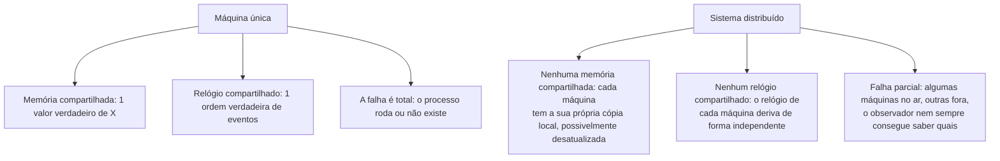

## Objetivos de Aprendizagem

- Nomear as três propriedades que distinguem um sistema distribuído da programação concorrente numa única máquina: falha parcial, nenhuma memória compartilhada e nenhum relógio compartilhado.
- Explicar por que um nó num sistema distribuído não consegue distinguir de forma confiável "aquela máquina caiu" de "aquela máquina (ou a rede até ela) está apenas lenta".
- Conectar este problema aos problemas de coordenação numa única máquina (locks, atomicidade, deadlock) já resolvidos numa máquina, e explicar concretamente por que essas soluções não se transferem.
- Enunciar, como uma declaração honesta de escopo, aonde esta disciplina chega: abstrações e protocolos (RPC, replicação, consenso) que permitem a um sistema construído a partir de partes não confiáveis se comportar, visto de fora, como se fosse confiável.

## Contexto e Motivação

`computer/operating-systems-i` e `computer/operating-systems-ii` já resolveram problemas difíceis de coordenação (exclusão mútua, prevenção de deadlock, acesso concorrente seguro a dados compartilhados), mas cada uma dessas soluções se apoia numa suposição que é simplesmente verdadeira numa única máquina e simplesmente falsa através de uma rede: todas as partes cooperantes compartilham a mesma memória, o mesmo relógio e o mesmo destino. Um lock é uma posição em memória compartilhada que toda thread consegue ver e testar-e-definir atomicamente. Um algoritmo de detecção de deadlock pode congelar o mundo e inspecionar as arestas de espera de toda thread de uma vez. Nada disso está disponível no momento em que "a outra thread" é uma máquina física diferente, alcançável apenas enviando mensagens que podem ser atrasadas, descartadas, duplicadas ou reordenadas pela rede no meio do caminho.

Este conceito ainda não resolve nada: ele nomeia, com precisão, o que é diferente, para que todo conceito posterior desta disciplina possa ser entendido como uma resposta direta a uma destas três propriedades, e não como uma complexidade adicionada arbitrariamente.

## Teoria Central

### Falha parcial

Numa única máquina, a falha é total: o processo ou continua rodando com um estado válido, ou cai e nada roda. Um chamador invocando uma função num processo caído simplesmente não vai acontecer, porque um processo caído não aceita chamadas de função; ele não existe mais como algo que possa ser chamado. O modo de falha de um sistema distribuído é qualitativamente diferente: algumas máquinas podem estar no ar e rodando corretamente enquanto outras estão fora e, crucialmente, um observador externo que envia uma mensagem e não recebe resposta não consegue distinguir localmente entre "a máquina destinatária caiu", "a máquina destinatária está viva mas sobrecarregada e lenta para responder" e "a destinatária respondeu, mas a rede perdeu a resposta no caminho de volta". Os três produzem exatamente a mesma observação: silêncio. Todo protocolo desta disciplina (timeouts, retentativas, votos por maioria) existe porque essa ambiguidade não pode ser resolvida com um raciocínio local melhor; ela precisa ser contornada por projeto.

### Nenhuma memória compartilhada

As threads de uma única máquina se coordenam lendo e escrevendo a mesma memória física, então estabelecer "o valor atual de X" é uma questão de onde olhar. Num sistema distribuído, não existe "o valor atual de X" sem primeiro definir um protocolo para isso: cada máquina só tem a sua própria memória local, e qualquer informação sobre o estado de outra máquina está, por construção, desatualizada no instante em que é observada; ela viajou pela rede para chegar aqui, levando uma quantidade de tempo não nula e imprevisível. A replicação (`the-replicated-state-machine-approach`, alguns conceitos adiante) existe especificamente para construir a ilusão de uma peça lógica de estado compartilhado em cima de várias máquinas que não têm memória física alguma em comum.

### Nenhum relógio compartilhado

Uma única máquina tem um relógio de hardware com o qual todas as suas threads implicitamente concordam, então "o evento A aconteceu antes do evento B" é inequívoco. Entre máquinas, cada uma tem o seu próprio relógio físico derivando de forma independente (`physical-clock-synchronization-and-drift`, a seguir), então carimbar eventos com o horário de relógio local e comparar carimbos entre máquinas não diz de forma confiável qual deles de fato aconteceu primeiro. Esta é exatamente a lacuna que os relógios lógicos de Lamport (dois conceitos adiante) são construídos para fechar, definindo "aconteceu antes" diretamente a partir da troca observável de mensagens, e não a partir de relógios.



### Por que este é um problema genuinamente diferente, e não só "concorrência com latência extra"

Um modelo mental tentador, mas errado, trata um sistema distribuído como um programa concorrente em que as mensagens são só chamadas de função lentas. A latência sozinha só tornaria um protocolo concorrente correto mais lento, nunca errado. O que de fato quebra a corretude é que mensagens podem ser perdidas por completo (não só atrasadas), que um participante remoto pode falhar independentemente de todos os outros no meio do protocolo, e que nenhum participante isolado jamais tem certeza sobre o estado global atual do sistema inteiro, apenas sobre as mensagens que ele mesmo enviou ou recebeu até agora. `remote-procedure-calls-and-the-illusion-of-a-local-call`, a seguir, é o primeiro conceito construído diretamente sobre essa realidade: uma chamada RPC é projetada para parecer exatamente uma chamada de função local, e entender bem RPC significa entender exatamente quais destas três propriedades ainda vazam através da abstração.

## Exemplos Resolvidos

### Exemplo 1: o silêncio ambíguo, concretamente

O Servidor A envia uma requisição `write(x=5)` ao Servidor B e, depois de 500ms, não recebeu resposta. Três cenários reais distintos produzem esta observação idêntica do ponto de vista de A:

```text
Cenário 1: requisição perdida em trânsito -- B nunca a viu, x não mudou.
Cenário 2: a requisição chegou, B a aplicou (x=5), mas a RESPOSTA se perdeu
           -- o estado de B mudou, A não sabe disso.
Cenário 3: B está vivo e recebeu a requisição, mas ainda a está processando
           (ex.: sob carga pesada) -- B vai aplicá-la eventualmente, o
           timeout de A só disparou cedo demais.
```

A não consegue distinguir estes localmente. Qualquer decisão que A tome a seguir (tentar de novo? desistir? presumir que B está morto?) precisa ser robusta à possibilidade dos três, e é exatamente essa ambiguidade que faz `at-least-once-at-most-once-and-exactly-once-semantics` precisar de três contratos distintos e cuidadosamente nomeados, em vez de uma única resposta óbvia de "é só tentar de novo".

### Exemplo 2: um lock que não sobrevive à viagem pela rede

`locks-and-atomic-hardware-primitives` (`operating-systems-i`) construiu a exclusão mútua sobre uma instrução atômica de test-and-set que a CPU garante ser indivisível em relação a todo outro núcleo que compartilha aquele mesmo barramento de memória. "Portar" isso ingenuamente para um cenário distribuído ("cada máquina lê uma flag `lock_held` de um arquivo/variável compartilhado, e a define se for falsa") quebra imediatamente: duas máquinas podem ambas ler `lock_held = false` quase no mesmo instante do mundo real (não há atomicidade no nível de barramento através de uma rede para serializar as suas leituras), ambas então escrevem `true`, e ambas acreditam deter o lock. A exclusão mútua distribuída precisa de uma fundação inteiramente diferente (no fim das contas, a ideia de acordo por maioria que esta disciplina constrói em `the-consensus-problem-agreement-validity-and-termination` e `raft-leader-election`), e não de uma versão transportada pela rede do test-and-set.

### Exemplo 3: detecção de deadlock que não consegue congelar o mundo

`deadlock-conditions-and-detection` (`operating-systems-i`) consegue construir um grafo de espera global porque um único kernel de SO pode pausar toda thread e inspecionar todos os seus estados num instante atômico. Um deadlock distribuído (a transação da máquina A está esperando por um lock detido pela máquina B, cuja transação está esperando por um lock detido pela máquina A) não tem esse ponto de observação: nenhuma máquina consegue congelar todas as outras máquinas simultaneamente e tirar um snapshot global perfeitamente consistente, porque o próprio "simultaneamente" não é uma noção bem definida sem um relógio compartilhado. Algoritmos reais de detecção de deadlock distribuído existem, mas precisam trabalhar com visões parciais, atrasadas por mensagens e potencialmente desatualizadas do mundo, uma posição de partida fundamentalmente mais difícil do que o caso de máquina única.

## Equívocos Comuns e Armadilhas

- **"Sistemas distribuídos são só programas concorrentes com latência de rede adicionada."** A latência sozinha só consegue deixar um protocolo correto mais lento, nunca torná-lo errado. O que de fato quebra projetos ingênuos é que mensagens podem ser perdidas por completo, que os participantes falham de forma independente e parcial, e que nenhum participante jamais tem uma visão completa e em tempo real do estado do sistema inteiro. São diferenças qualitativas, e não uma penalidade quantitativa de latência.
- **"Se uma requisição deu timeout, o servidor não a processou."** Um timeout só diz que nenhuma resposta chegou a tempo. O Exemplo 1 acima mostra que isso é consistente com a requisição nunca ter chegado, com a requisição ter sido totalmente processada e só a resposta ter se perdido, ou com o servidor simplesmente estar lento. Tentar de novo às cegas com base nessa suposição é exatamente a armadilha que `at-least-once-at-most-once-and-exactly-once-semantics` trata com cuidado.
- **"Um lock distribuído é só um lock comum guardado num lugar que todos conseguem alcançar."** O Exemplo 2 mostra que isso falha justamente porque presume uma leitura-e-escrita atômica entre máquinas sem nenhuma garantia de atomicidade desse tipo. A coordenação distribuída real precisa de um protocolo de acordo de fato, e não de uma primitiva de máquina única ingenuamente realocada.

## Resumo

Um sistema distribuído difere de um programa concorrente numa máquina de três formas específicas e nomeadas: falha parcial (algumas máquinas podem estar no ar enquanto outras estão fora, e um observador frequentemente não consegue distinguir "caiu" de "só está lento" a partir do silêncio), nenhuma memória compartilhada (cada máquina só tem o seu próprio estado local, sempre potencialmente desatualizado em relação ao de qualquer outra máquina) e nenhum relógio compartilhado (o relógio físico de cada máquina deriva de forma independente, então carimbos de horário de máquinas diferentes não são confiáveis para ordenar eventos corretamente). Estas não são dificuldades extras sobrepostas à programação concorrente comum; elas são o verdadeiro assunto desta disciplina, e todo conceito que vem a seguir (a semântica de falhas cuidadosa do RPC, relógios lógicos, modelos de consistência, CAP e, no fim, protocolos de consenso como o Raft) existe como uma resposta direta e específica a uma ou mais destas três propriedades.

## Documentation Links

- [MIT 6.5840 (Distributed Systems): Course Overview](https://pdos.csail.mit.edu/6.824/index.html): a visão geral do curso que descreve as mesmas três propriedades definidoras de sistemas distribuídos (falha parcial, nenhuma memória compartilhada, nenhum relógio compartilhado) com as quais este conceito abre.
- [ACM/IEEE: CS2013, Parallel and Distributed Computing Knowledge Area](https://csed.acm.org/knowledge-areas-parallel-and-distributed-computing-pd-cs2013-version/): a diretriz curricular que enquadra falha parcial, nenhuma memória compartilhada e nenhum relógio compartilhado como os tópicos definidores da computação paralela e distribuída.
