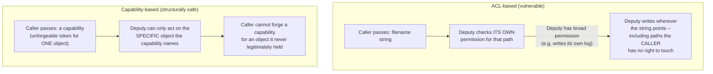

## Learning Objectives

- Define a capability as an unforgeable token a process already holds, proving it may perform a specific operation, as a subject-centered alternative to the previous concept's object-centered ACL.
- State the confused-deputy problem precisely, with a concrete scenario, and explain exactly why an ACL-based design is prone to it.
- Explain why capability-based security resolves the confused-deputy problem structurally, not merely by adding an extra check.
- Name a real system built on capability-based security (seL4) and describe, at a high level, what makes it a genuine, working instance of this model rather than a purely theoretical one.

## Context & Motivation

The previous concept's access control list answers "who may do what to this object" by attaching a policy to the object itself, and checking a requesting subject's identity against that policy on every access. This is a real, effective, and extremely widely deployed model — but it has a specific, well-documented structural weakness, one that becomes visible in exactly the kind of scenario where one program legitimately needs to act on another program's behalf.

Capability-based security answers the same underlying question — deciding what a process may do — with a fundamentally different model: instead of the kernel checking a requester's identity against an object's policy at the moment of access, the requester simply already holds an unforgeable token (a capability) that itself proves permission, with no separate identity check needed at all. Understanding why this different model exists, and what specific, real problem it solves that ACLs do not solve cleanly, is this concept's central purpose.

## Core Theory

### The confused-deputy problem: a concrete, real failure mode of ACL-based systems

The confused-deputy problem is a specific, well-documented scenario where a program with legitimate, elevated permission (a "deputy," acting on behalf of some caller) is tricked into misusing its own permission on the caller's behalf, precisely because an ACL-based check only asks "does the deputy have permission," never "on whose behalf, and for what original purpose, is the deputy currently acting."

The canonical concrete example: imagine a compiler service that has write access to a shared, system-wide log file (its own legitimate permission, needed to log its own diagnostic output), and that also accepts a filename argument from each caller, specifying where to write that particular compilation's output. A malicious caller passes the *log file's own path* as the output filename. The compiler service, checking only its OWN permission (which does include write access to the log file, since that is one of its own legitimate needs), happily overwrites the shared log file with the caller's chosen content — the compiler was never tricked about ITS OWN permissions; it was tricked about WHOSE INTENT it was actually serving at that moment, because an ACL check based on the deputy's own identity cannot distinguish "the compiler legitimately writing its own log" from "the compiler being manipulated into writing wherever a caller points it."

### Why an ACL-based check cannot cleanly prevent this

The structural reason this happens is that an ACL check asks exactly one question — does THIS subject (the compiler service) have permission for THIS operation (writing to this specific path) — and that question is genuinely, correctly answered "yes," because the compiler service really does have legitimate write access to the log file for its own purposes. The check has no way to additionally ask "but is the compiler currently exercising this permission for its own legitimate reason, or because a caller manipulated it into targeting a path the caller itself has no right to write to" — identity-based permission simply does not carry that distinction.

### The capability fix: an unforgeable token proving permission for exactly this object, this operation

A capability-based system takes a structurally different approach: rather than checking a requester's identity against an object's ACL, a process must already hold a specific, unforgeable capability — a token naming exactly one object and exactly the operations permitted on it — before the kernel will let it perform that operation at all, and a process can never manufacture a new capability for itself out of thin air; it can only receive one legitimately, either by being granted it at creation, or by another process that already holds it explicitly passing it along.

Applied to the confused-deputy scenario: the caller would pass the compiler service not a bare filename string (which the compiler can freely reinterpret as any path it has permission to reach) but a *capability* specifically for the intended output file — a token the caller itself must already legitimately hold. If the caller does not hold a capability for the shared log file (a reasonable assumption, since the log file is the compiler's own internal resource, not something ordinary callers should have any capability for at all), the caller cannot construct or forge one, and the compiler, holding only the capability the caller actually passed it, has no way to redirect its write anywhere the caller did not explicitly, legitimately authorize. The problem is closed structurally — not because a smarter check was added, but because the very act of naming "which object to write to" now requires possessing an unforgeable token, rather than merely typing a path string the deputy's own identity-based permission happens to also cover.



### A real, working instance: seL4

Capability-based security is not merely a theoretical alternative to ACLs — seL4, a formally verified microkernel with a substantial real-world deployment history (used in real, high-assurance embedded and safety-critical systems), is built entirely around capabilities as its sole access-control mechanism: every kernel object in seL4 (a thread, an address space, a communication endpoint) is accessed exclusively through a capability naming it, with no ambient, identity-based permission of any kind existing anywhere in the kernel. This is a genuinely different design point from mainstream general-purpose operating systems (which remain predominantly ACL-based, as the previous concept covered), and its formal verification specifically relies on capabilities' structural property — a process can only ever reach exactly the objects it holds capabilities for, nothing implicit or identity-based to reason about — to make strong, mathematically proven claims about what the kernel does and does not permit.

## Worked Examples

### Example 1: The confused-deputy scenario, traced step by step

```text
Setup: compiler_service has write access to /var/log/compiler.log
       (its own legitimate resource, for its own diagnostic output)

Malicious caller invokes:
  compile("my_program.c", output_path="/var/log/compiler.log")

ACL-based deputy's check:
  "Do I (compiler_service) have write permission for
   /var/log/compiler.log?"  -> YES (it's my own log file)

Result: compiler_service overwrites the SHARED log file with the
caller's compiled output -- the caller never had permission to
write to that path directly, but successfully did so anyway, by
manipulating a deputy that DID have permission, for a different
reason than the caller's actual (illegitimate) goal.
```

### Example 2: The same scenario, closed by capabilities

```text
Setup: compiler_service holds its OWN capability for its log file
       (never shared with callers).

Caller invokes:
  compile("my_program.c", output_capability=<caller's own
          capability for /home/caller/output.o>)

compiler_service's check: does the OPERATION (write) apply to the
OBJECT the SUPPLIED CAPABILITY actually names?  Yes -- and that
capability names /home/caller/output.o, NOT the log file, because
the caller never held (and cannot forge) a capability for the log
file at all.

Result: compiler_service writes exactly to the caller's own
intended output location. It has no way to redirect the write to
the log file, because doing so would require a capability for the
log file, which nothing in this exchange ever provided.
```

### Example 3: ACL versus capability, the same underlying question, two different mechanisms

```text
Question both models answer: "May THIS operation happen on THAT object?"

ACL-based:    Check the OBJECT's list: is the REQUESTER's identity
              (or group) present with the needed permission?
              -> Vulnerable to a trusted deputy being manipulated
                 into acting on an untrusted party's behalf.

Capability-  Check whether the REQUESTER already POSSESSES an
based:        unforgeable token naming exactly that object and
              operation.
              -> Not vulnerable to the same confusion, because
                 possessing the right token IS the permission --
                 there is no separate identity check to fool.
```

## Common Misconceptions & Pitfalls

- **"Capability-based security is a purely academic idea with no real systems using it."** seL4, a formally verified microkernel with genuine real-world deployment in high-assurance embedded and safety-critical systems, is built entirely around capabilities as its sole access-control mechanism — a real, working instance, not only a theoretical alternative.
- **"The confused-deputy problem is just a bug in a specific program's logic, not a structural weakness of ACL-based systems in general."** It arises specifically because identity-based permission checks (the ACL model) cannot distinguish "acting for my own legitimate purpose" from "acting because I was manipulated into targeting a resource on someone else's behalf" — this is a structural property of the ACL model itself, reproducible in any sufficiently privileged deputy, not a one-off coding mistake.
- **"Capabilities just add an extra permission check on top of the ACL model."** They replace identity-based checking entirely with possession-based checking — the fix is structural, not an additional layer of the same kind of check; a capability-based system has no notion of "the requester's identity" driving the access decision at all.
- **"Since capabilities close the confused-deputy problem, every real system should switch to capability-based security."** Mainstream general-purpose operating systems remain predominantly ACL-based, in part because ACLs map more naturally onto how most applications and administrators already think about permissions (by user and group identity); the tradeoff is real, not a simple case of one model being unconditionally superior.

## Summary

Capability-based security answers the same authorization question as an access control list — what may this operation do to this object — with a structurally different mechanism: rather than checking a requester's identity against an object's ACL, a process must already hold an unforgeable capability naming exactly that object and operation, a token it can never manufacture itself and can only ever receive by legitimate grant. This structurally closes the confused-deputy problem — a real, well-documented failure of ACL-based systems where a trusted deputy with its own legitimate, broad permission is manipulated by an untrusted caller into misusing that permission on the caller's behalf, because an identity-based check cannot distinguish acting for one's own purpose from acting under manipulation. seL4, a formally verified microkernel with genuine real-world deployment, demonstrates this is not merely a theoretical alternative but a real, working design capable of supporting strong, mathematically provable security guarantees.

## Documentation Links

- [OSTEP — Access Control](https://pages.cs.wisc.edu/~remzi/OSTEP/security-access.pdf) — covers capability-based security as a real alternative model to ACLs, alongside the confused-deputy problem this concept develops.
- [ACM/IEEE CS2013 — Operating Systems Knowledge Area](https://csed.acm.org/knowledge-areas-operating-systems-os-cs2013-version/) — situates access control models, including capabilities, within the Operating Systems curriculum this discipline follows.
