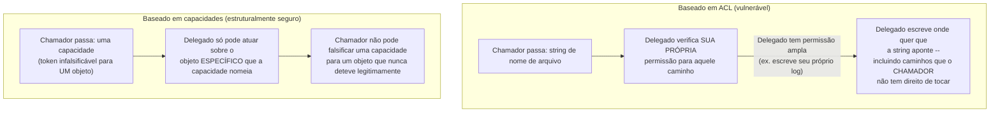

## Objetivos de Aprendizagem

- Definir uma capacidade como um token infalsificável que um processo já detém, provando que ele pode realizar uma operação específica, como uma alternativa centrada no sujeito à ACL centrada no objeto do conceito anterior.
- Enunciar o problema do delegado confuso com precisão, com um cenário concreto, e explicar exatamente por que um projeto baseado em ACL é propenso a ele.
- Explicar por que a segurança baseada em capacidades resolve o problema do delegado confuso estruturalmente, não apenas adicionando uma verificação extra.
- Nomear um sistema real construído sobre segurança baseada em capacidades (seL4) e descrever, em alto nível, o que o torna uma instância genuína e funcional desse modelo em vez de uma puramente teórica.

## Contexto e Motivação

A lista de controle de acesso do conceito anterior responde "quem pode fazer o quê com este objeto" anexando uma política ao próprio objeto, e verificando a identidade de um sujeito solicitante contra essa política a cada acesso. Este é um modelo real, eficaz e extremamente difundido, mas tem uma fraqueza estrutural específica e bem documentada, que se torna visível exatamente no tipo de cenário em que um programa legitimamente precisa atuar em nome de outro programa.

A segurança baseada em capacidades responde à mesma questão subjacente, decidir o que um processo pode fazer, com um modelo fundamentalmente diferente: em vez de o kernel verificar a identidade de um solicitante contra a política de um objeto no momento do acesso, o solicitante simplesmente já detém um token infalsificável (uma capacidade) que por si só prova a permissão, sem nenhuma verificação de identidade separada necessária. Entender por que esse modelo diferente existe, e que problema específico e real ele resolve que as ACLs não resolvem de forma limpa, é o propósito central deste conceito.

## Teoria Central

### O problema do delegado confuso: um modo de falha real e concreto de sistemas baseados em ACL

O problema do delegado confuso é um cenário específico e bem documentado em que um programa com permissão legítima e elevada (um "delegado", atuando em nome de algum chamador) é induzido a usar mal sua própria permissão em nome do chamador, precisamente porque uma verificação baseada em ACL só pergunta "o delegado tem permissão", nunca "em nome de quem, e com que propósito original, o delegado está atuando no momento".

O exemplo concreto canônico: imagine um serviço compilador que tem acesso de escrita a um arquivo de log compartilhado por todo o sistema (sua própria permissão legítima, necessária para registrar sua própria saída de diagnóstico), e que também aceita um argumento de nome de arquivo de cada chamador, especificando onde escrever a saída daquela compilação particular. Um chamador malicioso passa o *próprio caminho do arquivo de log* como o nome de arquivo de saída. O serviço compilador, verificando apenas a SUA PRÓPRIA permissão (que inclui de fato acesso de escrita ao arquivo de log, já que essa é uma de suas próprias necessidades legítimas), alegremente sobrescreve o arquivo de log compartilhado com o conteúdo escolhido pelo chamador: o compilador nunca foi enganado sobre AS SUAS PRÓPRIAS permissões; ele foi enganado sobre A QUAL INTENÇÃO estava de fato servindo naquele momento, porque uma verificação de ACL baseada na identidade do próprio delegado não consegue distinguir "o compilador legitimamente escrevendo seu próprio log" de "o compilador sendo manipulado a escrever onde quer que um chamador aponte".

### Por que uma verificação baseada em ACL não consegue impedir isso de forma limpa

A razão estrutural de isso acontecer é que uma verificação de ACL faz exatamente uma pergunta, ESTE sujeito (o serviço compilador) tem permissão para ESTA operação (escrever neste caminho específico), e essa pergunta é genuína e corretamente respondida "sim", porque o serviço compilador realmente tem acesso de escrita legítimo ao arquivo de log para seus próprios fins. A verificação não tem como adicionalmente perguntar "mas o compilador está atualmente exercendo essa permissão pela sua própria razão legítima, ou porque um chamador o manipulou para mirar num caminho que o próprio chamador não tem direito de escrever": a permissão baseada em identidade simplesmente não carrega essa distinção.

### A correção por capacidade: um token infalsificável provando permissão para exatamente este objeto, esta operação

Um sistema baseado em capacidades adota uma abordagem estruturalmente diferente: em vez de verificar a identidade de um solicitante contra a ACL de um objeto, um processo precisa já deter uma capacidade específica e infalsificável, um token nomeando exatamente um objeto e exatamente as operações permitidas sobre ele, antes que o kernel sequer o deixe realizar essa operação, e um processo nunca pode fabricar uma nova capacidade para si mesmo do nada; ele só pode recebê-la legitimamente, seja por ter recebido na criação, seja por outro processo que já a detém passá-la adiante explicitamente.

Aplicado ao cenário do delegado confuso: o chamador passaria ao serviço compilador não uma string de nome de arquivo nua (que o compilador pode livremente reinterpretar como qualquer caminho que tenha permissão de alcançar) mas uma *capacidade* especificamente para o arquivo de saída pretendido, um token que o próprio chamador precisa já deter legitimamente. Se o chamador não detém uma capacidade para o arquivo de log compartilhado (uma suposição razoável, já que o arquivo de log é o recurso interno do próprio compilador, não algo para o qual chamadores comuns deveriam ter qualquer capacidade), o chamador não consegue construir ou falsificar uma, e o compilador, detendo apenas a capacidade que o chamador de fato lhe passou, não tem como redirecionar sua escrita para qualquer lugar que o chamador não tenha explícita e legitimamente autorizado. O problema é fechado estruturalmente, não porque uma verificação mais inteligente foi adicionada, mas porque o próprio ato de nomear "em qual objeto escrever" agora exige possuir um token infalsificável, em vez de meramente digitar uma string de caminho que a própria permissão baseada em identidade do delegado por acaso também cobre.



### Uma instância real e funcional: seL4

A segurança baseada em capacidades não é meramente uma alternativa teórica às ACLs: o seL4, um microkernel formalmente verificado com um histórico substancial de implantação no mundo real (usado em sistemas embarcados e críticos de segurança reais e de alta garantia), é construído inteiramente em torno de capacidades como seu único mecanismo de controle de acesso: todo objeto de kernel no seL4 (uma thread, um espaço de endereçamento, um ponto final de comunicação) é acessado exclusivamente através de uma capacidade que o nomeia, sem nenhuma permissão ambiente, baseada em identidade, de qualquer tipo existindo em qualquer lugar no kernel. Este é um ponto de projeto genuinamente diferente dos sistemas operacionais de propósito geral predominantes (que permanecem majoritariamente baseados em ACL, como o conceito anterior cobriu), e sua verificação formal depende especificamente da propriedade estrutural das capacidades, um processo só pode alcançar exatamente os objetos para os quais detém capacidades, nada implícito ou baseado em identidade a raciocinar, para fazer afirmações fortes e matematicamente comprovadas sobre o que o kernel permite e não permite.

## Exemplos Resolvidos

### Exemplo 1: O cenário do delegado confuso, rastreado passo a passo

```text
Preparação: compiler_service tem acesso de escrita a /var/log/compiler.log
       (seu próprio recurso legítimo, para sua própria saída de diagnóstico)

Chamador malicioso invoca:
  compile("my_program.c", output_path="/var/log/compiler.log")

Verificação do delegado baseado em ACL:
  "Eu (compiler_service) tenho permissão de escrita para
   /var/log/compiler.log?"  -> SIM (é o meu próprio arquivo de log)

Resultado: compiler_service sobrescreve o arquivo de log COMPARTILHADO com a
saída compilada do chamador -- o chamador nunca teve permissão de
escrever naquele caminho diretamente, mas conseguiu fazê-lo mesmo assim,
manipulando um delegado que TINHA permissão, por uma razão diferente
do objetivo real (ilegítimo) do chamador.
```

### Exemplo 2: O mesmo cenário, fechado por capacidades

```text
Preparação: compiler_service detém a SUA PRÓPRIA capacidade para seu arquivo de log
       (nunca compartilhada com chamadores).

Chamador invoca:
  compile("my_program.c", output_capability=<a própria capacidade do
          chamador para /home/caller/output.o>)

Verificação do compiler_service: a OPERAÇÃO (escrever) se aplica ao
OBJETO que a CAPACIDADE FORNECIDA de fato nomeia?  Sim -- e essa
capacidade nomeia /home/caller/output.o, NÃO o arquivo de log, porque
o chamador nunca deteve (e não pode falsificar) uma capacidade para o
arquivo de log.

Resultado: compiler_service escreve exatamente no local de saída
pretendido do próprio chamador. Ele não tem como redirecionar a escrita
para o arquivo de log, porque fazê-lo exigiria uma capacidade para o
arquivo de log, que nada nesta troca jamais forneceu.
```

### Exemplo 3: ACL versus capacidade, a mesma questão subjacente, dois mecanismos diferentes

```text
Pergunta que ambos os modelos respondem: "ESTA operação pode acontecer sobre AQUELE objeto?"

Baseado em    Verifica a lista do OBJETO: a identidade (ou grupo) do
ACL:          SOLICITANTE está presente com a permissão necessária?
              -> Vulnerável a um delegado confiável ser manipulado
                 a atuar em nome de uma parte não confiável.

Baseado em    Verifica se o SOLICITANTE já POSSUI um token
capacidades:  infalsificável nomeando exatamente aquele objeto e
              operação.
              -> Não vulnerável à mesma confusão, porque
                 possuir o token certo É a permissão --
                 não há nenhuma verificação de identidade separada a enganar.
```

## Equívocos Comuns e Armadilhas

- **"Segurança baseada em capacidades é uma ideia puramente acadêmica sem nenhum sistema real usando-a."** O seL4, um microkernel formalmente verificado com implantação genuína no mundo real em sistemas embarcados e críticos de segurança de alta garantia, é construído inteiramente em torno de capacidades como seu único mecanismo de controle de acesso, uma instância real e funcional, não apenas uma alternativa teórica.
- **"O problema do delegado confuso é só um bug na lógica de um programa específico, não uma fraqueza estrutural dos sistemas baseados em ACL em geral."** Ele surge especificamente porque verificações de permissão baseadas em identidade (o modelo de ACL) não conseguem distinguir "atuar pelo meu próprio propósito legítimo" de "atuar porque fui manipulado a mirar um recurso em nome de outra pessoa", esta é uma propriedade estrutural do próprio modelo de ACL, reproduzível em qualquer delegado suficientemente privilegiado, não um erro de codificação isolado.
- **"Capacidades apenas adicionam uma verificação de permissão extra por cima do modelo de ACL."** Elas substituem inteiramente a verificação baseada em identidade por verificação baseada em posse: a correção é estrutural, não uma camada adicional do mesmo tipo de verificação; um sistema baseado em capacidades não tem nenhuma noção de "a identidade do solicitante" guiando a decisão de acesso.
- **"Como as capacidades fecham o problema do delegado confuso, todo sistema real deveria mudar para segurança baseada em capacidades."** Os sistemas operacionais de propósito geral predominantes permanecem majoritariamente baseados em ACL, em parte porque as ACLs se mapeiam de forma mais natural em como a maioria das aplicações e administradores já pensam sobre permissões (por identidade de usuário e grupo); o compromisso é real, não um caso simples de um modelo ser incondicionalmente superior.

## Resumo

A segurança baseada em capacidades responde à mesma questão de autorização que uma lista de controle de acesso, o que esta operação pode fazer com este objeto, com um mecanismo estruturalmente diferente: em vez de verificar a identidade de um solicitante contra a ACL de um objeto, um processo precisa já deter uma capacidade infalsificável nomeando exatamente aquele objeto e operação, um token que ele nunca pode fabricar por conta própria e só pode receber por concessão legítima. Isso fecha estruturalmente o problema do delegado confuso, uma falha real e bem documentada de sistemas baseados em ACL em que um delegado confiável com sua própria permissão legítima e ampla é manipulado por um chamador não confiável a usar mal essa permissão em nome do chamador, porque uma verificação baseada em identidade não consegue distinguir atuar pelo próprio propósito de atuar sob manipulação. O seL4, um microkernel formalmente verificado com implantação genuína no mundo real, demonstra que esta não é meramente uma alternativa teórica, mas um projeto real e funcional capaz de sustentar garantias de segurança fortes e matematicamente comprováveis.

## Documentation Links

- [OSTEP — Access Control](https://pages.cs.wisc.edu/~remzi/OSTEP/security-access.pdf): cobre a segurança baseada em capacidades como um modelo alternativo real às ACLs, junto com o problema do delegado confuso que este conceito desenvolve.
- [ACM/IEEE CS2013 — Operating Systems Knowledge Area](https://csed.acm.org/knowledge-areas-operating-systems-os-cs2013-version/): situa os modelos de controle de acesso, incluindo capacidades, dentro do currículo de Sistemas Operacionais que esta disciplina segue.
