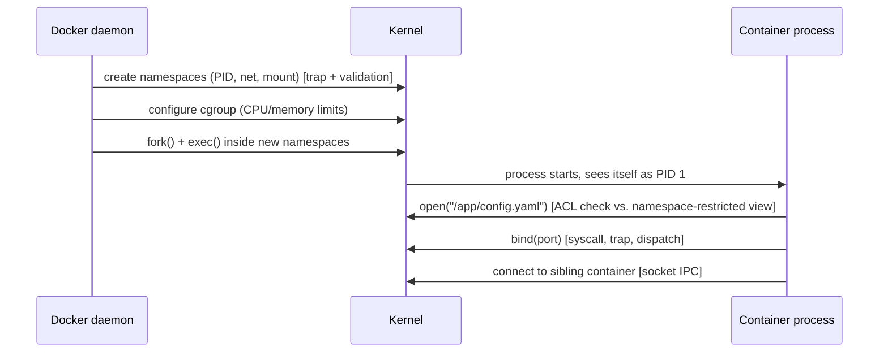

## Learning Objectives

- Trace a single `docker run` command through every cluster this discipline covered: process creation, kernel-boundary mechanics, namespace/cgroup setup, and access-control enforcement.
- Name, for each traced step, the specific concept from this discipline responsible for that step's correctness or safety.
- Compare, with concrete numbers, how much isolation and at what startup cost a bare process, a container, and a full VM each actually provide.
- State explicitly what this discipline covered and what remains for `computer/systems-laboratory` (build-it-yourself) and other, more advanced systems disciplines.

## Context & Motivation

This discipline covered four clusters, largely one at a time: the kernel/user boundary and system-call mechanics, interprocess communication, virtualization and containers, and OS-level protection. But no real container launch experiences these as four separate, sequential phases — starting a single sandboxed process on a real system touches the trap mechanism, a handful of system calls, namespace and cgroup configuration, and an access-control check, all within milliseconds, in a tightly interleaved sequence. This capstone traces one concrete, realistic scenario — launching a container — end to end, naming the exact mechanism from this discipline responsible for each step, and closes with an honest, numeric comparison of what a bare process, a container, and a full VM each actually buy in isolation, and at what cost.

## Core Theory

### The scenario: `docker run --read-only my-image /app/server`

A user runs `docker run --read-only my-image /app/server`, launching a containerized process. This single command sets in motion a sequence touching nearly every concept covered in this discipline, in roughly this order:

1. **The Docker daemon issues system calls to create new namespaces** (PID, network, mount) for the about-to-be-launched container — each such syscall itself crossing the kernel boundary via the trap mechanism this discipline's first cluster developed, with the kernel validating every argument the daemon supplies exactly as the kernel-boundary-validation concept requires.
2. **A cgroup is configured**, capping the container's CPU share and memory limit — kernel bookkeeping reused directly from `operating-systems-i`'s scheduling and memory-accounting mechanisms, just scoped to this one container's process group.
3. **`fork()` and `exec()`** (the exact process-creation system calls `operating-systems-i` already covered) create the containerized process itself, now running inside the newly created namespaces — it will see itself as PID 1, with its own restricted view of the filesystem and network, exactly as this discipline's containers concept described.
4. **The container's entry point, `/app/server`, issues its own system calls** — reading its configuration file, binding a network port, opening a log file — each one dispatched through the same system-call table and trap mechanism this discipline's first cluster developed, and each one checked against the container's own (namespace-restricted) view of the filesystem and, for the log file specifically, against Unix permission bits exactly as the access-control concept described.
5. **If `/app/server` needs to communicate with a sibling container** (a database, say), it does so over a socket — the same uniform IPC abstraction this discipline's second cluster developed, working identically whether the sibling container happens to be scheduled on the same physical machine or a different one entirely.



### What this trace reveals about the discipline's structure

Looking back across the whole trace, the four clusters are not independent topics that happen to be taught in sequence — they are four layers a single ordinary operation passes through, continuously: the kernel/user boundary cluster provides the mechanism (traps, system calls) every other cluster's operations are actually built from; the IPC cluster provides how the container communicates with anything outside its own process; the virtualization cluster provides the isolation boundary (namespaces, cgroups) the container actually runs within; and the OS-level protection cluster provides the access-control enforcement (ACLs, or capabilities in a system built that way) governing what the container's process, once running, may actually touch.

### An honest, numeric comparison: bare process, container, VM

```text
                    Bare process    Container         Full VM
------------------  --------------  -----------------  -----------------
Isolation boundary  None beyond     Namespaces + cgroups Separate guest
                    ordinary        (shared host kernel) kernel entirely
                    process/user
Startup time        ~1-10 ms        ~20-100 ms          seconds to tens
                                                          of seconds
Kernel-level         N/A (same       A kernel bug/exploit A guest kernel
compromise blast     process IS      threatens every      compromise does
radius               the boundary)   container sharing    NOT, by itself,
                                      that host kernel     grant code
                                                            execution in
                                                            the hypervisor
                                                            or another guest
Typical real use     Ordinary        Microservices,       Multi-tenant
case                 single-purpose  CI/CD build           cloud hosting,
                     program         isolation, dev        strong isolation
                                     environments          across untrusted
                                                            tenants
```

Neither container nor VM strictly dominates the other: a container buys dramatically faster startup and lower resource overhead, at the cost of a categorically weaker isolation boundary (one shared kernel); a VM buys categorically stronger isolation, at the cost of roughly two orders of magnitude higher startup latency and resource consumption — the same fundamental tradeoff this discipline's virtualization cluster developed in detail, now placed concretely alongside the bare-process baseline for comparison.

## Worked Examples

### Example 1: Naming the responsible concept at each traced step

```text
Step in the trace                          Concept from this discipline
------------------------------------------ --------------------------------
Daemon creates new PID/network/mount        Containers and OS-Level
  namespaces for the container                Virtualization
Cgroup configured to cap CPU/memory          Containers and OS-Level
                                              Virtualization
fork()/exec() launches the container's       Anatomy of a System Call
  entry point (reusing operating-systems-i's  (+ operating-systems-i's
  process-creation mechanics)                  Process API)
Container's syscalls (open/bind/read)        Anatomy of a System Call,
  crossing into the kernel                    Traps/Interrupts/Exceptions
Container's log-file write checked           Access Control Lists and
  against Unix permission bits                 Unix Permissions
Communication with a sibling container       Sockets as a Uniform IPC
  over a socket                                Abstraction
```

### Example 2: What could go wrong at each step, and which concept prevents it

```text
Without namespace isolation: the container's process could see and
  potentially interfere with every other process on the host, not
  just its own container's processes.
Without cgroup limits: one misbehaving or compromised container
  could consume all of the host's CPU or memory, starving every
  other container on the same machine.
Without kernel-boundary input validation: a malicious container
  could pass a crafted pointer/length to a system call and
  potentially corrupt kernel memory directly.
Without access control on the log file: any process on the host
  (not just this container) might be able to read or corrupt data
  the container intended to keep private.
Without a uniform socket abstraction: connecting to a sibling
  container running on a different physical machine would require
  entirely different code than connecting to one on the same host.
```

### Example 3: The same trace, restated as "what's isolated or restricted, and by what"

```text
Concern                       Restricted/isolated by      Discipline cluster
-----------------------------  ---------------------------  --------------------
Which processes are visible    PID namespace                Virtualization
Which files are visible         Mount namespace               Virtualization
How much CPU/memory is used    cgroups                       Virtualization
Which syscalls even reach       Kernel dispatch + validation   Kernel/User Boundary
  the kernel correctly
Who may read/write this file    ACL / Unix permission bits    OS-Level Protection
How this process talks to       Sockets                       Interprocess
  another process/container                                   Communication
```

## Common Misconceptions & Pitfalls

- **"Kernel-boundary mechanics, IPC, virtualization, and protection are four unrelated topics that happen to be taught in the same course."** As this capstone's trace shows, launching a single ordinary container exercises all four continuously and simultaneously — they are four coordinated layers a single real operation passes through, not four independent subjects.
- **"A container provides the same isolation guarantee as a VM, just implemented more efficiently."** As the numeric comparison shows, a container's shared-kernel architecture is a categorically different, and weaker, isolation boundary than a VM's separate-guest-kernel architecture — the tradeoff is real, not merely an implementation-efficiency difference.
- **"This discipline has now covered everything a real production systems engineer needs to know about kernels, isolation, and security."** This capstone explicitly names what remains: the hands-on construction of these same ideas (a real scheduler, memory manager, IPC mechanism, or sandbox, built by hand) is `computer/systems-laboratory`'s job, and deeper distributed-systems concerns spanning many machines are reserved for other, more advanced disciplines this platform has not yet published.
- **"Since containers start so much faster, they are simply the better choice in every scenario a VM might be used for."** The numeric comparison's blast-radius row is the real counterpoint: multi-tenant cloud hosting serving mutually untrusted customers genuinely needs a VM's stronger isolation guarantee, where a container's shared-kernel exposure would be an unacceptable risk regardless of its speed advantage.

## Summary

Tracing one ordinary operation — launching a single container — through namespace and cgroup setup, process creation, system-call dispatch with kernel-boundary validation, and access-control-checked file access shows every cluster of this discipline operating together, continuously, rather than as separate phases: the kernel/user boundary cluster provides the trap and system-call mechanism every other cluster's operations are built from; the IPC cluster provides how the container reaches anything outside itself; the virtualization cluster provides the actual isolation boundary the container runs within; and the OS-level protection cluster governs what the running container may touch once launched. Placing a bare process, a container, and a full VM side by side, with concrete startup-time and blast-radius numbers, makes this discipline's central real tradeoff explicit: isolation strength and startup cost move in opposite directions, and no single choice dominates the other two across every real use case. This discipline deliberately covered the conceptual machinery — traps, IPC, virtualization, protection — leaving the hands-on construction of these same ideas to `computer/systems-laboratory`, and deeper distributed-systems concerns spanning many machines to other, more advanced disciplines still to come.

## Documentation Links

- [OSTEP — Virtual Machines](https://pages.cs.wisc.edu/~remzi/OSTEP/vmm-intro.pdf) — OSTEP's own synthesis of virtualization mechanisms operating together, the same spirit this capstone applies across all four of this discipline's clusters.
- [UC Berkeley CS162 — Course Schedule](https://cs162.org/) — course whose project sequence mirrors this capstone's end-to-end integration of kernel mechanics, IPC, and protection.
