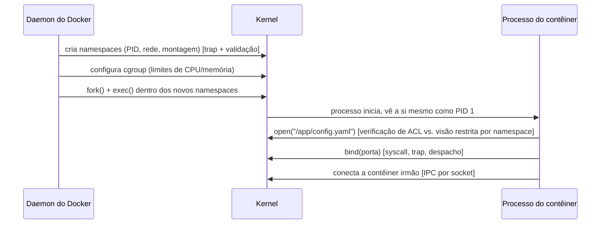

## Objetivos de Aprendizagem

- Rastrear um único comando `docker run` por todos os agrupamentos que esta disciplina cobriu: criação de processos, mecânica da fronteira do kernel, configuração de namespace/cgroup e imposição de controle de acesso.
- Nomear, para cada passo rastreado, o conceito específico desta disciplina responsável pela correção ou segurança daquele passo.
- Comparar, com números concretos, quanto isolamento e a que custo de inicialização um processo nu, um contêiner e uma VM completa de fato fornecem.
- Enunciar explicitamente o que esta disciplina cobriu e o que resta para `computer/systems-laboratory` (construa você mesmo) e outras disciplinas de sistemas mais avançadas.

## Contexto e Motivação

Esta disciplina cobriu quatro agrupamentos, em grande parte um de cada vez: a fronteira kernel/usuário e a mecânica de chamadas de sistema, a comunicação entre processos, a virtualização e os contêineres, e a proteção em nível de SO. Mas nenhum lançamento real de contêiner experimenta estes como quatro fases separadas e sequenciais: iniciar um único processo em sandbox num sistema real toca o mecanismo de trap, um punhado de chamadas de sistema, a configuração de namespace e cgroup, e uma verificação de controle de acesso, tudo em milissegundos, numa sequência fortemente entrelaçada. Este capstone rastreia um cenário concreto e realista (lançar um contêiner) de ponta a ponta, nomeando o mecanismo exato desta disciplina responsável por cada passo, e termina com uma comparação honesta e numérica do que um processo nu, um contêiner e uma VM completa de fato oferecem em isolamento, e a que custo.

## Teoria Central

### O cenário: `docker run --read-only my-image /app/server`

Um usuário roda `docker run --read-only my-image /app/server`, lançando um processo em contêiner. Este único comando põe em movimento uma sequência que toca quase todo conceito coberto nesta disciplina, aproximadamente nesta ordem:

1. **O daemon do Docker emite chamadas de sistema para criar novos namespaces** (PID, rede, montagem) para o contêiner prestes a ser lançado, cada uma dessas syscalls cruzando ela própria a fronteira do kernel via o mecanismo de trap que o primeiro agrupamento desta disciplina desenvolveu, com o kernel validando todo argumento que o daemon fornece exatamente como o conceito de validação na fronteira do kernel exige.
2. **Um cgroup é configurado**, limitando a fatia de CPU e o limite de memória do contêiner, uma contabilidade de kernel reusada diretamente dos mecanismos de escalonamento e de contabilidade de memória de `operating-systems-i`, só que escopada ao grupo de processos deste único contêiner.
3. **`fork()` e `exec()`** (as exatas chamadas de sistema de criação de processos que `operating-systems-i` já cobriu) criam o próprio processo em contêiner, agora rodando dentro dos namespaces recém-criados: ele se verá como PID 1, com sua própria visão restrita do sistema de arquivos e da rede, exatamente como o conceito de contêineres desta disciplina descreveu.
4. **O ponto de entrada do contêiner, `/app/server`, emite suas próprias chamadas de sistema**, lendo seu arquivo de configuração, vinculando uma porta de rede, abrindo um arquivo de log, cada uma despachada através da mesma tabela de chamadas de sistema e do mesmo mecanismo de trap que o primeiro agrupamento desta disciplina desenvolveu, e cada uma verificada contra a própria visão (restrita por namespace) do sistema de arquivos do contêiner e, para o arquivo de log especificamente, contra os bits de permissão Unix exatamente como o conceito de controle de acesso descreveu.
5. **Se `/app/server` precisa se comunicar com um contêiner irmão** (um banco de dados, por exemplo), ele o faz sobre um socket, a mesma abstração de IPC uniforme que o segundo agrupamento desta disciplina desenvolveu, funcionando de forma idêntica quer o contêiner irmão esteja escalonado na mesma máquina física quer numa máquina inteiramente diferente.



### O que este rastreamento revela sobre a estrutura da disciplina

Olhando para trás ao longo do rastreamento inteiro, os quatro agrupamentos não são tópicos independentes que por acaso são ensinados em sequência: são quatro camadas pelas quais uma única operação comum passa, continuamente. O agrupamento da fronteira kernel/usuário fornece o mecanismo (traps, chamadas de sistema) a partir do qual as operações de todos os outros agrupamentos são de fato construídas; o agrupamento de IPC fornece como o contêiner se comunica com qualquer coisa fora de seu próprio processo; o agrupamento de virtualização fornece a fronteira de isolamento (namespaces, cgroups) dentro da qual o contêiner de fato roda; e o agrupamento de proteção em nível de SO fornece a imposição de controle de acesso (ACLs, ou capacidades num sistema construído dessa forma) governando o que o processo do contêiner, uma vez rodando, pode de fato tocar.

### Uma comparação honesta e numérica: processo nu, contêiner, VM

```text
                    Processo nu     Contêiner          VM completa
------------------  --------------  -----------------  -----------------
Fronteira de        Nenhuma além    Namespaces + cgroups Kernel convidado
isolamento          do processo/    (kernel do host      inteiramente
                    usuário comum   compartilhado)       separado
Tempo de            ~1-10 ms        ~20-100 ms          segundos a dezenas
inicialização                                            de segundos
Raio de dano de      N/A (o próprio  Um bug/exploit do   Um comprometimento
comprometimento      processo É a    kernel ameaça todo   do kernel convidado
em nível de kernel   fronteira)      contêiner que        NÃO concede, por si
                                     compartilha aquele   só, execução de
                                     kernel do host       código no hipervisor
                                                          ou em outro convidado
Caso de uso real     Programa comum  Microsserviços,     Hospedagem em nuvem
típico               de propósito    isolamento de        multi-inquilino,
                     único           build de CI/CD,      isolamento forte
                                     ambientes de dev     entre inquilinos
                                                          não confiáveis
```

Nem o contêiner nem a VM dominam estritamente o outro: um contêiner oferece inicialização dramaticamente mais rápida e menor sobrecarga de recursos, ao custo de uma fronteira de isolamento categoricamente mais fraca (um kernel compartilhado); uma VM oferece isolamento categoricamente mais forte, ao custo de latência de inicialização e consumo de recursos cerca de duas ordens de magnitude maiores, o mesmo compromisso fundamental que o agrupamento de virtualização desta disciplina desenvolveu em detalhe, agora colocado concretamente ao lado da linha de base do processo nu para comparação.

## Exemplos Resolvidos

### Exemplo 1: Nomeando o conceito responsável em cada passo rastreado

```text
Passo no rastreamento                      Conceito desta disciplina
------------------------------------------ --------------------------------
Daemon cria novos namespaces de             Contêineres e Virtualização
  PID/rede/montagem para o contêiner          em Nível de SO
Cgroup configurado para limitar CPU/memória  Contêineres e Virtualização
                                              em Nível de SO
fork()/exec() lança o ponto de entrada       Anatomia de uma Chamada de Sistema
  do contêiner (reusando a mecânica de         (+ API de Processos de
  criação de processos de operating-systems-i) operating-systems-i)
Syscalls do contêiner (open/bind/read)       Anatomia de uma Chamada de Sistema,
  cruzando para o kernel                       Traps/Interrupções/Exceções
Escrita no arquivo de log do contêiner       Listas de Controle de Acesso e
  verificada contra bits de permissão Unix    Permissões Unix
Comunicação com um contêiner irmão           Sockets como Abstração
  sobre um socket                             Uniforme de IPC
```

### Exemplo 2: O que poderia dar errado em cada passo, e qual conceito o previne

```text
Sem isolamento de namespace: o processo do contêiner poderia ver e
  potencialmente interferir em todo outro processo no host, não
  apenas nos processos de seu próprio contêiner.
Sem limites de cgroup: um contêiner mal comportado ou comprometido
  poderia consumir toda a CPU ou memória do host, deixando sem recursos
  todo outro contêiner na mesma máquina.
Sem validação de entrada na fronteira do kernel: um contêiner malicioso
  poderia passar um ponteiro/comprimento forjado a uma chamada de sistema e
  potencialmente corromper a memória do kernel diretamente.
Sem controle de acesso no arquivo de log: qualquer processo no host
  (não apenas este contêiner) poderia conseguir ler ou corromper dados
  que o contêiner pretendia manter privados.
Sem uma abstração de socket uniforme: conectar a um contêiner irmão
  rodando numa máquina física diferente exigiria código
  inteiramente diferente de conectar a um no mesmo host.
```

### Exemplo 3: O mesmo rastreamento, reenunciado como "o que está isolado ou restrito, e por quê"

```text
Preocupação                   Restrito/isolado por        Agrupamento da disciplina
-----------------------------  ---------------------------  --------------------
Quais processos são visíveis   Namespace de PID             Virtualização
Quais arquivos são visíveis     Namespace de montagem         Virtualização
Quanta CPU/memória é usada     cgroups                       Virtualização
Quais syscalls sequer           Despacho + validação do kernel Fronteira Kernel/Usuário
  alcançam o kernel corretamente
Quem pode ler/escrever este arquivo ACL / bits de permissão Unix Proteção em Nível de SO
Como este processo conversa com Sockets                       Comunicação entre
  outro processo/contêiner                                    Processos
```

## Equívocos Comuns e Armadilhas

- **"A mecânica da fronteira do kernel, o IPC, a virtualização e a proteção são quatro tópicos não relacionados que por acaso são ensinados no mesmo curso."** Como o rastreamento deste capstone mostra, lançar um único contêiner comum exercita os quatro continuamente e simultaneamente: são quatro camadas coordenadas pelas quais uma única operação real passa, não quatro assuntos independentes.
- **"Um contêiner fornece a mesma garantia de isolamento que uma VM, apenas implementada de forma mais eficiente."** Como a comparação numérica mostra, a arquitetura de kernel compartilhado de um contêiner é uma fronteira de isolamento categoricamente diferente, e mais fraca, que a arquitetura de kernel convidado separado de uma VM, o compromisso é real, não meramente uma diferença de eficiência de implementação.
- **"Esta disciplina agora cobriu tudo o que um engenheiro de sistemas de produção real precisa saber sobre kernels, isolamento e segurança."** Este capstone nomeia explicitamente o que resta: a construção prática dessas mesmas ideias (um escalonador, gerenciador de memória, mecanismo de IPC ou sandbox reais, construídos à mão) é o trabalho de `computer/systems-laboratory`, e preocupações mais profundas de sistemas distribuídos abrangendo muitas máquinas ficam reservadas para outras disciplinas mais avançadas que esta plataforma ainda não publicou.
- **"Como os contêineres iniciam tão mais rápido, eles são simplesmente a melhor escolha em todo cenário em que uma VM poderia ser usada."** A linha de raio de dano da comparação numérica é o verdadeiro contraponto: a hospedagem em nuvem multi-inquilino atendendo clientes mutuamente não confiáveis genuinamente precisa da garantia de isolamento mais forte de uma VM, onde a exposição de kernel compartilhado de um contêiner seria um risco inaceitável independentemente de sua vantagem de velocidade.

## Resumo

Rastrear uma operação comum (lançar um único contêiner) através da configuração de namespace e cgroup, criação de processos, despacho de chamadas de sistema com validação na fronteira do kernel, e acesso a arquivos verificado por controle de acesso mostra todos os agrupamentos desta disciplina operando juntos, continuamente, em vez de como fases separadas: o agrupamento da fronteira kernel/usuário fornece o mecanismo de trap e de chamadas de sistema a partir do qual as operações de todos os outros agrupamentos são construídas; o agrupamento de IPC fornece como o contêiner alcança qualquer coisa fora de si mesmo; o agrupamento de virtualização fornece a fronteira de isolamento de fato dentro da qual o contêiner roda; e o agrupamento de proteção em nível de SO governa o que o contêiner em execução pode tocar uma vez lançado. Colocar um processo nu, um contêiner e uma VM completa lado a lado, com números concretos de tempo de inicialização e de raio de dano, torna explícito o compromisso central real desta disciplina: a força do isolamento e o custo de inicialização se movem em direções opostas, e nenhuma escolha única domina as outras duas em todo caso de uso real. Esta disciplina deliberadamente cobriu a maquinaria conceitual (traps, IPC, virtualização, proteção), deixando a construção prática dessas mesmas ideias para `computer/systems-laboratory`, e preocupações mais profundas de sistemas distribuídos abrangendo muitas máquinas para outras disciplinas mais avançadas ainda por vir.

## Documentation Links

- [OSTEP: Virtual Machines](https://pages.cs.wisc.edu/~remzi/OSTEP/vmm-intro.pdf): a própria síntese do OSTEP de mecanismos de virtualização operando juntos, o mesmo espírito que este capstone aplica a todos os quatro agrupamentos desta disciplina.
- [UC Berkeley CS162: Course Schedule](https://cs162.org/): curso cuja sequência de projetos espelha a integração de ponta a ponta deste capstone da mecânica de kernel, IPC e proteção.
