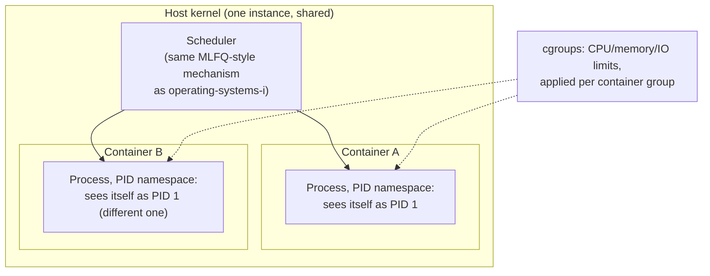

## Learning Objectives

- Explain the fundamental architectural difference between a container and a virtual machine: sharing one kernel versus each running its own.
- Describe namespaces and cgroups as the two real Linux kernel mechanisms containers are actually built from, and what each one isolates or limits.
- State realistic, concrete overhead numbers for container startup versus VM startup, and explain why the difference is so large given the previous two concepts' mechanisms.
- Articulate honestly what isolation a container does and does not provide, compared to a VM's isolation guarantee.

## Context & Motivation

The previous two concepts developed full-system virtualization in real depth: a hypervisor, running at a higher privilege level than any guest, letting each guest run its own completely independent kernel via trap-and-emulate, hardware-accelerated by VT-x/AMD-V. This gives extremely strong isolation — each guest's kernel is entirely its own, with its own scheduler, its own memory management, its own device drivers — but at a real, measurable cost: booting an entire second kernel, however virtualized, takes real time and real memory, typically on the order of seconds and hundreds of megabytes, even for a minimal guest.

Containers take a fundamentally different approach to a closely related goal — giving a running program the appearance of isolation from other programs on the same machine — by making a deliberate trade: instead of virtualizing an entire machine (letting each guest run its own kernel), a container shares the single, real host kernel among every container on that machine, and achieves isolation entirely through kernel-provided mechanisms that make each container's process *believe* it has the machine to itself, without paying the cost of ever booting a second kernel at all. Understanding precisely what a container actually is — not a lightweight VM, but a specially isolated ordinary process — is essential to reasoning correctly about what a container's isolation does and does not guarantee.

## Core Theory

### One kernel, many isolated views: namespaces

A Linux namespace is a kernel mechanism that gives a process (or a group of processes) its own private, isolated *view* of some particular global kernel resource, without actually creating a separate instance of the kernel subsystem managing that resource. Each of several distinct namespace types isolates a different resource:

- **PID namespace** — a process inside this namespace sees only the processes within its own namespace, and the very first process it creates appears to it as PID 1 — even though the real host kernel assigns that same process a completely different, ordinary PID in the host's own global process table.
- **Network namespace** — a process gets its own private set of network interfaces, IP addresses, and routing tables, isolated from the host's own networking configuration and from other containers' network namespaces.
- **Mount namespace** — a process gets its own private view of the filesystem hierarchy (what is mounted where), letting a container see a completely different root filesystem than the host's own, without requiring a separate physical or virtual disk the way a VM would.

Critically, all of this isolation is provided by the single, real host kernel doing extra bookkeeping — maintaining separate PID tables, separate network configuration, separate mount tables per namespace — rather than by running any additional kernel code at all. This is the core architectural fact that distinguishes a container from a VM: a container is, underneath all this isolation machinery, still an ordinary process (or process group) scheduled by the exact same host kernel scheduler `operating-systems-i` already covered, using the exact same address-space and page-table mechanisms already covered there — merely with a specially restricted, namespace-filtered view of what it can see and touch.

### Resource limits: cgroups

Namespaces isolate *what a process can see*; control groups (cgroups) limit *how much of the machine's real, shared resources a process (or group of processes) can actually consume* — CPU time, memory, disk I/O bandwidth, and more, each configurable as a hard limit or a proportional share the host kernel enforces directly, using the same scheduling and memory-accounting mechanisms `operating-systems-i` already established, just applied to a *group* of processes as a single accounting unit rather than one process at a time. A container's memory limit, disk I/O throttling, and CPU share are all, mechanically, cgroups configuration applied to the group of processes that container comprises — not a separate resource-management system invented specifically for containers.



### The overhead consequence: why containers start in milliseconds, VMs in seconds

This architectural difference has a direct, measurable performance consequence, one that follows mechanically from what each approach actually does at startup. Starting a container means: create a few new namespaces (cheap kernel bookkeeping operations), configure a cgroup (equally cheap), and start one ordinary process within that restricted view — fundamentally the same cost as starting any ordinary process, plus a small, fixed amount of additional kernel setup. Starting a VM means: allocate memory for an entire guest, and boot an entire independent kernel inside it from scratch — the guest kernel must initialize its own device drivers, its own memory manager, its own scheduler, exactly as if it had just been powered on, because from the guest kernel's own perspective, it has. Real, representative numbers illustrate the gap concretely: a container commonly starts in well under 100 milliseconds; a full VM commonly takes several seconds to tens of seconds to reach a comparable "ready" state — a difference of roughly two orders of magnitude, following directly from "configure some kernel bookkeeping and start a process" versus "boot an entire independent operating system."

### What a container does and does not isolate — an honest comparison

Because every container on a machine shares the exact same underlying host kernel, a genuine kernel-level vulnerability or bug can, in principle, be exploited from within one container to affect the host or other containers — a fundamentally different threat model than a VM's isolation, where each guest runs its own kernel, and compromising one guest's kernel does not, by itself, grant any code execution within the hypervisor or another guest's kernel at all. This is not a claim that containers provide no meaningful isolation — namespaces and cgroups are real, effective, and widely relied upon in production — but it is a real, honest difference in the strength of the isolation boundary each approach draws, directly traceable to the "one shared kernel" versus "one kernel per guest" architectural choice each makes.

## Worked Examples

### Example 1: A PID namespace, made concrete

```text
Host's real process table (a small excerpt):
  PID 1     systemd (the real, host-wide init process)
  PID 4821  dockerd
  PID 4907  the containerized process, as the HOST sees it

Inside the container's own PID namespace, that same process sees:
  PID 1     itself -- believing it is the very first process
            in an entirely fresh system, exactly like a machine
            that just booted

The host and the container are looking at the exact same real
process, through two different namespace "windows" -- neither
view is fake, they are simply differently scoped.
```

### Example 2: cgroups limiting a container's real resource consumption

```text
cgroup configuration for "container-web-app":
  memory.max = 512 MB
  cpu.max    = 50000 100000   (50% of one CPU core, on average)

Container's process attempts to allocate 600 MB:
  Host kernel's cgroup accounting detects this exceeds memory.max
  -> the allocation fails (or the kernel's OOM killer terminates a
     process within that cgroup), exactly as operating-systems-i's
     memory-management mechanisms already handle resource exhaustion,
     just scoped to this one cgroup's processes rather than the
     whole machine.
```

### Example 3: Startup time, concretely compared

```text
Starting a container (illustrative, real-world-representative):
  Create namespaces:        ~5 ms
  Configure cgroup:          ~2 ms
  Start the one process:    ~10-50 ms (ordinary process startup)
  Total:                     roughly 20-100 ms

Starting a VM (illustrative, real-world-representative):
  Allocate guest memory:     ~100 ms
  Boot guest kernel from scratch:
    - initialize drivers, memory manager, scheduler: several
      SECONDS, because the guest kernel is doing exactly what
      any kernel does when a real machine powers on
  Total:                     several seconds to tens of seconds
```

The roughly 100x gap is not an implementation-quality difference between specific products — it follows directly and mechanically from "reuse the existing host kernel, just restrict its view" versus "boot an entirely separate kernel from nothing."

## Common Misconceptions & Pitfalls

- **"A container is just a lightweight virtual machine."** A container shares the single, real host kernel with every other container on the machine; a VM runs its own, entirely separate guest kernel — this is an architectural difference in kind, not merely a difference in how "heavy" the implementation happens to be.
- **"Namespaces create actual separate copies of kernel resources, like a separate real process table per container."** The host kernel maintains one real underlying process table (and one real network configuration, one real mount table); namespaces provide each process a filtered, restricted *view* into a subset of that same underlying state, not a genuinely separate copy.
- **"cgroups and namespaces do the same job, just with different names."** They solve two different problems: namespaces control what a process can *see* (isolation of view); cgroups control how much of a shared resource a process can *consume* (limiting of consumption) — a container in practice needs both, but they are mechanically distinct kernel features.
- **"Since containers are so much faster to start, they provide equivalent or better isolation than a VM."** Isolation strength and startup speed are separate properties — a container's shared-kernel architecture is a genuinely weaker isolation boundary than a VM's separate-kernel architecture, in exchange for the dramatically lower startup cost; choosing between them is a real tradeoff, not a strictly dominant choice either way.

## Summary

A container achieves isolation without virtualizing an entire machine, by having every container on a host share the single, real host kernel, which uses namespaces (PID, network, mount, and others) to give each container process a restricted, filtered *view* of global kernel resources, and cgroups to limit how much CPU, memory, and I/O bandwidth that container's processes can actually consume — reusing, in both cases, the same underlying scheduling and resource-accounting mechanisms `operating-systems-i` already established, applied to a group of processes as one accounting unit. Because starting a container means only configuring some kernel bookkeeping and launching one ordinary process, rather than booting an entire independent guest kernel from scratch as a VM must, containers start roughly two orders of magnitude faster than VMs — a difference that follows mechanically from the two approaches' fundamentally different architecture, not merely from implementation quality. This speed comes with an honest tradeoff in isolation strength: because every container shares one real kernel, a genuine kernel-level vulnerability threatens every container on that host in a way a VM's separate-guest-kernel architecture does not.

## Documentation Links

- [OSTEP — Virtual Machines](https://pages.cs.wisc.edu/~remzi/OSTEP/vmm-intro.pdf) — situates OS-level virtualization (containers) alongside full-system virtualization (VMs) as two distinct approaches to the same underlying isolation goal.
- [UC Berkeley CS162 — Course Schedule](https://cs162.org/) — background on the process, scheduling, and resource-management mechanisms namespaces and cgroups directly extend rather than replace.
