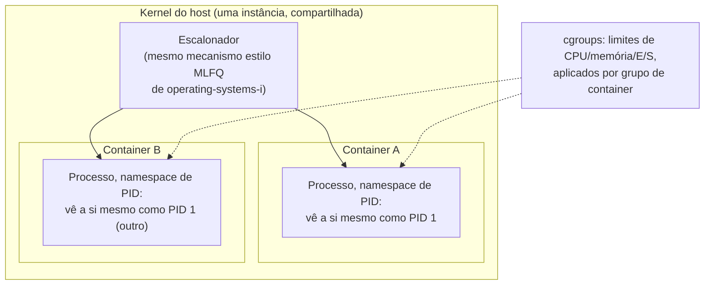

## Objetivos de Aprendizagem

- Explicar a diferença arquitetural fundamental entre um container e uma máquina virtual: compartilhar um kernel versus cada um rodar o seu próprio.
- Descrever namespaces e cgroups como os dois mecanismos reais do kernel Linux a partir dos quais os containers são de fato construídos, e o que cada um isola ou limita.
- Enunciar números de overhead realistas e concretos para a inicialização de um container versus a de uma VM, e explicar por que a diferença é tão grande dados os mecanismos dos dois conceitos anteriores.
- Articular honestamente que isolamento um container fornece e não fornece, em comparação com a garantia de isolamento de uma VM.

## Contexto e Motivação

Os dois conceitos anteriores desenvolveram a virtualização de sistema completo com profundidade real: um hypervisor, rodando num nível de privilégio mais alto que qualquer convidado, deixando cada convidado rodar o seu próprio kernel completamente independente via trap-and-emulate, acelerado em hardware pelo VT-x/AMD-V. Isso dá um isolamento extremamente forte (o kernel de cada convidado é inteiramente seu, com o seu próprio escalonador, o seu próprio gerenciamento de memória, os seus próprios drivers de dispositivo), mas a um custo real e mensurável: inicializar um segundo kernel inteiro, ainda que virtualizado, leva tempo real e memória real, tipicamente na ordem de segundos e centenas de megabytes, mesmo para um convidado mínimo.

Os containers adotam uma abordagem fundamentalmente diferente para um objetivo intimamente relacionado (dar a um programa em execução a aparência de isolamento em relação a outros programas na mesma máquina) fazendo uma troca deliberada: em vez de virtualizar uma máquina inteira (deixando cada convidado rodar o seu próprio kernel), um container compartilha o único kernel real do host entre todos os containers daquela máquina, e alcança o isolamento inteiramente por meio de mecanismos fornecidos pelo kernel que fazem o processo de cada container *acreditar* que tem a máquina só para si, sem pagar o custo de jamais inicializar um segundo kernel. Entender com precisão o que um container de fato é (não uma VM leve, mas um processo comum especialmente isolado) é essencial para raciocinar corretamente sobre o que o isolamento de um container garante e não garante.

## Teoria Central

### Um kernel, muitas visões isoladas: namespaces

Um namespace do Linux é um mecanismo do kernel que dá a um processo (ou a um grupo de processos) a sua própria *visão* privada e isolada de algum recurso global específico do kernel, sem de fato criar uma instância separada do subsistema do kernel que gerencia esse recurso. Cada um de vários tipos distintos de namespace isola um recurso diferente:

- **Namespace de PID**: um processo dentro deste namespace vê apenas os processos dentro do seu próprio namespace, e o primeiríssimo processo que ele cria aparece para ele como PID 1, mesmo que o kernel real do host atribua a esse mesmo processo um PID completamente diferente e comum na tabela de processos global do próprio host.
- **Namespace de rede**: um processo recebe o seu próprio conjunto privado de interfaces de rede, endereços IP e tabelas de roteamento, isolado da própria configuração de rede do host e dos namespaces de rede de outros containers.
- **Namespace de montagem**: um processo recebe a sua própria visão privada da hierarquia do sistema de arquivos (o que está montado onde), permitindo a um container ver um sistema de arquivos raiz completamente diferente do próprio host, sem exigir um disco físico ou virtual separado como uma VM exigiria.

Crucialmente, todo esse isolamento é fornecido pelo único kernel real do host fazendo contabilidade extra (mantendo tabelas de PID separadas, configuração de rede separada, tabelas de montagem separadas por namespace) em vez de rodar qualquer código de kernel adicional. Este é o fato arquitetural central que distingue um container de uma VM: um container é, por baixo de toda essa maquinaria de isolamento, ainda um processo comum (ou grupo de processos) escalonado exatamente pelo mesmo escalonador do kernel do host que `operating-systems-i` já cobriu, usando exatamente os mesmos mecanismos de espaço de endereçamento e tabela de páginas já cobertos ali, apenas com uma visão especialmente restrita, filtrada por namespace, do que pode ver e tocar.

### Limites de recursos: cgroups

Os namespaces isolam *o que um processo pode ver*; os control groups (cgroups) limitam *quanto dos recursos reais e compartilhados da máquina um processo (ou grupo de processos) pode de fato consumir*: tempo de CPU, memória, largura de banda de E/S de disco e mais, cada um configurável como um limite rígido ou uma fatia proporcional que o kernel do host impõe diretamente, usando os mesmos mecanismos de escalonamento e de contabilidade de memória que `operating-systems-i` já estabeleceu, apenas aplicados a um *grupo* de processos como uma única unidade de contabilidade em vez de um processo por vez. O limite de memória de um container, o seu controle de vazão de E/S de disco e a sua fatia de CPU são todos, mecanicamente, configuração de cgroups aplicada ao grupo de processos que aquele container compreende, e não um sistema separado de gerenciamento de recursos inventado especificamente para containers.



### A consequência no overhead: por que containers iniciam em milissegundos e VMs em segundos

Esta diferença arquitetural tem uma consequência de desempenho direta e mensurável, que decorre mecanicamente do que cada abordagem de fato faz na inicialização. Iniciar um container significa: criar alguns novos namespaces (operações baratas de contabilidade do kernel), configurar um cgroup (igualmente barato) e iniciar um processo comum dentro dessa visão restrita, fundamentalmente o mesmo custo de iniciar qualquer processo comum, mais uma pequena quantidade fixa de configuração adicional do kernel. Iniciar uma VM significa: alocar memória para um convidado inteiro, e inicializar do zero um kernel independente inteiro dentro dela. O kernel convidado precisa inicializar os seus próprios drivers de dispositivo, o seu próprio gerenciador de memória, o seu próprio escalonador, exatamente como se tivesse acabado de ser ligado, porque, da perspectiva do próprio kernel convidado, foi isso que aconteceu. Números reais e representativos ilustram a diferença concretamente: um container comumente inicia em bem menos de 100 milissegundos; uma VM completa comumente leva de vários segundos a dezenas de segundos para alcançar um estado "pronto" comparável, uma diferença de aproximadamente duas ordens de grandeza, decorrendo diretamente de "configurar alguma contabilidade do kernel e iniciar um processo" versus "inicializar um sistema operacional independente inteiro".

### O que um container isola e não isola: uma comparação honesta

Como todo container numa máquina compartilha exatamente o mesmo kernel do host subjacente, uma vulnerabilidade ou bug genuíno no nível do kernel pode, em princípio, ser explorado de dentro de um container para afetar o host ou outros containers. É um modelo de ameaça fundamentalmente diferente do isolamento de uma VM, onde cada convidado roda o seu próprio kernel, e comprometer o kernel de um convidado não concede, por si só, nenhuma execução de código dentro do hypervisor ou do kernel de outro convidado. Isto não é uma afirmação de que containers não fornecem isolamento significativo (namespaces e cgroups são reais, eficazes e amplamente usados em produção), mas é uma diferença real e honesta na força da fronteira de isolamento que cada abordagem traça, diretamente atribuível à escolha arquitetural de "um kernel compartilhado" versus "um kernel por convidado" que cada uma faz.

## Exemplos Resolvidos

### Exemplo 1: Um namespace de PID, tornado concreto

```text
Tabela de processos real do host (um pequeno trecho):
  PID 1     systemd (o processo init real, de todo o host)
  PID 4821  dockerd
  PID 4907  o processo conteinerizado, como o HOST o vê

Dentro do próprio namespace de PID do container, esse mesmo processo vê:
  PID 1     a si mesmo -- acreditando ser o primeiríssimo processo
            de um sistema inteiramente novo, exatamente como uma
            máquina que acabou de inicializar

O host e o container estão olhando para exatamente o mesmo processo
real, através de duas "janelas" de namespace diferentes -- nenhuma
visão é falsa, elas apenas têm escopos diferentes.
```

### Exemplo 2: cgroups limitando o consumo real de recursos de um container

```text
Configuração de cgroup para "container-web-app":
  memory.max = 512 MB
  cpu.max    = 50000 100000   (50% de um núcleo de CPU, em média)

O processo do container tenta alocar 600 MB:
  A contabilidade de cgroups do kernel do host detecta que isso excede
  memory.max -> a alocação falha (ou o OOM killer do kernel termina um
  processo dentro desse cgroup), exatamente como os mecanismos de
  gerenciamento de memória de operating-systems-i já tratam o
  esgotamento de recursos, só que com escopo nos processos deste único
  cgroup em vez da máquina inteira.
```

### Exemplo 3: Tempo de inicialização, comparado concretamente

```text
Iniciando um container (ilustrativo, representativo do mundo real):
  Criar namespaces:          ~5 ms
  Configurar cgroup:          ~2 ms
  Iniciar o único processo:   ~10-50 ms (inicialização comum de processo)
  Total:                      aproximadamente 20-100 ms

Iniciando uma VM (ilustrativo, representativo do mundo real):
  Alocar memória do convidado: ~100 ms
  Inicializar o kernel convidado do zero:
    - inicializar drivers, gerenciador de memória, escalonador:
      vários SEGUNDOS, porque o kernel convidado está fazendo
      exatamente o que qualquer kernel faz quando uma máquina
      real é ligada
  Total:                       de vários segundos a dezenas de segundos
```

A diferença de aproximadamente 100x não é uma diferença de qualidade de implementação entre produtos específicos: ela decorre direta e mecanicamente de "reusar o kernel do host existente, apenas restringindo a sua visão" versus "inicializar um kernel inteiramente separado a partir do nada".

## Equívocos Comuns e Armadilhas

- **"Um container é só uma máquina virtual leve."** Um container compartilha o único kernel real do host com todos os outros containers da máquina; uma VM roda o seu próprio kernel convidado, inteiramente separado. É uma diferença arquitetural de natureza, e não meramente uma diferença em quão "pesada" a implementação calha de ser.
- **"Namespaces criam cópias realmente separadas dos recursos do kernel, como uma tabela de processos real separada por container."** O kernel do host mantém uma tabela de processos real subjacente (e uma configuração de rede real, uma tabela de montagem real); os namespaces fornecem a cada processo uma *visão* filtrada e restrita de um subconjunto desse mesmo estado subjacente, e não uma cópia genuinamente separada.
- **"cgroups e namespaces fazem o mesmo trabalho, só com nomes diferentes."** Eles resolvem dois problemas diferentes: os namespaces controlam o que um processo pode *ver* (isolamento de visão); os cgroups controlam quanto de um recurso compartilhado um processo pode *consumir* (limitação de consumo). Um container na prática precisa dos dois, mas eles são recursos do kernel mecanicamente distintos.
- **"Como containers são muito mais rápidos de iniciar, eles fornecem isolamento equivalente ou melhor que uma VM."** Força de isolamento e velocidade de inicialização são propriedades separadas. A arquitetura de kernel compartilhado de um container é uma fronteira de isolamento genuinamente mais fraca que a arquitetura de kernel separado de uma VM, em troca do custo de inicialização dramaticamente menor; escolher entre eles é um trade-off real, e não uma escolha estritamente dominante em nenhuma direção.

## Resumo

Um container alcança isolamento sem virtualizar uma máquina inteira, fazendo todos os containers de um host compartilharem o único kernel real do host, que usa namespaces (de PID, de rede, de montagem e outros) para dar ao processo de cada container uma *visão* restrita e filtrada dos recursos globais do kernel, e cgroups para limitar quanta CPU, memória e largura de banda de E/S os processos daquele container podem de fato consumir, reutilizando, nos dois casos, os mesmos mecanismos subjacentes de escalonamento e contabilidade de recursos que `operating-systems-i` já estabeleceu, aplicados a um grupo de processos como uma unidade de contabilidade. Como iniciar um container significa apenas configurar alguma contabilidade do kernel e lançar um processo comum, em vez de inicializar do zero um kernel convidado independente inteiro como uma VM precisa fazer, containers iniciam aproximadamente duas ordens de grandeza mais rápido que VMs, uma diferença que decorre mecanicamente da arquitetura fundamentalmente diferente das duas abordagens, e não meramente da qualidade de implementação. Essa velocidade vem com um trade-off honesto na força do isolamento: como todo container compartilha um kernel real, uma vulnerabilidade genuína no nível do kernel ameaça todos os containers daquele host de uma forma que a arquitetura de kernel convidado separado de uma VM não ameaça.

## Documentation Links

- [OSTEP: Virtual Machines](https://pages.cs.wisc.edu/~remzi/OSTEP/vmm-intro.pdf): situa a virtualização no nível do SO (containers) ao lado da virtualização de sistema completo (VMs) como duas abordagens distintas para o mesmo objetivo de isolamento subjacente.
- [UC Berkeley CS162: Course Schedule](https://cs162.org/): contexto sobre os mecanismos de processos, escalonamento e gerenciamento de recursos que namespaces e cgroups estendem diretamente em vez de substituir.
