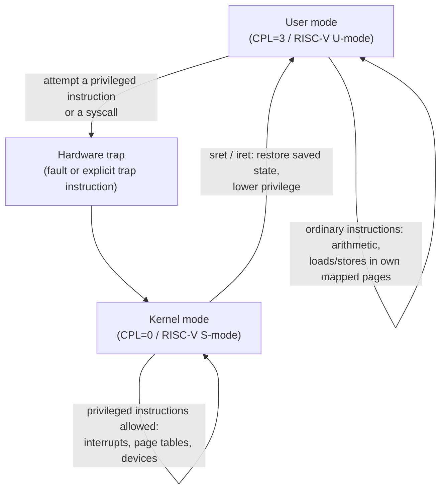

## Learning Objectives

- Explain dual-mode execution: the hardware distinguishes kernel mode and user mode, and restricts which instructions and memory each mode can access.
- Name the concrete hardware mechanism that implements this distinction (a privilege-level register: x86's CPL in the segment selector, RISC-V's `mstatus`/`sstatus` mode bits) and describe what changes when it flips.
- Distinguish privileged instructions (disable interrupts, change page-table base, halt the CPU) from ordinary ones, and explain why letting user code execute the former would break every other OS guarantee.
- Connect dual-mode execution to the process isolation already established by address spaces, and state precisely what address-space isolation protects (memory) versus what mode isolation protects (control of the machine itself).

## Context & Motivation

`operating-systems-i` established that a process gets its own private address space — no ordinary process can read or corrupt another's memory. But address-space isolation alone does not answer a sharper question: if a process's code is just instructions the CPU executes, what stops that code from directly reprogramming the timer interrupt, remapping its own page table to point at physical memory it should never see, or simply disabling interrupts forever so the scheduler can never reclaim the CPU? Nothing about a page table by itself prevents any of this — a process running with full hardware privilege could rewrite its own page table to map any physical address it likes, defeating memory isolation from the inside.

The missing piece is dual-mode execution: real hardware supports (at minimum) two distinct privilege levels, conventionally called kernel mode (or supervisor mode) and user mode, and the CPU itself — not a software convention, not a well-behaved compiler, but the silicon — refuses to execute certain instructions and refuses certain memory accesses unless the current mode is kernel mode. This is the foundational mechanism this entire discipline builds on: every other guarantee in this discipline — safe system calls, safe interprocess communication, safe virtualization, safe access control — ultimately rests on the hardware's willingness to enforce this one distinction reliably, cycle after cycle, for the lifetime of the machine.

## Core Theory

### The privilege-level bit (or bits) in real hardware

Real processors implement dual-mode execution with a small amount of dedicated hardware state that the currently-running code cannot arbitrarily rewrite from user mode. On x86, this is the Current Privilege Level (CPL), a 2-bit field baked into the code segment selector, giving four possible rings (0 through 3), though in practice essentially every modern OS uses only ring 0 (kernel) and ring 3 (user), leaving rings 1 and 2 as a historical curiosity from an era of more elaborate protection schemes. On RISC-V, the equivalent state lives in the `mstatus` and `sstatus` control-and-status registers, with machine mode (M), supervisor mode (S), and user mode (U) — the three-level scheme MIT's 6.S081 uses directly, with xv6's kernel running in supervisor mode and user programs in user mode.

Whatever the exact encoding, the essential property is the same: this privilege state can only be *raised* through a controlled, hardware-defined entry point (the trap mechanism, developed in the next concept), and it is automatically *lowered* by a specific, equally controlled instruction (`sret` on RISC-V, `iret` on x86) that also restores the previously saved, pre-trap state. There is no ordinary instruction that simply sets "I am now kernel mode" from user code — if there were, the entire scheme would be worthless.

### Privileged instructions: what only kernel mode may do

A privileged instruction is any instruction the hardware refuses to execute (typically raising a fault instead) unless the current privilege level is kernel mode. The exact list is architecture-specific, but the categories are universal across real ISAs:

- **Interrupt control** — enabling or disabling interrupts (`cli`/`sti` on x86). If user code could disable interrupts, it could make itself un-preemptible forever, permanently starving every other process and defeating the scheduler this discipline's predecessor already built.
- **Page-table control** — changing which page table the CPU's address-translation hardware uses (writing `CR3` on x86, `satp` on RISC-V). If user code could do this, any process could simply remap its own virtual addresses onto another process's physical memory, defeating address-space isolation entirely, from the inside, with a single instruction.
- **I/O port and device access** — talking directly to disk controllers, network cards, and other devices. Without this restriction, one buggy or malicious process could issue a raw disk command that corrupts a file another process — or the entire file system — depends on.
- **Halting or resetting the CPU** — an instruction that stops the processor entirely would let any single process deny the machine to every other process and to the OS itself.

Ordinary instructions — arithmetic, ordinary memory loads and stores within the process's own mapped pages, function calls — execute identically in either mode and are not gated at all; the CPU only needs to check privilege on the comparatively small set of instructions capable of undermining isolation.

### What mode isolation protects, versus what address-space isolation protects

It is worth being precise about the division of labor between this concept and what `operating-systems-i` already covered. Address-space isolation (page tables, one per process) protects *memory contents* — it stops process A from reading or writing process B's bytes. Dual-mode execution protects *control of the machine* — it stops any process, no matter how carefully it might otherwise respect memory boundaries, from reprogramming the very mechanisms (page tables, interrupts, device access) that make memory isolation and scheduling fairness possible in the first place. The two are complementary, not redundant: a machine with page tables but no privilege levels would have processes that cannot normally read each other's memory, but any process could simply rewrite the page-table hardware setting to remove that restriction whenever it liked.



### Why this must be hardware, not a software convention

A tempting simplification would be: "just have the compiler refuse to emit privileged instructions in user programs." This does not work, and the reason is fundamental to this discipline's entire security model. A compiler is a piece of software running on the same machine it is trying to constrain; nothing stops a determined attacker from hand-assembling raw machine code, bypassing the compiler entirely, and simply executing the privileged instruction directly. The only entity in the entire system that cannot be bypassed by cleverly-written user code is the CPU itself, checking the privilege bit on every single instruction it decodes, in hardware, before execution — which is precisely why dual-mode execution is implemented in silicon rather than convention.

## Worked Examples

### Example 1: What happens when user code tries a privileged instruction

Consider a user-mode program that, whether through a bug or deliberate tampering, attempts to execute the x86 instruction `cli` (clear interrupt flag, disabling interrupts):

```text
User-mode process executes: cli

CPU checks: current CPL == 3 (user mode)?  Yes.
CPU checks: is `cli` privileged?           Yes.
Result: CPU raises a general protection fault (#GP),
        NOT executing `cli`, and instead trapping
        into the kernel's fault handler.
```

The kernel's fault handler typically responds by delivering a signal to the offending process (`SIGSEGV`-family behavior on Unix-like systems) and, absent a handler that recovers gracefully, terminating it — the process's illegitimate attempt to seize control of interrupt delivery simply never takes effect.

### Example 2: RISC-V's three modes versus x86's four rings

```text
x86 rings (CPL):              RISC-V modes:
  Ring 0 — kernel                M-mode — machine (firmware/hypervisor-adjacent)
  Ring 1 — unused in practice     S-mode — supervisor (xv6's own kernel runs here)
  Ring 2 — unused in practice     U-mode — user (ordinary processes)
  Ring 3 — user
```

xv6, the teaching kernel MIT 6.S081 builds around, deliberately runs its own kernel in S-mode rather than M-mode, leaving M-mode to a small amount of low-level firmware — a real, concrete instance of an OS choosing not to use the most-privileged level available, because the OS itself does not need to touch the machine-level facilities M-mode reserves (like certain low-level timer configuration) directly.

### Example 3: Classifying instructions as privileged or ordinary

```text
Instruction / operation                  Privileged?
----------------------------------------  -----------
add %eax, %ebx (ordinary arithmetic)      No
mov [rbx], rax (store to owned memory)    No
cli / sti (enable/disable interrupts)     Yes
mov CR3, rax (change page-table base)     Yes
out dx, al (write to an I/O port)         Yes
call printf (ordinary function call)      No
```

The pattern: any instruction whose effect could compromise another process's isolation or the kernel's own control of the machine is privileged; instructions that only affect the executing process's own registers and its own mapped memory are not.

## Common Misconceptions & Pitfalls

- **"User mode and kernel mode are just a naming convention the OS chooses to follow."** They are enforced by dedicated hardware state (CPL, `mstatus`/`sstatus`) that user-mode code cannot rewrite through any ordinary instruction — this is a hardware guarantee, not a software agreement that a rogue program could simply ignore.
- **"Any memory access from a process is checked the same way as a privileged instruction."** Ordinary memory access is checked by the *address-translation* hardware (page tables, already covered in `operating-systems-i`), not by the privilege-level check described here — the two mechanisms are complementary and operate on different violations (touching memory you don't own, versus executing an instruction that controls the whole machine).
- **"Ring 1 and ring 2 on x86 provide extra useful privilege levels most operating systems use."** Essentially every mainstream OS (Linux, Windows, xv6-style teaching kernels) uses only ring 0 and ring 3, leaving the middle two unused — a real historical artifact of a more elaborate protection scheme the industry converged away from.
- **"A sufficiently well-written user program never needs privilege checks, so this is just overhead for buggy code."** The check protects against both bugs and deliberate malice equally, and it must run unconditionally on every relevant instruction for every process, because the hardware cannot distinguish "this code happens to be well-written" from "this code happens to be malicious" — the guarantee is only meaningful if it is universal.

## Summary

Dual-mode execution is the foundational hardware mechanism this entire discipline is built on: the CPU maintains a small piece of privilege state (CPL on x86, `mstatus`/`sstatus` mode bits on RISC-V) that user-mode code cannot rewrite through any ordinary instruction, and gates a specific set of privileged instructions — interrupt control, page-table control, direct device access, and machine halt/reset — so they execute only in kernel mode. This complements, rather than duplicates, the address-space isolation `operating-systems-i` already covered: page tables protect memory contents, while dual-mode execution protects control of the machine itself, including the very mechanisms (page tables, interrupts) that make memory isolation possible in the first place. Because this check must be unbypassable by definition, it lives in hardware, not in a compiler or software convention. Every subsequent concept in this discipline — traps, system calls, virtualization, and OS-level protection — is built directly on top of this one hardware guarantee.

## Documentation Links

- [OSTEP — Direct Execution](https://pages.cs.wisc.edu/~remzi/OSTEP/cpu-mechanisms.pdf) — the mechanism chapter this concept's dual-mode execution model is drawn from.
- [MIT 6.S081 — Course Schedule](https://pdos.csail.mit.edu/6.S081/2021/schedule.html) — the "OS Organization and System Calls" lecture that introduces RISC-V's M/S/U mode scheme via the xv6 kernel.
