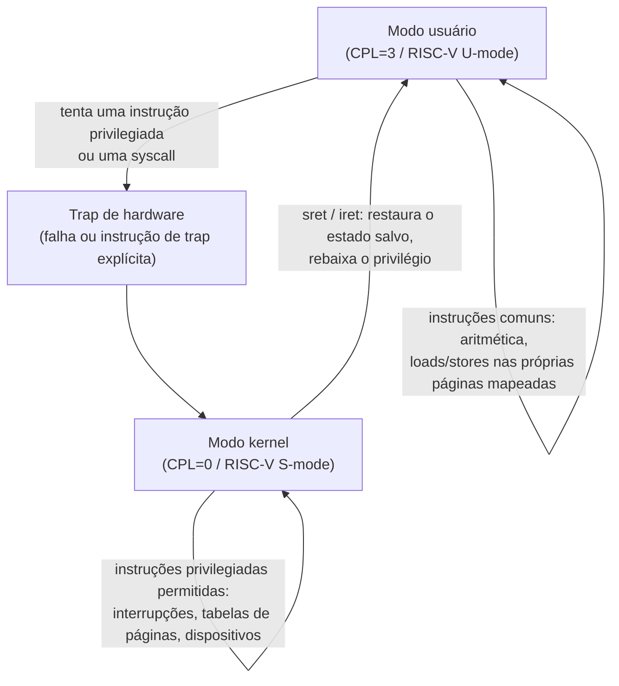

## Objetivos de Aprendizagem

- Explicar a execução em modo dual: o hardware distingue o modo kernel e o modo usuário, e restringe quais instruções e qual memória cada modo pode acessar.
- Nomear o mecanismo de hardware concreto que implementa essa distinção (um registrador de nível de privilégio: o CPL do x86 no seletor de segmento, os bits de modo `mstatus`/`sstatus` do RISC-V) e descrever o que muda quando ele vira.
- Distinguir instruções privilegiadas (desabilitar interrupções, mudar a base da tabela de páginas, parar a CPU) das comuns, e explicar por que deixar código de usuário executar as primeiras quebraria toda outra garantia do SO.
- Conectar a execução em modo dual ao isolamento de processos já estabelecido pelos espaços de endereçamento, e enunciar com precisão o que o isolamento de espaço de endereçamento protege (memória) versus o que o isolamento de modo protege (o controle da própria máquina).

## Contexto e Motivação

`operating-systems-i` estabeleceu que um processo recebe o seu próprio espaço de endereçamento privado: nenhum processo comum consegue ler ou corromper a memória de outro. Mas o isolamento de espaço de endereçamento sozinho não responde uma pergunta mais afiada: se o código de um processo é só um conjunto de instruções que a CPU executa, o que impede esse código de reprogramar diretamente a interrupção de timer, remapear a sua própria tabela de páginas para apontar para memória física que ele nunca deveria ver, ou simplesmente desabilitar as interrupções para sempre para que o escalonador nunca consiga recuperar a CPU? Nada numa tabela de páginas por si só impede qualquer uma dessas coisas: um processo rodando com privilégio total de hardware poderia reescrever a sua própria tabela de páginas para mapear qualquer endereço físico que quisesse, derrotando o isolamento de memória por dentro.

A peça que falta é a execução em modo dual: o hardware real suporta (no mínimo) dois níveis de privilégio distintos, convencionalmente chamados de modo kernel (ou modo supervisor) e modo usuário, e a própria CPU (não uma convenção de software, não um compilador bem-comportado, mas o silício) se recusa a executar certas instruções e se recusa a certos acessos à memória a menos que o modo atual seja o modo kernel. Este é o mecanismo fundamental sobre o qual esta disciplina inteira constrói: toda outra garantia desta disciplina (chamadas de sistema seguras, comunicação entre processos segura, virtualização segura, controle de acesso seguro) depende, no fim das contas, da disposição do hardware em impor esta única distinção de forma confiável, ciclo após ciclo, durante toda a vida da máquina.

## Teoria Central

### O bit (ou os bits) de nível de privilégio no hardware real

Processadores reais implementam a execução em modo dual com uma pequena quantidade de estado de hardware dedicado que o código em execução não pode reescrever arbitrariamente a partir do modo usuário. No x86, isso é o Current Privilege Level (CPL), um campo de 2 bits embutido no seletor de segmento de código, dando quatro anéis possíveis (de 0 a 3), embora na prática essencialmente todo SO moderno use apenas o anel 0 (kernel) e o anel 3 (usuário), deixando os anéis 1 e 2 como uma curiosidade histórica de uma era de esquemas de proteção mais elaborados. No RISC-V, o estado equivalente vive nos registradores de controle e status `mstatus` e `sstatus`, com o modo máquina (M), o modo supervisor (S) e o modo usuário (U), o esquema de três níveis que o 6.S081 do MIT usa diretamente, com o kernel do xv6 rodando em modo supervisor e os programas de usuário em modo usuário.

Qualquer que seja a codificação exata, a propriedade essencial é a mesma: este estado de privilégio só pode ser *elevado* por meio de um ponto de entrada controlado e definido pelo hardware (o mecanismo de trap, desenvolvido no próximo conceito), e é automaticamente *rebaixado* por uma instrução específica e igualmente controlada (`sret` no RISC-V, `iret` no x86) que também restaura o estado salvo anterior ao trap. Não existe nenhuma instrução comum que simplesmente defina "agora sou modo kernel" a partir de código de usuário; se existisse, o esquema inteiro não valeria nada.

### Instruções privilegiadas: o que só o modo kernel pode fazer

Uma instrução privilegiada é qualquer instrução que o hardware se recusa a executar (tipicamente levantando uma falha em vez disso) a menos que o nível de privilégio atual seja o modo kernel. A lista exata é específica de cada arquitetura, mas as categorias são universais entre ISAs reais:

- **Controle de interrupções**: habilitar ou desabilitar interrupções (`cli`/`sti` no x86). Se o código de usuário pudesse desabilitar interrupções, ele poderia se tornar não preemptível para sempre, deixando permanentemente sem CPU todos os outros processos e derrotando o escalonador que a disciplina predecessora desta já construiu.
- **Controle da tabela de páginas**: mudar qual tabela de páginas o hardware de tradução de endereços da CPU usa (escrever no `CR3` no x86, no `satp` no RISC-V). Se o código de usuário pudesse fazer isso, qualquer processo poderia simplesmente remapear os seus próprios endereços virtuais para a memória física de outro processo, derrotando inteiramente o isolamento de espaço de endereçamento, por dentro, com uma única instrução.
- **Acesso a portas de E/S e dispositivos**: falar diretamente com controladoras de disco, placas de rede e outros dispositivos. Sem essa restrição, um processo com bug ou malicioso poderia emitir um comando bruto de disco que corrompe um arquivo do qual outro processo (ou o sistema de arquivos inteiro) depende.
- **Parar ou reiniciar a CPU**: uma instrução que para o processador inteiramente permitiria a qualquer processo isolado negar a máquina a todos os outros processos e ao próprio SO.

Instruções comuns (aritmética, loads e stores comuns dentro das páginas mapeadas do próprio processo, chamadas de função) executam identicamente em qualquer um dos modos e não são restringidas de forma alguma; a CPU só precisa checar o privilégio no conjunto comparativamente pequeno de instruções capazes de minar o isolamento.

### O que o isolamento de modo protege, versus o que o isolamento de espaço de endereçamento protege

Vale ser preciso sobre a divisão de trabalho entre este conceito e o que `operating-systems-i` já cobriu. O isolamento de espaço de endereçamento (tabelas de páginas, uma por processo) protege o *conteúdo da memória*: ele impede o processo A de ler ou escrever os bytes do processo B. A execução em modo dual protege o *controle da máquina*: ela impede qualquer processo, não importa quão cuidadosamente ele de resto respeite as fronteiras de memória, de reprogramar os próprios mecanismos (tabelas de páginas, interrupções, acesso a dispositivos) que tornam possíveis, para começo de conversa, o isolamento de memória e a justiça do escalonamento. Os dois são complementares, não redundantes: uma máquina com tabelas de páginas mas sem níveis de privilégio teria processos que normalmente não conseguem ler a memória uns dos outros, mas qualquer processo poderia simplesmente reescrever a configuração de hardware da tabela de páginas para remover essa restrição quando quisesse.



### Por que isto precisa ser hardware, e não uma convenção de software

Uma simplificação tentadora seria: "é só fazer o compilador se recusar a emitir instruções privilegiadas em programas de usuário". Isso não funciona, e a razão é fundamental para todo o modelo de segurança desta disciplina. Um compilador é um software rodando na mesma máquina que ele está tentando restringir; nada impede um atacante determinado de montar à mão código de máquina bruto, contornando inteiramente o compilador, e simplesmente executar a instrução privilegiada diretamente. A única entidade em todo o sistema que não pode ser contornada por código de usuário escrito com esperteza é a própria CPU, checando o bit de privilégio em cada instrução que decodifica, em hardware, antes da execução, e é precisamente por isso que a execução em modo dual é implementada em silício e não por convenção.

## Exemplos Resolvidos

### Exemplo 1: O que acontece quando código de usuário tenta uma instrução privilegiada

Considere um programa em modo usuário que, seja por um bug ou por adulteração deliberada, tenta executar a instrução x86 `cli` (clear interrupt flag, desabilitando interrupções):

```text
Processo em modo usuário executa: cli

CPU checa: CPL atual == 3 (modo usuário)?  Sim.
CPU checa: `cli` é privilegiada?           Sim.
Resultado: a CPU levanta uma general protection fault (#GP),
           NÃO executando `cli`, e em vez disso fazendo
           trap para o tratador de falhas do kernel.
```

O tratador de falhas do kernel tipicamente responde entregando um sinal ao processo infrator (comportamento da família `SIGSEGV` em sistemas tipo Unix) e, na ausência de um tratador que se recupere graciosamente, terminando-o: a tentativa ilegítima do processo de tomar o controle da entrega de interrupções simplesmente nunca tem efeito.

### Exemplo 2: Os três modos do RISC-V versus os quatro anéis do x86

```text
Anéis do x86 (CPL):           Modos do RISC-V:
  Anel 0: kernel                 M-mode: máquina (firmware/próximo ao hypervisor)
  Anel 1: sem uso na prática      S-mode: supervisor (o próprio kernel do xv6 roda aqui)
  Anel 2: sem uso na prática      U-mode: usuário (processos comuns)
  Anel 3: usuário
```

O xv6, o kernel didático em torno do qual o 6.S081 do MIT é construído, deliberadamente roda o seu próprio kernel em S-mode em vez de M-mode, deixando o M-mode para uma pequena quantidade de firmware de baixo nível. É um exemplo real e concreto de um SO escolhendo não usar o nível mais privilegiado disponível, porque o próprio SO não precisa tocar diretamente as facilidades de nível de máquina que o M-mode reserva (como certas configurações de timer de baixo nível).

### Exemplo 3: Classificando instruções como privilegiadas ou comuns

```text
Instrução / operação                      Privilegiada?
----------------------------------------  -------------
add %eax, %ebx (aritmética comum)         Não
mov [rbx], rax (store em memória própria) Não
cli / sti (habilita/desabilita interrup.) Sim
mov CR3, rax (muda base da tab. páginas)  Sim
out dx, al (escreve numa porta de E/S)    Sim
call printf (chamada de função comum)     Não
```

O padrão: qualquer instrução cujo efeito poderia comprometer o isolamento de outro processo ou o próprio controle da máquina pelo kernel é privilegiada; instruções que só afetam os registradores do próprio processo em execução e a sua própria memória mapeada não são.

## Equívocos Comuns e Armadilhas

- **"Modo usuário e modo kernel são só uma convenção de nomes que o SO escolhe seguir."** Eles são impostos por estado de hardware dedicado (CPL, `mstatus`/`sstatus`) que código em modo usuário não consegue reescrever por meio de nenhuma instrução comum. É uma garantia de hardware, não um acordo de software que um programa rebelde poderia simplesmente ignorar.
- **"Todo acesso à memória de um processo é checado da mesma forma que uma instrução privilegiada."** O acesso comum à memória é checado pelo hardware de *tradução de endereços* (tabelas de páginas, já cobertas em `operating-systems-i`), não pela checagem de nível de privilégio descrita aqui. Os dois mecanismos são complementares e operam sobre violações diferentes (tocar memória que você não possui, versus executar uma instrução que controla a máquina inteira).
- **"Os anéis 1 e 2 do x86 fornecem níveis de privilégio extras úteis que a maioria dos sistemas operacionais usa."** Essencialmente todo SO mainstream (Linux, Windows, kernels didáticos no estilo xv6) usa apenas o anel 0 e o anel 3, deixando os dois do meio sem uso, um artefato histórico real de um esquema de proteção mais elaborado do qual a indústria se afastou.
- **"Um programa de usuário suficientemente bem escrito nunca precisa de checagens de privilégio, então isto é só overhead para código com bug."** A checagem protege igualmente contra bugs e contra malícia deliberada, e precisa rodar incondicionalmente em toda instrução relevante para todo processo, porque o hardware não consegue distinguir "este código calha de ser bem escrito" de "este código calha de ser malicioso". A garantia só tem significado se for universal.

## Resumo

A execução em modo dual é o mecanismo de hardware fundamental sobre o qual esta disciplina inteira é construída: a CPU mantém um pequeno estado de privilégio (CPL no x86, bits de modo `mstatus`/`sstatus` no RISC-V) que código em modo usuário não consegue reescrever por meio de nenhuma instrução comum, e restringe um conjunto específico de instruções privilegiadas (controle de interrupções, controle da tabela de páginas, acesso direto a dispositivos e parada/reinício da máquina) para que executem apenas em modo kernel. Isso complementa, em vez de duplicar, o isolamento de espaço de endereçamento que `operating-systems-i` já cobriu: as tabelas de páginas protegem o conteúdo da memória, enquanto a execução em modo dual protege o controle da própria máquina, incluindo os próprios mecanismos (tabelas de páginas, interrupções) que tornam o isolamento de memória possível, para começo de conversa. Como esta checagem precisa ser incontornável por definição, ela vive no hardware, não num compilador ou numa convenção de software. Todo conceito seguinte desta disciplina (traps, chamadas de sistema, virtualização e proteção no nível do SO) é construído diretamente sobre esta única garantia de hardware.

## Documentation Links

- [OSTEP: Direct Execution](https://pages.cs.wisc.edu/~remzi/OSTEP/cpu-mechanisms.pdf): o capítulo de mecanismos do qual o modelo de execução em modo dual deste conceito é extraído.
- [MIT 6.S081: Course Schedule](https://pdos.csail.mit.edu/6.S081/2021/schedule.html): a aula "OS Organization and System Calls", que introduz o esquema de modos M/S/U do RISC-V por meio do kernel xv6.
