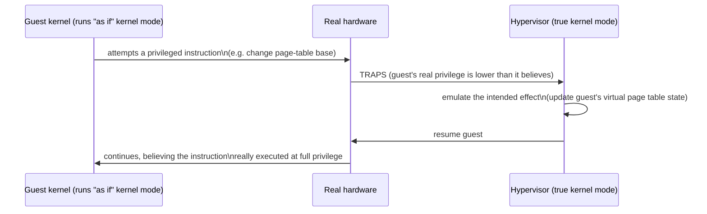

## Learning Objectives

- Define full-system virtualization as running an entire guest operating system, unmodified, as if it had a whole physical machine to itself.
- Explain the trap-and-emulate technique: how a hypervisor intercepts a guest's privileged instructions and emulates their effect instead of letting them touch real hardware.
- Distinguish a type-1 (bare-metal) hypervisor from a type-2 (hosted) hypervisor, and give a real example of each.
- Connect trap-and-emulate to the dual-mode execution and trap mechanisms already covered earlier in this discipline, framing virtualization as a direct extension of those ideas rather than an unrelated new mechanism.

## Context & Motivation

Every mechanism so far in this discipline has assumed a single kernel directly controls the real, physical hardware, with ordinary processes running above it in user mode. Full-system virtualization asks a more ambitious question: what if an entire *guest* operating system — kernel, drivers, and all, completely unmodified, believing itself to be running directly on real hardware — could instead run as a kind of oversized, extremely privileged "process" managed by a thin layer of software beneath it?

This is not a hypothetical curiosity; it is the technology underlying essentially all real cloud computing (a cloud provider's physical servers each run many customers' independent virtual machines simultaneously), software testing across operating systems without buying separate physical machines, and disaster recovery (an entire failed server's state, running inside a VM, can be moved to different physical hardware in seconds). Understanding it precisely requires revisiting this discipline's very first cluster — dual-mode execution and the trap mechanism — because full-system virtualization is, at its core, a direct and clever extension of exactly those two ideas, not a separate new mechanism invented from scratch.

## Core Theory

### The hypervisor: a kernel for kernels

A hypervisor (also called a virtual machine monitor, VMM) is software that sits between real hardware and one or more guest operating systems, presenting each guest with what appears to be its own dedicated physical machine — its own (virtual) CPU, memory, and devices — while in reality multiplexing the same underlying physical hardware among all of them, using techniques directly analogous to how an ordinary OS multiplexes physical resources among ordinary processes. The guest kernel is not modified to know it is virtualized (in the "full" virtualization this concept covers — paravirtualization, a different, lighter-weight technique, is a related but distinct approach this concept does not develop); it executes exactly the same code it would on real hardware, including its own privileged instructions, its own page-table manipulation, and its own interrupt handling.

### Trap-and-emulate: reusing this discipline's own trap mechanism

The central technique making this possible is trap-and-emulate, and it depends directly on the trap mechanism this discipline's very first cluster developed. The hypervisor runs at the machine's highest real privilege level, and deliberately runs each guest OS's kernel at a *lower* privilege level than the guest kernel itself believes it has — the guest kernel thinks it is executing in kernel mode with full hardware privilege, but is, in reality, running in a mode the hypervisor has arranged to be less privileged than true kernel mode. When the guest kernel then attempts one of the privileged instructions this discipline's first concept catalogued — disabling interrupts, changing the page-table base, accessing a device directly — the real hardware, seeing an instruction that oversteps the guest's actual (lowered) privilege level, does exactly what it always does: it traps, using the identical trap mechanism this discipline already covered for system calls and exceptions. But this trap lands not in the guest kernel's own trap handler, but in the hypervisor itself, which inspects what the guest was trying to do, emulates the effect the guest kernel expected (updating its own internal bookkeeping about that guest's virtual page-table state, for instance, without ever letting the guest actually touch the real page-table hardware), and then resumes the guest kernel exactly as if its privileged instruction had genuinely executed.



This is precisely why this concept was placed directly after this discipline's trap-mechanism concept rather than treated as unrelated new material: the hypervisor is, structurally, doing exactly what a kernel already does to a user-mode process — intercepting a privileged operation via a trap and handling it on the process's behalf — just one privilege level higher, applied to an entire guest kernel instead of an ordinary user program.

### Type-1 versus type-2 hypervisors

Real hypervisors fall into two architecturally distinct categories. A type-1 (bare-metal) hypervisor runs directly on the physical hardware, with no separate host operating system beneath it at all — VMware ESXi and Xen are real, widely deployed examples, used throughout enterprise data centers and cloud providers specifically because removing a full host OS from the equation reduces both overhead and the amount of code that could contain a security vulnerability. A type-2 (hosted) hypervisor instead runs as an ordinary application on top of a conventional host operating system — VirtualBox and VMware Workstation are real, common examples, typically chosen for desktop use (running a different OS temporarily on a personal laptop) precisely because installing a full bare-metal hypervisor on a general-purpose desktop machine would be impractical.

### Why full-system virtualization is expensive, setting up the next concept

Every one of a guest kernel's privileged instructions traps to the hypervisor and must be emulated in software before the guest resumes — and a real, busy guest kernel executes privileged instructions extremely frequently (managing its own scheduler's timer interrupts, its own page tables, its own device access). Naive trap-and-emulate, done entirely in software as described so far, pays a real, measurable performance cost for every single one of these traps — sometimes an order of magnitude slower than the equivalent operation on real, unvirtualized hardware. This performance gap, and how real processors closed most of it, is exactly where the next concept picks up.

## Worked Examples

### Example 1: A concrete trapped instruction, traced through the hypervisor

```text
Guest kernel executes: (attempts to) write to CR3 (change page-table base)

Real hardware: guest's actual privilege level is LOWER than kernel mode
              (arranged by the hypervisor at guest boot)
Real hardware: CR3 write is privileged -> TRAPS

Hypervisor's trap handler:
  1. Reads which instruction trapped and its intended arguments
     (the new page-table base the guest wanted to install)
  2. Updates its own internal "shadow" record of this guest's
     intended page table
  3. Resumes the guest kernel at the instruction AFTER the
     attempted CR3 write, exactly as if the write had succeeded
```

The guest kernel's own code is never modified and never learns that its CR3 write didn't actually reach real hardware directly — from the guest's perspective, the operation simply happened.

### Example 2: Type-1 versus type-2, concretely

```text
Type-1 (bare-metal):              Type-2 (hosted):
  Real hardware                     Real hardware
       |                                 |
    Hypervisor (VMware ESXi, Xen)    Host OS (e.g. Linux, Windows)
       |                                 |
   Guest OS, Guest OS, ...          Type-2 hypervisor (VirtualBox)
   (each a separate VM)                  |
                                     Guest OS, Guest OS, ...
```

A type-1 hypervisor has one fewer layer between it and the real hardware than a type-2 hypervisor does — the source of its typically lower overhead in production data-center use.

### Example 3: What the guest kernel believes versus what is actually true

```text
Guest kernel's belief              Actual reality
----------------------------------  --------------------------------
"I am running in kernel mode,       Running at a privilege level the
 with full hardware privilege"      hypervisor deliberately lowered

"My CR3 write directly changed      The hypervisor intercepted it and
 the real page-table base"          updated its own internal state instead

"I have exclusive access to         Multiplexed, via the same kind of
 this entire physical machine"      resource-sharing this discipline's
                                     process/thread model already uses
```

## Common Misconceptions & Pitfalls

- **"Virtualization requires modifying the guest operating system's code."** Full-system virtualization, as covered here, works with a completely unmodified guest kernel — the guest genuinely believes it has full hardware privilege and never needs to know it is being virtualized; a different technique, paravirtualization, does require guest modification but is a distinct approach not developed in this concept.
- **"Trap-and-emulate is a completely different mechanism from the traps this discipline already covered."** It is the identical hardware trap mechanism, applied one privilege level higher — the guest kernel's attempted privileged instructions trap to the hypervisor exactly as an ordinary process's attempted privileged instructions trap to a kernel.
- **"A type-2 hypervisor is simply a worse, slower version of a type-1 hypervisor, with no reason to ever use it."** Type-2 hypervisors are the practical, appropriate choice for desktop and development use, where installing a full bare-metal hypervisor in place of a general-purpose host OS would be impractical — the tradeoff is convenience against the somewhat higher overhead of an extra host-OS layer.
- **"The hypervisor and the guest kernel are running at the same privilege level, just doing different jobs."** The hypervisor deliberately runs at a strictly higher real privilege level than the guest kernel, specifically so it can trap and intercept the guest kernel's own attempted privileged instructions — the whole scheme depends on this privilege gap existing.

## Summary

Full-system virtualization runs an entire, unmodified guest operating system as though it had a dedicated physical machine, using a hypervisor that runs at a higher real privilege level than the guest kernel and intercepts the guest's privileged instructions via trap-and-emulate — the identical trap mechanism this discipline's first cluster already established for system calls and exceptions, now applied one privilege level higher, to an entire guest kernel instead of an ordinary user process. Type-1 (bare-metal) hypervisors like VMware ESXi and Xen run directly on hardware with no host OS beneath them, favored in data centers for lower overhead; type-2 (hosted) hypervisors like VirtualBox run as an application atop a conventional host OS, favored for desktop convenience. Because every one of a guest kernel's frequent privileged instructions must trap and be emulated in software, naive trap-and-emulate carries a real, measurable performance cost — which real hardware closed most of the way, as the next concept develops.

## Documentation Links

- [OSTEP — Virtual Machines](https://pages.cs.wisc.edu/~remzi/OSTEP/vmm-intro.pdf) — the trap-and-emulate mechanism and type-1/type-2 hypervisor distinction this concept is drawn from.
- [Popek & Goldberg — Formal Requirements for Virtualizable Third Generation Architectures](https://dl.acm.org/doi/10.1145/361011.361073) — the original, formal paper establishing the conditions an ISA must meet for trap-and-emulate virtualization to work.
