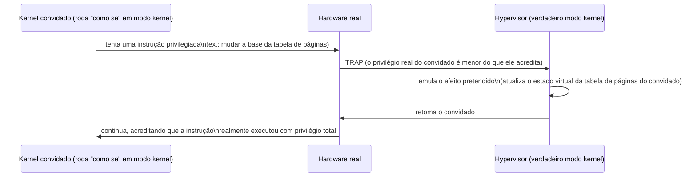

## Objetivos de Aprendizagem

- Definir a virtualização de sistema completo como rodar um sistema operacional convidado inteiro, sem modificações, como se ele tivesse uma máquina física inteira só para si.
- Explicar a técnica trap-and-emulate: como um hypervisor intercepta as instruções privilegiadas de um convidado e emula o seu efeito em vez de deixá-las tocar o hardware real.
- Distinguir um hypervisor tipo 1 (bare-metal) de um hypervisor tipo 2 (hospedado), e dar um exemplo real de cada um.
- Conectar o trap-and-emulate aos mecanismos de execução em modo dual e de trap já cobertos antes nesta disciplina, enquadrando a virtualização como uma extensão direta dessas ideias em vez de um mecanismo novo e sem relação.

## Contexto e Motivação

Todo mecanismo até agora nesta disciplina presumiu que um único kernel controla diretamente o hardware físico real, com processos comuns rodando acima dele em modo usuário. A virtualização de sistema completo faz uma pergunta mais ambiciosa: e se um sistema operacional *convidado* inteiro (kernel, drivers e tudo mais, completamente sem modificações, acreditando estar rodando diretamente em hardware real) pudesse em vez disso rodar como uma espécie de "processo" superdimensionado e extremamente privilegiado, gerenciado por uma fina camada de software abaixo dele?

Isto não é uma curiosidade hipotética; é a tecnologia por baixo de essencialmente toda a computação em nuvem real (os servidores físicos de um provedor de nuvem rodam cada um muitas máquinas virtuais independentes de clientes simultaneamente), de testes de software entre sistemas operacionais sem comprar máquinas físicas separadas, e de recuperação de desastres (o estado inteiro de um servidor que falhou, rodando dentro de uma VM, pode ser movido para um hardware físico diferente em segundos). Entendê-la com precisão exige revisitar o primeiríssimo bloco desta disciplina (execução em modo dual e o mecanismo de trap), porque a virtualização de sistema completo é, no seu núcleo, uma extensão direta e engenhosa exatamente dessas duas ideias, e não um mecanismo novo e separado inventado do zero.

## Teoria Central

### O hypervisor: um kernel para kernels

Um hypervisor (também chamado de virtual machine monitor, VMM) é um software que fica entre o hardware real e um ou mais sistemas operacionais convidados, apresentando a cada convidado o que parece ser a sua própria máquina física dedicada (a sua própria CPU, memória e dispositivos, virtuais), enquanto na realidade multiplexa o mesmo hardware físico subjacente entre todos eles, usando técnicas diretamente análogas a como um SO comum multiplexa recursos físicos entre processos comuns. O kernel convidado não é modificado para saber que está virtualizado (na virtualização "completa" que este conceito cobre; a paravirtualização, uma técnica diferente e mais leve, é uma abordagem relacionada, mas distinta, que este conceito não desenvolve); ele executa exatamente o mesmo código que executaria em hardware real, incluindo as suas próprias instruções privilegiadas, a sua própria manipulação de tabelas de páginas e o seu próprio tratamento de interrupções.

### Trap-and-emulate: reutilizando o próprio mecanismo de trap desta disciplina

A técnica central que torna isso possível é o trap-and-emulate, e ela depende diretamente do mecanismo de trap que o primeiríssimo bloco desta disciplina desenvolveu. O hypervisor roda no maior nível de privilégio real da máquina, e deliberadamente roda o kernel de cada SO convidado num nível de privilégio *menor* do que o próprio kernel convidado acredita ter: o kernel convidado pensa que está executando em modo kernel com privilégio total de hardware, mas está, na realidade, rodando num modo que o hypervisor arranjou para ser menos privilegiado que o verdadeiro modo kernel. Quando o kernel convidado então tenta uma das instruções privilegiadas que o primeiro conceito desta disciplina catalogou (desabilitar interrupções, mudar a base da tabela de páginas, acessar um dispositivo diretamente), o hardware real, vendo uma instrução que ultrapassa o nível de privilégio real (rebaixado) do convidado, faz exatamente o que sempre faz: faz um trap, usando o mecanismo de trap idêntico que esta disciplina já cobriu para chamadas de sistema e exceções. Mas este trap aterrissa não no próprio tratador de trap do kernel convidado, e sim no próprio hypervisor, que inspeciona o que o convidado estava tentando fazer, emula o efeito que o kernel convidado esperava (atualizando a sua própria contabilidade interna sobre o estado virtual da tabela de páginas daquele convidado, por exemplo, sem jamais deixar o convidado de fato tocar o hardware real da tabela de páginas), e então retoma o kernel convidado exatamente como se a sua instrução privilegiada tivesse genuinamente executado.



É precisamente por isso que este conceito foi colocado logo depois do conceito de mecanismo de trap desta disciplina em vez de tratado como material novo e sem relação: o hypervisor está, estruturalmente, fazendo exatamente o que um kernel já faz com um processo em modo usuário (interceptar uma operação privilegiada via um trap e tratá-la em nome do processo), só que um nível de privilégio acima, aplicado a um kernel convidado inteiro em vez de um programa de usuário comum.

### Hypervisors tipo 1 versus tipo 2

Hypervisors reais caem em duas categorias arquiteturalmente distintas. Um hypervisor tipo 1 (bare-metal) roda diretamente no hardware físico, sem nenhum sistema operacional hospedeiro separado abaixo dele. VMware ESXi e Xen são exemplos reais e amplamente implantados, usados em data centers corporativos e provedores de nuvem especificamente porque remover um SO hospedeiro completo da equação reduz tanto o overhead quanto a quantidade de código que poderia conter uma vulnerabilidade de segurança. Um hypervisor tipo 2 (hospedado), em vez disso, roda como uma aplicação comum em cima de um sistema operacional hospedeiro convencional. VirtualBox e VMware Workstation são exemplos reais e comuns, tipicamente escolhidos para uso em desktop (rodar um SO diferente temporariamente num notebook pessoal) justamente porque instalar um hypervisor bare-metal completo numa máquina desktop de uso geral seria impraticável.

### Por que a virtualização de sistema completo é cara, preparando o próximo conceito

Cada uma das instruções privilegiadas de um kernel convidado faz trap para o hypervisor e precisa ser emulada em software antes que o convidado seja retomado, e um kernel convidado real e ocupado executa instruções privilegiadas com extrema frequência (gerenciando as interrupções de timer do seu próprio escalonador, as suas próprias tabelas de páginas, o seu próprio acesso a dispositivos). O trap-and-emulate ingênuo, feito inteiramente em software como descrito até aqui, paga um custo de desempenho real e mensurável por cada um desses traps, às vezes uma ordem de grandeza mais lento do que a operação equivalente em hardware real, não virtualizado. Esta diferença de desempenho, e como processadores reais fecharam a maior parte dela, é exatamente onde o próximo conceito continua.

## Exemplos Resolvidos

### Exemplo 1: Uma instrução concreta que causa trap, rastreada pelo hypervisor

```text
Kernel convidado executa: (tenta) escrever no CR3 (mudar a base da tabela de páginas)

Hardware real: o nível de privilégio real do convidado é MENOR que o modo kernel
              (arranjado pelo hypervisor na inicialização do convidado)
Hardware real: escrita no CR3 é privilegiada -> TRAP

Tratador de trap do hypervisor:
  1. Lê qual instrução causou o trap e os seus argumentos pretendidos
     (a nova base de tabela de páginas que o convidado queria instalar)
  2. Atualiza o seu próprio registro interno "sombra" da tabela de
     páginas pretendida por este convidado
  3. Retoma o kernel convidado na instrução DEPOIS da escrita
     tentada no CR3, exatamente como se a escrita tivesse dado certo
```

O código do próprio kernel convidado nunca é modificado e nunca descobre que a sua escrita no CR3 não chegou de fato diretamente ao hardware real: da perspectiva do convidado, a operação simplesmente aconteceu.

### Exemplo 2: Tipo 1 versus tipo 2, concretamente

```text
Tipo 1 (bare-metal):              Tipo 2 (hospedado):
  Hardware real                     Hardware real
       |                                 |
    Hypervisor (VMware ESXi, Xen)    SO hospedeiro (ex.: Linux, Windows)
       |                                 |
   SO convidado, SO convidado, ...  Hypervisor tipo 2 (VirtualBox)
   (cada um uma VM separada)             |
                                     SO convidado, SO convidado, ...
```

Um hypervisor tipo 1 tem uma camada a menos entre ele e o hardware real do que um hypervisor tipo 2, a origem do seu overhead tipicamente menor em uso de produção em data centers.

### Exemplo 3: O que o kernel convidado acredita versus o que é de fato verdade

```text
Crença do kernel convidado          Realidade de fato
----------------------------------  --------------------------------
"Estou rodando em modo kernel,      Rodando num nível de privilégio que
 com privilégio total de hardware"  o hypervisor deliberadamente rebaixou

"Minha escrita no CR3 mudou         O hypervisor a interceptou e
 diretamente a base real da         atualizou o seu próprio estado
 tabela de páginas"                 interno em vez disso

"Tenho acesso exclusivo a esta      Multiplexada, via o mesmo tipo de
 máquina física inteira"            compartilhamento de recursos que o
                                     modelo de processos/threads desta
                                     disciplina já usa
```

## Equívocos Comuns e Armadilhas

- **"A virtualização exige modificar o código do sistema operacional convidado."** A virtualização de sistema completo, como coberta aqui, funciona com um kernel convidado completamente sem modificações: o convidado genuinamente acredita ter privilégio total de hardware e nunca precisa saber que está sendo virtualizado. Uma técnica diferente, a paravirtualização, exige modificar o convidado, mas é uma abordagem distinta não desenvolvida neste conceito.
- **"Trap-and-emulate é um mecanismo completamente diferente dos traps que esta disciplina já cobriu."** É o mecanismo de trap de hardware idêntico, aplicado um nível de privilégio acima: as instruções privilegiadas tentadas pelo kernel convidado fazem trap para o hypervisor exatamente como as instruções privilegiadas tentadas por um processo comum fazem trap para um kernel.
- **"Um hypervisor tipo 2 é simplesmente uma versão pior e mais lenta de um hypervisor tipo 1, sem motivo para jamais usá-lo."** Hypervisors tipo 2 são a escolha prática e apropriada para uso em desktop e desenvolvimento, onde instalar um hypervisor bare-metal completo no lugar de um SO hospedeiro de uso geral seria impraticável. O trade-off é conveniência contra o overhead um pouco maior de uma camada extra de SO hospedeiro.
- **"O hypervisor e o kernel convidado estão rodando no mesmo nível de privilégio, só fazendo trabalhos diferentes."** O hypervisor deliberadamente roda num nível de privilégio real estritamente mais alto que o kernel convidado, especificamente para poder fazer trap e interceptar as próprias instruções privilegiadas tentadas pelo kernel convidado. O esquema inteiro depende da existência dessa diferença de privilégio.

## Resumo

A virtualização de sistema completo roda um sistema operacional convidado inteiro e sem modificações como se ele tivesse uma máquina física dedicada, usando um hypervisor que roda num nível de privilégio real mais alto que o kernel convidado e intercepta as instruções privilegiadas do convidado via trap-and-emulate: o mecanismo de trap idêntico que o primeiro bloco desta disciplina já estabeleceu para chamadas de sistema e exceções, agora aplicado um nível de privilégio acima, a um kernel convidado inteiro em vez de um processo de usuário comum. Hypervisors tipo 1 (bare-metal) como VMware ESXi e Xen rodam diretamente no hardware sem nenhum SO hospedeiro abaixo deles, preferidos em data centers pelo overhead menor; hypervisors tipo 2 (hospedados) como VirtualBox rodam como uma aplicação sobre um SO hospedeiro convencional, preferidos pela conveniência em desktops. Como cada uma das frequentes instruções privilegiadas de um kernel convidado precisa fazer trap e ser emulada em software, o trap-and-emulate ingênuo carrega um custo de desempenho real e mensurável, que o hardware real fechou em boa parte, como o próximo conceito desenvolve.

## Documentation Links

- [OSTEP: Virtual Machines](https://pages.cs.wisc.edu/~remzi/OSTEP/vmm-intro.pdf): o mecanismo trap-and-emulate e a distinção entre hypervisors tipo 1/tipo 2 dos quais este conceito é extraído.
- [Popek & Goldberg: Formal Requirements for Virtualizable Third Generation Architectures](https://dl.acm.org/doi/10.1145/361011.361073): o artigo original e formal que estabelece as condições que uma ISA precisa satisfazer para que a virtualização por trap-and-emulate funcione.
