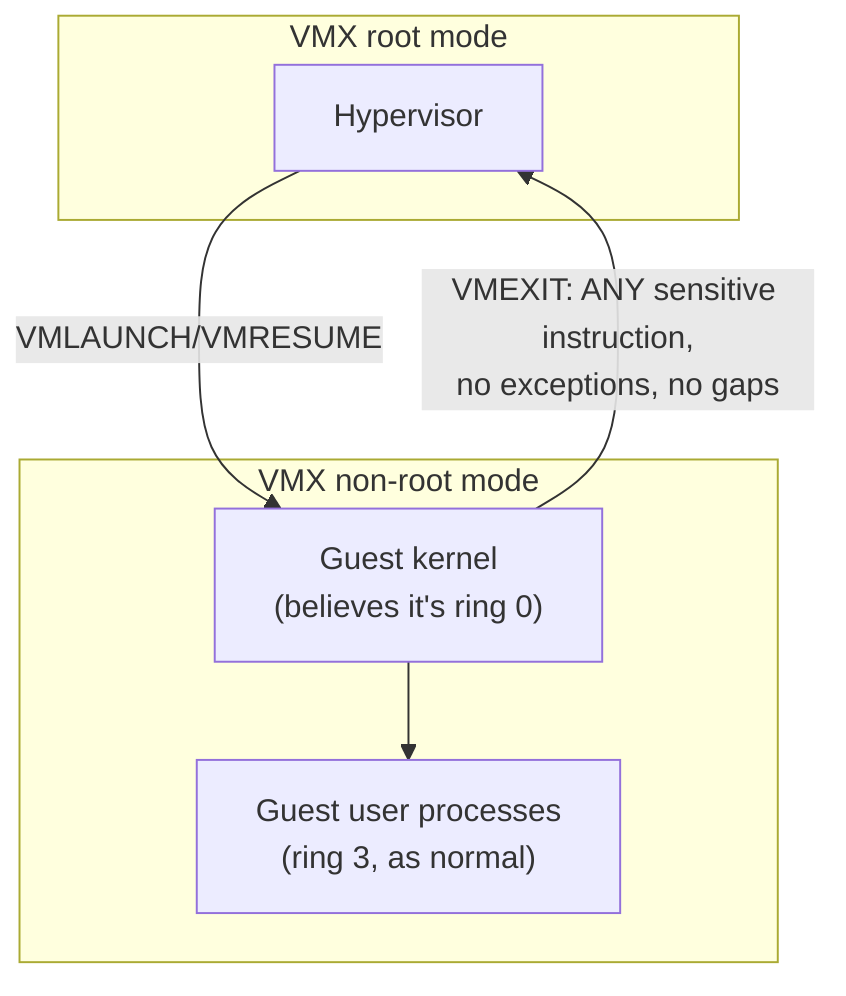

## Learning Objectives

- Explain why naive, software-only trap-and-emulate could not correctly virtualize the real x86 instruction set, citing the specific class of problem instructions.
- State the Popek and Goldberg conditions, informally, as the formal requirement an ISA must satisfy for trap-and-emulate to work at all.
- Describe what Intel VT-x and AMD-V actually add to the hardware — a second privilege dimension — and how it restores full trap-and-emulate correctness.
- Explain, at least qualitatively, why hardware-assisted virtualization also improves performance, not just correctness, compared to pure software emulation.

## Context & Motivation

The previous concept described trap-and-emulate as though it simply works: a guest kernel's privileged instructions trap to the hypervisor, which emulates their effect. This is correct in principle, but real x86 hardware, as it existed for decades before hardware virtualization support was added, could not actually support this scheme reliably for every instruction — a genuinely surprising, historically important gap between the theory of virtualization and the reality of a specific, extremely widely deployed instruction set architecture.

Understanding exactly what went wrong, and what Intel and AMD added to their hardware specifically to fix it, is not a historical footnote — it explains why hardware virtualization extensions (VT-x, AMD-V) exist as distinct, real hardware features at all, why every modern cloud data center relies on chips with these extensions enabled, and why the previous concept's clean trap-and-emulate story needed a genuine hardware fix, not merely a clever software workaround, to become fully correct and reasonably fast on real machines.

## Core Theory

### The formal requirement: Popek and Goldberg's conditions

In 1974, Gerald Popek and Robert Goldberg published a formal analysis of exactly what property an instruction set architecture must have for trap-and-emulate virtualization to work correctly at all. Their key requirement, informally: every instruction whose behavior depends on the current privilege level, or that could affect the hypervisor's control of the machine, must trap when executed at a lower privilege level than it expects. If even one such "sensitive" instruction fails to trap — instead silently executing with different, incorrect behavior, or worse, silently succeeding as if run at full privilege — a guest kernel running that instruction under trap-and-emulate will behave differently than it would running directly on real hardware, breaking the entire premise that a virtualized guest cannot tell it is virtualized.

### The real, concrete problem: x86 had non-virtualizable instructions

For decades, the real x86 instruction set violated exactly this condition for a genuine, if small, set of instructions. The most commonly cited concrete example is `POPF` (pop flags): running at a lower privilege level than it expects, `POPF` does not trap — it simply, silently, fails to update certain privileged flag bits it would have updated at full privilege, and continues executing normally with the operation only partially completed and no signal to the hypervisor that anything unusual happened at all. A guest kernel relying on `POPF` behaving identically to how it behaves at genuine full privilege would silently misbehave under naive trap-and-emulate — not crash, not obviously malfunction, just quietly produce different results than the same code would produce on real, unvirtualized hardware, exactly the kind of subtle correctness bug that is hardest to detect and diagnose.

Before hardware virtualization support existed, real hypervisors (VMware being the most historically significant example) worked around this gap with binary translation — dynamically scanning the guest kernel's code just before execution and rewriting exactly the small set of problem instructions into different, functionally equivalent sequences that *would* trap correctly, entirely in software, without ever modifying the guest kernel's own source code or binary on disk. This worked, and worked well enough to build a real, commercially successful virtualization industry on, but it required exactly this kind of careful, ongoing software engineering to compensate for a genuine hardware deficiency.

### The hardware fix: a second, purpose-built privilege dimension

Intel VT-x and AMD-V (introduced in the mid-2000s) solved this at the hardware level by adding an entirely new, orthogonal privilege dimension specifically for virtualization, rather than trying to fix each individual problem instruction. Concretely, the CPU gains a "root" mode (where the hypervisor runs) and a "non-root" mode (where the guest, including the guest kernel, runs) — and critically, the *existing* four x86 rings still exist and still work normally *within* non-root mode, so the guest kernel continues believing it is running in ring 0, with its own genuine ring 0/ring 3 distinction preserved for its own processes, entirely unaware that the entire non-root mode it is running in is itself one additional layer beneath the hypervisor's root mode.



Crucially, this hardware redesign closes the Popek-and-Goldberg gap directly: the CPU vendor redefined which instructions cause an exit from non-root mode back to root mode (a `VMEXIT`, the hardware-assisted equivalent of the trap this discipline already covered), specifically ensuring every sensitive instruction — including the previously problematic ones like `POPF` — now reliably exits to the hypervisor, with no silent, incorrect exceptions remaining. The formal condition Popek and Goldberg required in 1974 is satisfied for the first time on real x86 hardware, not through a workaround, but through an actual redesign of what causes an exit.

### Performance, not just correctness

Hardware-assisted virtualization also improves speed, for a reason distinct from fixing the correctness gap: a hardware `VMEXIT`/`VMRESUME` transition is a single, purpose-built hardware operation, considerably cheaper than the overhead binary translation's dynamic code-rewriting approach required on every execution of a rewritten instruction sequence. Removing the need to scan and rewrite guest code at all, and instead letting the guest kernel's own original, unmodified instructions run directly until a genuine `VMEXIT` condition occurs, removes an entire layer of software overhead binary translation had to pay on every affected instruction.

## Worked Examples

### Example 1: `POPF`'s silent misbehavior, traced concretely

```text
Guest kernel, believing it runs at real privilege, executes: POPF

WITHOUT hardware virtualization support (old x86):
  Running at lower-than-expected privilege, POPF silently skips
  updating the interrupt-enable flag bit -- no trap, no signal,
  execution simply continues with a subtly wrong flag state.
  The guest kernel has no way to detect this happened.

WITH VT-x/AMD-V:
  POPF is configured as a VMEXIT-triggering instruction in non-root
  mode -- executing it reliably transfers control to the hypervisor,
  which emulates the FULL, correct effect (including the flag the
  old hardware would have silently skipped) before resuming the guest.
```

### Example 2: Binary translation's workaround, before hardware support existed

```text
Guest kernel's original code (as compiled, unmodified):
  ... ; some instructions
  POPF
  ... ; more instructions

VMware's binary translator, scanning just before execution, REWRITES
this to a functionally equivalent sequence that DOES trap correctly:
  ... ; some instructions
  CALL emulate_popf_correctly   ; a hypervisor-provided routine
  ... ; more instructions
```

This rewriting happened dynamically, instruction-sequence by instruction-sequence, entirely in software, imposing real, measurable overhead on every affected instruction, every time it executed — exactly the cost VT-x/AMD-V's hardware VMEXIT mechanism removed.

### Example 3: The old four x86 rings, now nested one level deeper

```text
Before VT-x/AMD-V:          With VT-x/AMD-V:
  Ring 0 (kernel)             VMX root:   hypervisor
  Ring 1 (unused)             VMX non-root:
  Ring 2 (unused)               Ring 0 (guest kernel, believes full privilege)
  Ring 3 (user)                  Ring 3 (guest user processes)
```

The guest kernel's own internal ring 0/ring 3 distinction is completely preserved and unmodified — VT-x/AMD-V adds an entirely new, orthogonal dimension above it, rather than changing anything about how rings work within the guest itself.

## Common Misconceptions & Pitfalls

- **"Trap-and-emulate, as originally described, always worked correctly on real x86 hardware."** For decades it did not — a genuine, documented gap existed for a small set of "sensitive" instructions like `POPF` that failed to trap when the Popek-and-Goldberg condition required them to, a real historical problem real hypervisors had to work around with binary translation before hardware support existed.
- **"VT-x and AMD-V work by fixing each individual problem instruction like `POPF` to trap correctly."** They instead add an entirely new privilege dimension (root/non-root mode) with its own, redesigned set of `VMEXIT`-triggering conditions covering every sensitive instruction at once, rather than patching instructions one at a time.
- **"Binary translation modified the guest kernel's actual source code or disk image."** It rewrote instruction sequences dynamically, in memory, immediately before execution, without ever touching the guest kernel's code as stored on disk — a transparent, on-the-fly software workaround, not a permanent modification.
- **"Hardware-assisted virtualization only fixes correctness; performance is unaffected."** It also improves performance, since a hardware `VMEXIT` is a single, purpose-built operation, considerably cheaper than the software-based scanning and rewriting binary translation required for every affected instruction on every execution.

## Summary

Real x86 hardware, for decades, violated the formal condition Popek and Goldberg established in 1974 for correct trap-and-emulate virtualization: a small set of sensitive instructions, `POPF` the most commonly cited, failed to trap when run at less-than-expected privilege, instead silently behaving incorrectly — a genuine gap real hypervisors worked around with binary translation, dynamically rewriting problem instruction sequences in software before execution. Intel VT-x and AMD-V closed this gap at the hardware level by adding an entirely new root/non-root privilege dimension, redefining which instructions trigger a hardware `VMEXIT` back to the hypervisor so that every sensitive instruction, including the previously problematic ones, now reliably and correctly exits — while leaving the guest kernel's own internal ring 0/ring 3 distinction completely untouched, nested one level beneath the new dimension. Beyond restoring correctness, hardware-assisted virtualization also improves performance, since a single hardware `VMEXIT` operation is considerably cheaper than the ongoing software cost binary translation had to pay.

## Documentation Links

- [OSTEP — Virtual Machines](https://pages.cs.wisc.edu/~remzi/OSTEP/vmm-intro.pdf) — covers the non-virtualizable x86 instruction problem and hardware-assisted virtualization's fix this concept develops in detail.
- [Popek & Goldberg — Formal Requirements for Virtualizable Third Generation Architectures](https://dl.acm.org/doi/10.1145/361011.361073) — the original 1974 paper stating the formal condition VT-x/AMD-V were built specifically to satisfy.
