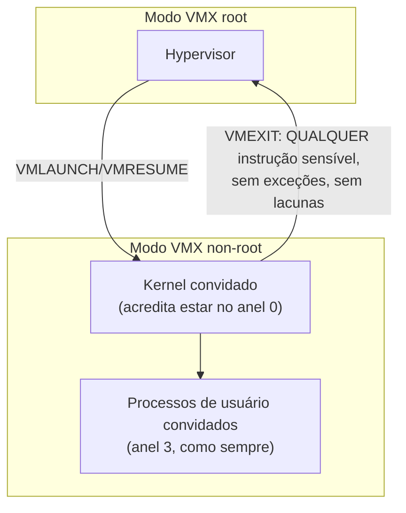

## Objetivos de Aprendizagem

- Explicar por que o trap-and-emulate ingênuo, só em software, não conseguia virtualizar corretamente o conjunto de instruções x86 real, citando a classe específica de instruções problemáticas.
- Enunciar as condições de Popek e Goldberg, informalmente, como o requisito formal que uma ISA precisa satisfazer para que o trap-and-emulate funcione de alguma forma.
- Descrever o que o Intel VT-x e o AMD-V de fato adicionam ao hardware (uma segunda dimensão de privilégio) e como isso restaura a corretude completa do trap-and-emulate.
- Explicar, ao menos qualitativamente, por que a virtualização assistida por hardware também melhora o desempenho, e não só a corretude, em comparação com a emulação puramente em software.

## Contexto e Motivação

O conceito anterior descreveu o trap-and-emulate como se ele simplesmente funcionasse: as instruções privilegiadas de um kernel convidado fazem trap para o hypervisor, que emula o seu efeito. Isso está correto em princípio, mas o hardware x86 real, como existiu por décadas antes que o suporte de hardware à virtualização fosse adicionado, não conseguia de fato suportar esse esquema de forma confiável para toda instrução, uma lacuna genuinamente surpreendente e historicamente importante entre a teoria da virtualização e a realidade de uma arquitetura de conjunto de instruções específica e extremamente difundida.

Entender exatamente o que deu errado, e o que a Intel e a AMD adicionaram ao seu hardware especificamente para corrigir isso, não é uma nota de rodapé histórica: isso explica por que as extensões de virtualização de hardware (VT-x, AMD-V) existem como recursos de hardware reais e distintos, por que todo data center de nuvem moderno depende de chips com essas extensões habilitadas, e por que a história limpa de trap-and-emulate do conceito anterior precisou de uma correção genuína de hardware, e não meramente de um contorno esperto em software, para se tornar totalmente correta e razoavelmente rápida em máquinas reais.

## Teoria Central

### O requisito formal: as condições de Popek e Goldberg

Em 1974, Gerald Popek e Robert Goldberg publicaram uma análise formal de exatamente que propriedade uma arquitetura de conjunto de instruções precisa ter para que a virtualização por trap-and-emulate funcione corretamente. O seu requisito central, informalmente: toda instrução cujo comportamento depende do nível de privilégio atual, ou que poderia afetar o controle da máquina pelo hypervisor, precisa fazer trap quando executada num nível de privilégio menor do que o que ela espera. Se mesmo uma dessas instruções "sensíveis" deixar de fazer trap (em vez disso executando silenciosamente com um comportamento diferente e incorreto, ou pior, tendo sucesso silenciosamente como se rodasse com privilégio total), um kernel convidado rodando essa instrução sob trap-and-emulate vai se comportar de forma diferente do que se comportaria rodando diretamente em hardware real, quebrando toda a premissa de que um convidado virtualizado não consegue perceber que está virtualizado.

### O problema real e concreto: o x86 tinha instruções não virtualizáveis

Por décadas, o conjunto de instruções x86 real violou exatamente essa condição para um conjunto genuíno, ainda que pequeno, de instruções. O exemplo concreto mais citado é o `POPF` (pop flags): rodando num nível de privilégio menor do que o esperado, o `POPF` não faz trap; ele simplesmente, silenciosamente, deixa de atualizar certos bits de flag privilegiados que teria atualizado com privilégio total, e continua executando normalmente com a operação só parcialmente completada e sem nenhum sinal ao hypervisor de que algo incomum aconteceu. Um kernel convidado que dependesse de o `POPF` se comportar identicamente a como se comporta com privilégio total genuíno se comportaria mal silenciosamente sob trap-and-emulate ingênuo: não travaria, não funcionaria obviamente mal, apenas produziria discretamente resultados diferentes dos que o mesmo código produziria em hardware real não virtualizado, exatamente o tipo de bug de corretude sutil que é o mais difícil de detectar e diagnosticar.

Antes que existisse suporte de hardware à virtualização, hypervisors reais (sendo a VMware o exemplo historicamente mais significativo) contornavam essa lacuna com tradução binária: escaneando dinamicamente o código do kernel convidado logo antes da execução e reescrevendo exatamente o pequeno conjunto de instruções problemáticas em sequências diferentes, funcionalmente equivalentes, que *fariam* trap corretamente, inteiramente em software, sem jamais modificar o código-fonte ou o binário em disco do próprio kernel convidado. Isso funcionava, e funcionava bem o suficiente para construir sobre isso uma indústria de virtualização real e comercialmente bem-sucedida, mas exigia exatamente esse tipo de engenharia de software cuidadosa e contínua para compensar uma deficiência genuína de hardware.

### A correção de hardware: uma segunda dimensão de privilégio, construída sob medida

O Intel VT-x e o AMD-V (introduzidos em meados dos anos 2000) resolveram isso no nível do hardware adicionando uma dimensão de privilégio inteiramente nova e ortogonal especificamente para virtualização, em vez de tentar consertar cada instrução problemática individualmente. Concretamente, a CPU ganha um modo "root" (onde o hypervisor roda) e um modo "non-root" (onde o convidado, incluindo o kernel convidado, roda) e, crucialmente, os quatro anéis x86 *existentes* continuam existindo e funcionando normalmente *dentro* do modo non-root, então o kernel convidado continua acreditando que está rodando no anel 0, com a sua própria distinção genuína entre anel 0/anel 3 preservada para os seus próprios processos, inteiramente sem saber que todo o modo non-root no qual está rodando é ele próprio uma camada adicional abaixo do modo root do hypervisor.



Crucialmente, este redesenho de hardware fecha diretamente a lacuna de Popek e Goldberg: o fabricante da CPU redefiniu quais instruções causam uma saída do modo non-root de volta ao modo root (um `VMEXIT`, o equivalente assistido por hardware do trap que esta disciplina já cobriu), garantindo especificamente que toda instrução sensível, incluindo as antes problemáticas como o `POPF`, agora saia de forma confiável para o hypervisor, sem nenhuma exceção silenciosa e incorreta restante. A condição formal que Popek e Goldberg exigiram em 1974 é satisfeita pela primeira vez em hardware x86 real, não por meio de um contorno, mas por meio de um redesenho de fato do que causa uma saída.

### Desempenho, e não só corretude

A virtualização assistida por hardware também melhora a velocidade, por uma razão distinta de consertar a lacuna de corretude: uma transição `VMEXIT`/`VMRESUME` de hardware é uma única operação de hardware construída sob medida, consideravelmente mais barata que o overhead que a abordagem de reescrita dinâmica de código da tradução binária exigia a cada execução de uma sequência de instruções reescrita. Remover a necessidade de escanear e reescrever o código do convidado, deixando em vez disso as próprias instruções originais e não modificadas do kernel convidado rodarem diretamente até que uma condição genuína de `VMEXIT` ocorra, remove uma camada inteira de overhead de software que a tradução binária precisava pagar em cada instrução afetada.

## Exemplos Resolvidos

### Exemplo 1: O mau comportamento silencioso do `POPF`, rastreado concretamente

```text
Kernel convidado, acreditando rodar com privilégio real, executa: POPF

SEM suporte de hardware à virtualização (x86 antigo):
  Rodando com privilégio menor que o esperado, o POPF silenciosamente
  pula a atualização do bit da flag de habilitação de interrupções --
  sem trap, sem sinal, a execução simplesmente continua com um estado
  de flag sutilmente errado. O kernel convidado não tem como detectar
  que isso aconteceu.

COM VT-x/AMD-V:
  O POPF é configurado como uma instrução que dispara VMEXIT no modo
  non-root -- executá-lo transfere o controle de forma confiável para
  o hypervisor, que emula o efeito COMPLETO e correto (incluindo a flag
  que o hardware antigo teria pulado silenciosamente) antes de retomar
  o convidado.
```

### Exemplo 2: O contorno da tradução binária, antes de existir suporte de hardware

```text
Código original do kernel convidado (como compilado, sem modificações):
  ... ; algumas instruções
  POPF
  ... ; mais instruções

O tradutor binário da VMware, escaneando logo antes da execução,
REESCREVE isto numa sequência funcionalmente equivalente que FAZ trap
corretamente:
  ... ; algumas instruções
  CALL emulate_popf_correctly   ; uma rotina fornecida pelo hypervisor
  ... ; mais instruções
```

Essa reescrita acontecia dinamicamente, sequência de instruções por sequência de instruções, inteiramente em software, impondo um overhead real e mensurável a cada instrução afetada, toda vez que ela executava, exatamente o custo que o mecanismo de VMEXIT de hardware do VT-x/AMD-V removeu.

### Exemplo 3: Os quatro anéis antigos do x86, agora aninhados um nível mais fundo

```text
Antes do VT-x/AMD-V:        Com VT-x/AMD-V:
  Anel 0 (kernel)             VMX root:   hypervisor
  Anel 1 (sem uso)            VMX non-root:
  Anel 2 (sem uso)              Anel 0 (kernel convidado, acredita ter privilégio total)
  Anel 3 (usuário)               Anel 3 (processos de usuário convidados)
```

A distinção interna entre anel 0/anel 3 do próprio kernel convidado é completamente preservada e não modificada: o VT-x/AMD-V adiciona uma dimensão inteiramente nova e ortogonal acima dela, em vez de mudar qualquer coisa em como os anéis funcionam dentro do próprio convidado.

## Equívocos Comuns e Armadilhas

- **"O trap-and-emulate, como originalmente descrito, sempre funcionou corretamente em hardware x86 real."** Por décadas não funcionou: existia uma lacuna genuína e documentada para um pequeno conjunto de instruções "sensíveis" como o `POPF`, que deixavam de fazer trap quando a condição de Popek e Goldberg exigia que fizessem, um problema histórico real que hypervisors reais precisaram contornar com tradução binária antes que existisse suporte de hardware.
- **"O VT-x e o AMD-V funcionam consertando cada instrução problemática individual, como o `POPF`, para fazer trap corretamente."** Em vez disso, eles adicionam uma dimensão de privilégio inteiramente nova (modo root/non-root) com o seu próprio conjunto redesenhado de condições que disparam `VMEXIT`, cobrindo toda instrução sensível de uma vez, em vez de corrigir instruções uma por uma.
- **"A tradução binária modificava o código-fonte de fato ou a imagem em disco do kernel convidado."** Ela reescrevia sequências de instruções dinamicamente, em memória, imediatamente antes da execução, sem jamais tocar o código do kernel convidado como armazenado em disco: um contorno de software transparente e em tempo real, não uma modificação permanente.
- **"A virtualização assistida por hardware só conserta a corretude; o desempenho não é afetado."** Ela também melhora o desempenho, já que um `VMEXIT` de hardware é uma única operação construída sob medida, consideravelmente mais barata que o escaneamento e a reescrita baseados em software que a tradução binária exigia para cada instrução afetada a cada execução.

## Resumo

O hardware x86 real, por décadas, violou a condição formal que Popek e Goldberg estabeleceram em 1974 para a virtualização correta por trap-and-emulate: um pequeno conjunto de instruções sensíveis, sendo o `POPF` a mais citada, deixava de fazer trap quando rodava com privilégio menor que o esperado, comportando-se em vez disso silenciosamente de forma incorreta, uma lacuna genuína que hypervisors reais contornavam com tradução binária, reescrevendo dinamicamente em software as sequências de instruções problemáticas antes da execução. O Intel VT-x e o AMD-V fecharam essa lacuna no nível do hardware adicionando uma dimensão de privilégio root/non-root inteiramente nova, redefinindo quais instruções disparam um `VMEXIT` de hardware de volta ao hypervisor, de modo que toda instrução sensível, incluindo as antes problemáticas, agora sai de forma confiável e correta, deixando completamente intocada a própria distinção interna entre anel 0/anel 3 do kernel convidado, aninhada um nível abaixo da nova dimensão. Além de restaurar a corretude, a virtualização assistida por hardware também melhora o desempenho, já que uma única operação de `VMEXIT` de hardware é consideravelmente mais barata que o custo contínuo de software que a tradução binária precisava pagar.

## Documentation Links

- [OSTEP: Virtual Machines](https://pages.cs.wisc.edu/~remzi/OSTEP/vmm-intro.pdf): cobre o problema das instruções x86 não virtualizáveis e a correção da virtualização assistida por hardware que este conceito desenvolve em detalhe.
- [Popek & Goldberg: Formal Requirements for Virtualizable Third Generation Architectures](https://dl.acm.org/doi/10.1145/361011.361073): o artigo original de 1974 que enuncia a condição formal que o VT-x/AMD-V foram construídos especificamente para satisfazer.
