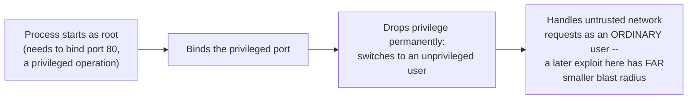

## Learning Objectives

- State the principle of least privilege precisely: give a running process the minimum access it needs to do its job, no more.
- Describe three real, concrete Unix/Linux sandboxing mechanisms (`chroot`, `seccomp`, dropping `setuid` privileges) as different-granularity applications of the same underlying principle.
- Explain why "small blast radius by design" is a fundamentally different (and stronger) security posture than "hope nothing ever goes wrong."
- Connect sandboxing to the containers concept from this discipline's virtualization cluster, and to the ACL/capability concepts just covered, as complementary applications of the same access-restriction theme.

## Context & Motivation

The previous two concepts developed two different theoretical models — access control lists and capabilities — for deciding what a process may do. This concept turns to a more practical, operational question real system administrators and developers face constantly: given that a process, however carefully written, might contain a bug, or might be compromised by an attacker exploiting a vulnerability this platform's `security-cryptography` discipline already catalogued, how much damage can that single compromised process actually do to the rest of the system?

The principle of least privilege answers this with a design stance, not a single mechanism: deliberately restrict every running process to the smallest set of permissions, files, and system capabilities it genuinely needs for its actual job, so that if it is ever compromised — not "if we are careless," but "when, inevitably, some bug or vulnerability is exploited" — the compromise's blast radius is small by design, not merely by luck. This concept surveys three real, concrete Unix/Linux mechanisms that apply this same principle at different granularities, tying together this discipline's virtualization cluster (containers) and this cluster's own ACL and capability concepts as complementary instances of the identical underlying idea.

## Core Theory

### The principle, stated precisely

The principle of least privilege holds that every process, user, or component of a system should operate with the minimum set of permissions necessary to complete its intended function, and no more — not "eventually reduced," not "restricted after an incident," but deliberately, structurally minimized from the moment the process starts. This is a design philosophy that shows up throughout real systems in many different concrete forms, three of which this concept develops: restricting which part of the filesystem a process can even see (`chroot`), restricting which system calls a process is even allowed to attempt (`seccomp`), and restricting which user identity and its associated permissions a process retains after it no longer needs elevated privilege (dropping `setuid`).

### `chroot`: restricting the visible filesystem

`chroot` (change root) is a system call that changes what a process — and every process it subsequently creates — perceives as the root (`/`) of the entire filesystem, confining it to a specific subtree and making everything outside that subtree entirely invisible and unreachable through ordinary path-based file access, even if the underlying files genuinely exist elsewhere on the same disk. A network service that only ever needs to read from and write to one specific directory tree (a web server serving static files from `/var/www`, for instance) gains real, concrete protection from `chroot`: even if that service is compromised via some vulnerability, an attacker's ability to read or write arbitrary files elsewhere on the system — configuration files, other users' data, system binaries — is sharply restricted, because those paths simply do not exist from the compromised process's own restricted point of view.

### `seccomp`: restricting which system calls are even reachable

Where `chroot` restricts *which files* a process can see, `seccomp` (secure computing mode) restricts *which system calls* a process is even permitted to attempt at all, by installing a kernel-enforced filter (commonly expressed as an explicit allowlist of permitted syscall numbers) that the kernel consults before dispatching any system call this discipline's earlier concept already covered — an attempted syscall not on the allowlist is rejected (or the process is terminated outright) before the kernel's actual syscall-table dispatch ever runs. This is a genuinely different, and often stronger, restriction than file-level access control: a process compromised by an attacker who has gained arbitrary code execution within it still cannot, for instance, call `execve()` to spawn a shell, or open a raw network socket, if those specific syscalls were never on that process's allowlist to begin with — restricting the attacker's options structurally, at the exact kernel boundary this discipline's earlier syscall-anatomy concept already established as the sole gateway to any kernel service.

### Dropping `setuid` privilege: restricting elevated identity to only when it's needed

Some legitimate Unix programs genuinely need elevated (often root) privilege for a brief moment — a program that binds to a low-numbered network port (a privileged operation) or that needs to read a system password file at startup — but do not need that elevated privilege for the entire remainder of their execution. The `setuid` mechanism lets such a program start with elevated privilege, perform the one specific operation that genuinely requires it, and then permanently and irrevocably drop that privilege (switching to an ordinary, unprivileged user identity for the rest of its lifetime) before it does anything else, especially before it processes any untrusted input from a network connection or a file it did not create itself. A real, widely cited example: many network daemons bind to their privileged port while still running as root, then immediately call a privilege-dropping system call to become an unprivileged user for all subsequent request-handling — so that a vulnerability exploited later, while handling an actual network request, compromises only an unprivileged process, not one still holding root.



### Blast radius by design, not by luck

The unifying theme across all three mechanisms — and across containers and the ACL/capability models this cluster already covered — is a specific security posture: assume compromise will eventually happen to some process, somewhere, and design the system so that any single compromise's consequences are structurally, mechanically bounded in advance, rather than relying on the hope that no vulnerability is ever exploited. A `chroot`-confined, `seccomp`-filtered, privilege-dropped network service that is compromised can still do damage — but only within the narrow, deliberately restricted scope that remains available to it, which is precisely the point: "small blast radius by design" degrades gracefully under an assumption of eventual failure, where "hope nothing goes wrong" does not degrade at all — it simply fails completely, the first time an assumption turns out to be wrong.

## Worked Examples

### Example 1: A `chroot`-confined service, concretely

```text
Real filesystem (as the host sees it):
  /etc/passwd
  /home/alice/secrets.txt
  /var/www/index.html
  /var/www/images/logo.png

Web server process, after chroot("/var/www"):
  Its own view of "/" is now what the host calls /var/www.
  It can access:  /index.html, /images/logo.png
  It CANNOT reach /etc/passwd or /home/alice/secrets.txt at all --
  those paths simply do not exist from within its restricted view,
  even if the process is fully compromised and running arbitrary
  attacker-supplied code.
```

### Example 2: A `seccomp` allowlist, concretely

```text
seccomp filter installed by a sandboxed image-processing service:
  ALLOWED:  read, write, mmap, exit
  EVERYTHING ELSE: rejected (process killed on attempt)

Attacker achieves arbitrary code execution within this process
(e.g. via a memory-safety bug in an image-parsing library) and
attempts:
  execve("/bin/sh", ...)   -> REJECTED, process killed immediately
                              (execve is not on the allowlist)

The attacker's code CAN still call read/write/mmap freely (those
remain permitted, since the service genuinely needs them for its
job) -- the sandbox does not eliminate the compromise, but sharply
restricts what the compromised process can actually accomplish
afterward.
```

### Example 3: Privilege dropping, traced through a concrete daemon's startup

```text
1. Process starts as root (uid=0).
2. bind(80) -- succeeds, because binding a port below 1024
   requires root privilege on real Unix-like systems.
3. Process calls setuid(unprivileged_uid) -- PERMANENTLY switches
   to an unprivileged identity; there is no way back to root from
   here, by design.
4. Process now handles incoming network requests as the
   unprivileged user.

If a vulnerability in step 4's request-handling code is later
exploited: the attacker gains control of a process running as an
UNPRIVILEGED user, not root -- a categorically smaller blast radius
than if privilege had never been dropped after step 2.
```

## Common Misconceptions & Pitfalls

- **"`chroot` is a strong, complete security boundary, equivalent to a container's isolation."** `chroot` restricts filesystem path visibility only; it does not isolate process IDs, network interfaces, or resource consumption the way the namespaces and cgroups behind real containers do — a process can, in some configurations, still escape a naively configured `chroot` through other kernel interfaces it retains access to.
- **"A `seccomp` allowlist eliminates the possibility of a security vulnerability being exploited."** It restricts what a successfully exploited process can subsequently DO, not whether a vulnerability can be exploited in the first place — a compromised process is still compromised; its capabilities are simply, deliberately, much narrower afterward.
- **"Dropping privilege with `setuid` is optional hardening, not something a correctly written privileged program actually needs."** Any program that legitimately needs elevated privilege only briefly, at startup, and then processes untrusted input afterward, should drop that privilege permanently before handling that input — retaining unnecessary privilege throughout a program's entire lifetime is precisely the opposite of least privilege, regardless of how carefully the remaining code is written.
- **"These three mechanisms are redundant with each other, so a well-designed system only needs one."** They restrict different things (filesystem visibility, reachable system calls, and elevated identity retention, respectively) and are commonly combined in real production systems precisely because each closes a different, independent avenue of potential damage.

## Summary

The principle of least privilege holds that every process should run with the minimum permissions its actual job requires, deliberately and structurally, not merely as an afterthought — and this concept surveyed three real, concrete Unix/Linux mechanisms applying that principle at different granularities: `chroot` restricts which part of the filesystem a process can even see; `seccomp` restricts which system calls a process is even permitted to attempt, enforced at the same kernel boundary this discipline's earlier syscall concepts already established; and dropping `setuid` privilege restricts how long a process retains an elevated identity, ideally only for the brief window it genuinely needs one. All three, together with this discipline's containers concept and this cluster's ACL and capability models, express the same underlying security posture: design every system component so that a compromise's consequences are structurally bounded in advance — small blast radius by design — rather than hoping no vulnerability is ever successfully exploited.

## Documentation Links

- [OSTEP — Access Control](https://pages.cs.wisc.edu/~remzi/OSTEP/security-access.pdf) — covers least-privilege sandboxing mechanisms alongside the ACL and capability models this cluster develops.
- [UC Berkeley CS162 — Course Schedule](https://cs162.org/) — background on the process and syscall mechanisms `seccomp` and privilege-dropping directly restrict.
