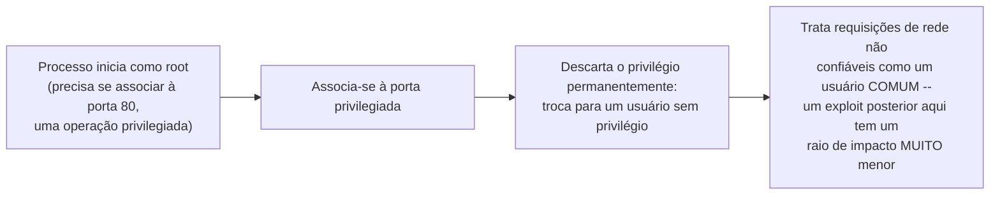

## Objetivos de Aprendizagem

- Enunciar com precisão o princípio do menor privilégio: dar a um processo em execução o acesso mínimo de que ele precisa para fazer o seu trabalho, e nada mais.
- Descrever três mecanismos de sandboxing reais e concretos de Unix/Linux (`chroot`, `seccomp`, descarte de privilégios `setuid`) como aplicações, em granularidades diferentes, do mesmo princípio subjacente.
- Explicar por que "raio de impacto pequeno por projeto" é uma postura de segurança fundamentalmente diferente (e mais forte) do que "torcer para que nada dê errado".
- Conectar o sandboxing ao conceito de containers do bloco de virtualização desta disciplina, e aos conceitos de ACL/capabilities recém-cobertos, como aplicações complementares do mesmo tema de restrição de acesso.

## Contexto e Motivação

Os dois conceitos anteriores desenvolveram dois modelos teóricos diferentes (listas de controle de acesso e capabilities) para decidir o que um processo pode fazer. Este conceito se volta para uma pergunta mais prática e operacional que administradores de sistemas e desenvolvedores reais enfrentam o tempo todo: dado que um processo, por mais cuidadosamente escrito, pode conter um bug, ou pode ser comprometido por um atacante explorando uma vulnerabilidade que a disciplina `security-cryptography` desta plataforma já catalogou, quanto dano esse único processo comprometido consegue de fato causar ao resto do sistema?

O princípio do menor privilégio responde isso com uma postura de projeto, não com um mecanismo isolado: restringir deliberadamente todo processo em execução ao menor conjunto de permissões, arquivos e capacidades de sistema de que ele genuinamente precisa para o seu trabalho real, para que, se ele algum dia for comprometido (não "se formos descuidados", mas "quando, inevitavelmente, algum bug ou vulnerabilidade for explorado"), o raio de impacto do comprometimento seja pequeno por projeto, e não meramente por sorte. Este conceito percorre três mecanismos reais e concretos de Unix/Linux que aplicam este mesmo princípio em granularidades diferentes, amarrando o bloco de virtualização desta disciplina (containers) e os próprios conceitos de ACL e capabilities deste bloco como instâncias complementares da mesmíssima ideia subjacente.

## Teoria Central

### O princípio, enunciado com precisão

O princípio do menor privilégio sustenta que todo processo, usuário ou componente de um sistema deve operar com o conjunto mínimo de permissões necessário para completar a sua função pretendida, e nada mais: não "reduzido em algum momento", não "restringido depois de um incidente", mas deliberada e estruturalmente minimizado desde o momento em que o processo inicia. Esta é uma filosofia de projeto que aparece em sistemas reais de muitas formas concretas diferentes, três das quais este conceito desenvolve: restringir qual parte do sistema de arquivos um processo sequer consegue ver (`chroot`), restringir quais chamadas de sistema um processo sequer tem permissão de tentar (`seccomp`) e restringir qual identidade de usuário, e as permissões associadas a ela, um processo retém depois que não precisa mais de privilégio elevado (descartar `setuid`).

### `chroot`: restringindo o sistema de arquivos visível

`chroot` (change root) é uma chamada de sistema que muda o que um processo (e todo processo que ele criar em seguida) percebe como a raiz (`/`) do sistema de arquivos inteiro, confinando-o a uma subárvore específica e tornando tudo fora dessa subárvore inteiramente invisível e inalcançável por meio de acesso comum a arquivos baseado em caminhos, mesmo que os arquivos subjacentes genuinamente existam em outro lugar do mesmo disco. Um serviço de rede que só precisa ler e escrever numa árvore de diretórios específica (um servidor web servindo arquivos estáticos de `/var/www`, por exemplo) ganha uma proteção real e concreta do `chroot`: mesmo que esse serviço seja comprometido via alguma vulnerabilidade, a capacidade de um atacante de ler ou escrever arquivos arbitrários em outros lugares do sistema (arquivos de configuração, dados de outros usuários, binários do sistema) fica fortemente restrita, porque esses caminhos simplesmente não existem do ponto de vista restrito do próprio processo comprometido.

### `seccomp`: restringindo quais chamadas de sistema são sequer alcançáveis

Onde o `chroot` restringe *quais arquivos* um processo pode ver, o `seccomp` (secure computing mode) restringe *quais chamadas de sistema* um processo sequer tem permissão de tentar, instalando um filtro imposto pelo kernel (comumente expresso como uma allowlist explícita de números de syscall permitidos) que o kernel consulta antes de despachar qualquer chamada de sistema que o conceito anterior desta disciplina já cobriu. Uma syscall tentada que não esteja na allowlist é rejeitada (ou o processo é terminado na hora) antes que o despacho de fato pela tabela de syscalls do kernel sequer rode. Esta é uma restrição genuinamente diferente, e frequentemente mais forte, que o controle de acesso no nível de arquivos: um processo comprometido por um atacante que ganhou execução de código arbitrário dentro dele ainda não consegue, por exemplo, chamar `execve()` para abrir um shell, ou abrir um socket de rede bruto, se essas syscalls específicas nunca estiveram na allowlist desse processo, para começo de conversa. Isso restringe as opções do atacante estruturalmente, na exata fronteira do kernel que o conceito anterior sobre a anatomia de syscalls desta disciplina já estabeleceu como a única porta de entrada para qualquer serviço do kernel.

### Descartando o privilégio `setuid`: restringindo a identidade elevada só a quando ela é necessária

Alguns programas Unix legítimos genuinamente precisam de privilégio elevado (frequentemente root) por um breve momento (um programa que se associa a uma porta de rede de número baixo, uma operação privilegiada, ou que precisa ler um arquivo de senhas do sistema na inicialização), mas não precisam desse privilégio elevado durante todo o restante da sua execução. O mecanismo `setuid` permite a um programa assim começar com privilégio elevado, realizar a única operação específica que genuinamente o exige, e então descartar esse privilégio de forma permanente e irrevogável (trocando para uma identidade de usuário comum e sem privilégio pelo resto da sua vida) antes de fazer qualquer outra coisa, especialmente antes de processar qualquer entrada não confiável vinda de uma conexão de rede ou de um arquivo que ele mesmo não criou. Um exemplo real e amplamente citado: muitos daemons de rede se associam à sua porta privilegiada ainda rodando como root, e então imediatamente chamam uma chamada de sistema de descarte de privilégio para se tornarem um usuário sem privilégio para todo o tratamento de requisições seguinte, de modo que uma vulnerabilidade explorada depois, durante o tratamento de uma requisição de rede real, compromete apenas um processo sem privilégio, e não um que ainda detém root.



### Raio de impacto por projeto, não por sorte

O tema unificador dos três mecanismos (e dos containers e dos modelos de ACL/capabilities que este bloco já cobriu) é uma postura de segurança específica: presumir que o comprometimento vai acabar acontecendo com algum processo, em algum lugar, e projetar o sistema para que as consequências de qualquer comprometimento isolado sejam estrutural e mecanicamente limitadas de antemão, em vez de depender da esperança de que nenhuma vulnerabilidade jamais seja explorada. Um serviço de rede confinado por `chroot`, filtrado por `seccomp` e com privilégio descartado que for comprometido ainda pode causar dano, mas só dentro do escopo estreito e deliberadamente restrito que continua disponível para ele, e esse é justamente o ponto: "raio de impacto pequeno por projeto" degrada graciosamente sob a suposição de falha eventual, enquanto "torcer para que nada dê errado" não degrada de forma alguma; ele simplesmente falha por completo, na primeira vez que uma suposição se revelar errada.

## Exemplos Resolvidos

### Exemplo 1: Um serviço confinado por `chroot`, concretamente

```text
Sistema de arquivos real (como o host o vê):
  /etc/passwd
  /home/alice/secrets.txt
  /var/www/index.html
  /var/www/images/logo.png

Processo do servidor web, depois de chroot("/var/www"):
  A sua própria visão de "/" agora é o que o host chama de /var/www.
  Ele consegue acessar:  /index.html, /images/logo.png
  Ele NÃO consegue alcançar /etc/passwd nem /home/alice/secrets.txt --
  esses caminhos simplesmente não existem dentro da sua visão restrita,
  mesmo que o processo esteja totalmente comprometido e rodando código
  arbitrário fornecido pelo atacante.
```

### Exemplo 2: Uma allowlist de `seccomp`, concretamente

```text
Filtro seccomp instalado por um serviço de processamento de imagens em sandbox:
  PERMITIDAS:  read, write, mmap, exit
  TODO O RESTO: rejeitado (processo morto na tentativa)

O atacante consegue execução de código arbitrário dentro deste processo
(ex.: via um bug de segurança de memória numa biblioteca de parsing de
imagens) e tenta:
  execve("/bin/sh", ...)   -> REJEITADA, processo morto imediatamente
                              (execve não está na allowlist)

O código do atacante AINDA consegue chamar read/write/mmap livremente
(essas continuam permitidas, já que o serviço genuinamente precisa delas
para o seu trabalho) -- a sandbox não elimina o comprometimento, mas
restringe fortemente o que o processo comprometido consegue de fato
realizar depois.
```

### Exemplo 3: Descarte de privilégio, rastreado na inicialização de um daemon concreto

```text
1. O processo inicia como root (uid=0).
2. bind(80) -- dá certo, porque associar-se a uma porta abaixo de 1024
   exige privilégio de root em sistemas tipo Unix reais.
3. O processo chama setuid(unprivileged_uid) -- troca PERMANENTEMENTE
   para uma identidade sem privilégio; não há caminho de volta para root
   a partir daqui, por projeto.
4. O processo agora trata requisições de rede recebidas como o usuário
   sem privilégio.

Se uma vulnerabilidade no código de tratamento de requisições do passo 4
for explorada depois: o atacante ganha o controle de um processo rodando
como um usuário SEM PRIVILÉGIO, e não como root -- um raio de impacto
categoricamente menor do que se o privilégio nunca tivesse sido
descartado depois do passo 2.
```

## Equívocos Comuns e Armadilhas

- **"O `chroot` é uma fronteira de segurança forte e completa, equivalente ao isolamento de um container."** O `chroot` restringe apenas a visibilidade de caminhos do sistema de arquivos; ele não isola IDs de processo, interfaces de rede nem consumo de recursos como fazem os namespaces e cgroups por trás de containers reais. Um processo pode, em algumas configurações, ainda escapar de um `chroot` configurado de forma ingênua por meio de outras interfaces do kernel às quais ele continua tendo acesso.
- **"Uma allowlist de `seccomp` elimina a possibilidade de uma vulnerabilidade de segurança ser explorada."** Ela restringe o que um processo explorado com sucesso consegue FAZER depois, e não se uma vulnerabilidade pode ser explorada, para começo de conversa. Um processo comprometido continua comprometido; as suas capacidades simplesmente ficam, de forma deliberada, muito mais estreitas depois.
- **"Descartar privilégio com `setuid` é um endurecimento opcional, e não algo de que um programa privilegiado corretamente escrito de fato precise."** Qualquer programa que legitimamente precise de privilégio elevado só brevemente, na inicialização, e que depois processe entrada não confiável, deveria descartar esse privilégio permanentemente antes de tratar essa entrada. Reter privilégio desnecessário durante toda a vida de um programa é precisamente o oposto do menor privilégio, independentemente de quão cuidadosamente o restante do código seja escrito.
- **"Estes três mecanismos são redundantes entre si, então um sistema bem projetado só precisa de um."** Eles restringem coisas diferentes (visibilidade do sistema de arquivos, chamadas de sistema alcançáveis e retenção de identidade elevada, respectivamente) e são comumente combinados em sistemas de produção reais justamente porque cada um fecha uma via diferente e independente de dano potencial.

## Resumo

O princípio do menor privilégio sustenta que todo processo deve rodar com as permissões mínimas que o seu trabalho real exige, de forma deliberada e estrutural, e não meramente como algo secundário. Este conceito percorreu três mecanismos reais e concretos de Unix/Linux que aplicam esse princípio em granularidades diferentes: o `chroot` restringe qual parte do sistema de arquivos um processo sequer consegue ver; o `seccomp` restringe quais chamadas de sistema um processo sequer tem permissão de tentar, imposto na mesma fronteira do kernel que os conceitos anteriores de syscalls desta disciplina já estabeleceram; e descartar o privilégio `setuid` restringe por quanto tempo um processo retém uma identidade elevada, idealmente só pela breve janela em que ele genuinamente precisa de uma. Os três, junto com o conceito de containers desta disciplina e os modelos de ACL e capabilities deste bloco, expressam a mesma postura de segurança subjacente: projetar todo componente do sistema para que as consequências de um comprometimento sejam estruturalmente limitadas de antemão (raio de impacto pequeno por projeto) em vez de torcer para que nenhuma vulnerabilidade jamais seja explorada com sucesso.

## Documentation Links

- [OSTEP: Access Control](https://pages.cs.wisc.edu/~remzi/OSTEP/security-access.pdf): cobre os mecanismos de sandboxing por menor privilégio ao lado dos modelos de ACL e capabilities que este bloco desenvolve.
- [UC Berkeley CS162: Course Schedule](https://cs162.org/): contexto sobre os mecanismos de processos e syscalls que o `seccomp` e o descarte de privilégio restringem diretamente.
