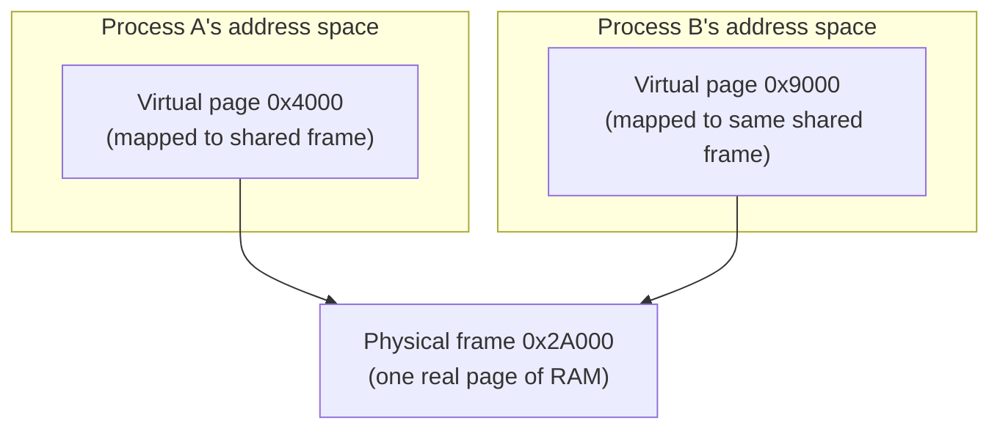

## Learning Objectives

- Explain how shared memory lets two otherwise-isolated processes see the same physical page mapped into each of their own address spaces.
- Contrast shared memory's zero-copy access with a pipe's kernel-mediated `read`/`write` copying, and state precisely why shared memory is faster.
- Explain why shared memory, uniquely among this cluster's mechanisms, provides no synchronization of its own, and what the two cooperating processes must supply themselves.
- Connect this concept back to `operating-systems-i`'s address-space and locking/semaphore material, framing shared memory as reusing both rather than inventing new mechanisms.

## Context & Motivation

The previous concept's pipe moves every byte of data through the kernel: a writer's `write()` copies data into a kernel buffer, and a reader's `read()` copies it back out — two copies, and two system calls, for every byte transferred. For small, occasional messages this overhead is irrelevant; for large volumes of data exchanged frequently between cooperating processes (video frames handed from a decoder process to a renderer process, or rows of data streamed between stages of a data-processing pipeline), the copying cost becomes the dominant expense.

Shared memory IPC removes this cost entirely, by making the kernel map the *exact same physical page* into both processes' address spaces simultaneously. Once set up, no further system call is needed to exchange data — one process writes a value, and the other can read it directly with an ordinary memory access, exactly as if it were a local variable. This is the fastest IPC mechanism available on any real system, precisely because the kernel gets out of the way after the initial setup — but that same absence of kernel mediation on every access is also, as this concept develops, exactly what shared memory does not provide for free: coordination.

## Core Theory

### The same physical page, two virtual addresses

`operating-systems-i` established that a process's address space is built from a page table mapping that process's own virtual addresses to physical frames, and that this mapping is precisely what keeps one process's memory invisible to another's by default. Shared memory does not bypass this mechanism — it uses it deliberately, in reverse. The kernel allocates one physical frame and inserts an entry for it into *both* processes' page tables, each process's entry pointing at the very same physical memory but potentially at a different virtual address in each process's own address space. From the CPU's perspective, when either process reads or writes that virtual address, ordinary address translation resolves it straight to the shared physical frame — there is no special instruction, no trap, and no kernel involvement at all in the actual read or write, only in the initial setup that created the shared mapping.



Both processes can use different virtual addresses for the same underlying memory, since address translation, not the virtual address itself, is what determines which physical frame an access actually reaches.

### Why this is faster: zero-copy access after setup

A pipe's every transfer costs (at minimum) one `write()` system call, one kernel-space copy into the pipe buffer, one `read()` system call, and one kernel-space copy out — four expensive operations for every message, each involving the trap machinery this discipline's first cluster covered in detail. Shared memory pays a one-time setup cost (the system calls needed to create and map the shared region) and then costs nothing further per access: reading or writing the shared page is an ordinary memory instruction, exactly as cheap as touching any of the process's own private memory, with zero system calls and zero kernel-mediated copying on the hot path.

### The tradeoff: no synchronization comes for free

A pipe's kernel-mediated design has one significant, if easily overlooked, side benefit: because the kernel touches every byte, it can naturally enforce ordering and blocking (a reader blocks until data exists; a writer blocks until there is room) as part of the mechanism itself. Shared memory offers none of this. If Process A writes a value to the shared page and Process B happens to read that same location a moment before the write completes, B simply sees whatever was there before — stale data, not an error, not a block, nothing to signal that a write was in progress. Two processes sharing memory without any additional coordination is exactly the same hazard `operating-systems-i`'s concurrency cluster covered for threads sharing an address space within a single process — a race condition — except now it spans two entirely separate processes instead of two threads within one.

The fix is exactly the same tool this discipline already built: a semaphore (or, less commonly across process boundaries, a lock built on the same atomic hardware primitives) placed *inside* the shared memory region itself, so both processes can see and manipulate the very same synchronization object. A producer process acquires the semaphore, writes its data, then signals a second semaphore to tell the consumer data is ready; the consumer waits on that second semaphore before reading, then signals the first to let the producer proceed again. Nothing about this is new synchronization theory — it is the identical mechanism `operating-systems-i` developed for threads within one process, now applied across the process boundary because the semaphore itself lives in the one region of memory both processes can actually see.

### When shared memory is (and isn't) the right choice

Shared memory is the right tool when the volume of data exchanged is large and the exchange is frequent enough that per-message system-call and copying overhead would dominate — real examples include a video-decoding pipeline handing frame buffers to a renderer, or a database's buffer cache shared across multiple worker processes. It is the wrong tool when messages are small, infrequent, or when the two cooperating processes would benefit from the kernel automatically enforcing structure and ordering — cases the next concept, message queues, is built for instead.

## Worked Examples

### Example 1: Setting up shared memory and coordinating access, in outline

```c
// Setup (once, before the actual data exchange begins):
int shm_fd = shm_open("/frame_buffer", O_CREAT | O_RDWR, 0666);
ftruncate(shm_fd, FRAME_SIZE);
void *shared = mmap(NULL, FRAME_SIZE, PROT_READ | PROT_WRITE,
                     MAP_SHARED, shm_fd, 0);
// `shared` now points at the same physical memory in both processes,
// though at whatever virtual address each process's own mmap() returned.

sem_t *data_ready = /* a semaphore, itself placed in shared memory */;
sem_t *buffer_free = /* likewise */;

// Producer process:
sem_wait(buffer_free);
memcpy(shared, new_frame, FRAME_SIZE);   // ordinary memory write
sem_post(data_ready);

// Consumer process:
sem_wait(data_ready);
render(shared, FRAME_SIZE);              // ordinary memory read
sem_post(buffer_free);
```

Note that once `shared` is mapped, the actual data transfer (`memcpy`/`render`) is an ordinary memory operation — no system call, no kernel involvement, on the hot path.

### Example 2: A concrete race, without synchronization

```text
t=0   Producer begins writing a 4 KB frame into shared memory.
t=1   Producer has written 1 KB so far (not yet complete).
t=1   Consumer, with no signal telling it to wait, reads the
      shared region right now.
t=1   Consumer sees: 1 KB of the NEW frame, 3 KB of the OLD frame
      -- a corrupted, half-old-half-new frame, with no error raised
      anywhere, because shared memory itself enforces nothing.
```

Nothing crashes, nothing is flagged — the corruption is silent, which is exactly why unsynchronized shared memory is dangerous rather than merely slow.

### Example 3: Pipe versus shared memory, a concrete cost comparison

```text
Transferring 1 MB, 1000 times, between two processes:

Pipe:            1000 x (write() syscall + kernel copy in
                          + read() syscall + kernel copy out)
                  = 4000 expensive operations total

Shared memory:    1 x (mmap() setup, one-time)
                  + 1000 x (ordinary memcpy, zero syscalls)
                  = 1 expensive setup + 1000 cheap memory copies
```

The comparison is not "shared memory has no cost" — copying 1 MB still takes real time — but that shared memory eliminates the syscall and kernel-mediated-copy overhead pipes pay on every single transfer, not just once.

## Common Misconceptions & Pitfalls

- **"Shared memory means the kernel copies data between the two processes' memory."** The kernel never copies the actual data at all after setup — it maps one physical page into both address spaces once, and every subsequent access is an ordinary, kernel-free memory operation on both sides.
- **"Shared memory automatically handles ordering, the same way a pipe does."** It provides none — two processes accessing the same shared region without their own explicit synchronization (semaphores, typically placed inside the shared region itself) can race exactly like unsynchronized threads within one process.
- **"Since shared memory is faster, it should replace pipes for all IPC."** It is faster only for large, frequent transfers where per-message overhead dominates; for small or infrequent messages, the added complexity of managing synchronization objects yourself outweighs the saved system-call cost a pipe would have incurred anyway.
- **"The two processes must use the exact same virtual address for the shared page."** They do not — each process's own `mmap()` call can return a different virtual address; what matters is that both virtual addresses resolve, via each process's own page table, to the same physical frame.

## Summary

Shared memory IPC lets the kernel map one physical page into two otherwise-isolated processes' address spaces, giving both direct, zero-copy access to the same underlying bytes after a one-time setup cost — the fastest IPC mechanism available, because ordinary reads and writes to the shared region involve no system call and no kernel-mediated copying at all, unlike a pipe's per-message kernel-buffered transfer. This speed comes at the cost of synchronization: unlike a pipe, shared memory enforces no ordering or blocking of its own, so two processes accessing it without explicit coordination can race exactly like unsynchronized threads within a single process. The fix reuses `operating-systems-i`'s existing semaphore mechanism unchanged, simply placing the semaphore itself inside the shared region so both processes can see and manipulate it — new use of an old tool, not new synchronization theory.

## Documentation Links

- [OSTEP — Address Spaces](https://pages.cs.wisc.edu/~remzi/OSTEP/vm-intro.pdf) — the address-space and page-table mapping mechanism this concept reuses to create a shared mapping.
- [UC Berkeley CS162 — Course Schedule](https://cs162.org/) — covers shared memory alongside pipes and sockets as this cluster's IPC mechanisms.
