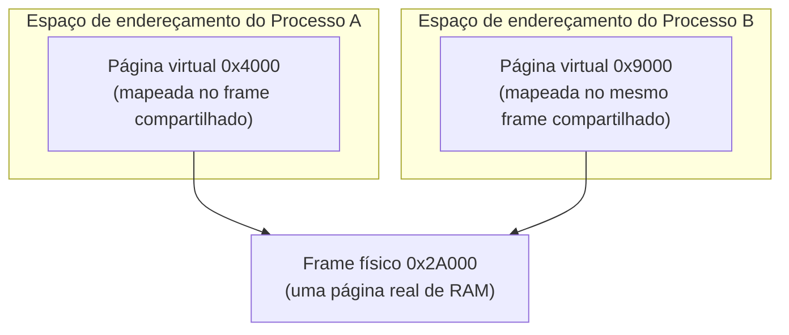

## Objetivos de Aprendizagem

- Explicar como a memória compartilhada permite a dois processos de resto isolados verem a mesma página física mapeada em cada um dos seus próprios espaços de endereçamento.
- Contrastar o acesso sem cópia da memória compartilhada com a cópia mediada pelo kernel via `read`/`write` de um pipe, e enunciar com precisão por que a memória compartilhada é mais rápida.
- Explicar por que a memória compartilhada, de forma única entre os mecanismos deste bloco, não fornece nenhuma sincronização própria, e o que os dois processos cooperantes precisam fornecer por conta própria.
- Conectar este conceito ao material de espaço de endereçamento e de locks/semáforos de `operating-systems-i`, enquadrando a memória compartilhada como reutilização de ambos em vez de invenção de novos mecanismos.

## Contexto e Motivação

O pipe do conceito anterior move cada byte de dados através do kernel: o `write()` de um escritor copia os dados para um buffer do kernel, e o `read()` de um leitor os copia de volta para fora. São duas cópias e duas chamadas de sistema para cada byte transferido. Para mensagens pequenas e ocasionais esse overhead é irrelevante; para grandes volumes de dados trocados com frequência entre processos cooperantes (frames de vídeo entregues de um processo decodificador para um processo renderizador, ou linhas de dados transmitidas entre estágios de um pipeline de processamento de dados), o custo de cópia se torna a despesa dominante.

A IPC por memória compartilhada remove esse custo inteiramente, fazendo o kernel mapear *exatamente a mesma página física* nos espaços de endereçamento dos dois processos simultaneamente. Uma vez configurada, nenhuma chamada de sistema adicional é necessária para trocar dados: um processo escreve um valor, e o outro pode lê-lo diretamente com um acesso comum à memória, exatamente como se fosse uma variável local. Este é o mecanismo de IPC mais rápido disponível em qualquer sistema real, justamente porque o kernel sai do caminho depois da configuração inicial, mas essa mesma ausência de mediação do kernel a cada acesso é também, como este conceito desenvolve, exatamente o que a memória compartilhada não fornece de graça: coordenação.

## Teoria Central

### A mesma página física, dois endereços virtuais

`operating-systems-i` estabeleceu que o espaço de endereçamento de um processo é construído a partir de uma tabela de páginas que mapeia os endereços virtuais desse processo para frames físicos, e que esse mapeamento é precisamente o que mantém a memória de um processo invisível para outro por padrão. A memória compartilhada não contorna esse mecanismo; ela o usa deliberadamente, ao contrário. O kernel aloca um frame físico e insere uma entrada para ele nas tabelas de páginas *dos dois* processos, com a entrada de cada processo apontando para a mesmíssima memória física, mas potencialmente num endereço virtual diferente no espaço de endereçamento de cada processo. Da perspectiva da CPU, quando qualquer um dos processos lê ou escreve aquele endereço virtual, a tradução de endereços comum o resolve direto para o frame físico compartilhado: não há instrução especial, nem trap, nem envolvimento algum do kernel na leitura ou escrita de fato, apenas na configuração inicial que criou o mapeamento compartilhado.



Os dois processos podem usar endereços virtuais diferentes para a mesma memória subjacente, já que é a tradução de endereços, e não o próprio endereço virtual, que determina qual frame físico um acesso de fato alcança.

### Por que isto é mais rápido: acesso sem cópia depois da configuração

Cada transferência de um pipe custa (no mínimo) uma chamada de sistema `write()`, uma cópia em espaço de kernel para dentro do buffer do pipe, uma chamada de sistema `read()` e uma cópia em espaço de kernel para fora: quatro operações caras para cada mensagem, cada uma envolvendo a maquinaria de trap que o primeiro bloco desta disciplina cobriu em detalhe. A memória compartilhada paga um custo único de configuração (as chamadas de sistema necessárias para criar e mapear a região compartilhada) e depois não custa mais nada por acesso: ler ou escrever a página compartilhada é uma instrução de memória comum, exatamente tão barata quanto tocar qualquer memória privada do próprio processo, com zero chamadas de sistema e zero cópias mediadas pelo kernel no caminho crítico.

### O trade-off: nenhuma sincronização vem de graça

O projeto mediado pelo kernel de um pipe tem um benefício colateral significativo, embora fácil de ignorar: como o kernel toca cada byte, ele consegue impor naturalmente ordem e bloqueio (um leitor bloqueia até que existam dados; um escritor bloqueia até que haja espaço) como parte do próprio mecanismo. A memória compartilhada não oferece nada disso. Se o Processo A escreve um valor na página compartilhada e o Processo B calha de ler essa mesma posição um instante antes de a escrita completar, B simplesmente vê o que quer que estivesse lá antes: dados velhos, não um erro, não um bloqueio, nada que sinalize que uma escrita estava em andamento. Dois processos compartilhando memória sem nenhuma coordenação adicional é exatamente o mesmo risco que o bloco de concorrência de `operating-systems-i` cobriu para threads compartilhando um espaço de endereçamento dentro de um único processo (uma condição de corrida), só que agora abrangendo dois processos inteiramente separados em vez de duas threads dentro de um.

A correção é exatamente a mesma ferramenta que esta disciplina já construiu: um semáforo (ou, menos comumente entre fronteiras de processo, um lock construído sobre as mesmas primitivas atômicas de hardware) colocado *dentro* da própria região de memória compartilhada, para que os dois processos possam ver e manipular o mesmíssimo objeto de sincronização. Um processo produtor adquire o semáforo, escreve os seus dados, e depois sinaliza um segundo semáforo para dizer ao consumidor que os dados estão prontos; o consumidor espera nesse segundo semáforo antes de ler, e depois sinaliza o primeiro para deixar o produtor prosseguir de novo. Nada disso é teoria de sincronização nova: é o mecanismo idêntico que `operating-systems-i` desenvolveu para threads dentro de um processo, agora aplicado através da fronteira de processo porque o próprio semáforo vive na única região de memória que os dois processos de fato conseguem ver.

### Quando a memória compartilhada é (e não é) a escolha certa

A memória compartilhada é a ferramenta certa quando o volume de dados trocados é grande e a troca é frequente o suficiente para que o overhead de chamada de sistema e cópia por mensagem dominasse. Exemplos reais incluem um pipeline de decodificação de vídeo entregando buffers de frame a um renderizador, ou o buffer cache de um banco de dados compartilhado entre múltiplos processos trabalhadores. Ela é a ferramenta errada quando as mensagens são pequenas, infrequentes, ou quando os dois processos cooperantes se beneficiariam de o kernel impor automaticamente estrutura e ordem, casos para os quais o próximo conceito, filas de mensagens, é construído.

## Exemplos Resolvidos

### Exemplo 1: Configurando memória compartilhada e coordenando o acesso, em linhas gerais

```c
// Configuração (uma vez, antes que a troca de dados de fato comece):
int shm_fd = shm_open("/frame_buffer", O_CREAT | O_RDWR, 0666);
ftruncate(shm_fd, FRAME_SIZE);
void *shared = mmap(NULL, FRAME_SIZE, PROT_READ | PROT_WRITE,
                     MAP_SHARED, shm_fd, 0);
// `shared` agora aponta para a mesma memória física nos dois processos,
// embora no endereço virtual que o próprio mmap() de cada processo retornou.

sem_t *data_ready = /* um semáforo, ele próprio colocado na memória compartilhada */;
sem_t *buffer_free = /* idem */;

// Processo produtor:
sem_wait(buffer_free);
memcpy(shared, new_frame, FRAME_SIZE);   // escrita comum na memória
sem_post(data_ready);

// Processo consumidor:
sem_wait(data_ready);
render(shared, FRAME_SIZE);              // leitura comum da memória
sem_post(buffer_free);
```

Note que, uma vez que `shared` está mapeado, a transferência de dados de fato (`memcpy`/`render`) é uma operação comum de memória: nenhuma chamada de sistema, nenhum envolvimento do kernel, no caminho crítico.

### Exemplo 2: Uma corrida concreta, sem sincronização

```text
t=0   Produtor começa a escrever um frame de 4 KB na memória compartilhada.
t=1   Produtor escreveu 1 KB até agora (ainda não completo).
t=1   Consumidor, sem nenhum sinal dizendo para esperar, lê a
      região compartilhada neste exato momento.
t=1   Consumidor vê: 1 KB do frame NOVO, 3 KB do frame VELHO
      -- um frame corrompido, metade velho metade novo, sem nenhum erro
      levantado em lugar algum, porque a memória compartilhada em si não impõe nada.
```

Nada trava, nada é sinalizado: a corrupção é silenciosa, e é exatamente por isso que a memória compartilhada sem sincronização é perigosa, e não meramente lenta.

### Exemplo 3: Pipe versus memória compartilhada, uma comparação de custo concreta

```text
Transferindo 1 MB, 1000 vezes, entre dois processos:

Pipe:                 1000 x (syscall write() + cópia no kernel para dentro
                               + syscall read() + cópia no kernel para fora)
                       = 4000 operações caras no total

Memória compartilhada: 1 x (configuração com mmap(), uma vez)
                       + 1000 x (memcpy comum, zero syscalls)
                       = 1 configuração cara + 1000 cópias baratas em memória
```

A comparação não é "a memória compartilhada não tem custo" (copiar 1 MB ainda leva tempo real), mas sim que a memória compartilhada elimina o overhead de syscall e de cópia mediada pelo kernel que os pipes pagam em cada transferência, e não só uma vez.

## Equívocos Comuns e Armadilhas

- **"Memória compartilhada significa que o kernel copia dados entre as memórias dos dois processos."** O kernel nunca copia os dados de fato depois da configuração: ele mapeia uma página física nos dois espaços de endereçamento uma vez, e todo acesso seguinte é uma operação de memória comum, sem kernel, dos dois lados.
- **"A memória compartilhada trata a ordem automaticamente, do mesmo jeito que um pipe."** Ela não fornece nenhuma: dois processos acessando a mesma região compartilhada sem a sua própria sincronização explícita (semáforos, tipicamente colocados dentro da própria região compartilhada) podem entrar em corrida exatamente como threads não sincronizadas dentro de um processo.
- **"Como a memória compartilhada é mais rápida, ela deveria substituir os pipes para toda IPC."** Ela só é mais rápida para transferências grandes e frequentes em que o overhead por mensagem domina; para mensagens pequenas ou infrequentes, a complexidade adicional de gerenciar você mesmo os objetos de sincronização supera o custo de syscall economizado que um pipe teria tido de qualquer jeito.
- **"Os dois processos precisam usar exatamente o mesmo endereço virtual para a página compartilhada."** Não precisam: a chamada `mmap()` de cada processo pode retornar um endereço virtual diferente; o que importa é que os dois endereços virtuais se resolvam, via a tabela de páginas de cada processo, para o mesmo frame físico.

## Resumo

A IPC por memória compartilhada permite ao kernel mapear uma página física nos espaços de endereçamento de dois processos de resto isolados, dando aos dois acesso direto e sem cópia aos mesmos bytes subjacentes depois de um custo único de configuração. É o mecanismo de IPC mais rápido disponível, porque leituras e escritas comuns na região compartilhada não envolvem nenhuma chamada de sistema nem nenhuma cópia mediada pelo kernel, ao contrário da transferência bufferizada no kernel por mensagem de um pipe. Essa velocidade tem o custo da sincronização: diferente de um pipe, a memória compartilhada não impõe ordem nem bloqueio próprios, então dois processos acessando-a sem coordenação explícita podem entrar em corrida exatamente como threads não sincronizadas dentro de um único processo. A correção reutiliza sem mudanças o mecanismo de semáforo existente de `operating-systems-i`, simplesmente colocando o próprio semáforo dentro da região compartilhada para que os dois processos possam vê-lo e manipulá-lo: um uso novo de uma ferramenta antiga, não uma teoria de sincronização nova.

## Documentation Links

- [OSTEP: Address Spaces](https://pages.cs.wisc.edu/~remzi/OSTEP/vm-intro.pdf): o mecanismo de espaço de endereçamento e de mapeamento por tabela de páginas que este conceito reutiliza para criar um mapeamento compartilhado.
- [UC Berkeley CS162: Course Schedule](https://cs162.org/): cobre a memória compartilhada ao lado de pipes e sockets como os mecanismos de IPC deste bloco.
