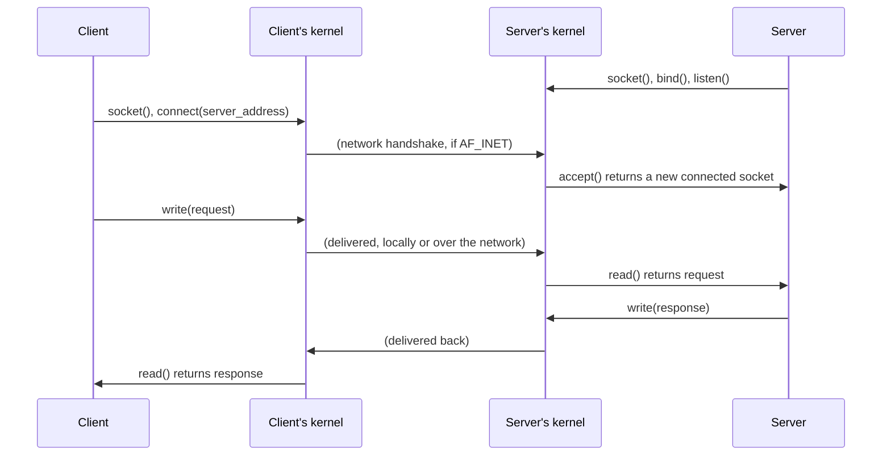

## Learning Objectives

- Explain how the Berkeley sockets API presents local (same-machine) and remote (cross-machine) communication through the exact same `read`/`write`-style interface.
- Describe a socket's address structure (address family, address, port) and how it generalizes "which process should receive this" beyond a single machine's process table.
- Trace a minimal client/server socket exchange, naming each system call in the correct order on each side.
- State explicitly what this concept sets up but does not develop — the actual network stack a future networking discipline covers — and why sockets are still an OS-level IPC concept, not a networking one.

## Context & Motivation

Every IPC mechanism this cluster has covered so far — pipes, shared memory, message queues — shares one restriction this concept finally removes: all three only work between processes on the *same machine*, communicating through *kernel-internal* state (a pipe buffer, a shared physical page, a queue) that has no meaning outside that one machine's kernel. Real distributed systems, though, routinely need one process to communicate with another running on an entirely different physical computer, potentially thousands of miles away, with no shared kernel at all.

The socket is the abstraction that makes this possible while changing almost nothing about how a programmer actually uses it: reading from and writing to a socket uses the exact same `read()`/`write()` system calls (or a close, deliberately similar variant, `send()`/`recv()`) already used for pipes and ordinary files. This uniformity is the entire point — a program written to communicate over a socket does not need to know or care whether the process on the other end is running in the very same machine or on the far side of the internet; the kernel and, beneath it, the actual network hardware and protocols handle that distinction entirely transparently. This concept is deliberately the last one in this cluster, and deliberately scoped narrowly: it establishes the socket abstraction itself, as one more OS-level IPC mechanism, and explicitly leaves the actual mechanics of how bytes cross a real network — addressing, routing, reliable delivery — to a dedicated networking discipline this platform has not yet published.

## Core Theory

### The socket address: generalizing "which process" beyond one machine's process table

Every IPC mechanism so far identifies its destination in a way that only makes sense on a single machine: a pipe's file descriptor, a shared-memory region's name, a message queue's identifier — all are meaningless outside the one kernel that created them. A socket instead identifies its destination with a socket address, a structure that names an address family (most commonly `AF_UNIX` for same-machine communication, or `AF_INET`/`AF_INET6` for network communication), a numeric address within that family (a filesystem path for `AF_UNIX`, an IP address for `AF_INET`), and a port number distinguishing which specific listening process on that address should receive the connection, since one machine can run many different network services simultaneously. This structure is precisely what lets the *same* socket API describe both a purely local IPC channel (`AF_UNIX`, identified by a filesystem path — commonly used, for instance, between a database server and clients on the same machine, faster than a full network round-trip for same-machine traffic) and a genuinely remote one (`AF_INET`, identified by an IP address and port).

### The uniform interface: `read`/`write`, regardless of what's on the other end

Once a socket is connected — however that connection was actually established — a program interacts with it using the same interface already familiar from every other file descriptor in this discipline: `write()` sends data, `read()` receives it (or the closely related `send()`/`recv()`, which add a few socket-specific options but behave the same way at their core). This is a deliberate design choice, not an accident: it means code written to communicate over a Unix-domain socket (same machine) can very often be adapted to communicate over a TCP socket (different machine) with nothing more than a change to how the socket was originally created and connected — the actual send/receive logic in the body of the program does not need to change at all.



### The server side: `bind`, `listen`, `accept` — a genuinely new step this cluster hasn't needed before

Unlike a pipe (where both ends already exist the moment `pipe()` returns) or shared memory (where both processes explicitly `mmap()` the same named region), a socket-based server must first announce that it exists and is willing to receive connections, before any client has necessarily started running yet. This requires three additional steps a program using sockets performs that none of this cluster's earlier mechanisms needed: `bind()` associates a socket with a specific local address and port, so clients know exactly where to find it; `listen()` tells the kernel to start queuing incoming connection attempts rather than rejecting them; and `accept()` blocks until a client actually connects, then returns a brand-new, separate connected socket specifically for that one client, leaving the original listening socket free to `accept()` further, entirely separate clients.

### Why this is still an OS concept, not a networking concept

It is tempting to think of sockets as belonging entirely to networking rather than to operating systems, but the socket API itself — the system calls `socket()`, `bind()`, `listen()`, `accept()`, `connect()`, and the `read`/`write` interface used afterward — is precisely the kernel-provided abstraction a program uses, regardless of what happens underneath it. What actually happens underneath — how an IP address is resolved, how packets are routed across intermediate machines, how TCP guarantees reliable, in-order delivery over an inherently unreliable network — is real, substantial material this concept deliberately does not develop, reserved instead for a dedicated computer-networking discipline. This concept's job is narrower and precise: establish that sockets exist as the uniform IPC abstraction spanning "same machine" and "different machine," and that everything a programmer directly interacts with (the system calls, the `read`/`write` interface) is exactly the same regardless of which case actually applies.

## Worked Examples

### Example 1: A minimal client/server exchange, system call by system call

```c
// Server
int listen_fd = socket(AF_INET, SOCK_STREAM, 0);
bind(listen_fd, (struct sockaddr *)&server_addr, sizeof(server_addr));
listen(listen_fd, BACKLOG);
int conn_fd = accept(listen_fd, NULL, NULL);   // blocks until a client connects
char buf[256];
read(conn_fd, buf, sizeof(buf));               // receive the client's request
write(conn_fd, "hello", 5);                    // send a response

// Client
int fd = socket(AF_INET, SOCK_STREAM, 0);
connect(fd, (struct sockaddr *)&server_addr, sizeof(server_addr));
write(fd, "hi", 2);                            // send a request
char buf[256];
read(fd, buf, sizeof(buf));                    // receive the response
```

Note that after `connect()`/`accept()` establish the connection, both sides use the exact same `read`/`write` calls already familiar from pipes and ordinary files.

### Example 2: The same client code, unchanged, against a Unix-domain socket instead

```c
// Only the address family and the address structure's contents change --
// the connect()/read()/write() calls below are IDENTICAL:
int fd = socket(AF_UNIX, SOCK_STREAM, 0);       // was AF_INET
struct sockaddr_un addr;
addr.sun_family = AF_UNIX;
strcpy(addr.sun_path, "/tmp/my_service.sock");  // a filesystem path, not an IP
connect(fd, (struct sockaddr *)&addr, sizeof(addr));
write(fd, "hi", 2);
read(fd, buf, sizeof(buf));
```

This is the concrete demonstration of the uniform-interface claim: switching from same-machine to network communication (or vice versa) changes only the socket's creation and address, never the actual data-exchange logic.

### Example 3: What a socket address structure actually contains, concretely

```text
AF_INET socket address:
  family:  AF_INET
  address: 192.168.1.42       (which machine)
  port:    8080                (which listening service on that machine)

AF_UNIX socket address:
  family:  AF_UNIX
  path:    /var/run/postgresql/.s.PGSQL.5432   (a filesystem path
                                                  identifying the service,
                                                  on THIS machine only)
```

Both structures answer the same underlying question — "which specific process, running where, should receive this?" — using a representation appropriate to whether "where" is this machine or some other one.

## Common Misconceptions & Pitfalls

- **"Sockets are a networking concept, not an operating systems one."** The socket API — the system calls a program actually issues — is provided and enforced by the local kernel exactly like every other IPC mechanism in this cluster; what happens over an actual network (routing, reliable delivery) is separate material this concept deliberately does not develop.
- **"A socket always involves the network, even for `AF_UNIX`."** `AF_UNIX` sockets communicate entirely through kernel-internal state on a single machine, with no network hardware or protocol involved at all — they exist specifically because programmers wanted socket-style code that works for both local and remote cases without a network's overhead when it isn't needed.
- **"`connect()` and `accept()` are the same operation on each side."** `connect()` is what a client calls to initiate a connection to a known address; `accept()` is what a server calls to receive the *next* pending connection a client has initiated — they are complementary, not interchangeable, and only the server side needs the earlier `bind()`/`listen()` setup at all.
- **"Once you understand sockets, you understand how data actually gets across a real network."** This concept establishes the local, kernel-provided abstraction only — how an IP address is resolved, how packets are routed, and how reliable delivery is achieved over an inherently unreliable network are substantial topics reserved for a dedicated computer-networking discipline.

## Summary

The socket is the IPC mechanism that finally crosses this cluster's one shared limitation — every prior mechanism only worked between processes on the same machine — by generalizing "which process should receive this" into a socket address (family, address, port) that can name either a local, same-machine destination (`AF_UNIX`) or a genuinely remote one (`AF_INET`/`AF_INET6`), while keeping the actual data-exchange interface identical to the `read`/`write` calls already familiar from every other file descriptor in this discipline. A socket-based server additionally requires `bind()`, `listen()`, and `accept()` — a genuinely new setup sequence this cluster's other mechanisms didn't need, since a server must announce its willingness to receive connections before any client necessarily exists yet. This concept deliberately stays at the boundary: it establishes sockets as this platform's OS-level IPC abstraction spanning local and remote communication, and explicitly leaves the substantial mechanics of how bytes actually traverse a real network to a dedicated computer-networking discipline.

## Documentation Links

- [UC Berkeley CS162 — Course Schedule](https://cs162.org/) — covers sockets alongside pipes and shared memory as this cluster's IPC mechanisms, explicitly distinguishing the local socket API from the networking material underneath it.
- [MIT 6.S081 — Course Schedule](https://pdos.csail.mit.edu/6.S081/2021/schedule.html) — situates the socket system-call interface within the same kernel-provided abstraction layer as this discipline's other system calls.
