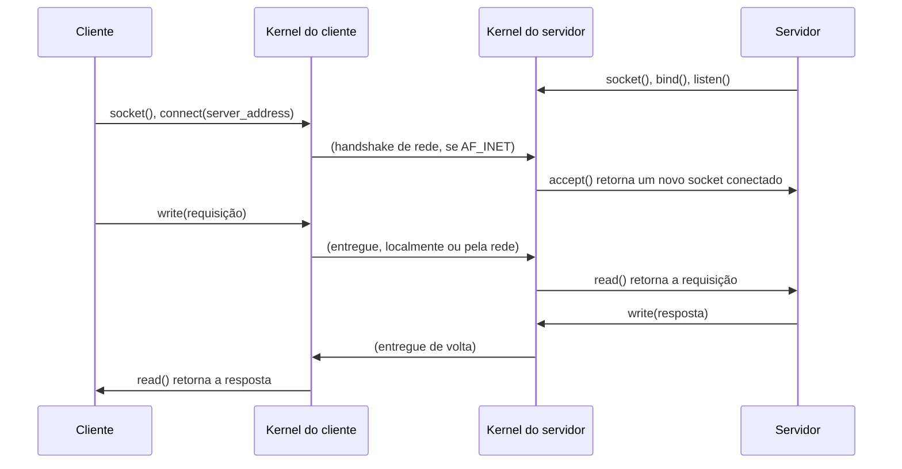

## Objetivos de Aprendizagem

- Explicar como a API de sockets de Berkeley apresenta a comunicação local (mesma máquina) e remota (entre máquinas) pela exatamente mesma interface no estilo `read`/`write`.
- Descrever a estrutura de endereço de um socket (família de endereços, endereço, porta) e como ela generaliza "qual processo deve receber isto" para além da tabela de processos de uma única máquina.
- Rastrear uma troca mínima de cliente/servidor via sockets, nomeando cada chamada de sistema na ordem correta em cada lado.
- Enunciar explicitamente o que este conceito prepara mas não desenvolve (a pilha de rede de fato que uma futura disciplina de redes cobre) e por que sockets continuam sendo um conceito de IPC no nível do SO, não de redes.

## Contexto e Motivação

Todo mecanismo de IPC que este bloco cobriu até agora (pipes, memória compartilhada, filas de mensagens) compartilha uma restrição que este conceito finalmente remove: os três só funcionam entre processos na *mesma máquina*, comunicando-se por meio de estado *interno ao kernel* (um buffer de pipe, uma página física compartilhada, uma fila) que não tem significado fora do kernel daquela única máquina. Sistemas distribuídos reais, porém, rotineiramente precisam que um processo se comunique com outro rodando num computador físico totalmente diferente, potencialmente a milhares de quilômetros de distância, sem nenhum kernel compartilhado.

O socket é a abstração que torna isso possível mudando quase nada em como um programador de fato a usa: ler de e escrever num socket usa exatamente as mesmas chamadas de sistema `read()`/`write()` (ou uma variante próxima e deliberadamente parecida, `send()`/`recv()`) já usadas para pipes e arquivos comuns. Essa uniformidade é o ponto principal: um programa escrito para se comunicar por um socket não precisa saber nem se importar se o processo do outro lado está rodando na mesmíssima máquina ou do outro lado da internet; o kernel e, abaixo dele, o hardware e os protocolos de rede de fato tratam essa distinção de forma inteiramente transparente. Este conceito é deliberadamente o último deste bloco, e deliberadamente de escopo estreito: ele estabelece a própria abstração de socket, como mais um mecanismo de IPC no nível do SO, e deixa explicitamente a mecânica de fato de como os bytes atravessam uma rede real (endereçamento, roteamento, entrega confiável) para uma disciplina dedicada de redes que esta plataforma ainda não publicou.

## Teoria Central

### O endereço de socket: generalizando "qual processo" para além da tabela de processos de uma máquina

Todo mecanismo de IPC até agora identifica o seu destino de uma forma que só faz sentido numa única máquina: o descritor de arquivo de um pipe, o nome de uma região de memória compartilhada, o identificador de uma fila de mensagens. Todos são sem sentido fora do único kernel que os criou. Um socket, em vez disso, identifica o seu destino com um endereço de socket, uma estrutura que nomeia uma família de endereços (mais comumente `AF_UNIX` para comunicação na mesma máquina, ou `AF_INET`/`AF_INET6` para comunicação em rede), um endereço numérico dentro dessa família (um caminho do sistema de arquivos para `AF_UNIX`, um endereço IP para `AF_INET`) e um número de porta que distingue qual processo específico escutando naquele endereço deve receber a conexão, já que uma máquina pode rodar muitos serviços de rede diferentes simultaneamente. Esta estrutura é precisamente o que permite à *mesma* API de sockets descrever tanto um canal de IPC puramente local (`AF_UNIX`, identificado por um caminho do sistema de arquivos, comumente usado, por exemplo, entre um servidor de banco de dados e clientes na mesma máquina, mais rápido que uma ida e volta completa pela rede para tráfego na mesma máquina) quanto um genuinamente remoto (`AF_INET`, identificado por um endereço IP e uma porta).

### A interface uniforme: `read`/`write`, independentemente do que está do outro lado

Uma vez que um socket está conectado (como quer que essa conexão tenha de fato sido estabelecida), um programa interage com ele usando a mesma interface já familiar de todo outro descritor de arquivo desta disciplina: `write()` envia dados, `read()` os recebe (ou os intimamente relacionados `send()`/`recv()`, que adicionam algumas opções específicas de socket, mas se comportam da mesma forma no essencial). Esta é uma escolha de projeto deliberada, não um acidente: significa que código escrito para se comunicar por um socket de domínio Unix (mesma máquina) pode muito frequentemente ser adaptado para se comunicar por um socket TCP (máquina diferente) com nada além de uma mudança em como o socket foi originalmente criado e conectado. A lógica de envio/recebimento de fato no corpo do programa não precisa mudar em nada.



### O lado do servidor: `bind`, `listen`, `accept`, um passo genuinamente novo de que este bloco não precisava antes

Diferente de um pipe (onde as duas extremidades já existem no momento em que `pipe()` retorna) ou da memória compartilhada (onde os dois processos fazem explicitamente `mmap()` da mesma região nomeada), um servidor baseado em sockets precisa primeiro anunciar que existe e está disposto a receber conexões, antes que qualquer cliente tenha necessariamente começado a rodar. Isso exige três passos adicionais que um programa usando sockets realiza e dos quais nenhum dos mecanismos anteriores deste bloco precisava: `bind()` associa um socket a um endereço e porta locais específicos, para que os clientes saibam exatamente onde encontrá-lo; `listen()` diz ao kernel para começar a enfileirar tentativas de conexão recebidas em vez de rejeitá-las; e `accept()` bloqueia até que um cliente de fato se conecte, e então retorna um socket conectado novinho e separado especificamente para aquele cliente, deixando o socket de escuta original livre para fazer `accept()` de outros clientes, inteiramente separados.

### Por que isto ainda é um conceito de SO, e não de redes

É tentador pensar em sockets como pertencendo inteiramente a redes em vez de a sistemas operacionais, mas a própria API de sockets (as chamadas de sistema `socket()`, `bind()`, `listen()`, `accept()`, `connect()` e a interface `read`/`write` usada depois) é precisamente a abstração fornecida pelo kernel que um programa usa, independentemente do que acontece por baixo dela. O que de fato acontece por baixo (como um endereço IP é resolvido, como pacotes são roteados por máquinas intermediárias, como o TCP garante entrega confiável e em ordem sobre uma rede inerentemente não confiável) é material real e substancial que este conceito deliberadamente não desenvolve, reservado em vez disso a uma disciplina dedicada de redes de computadores. O trabalho deste conceito é mais estreito e preciso: estabelecer que sockets existem como a abstração uniforme de IPC que abrange "mesma máquina" e "máquina diferente", e que tudo com o que um programador interage diretamente (as chamadas de sistema, a interface `read`/`write`) é exatamente igual, independentemente de qual caso de fato se aplica.

## Exemplos Resolvidos

### Exemplo 1: Uma troca mínima de cliente/servidor, chamada de sistema por chamada de sistema

```c
// Servidor
int listen_fd = socket(AF_INET, SOCK_STREAM, 0);
bind(listen_fd, (struct sockaddr *)&server_addr, sizeof(server_addr));
listen(listen_fd, BACKLOG);
int conn_fd = accept(listen_fd, NULL, NULL);   // bloqueia até um cliente se conectar
char buf[256];
read(conn_fd, buf, sizeof(buf));               // recebe a requisição do cliente
write(conn_fd, "hello", 5);                    // envia uma resposta

// Cliente
int fd = socket(AF_INET, SOCK_STREAM, 0);
connect(fd, (struct sockaddr *)&server_addr, sizeof(server_addr));
write(fd, "hi", 2);                            // envia uma requisição
char buf[256];
read(fd, buf, sizeof(buf));                    // recebe a resposta
```

Note que, depois que `connect()`/`accept()` estabelecem a conexão, os dois lados usam exatamente as mesmas chamadas `read`/`write` já familiares de pipes e arquivos comuns.

### Exemplo 2: O mesmo código de cliente, sem mudanças, contra um socket de domínio Unix

```c
// Só a família de endereços e o conteúdo da estrutura de endereço mudam --
// as chamadas connect()/read()/write() abaixo são IDÊNTICAS:
int fd = socket(AF_UNIX, SOCK_STREAM, 0);       // era AF_INET
struct sockaddr_un addr;
addr.sun_family = AF_UNIX;
strcpy(addr.sun_path, "/tmp/my_service.sock");  // um caminho do sistema de arquivos, não um IP
connect(fd, (struct sockaddr *)&addr, sizeof(addr));
write(fd, "hi", 2);
read(fd, buf, sizeof(buf));
```

Esta é a demonstração concreta da afirmação de interface uniforme: trocar de comunicação na mesma máquina para comunicação em rede (ou vice-versa) muda apenas a criação e o endereço do socket, nunca a lógica de troca de dados de fato.

### Exemplo 3: O que uma estrutura de endereço de socket de fato contém, concretamente

```text
Endereço de socket AF_INET:
  família:  AF_INET
  endereço: 192.168.1.42       (qual máquina)
  porta:    8080                (qual serviço escutando naquela máquina)

Endereço de socket AF_UNIX:
  família:  AF_UNIX
  caminho:  /var/run/postgresql/.s.PGSQL.5432   (um caminho do sistema de
                                                   arquivos identificando o
                                                   serviço, só NESTA máquina)
```

As duas estruturas respondem a mesma pergunta subjacente ("qual processo específico, rodando onde, deve receber isto?") usando uma representação apropriada para se "onde" é esta máquina ou alguma outra.

## Equívocos Comuns e Armadilhas

- **"Sockets são um conceito de redes, não de sistemas operacionais."** A API de sockets (as chamadas de sistema que um programa de fato emite) é fornecida e imposta pelo kernel local exatamente como todo outro mecanismo de IPC deste bloco; o que acontece numa rede de fato (roteamento, entrega confiável) é material separado que este conceito deliberadamente não desenvolve.
- **"Um socket sempre envolve a rede, mesmo para `AF_UNIX`."** Sockets `AF_UNIX` se comunicam inteiramente por estado interno ao kernel numa única máquina, sem nenhum hardware ou protocolo de rede envolvido. Eles existem justamente porque programadores queriam código no estilo de sockets que funcionasse tanto para casos locais quanto remotos sem o overhead de uma rede quando ela não é necessária.
- **"`connect()` e `accept()` são a mesma operação em cada lado."** `connect()` é o que um cliente chama para iniciar uma conexão com um endereço conhecido; `accept()` é o que um servidor chama para receber a *próxima* conexão pendente que um cliente iniciou. Elas são complementares, não intercambiáveis, e só o lado do servidor precisa da configuração anterior com `bind()`/`listen()`.
- **"Depois de entender sockets, você entende como os dados de fato atravessam uma rede real."** Este conceito estabelece apenas a abstração local fornecida pelo kernel. Como um endereço IP é resolvido, como pacotes são roteados e como a entrega confiável é alcançada sobre uma rede inerentemente não confiável são tópicos substanciais reservados a uma disciplina dedicada de redes de computadores.

## Resumo

O socket é o mecanismo de IPC que finalmente cruza a única limitação compartilhada deste bloco (todo mecanismo anterior só funcionava entre processos na mesma máquina) ao generalizar "qual processo deve receber isto" num endereço de socket (família, endereço, porta) que pode nomear tanto um destino local, na mesma máquina (`AF_UNIX`), quanto um genuinamente remoto (`AF_INET`/`AF_INET6`), mantendo a interface de troca de dados de fato idêntica às chamadas `read`/`write` já familiares de todo outro descritor de arquivo desta disciplina. Um servidor baseado em sockets exige adicionalmente `bind()`, `listen()` e `accept()`, uma sequência de configuração genuinamente nova da qual os outros mecanismos deste bloco não precisavam, já que um servidor precisa anunciar a sua disposição em receber conexões antes que qualquer cliente necessariamente exista. Este conceito fica deliberadamente na fronteira: ele estabelece os sockets como a abstração de IPC no nível do SO desta plataforma, abrangendo comunicação local e remota, e deixa explicitamente a mecânica substancial de como os bytes de fato atravessam uma rede real para uma disciplina dedicada de redes de computadores.

## Documentation Links

- [UC Berkeley CS162: Course Schedule](https://cs162.org/): cobre sockets ao lado de pipes e memória compartilhada como os mecanismos de IPC deste bloco, distinguindo explicitamente a API local de sockets do material de redes por baixo dela.
- [MIT 6.S081: Course Schedule](https://pdos.csail.mit.edu/6.S081/2021/schedule.html): situa a interface de chamadas de sistema de sockets dentro da mesma camada de abstração fornecida pelo kernel das outras chamadas de sistema desta disciplina.
