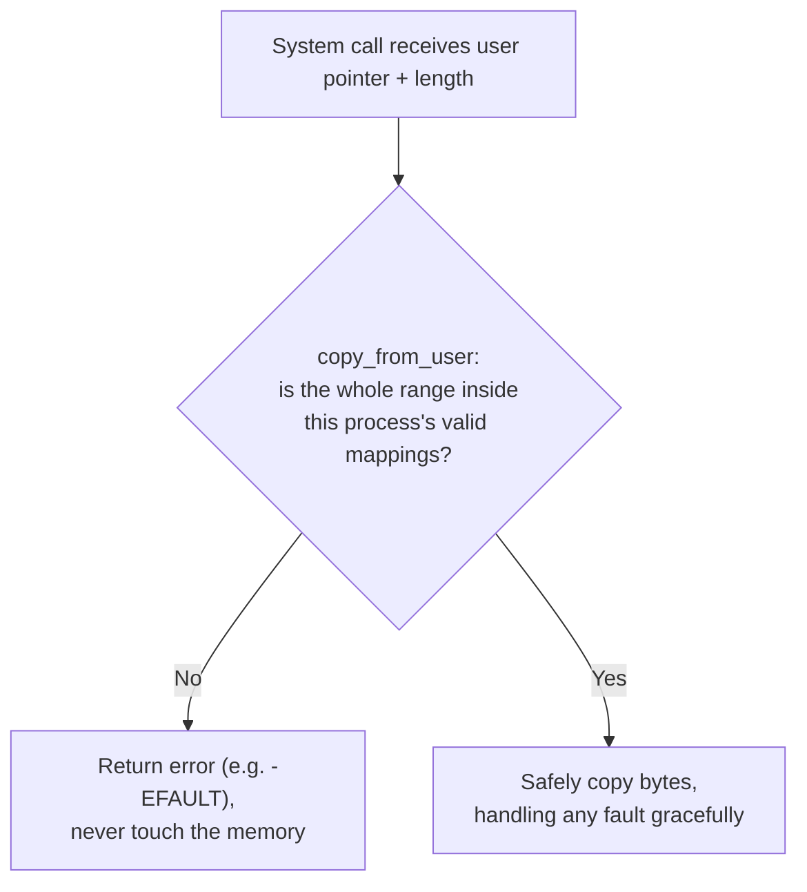

## Learning Objectives

- Explain why every pointer, length, and integer a system call receives from user mode must be treated as untrusted input, no matter how well-behaved the calling program is expected to be.
- Describe the concrete mechanism (`copy_from_user`/`copy_to_user`-style routines) real kernels use to safely read from or write to user-supplied addresses, and why the kernel cannot simply dereference such a pointer directly.
- Recognize a time-of-check-to-time-of-use (TOCTOU) race as a distinct hazard beyond a single bad pointer, where a validated value becomes invalid between the check and its use.
- Connect this concept to the already-covered memory-safety failure mode from `c-and-assembly` and `security-cryptography`, explaining why the same underlying bug class becomes more dangerous at the kernel boundary.

## Context & Motivation

The previous concept traced a system call's arguments arriving in registers, including pointers into the calling process's own address space — and closed by noting that the kernel cannot simply trust these values. This concept makes that concern precise and complete: everything a system call receives from user mode — pointers, lengths, file descriptors, syscall numbers themselves — is, from the kernel's point of view, an unverified claim made by code the kernel does not control and must not assume is well-behaved, whether that code is buggy or actively malicious.

This matters more here than almost anywhere else in this discipline, because the code doing the (potential) trusting is now running with full kernel privilege. `c-and-assembly` and `security-cryptography` already established that a buffer overflow or an unchecked pointer is dangerous in ordinary application code — but an application-level memory-safety bug typically corrupts that application's own memory, or crashes that one process. A kernel that trusts a bad user-supplied pointer without validation can be tricked into reading or writing memory the calling process was never entitled to touch, at kernel privilege — turning what would be an application-level crash into a complete compromise of process isolation itself.

## Core Theory

### Why a raw user pointer cannot simply be dereferenced

Suppose a system call like `read(fd, buf, count)` receives `buf` as a user-space pointer. The naive implementation would have the kernel simply write the file's bytes directly to that address: `memcpy(buf, kernel_data, count)`. This is unsafe for at least three independent reasons, each of which a real kernel must guard against:

1. **The pointer might not belong to the calling process at all.** A buggy or malicious program could pass an address entirely outside its own valid mappings — including, in principle, an address that happens to fall inside a completely different structure the kernel itself uses internally, if the kernel is not careful about which address space is currently active when it performs the copy.
2. **The pointer might be a legitimate user address, but the `count` might claim far more bytes than the buffer it points to actually has room for** — an application-level buffer-overflow bug, now happening because the *kernel* wrote past the buffer's real end, not the application's own code.
3. **The address might be a kernel address masquerading as a user pointer.** If the kernel's copy routine does not check that the target address genuinely falls within the calling process's user-mode address range, a program could potentially trick the kernel into overwriting its own kernel memory on the program's behalf.

### The real mechanism: bounds-checked copy routines

Real kernels solve this with a small, carefully written pair of routines — commonly named `copy_from_user()` and `copy_to_user()` in Linux, and their equivalents in every other production kernel — that the rest of the kernel is required to use for every single access to user-supplied memory, never a raw pointer dereference. These routines perform two things a naive `memcpy` would not: they verify that the entire requested range (`address` through `address + count`) falls within the calling process's legitimate address space *before* touching a single byte, and they are written to gracefully handle a page fault that occurs mid-copy (if the target page turns out not to be resident, or turns out to be mapped read-only when a write was requested) by returning an error to the calling kernel code instead of crashing the entire kernel.



This is precisely the discipline's earlier `validating-user-input-at-the-kernel-boundary`-relevant lesson from `c-and-assembly`'s buffer-overflow material and `security-cryptography`'s injection-vulnerability material, applied one layer deeper: never trust a length or a pointer supplied by a party you do not control, and always validate before acting — except here, the "party you do not control" is ordinary user-mode code, and the code doing the trusting has full hardware privilege, which is exactly why the stakes are categorically higher.

### Time-of-check-to-time-of-use (TOCTOU): a validated value can still become unsafe

A second, subtler hazard exists even when every check above is implemented correctly: the value being checked can change between the moment it is checked and the moment it is actually used, if another thread (in the same multi-threaded process) or another CPU can modify the underlying memory concurrently. A classic real instance: a system call checks that a file path string, read from user memory, refers to a file the calling process is permitted to access — then, before the kernel actually opens the file using that same path, a second thread in the same process rewrites the string (or, in a more elaborate real exploit, remaps the underlying memory) to point at a different, unauthorized file. The kernel's check was correct at the moment it ran; the use, moments later, operates on different data than what was checked. Defending against this requires either copying the value into kernel-private memory immediately, atomically, at check time (so it genuinely cannot change afterward), or re-validating immediately before use — TOCTOU bugs are a real, recurring category in kernel security history, not a hypothetical concern.

## Worked Examples

### Example 1: A safe versus unsafe `read()` implementation, side by side

```c
// UNSAFE: trusts the user pointer and length directly
ssize_t sys_read_unsafe(int fd, void *buf, size_t count) {
    // buf could be invalid, too short, or a kernel address --
    // this line can corrupt arbitrary memory or crash the kernel.
    return read_from_file(fd, buf, count);
}

// SAFE: validates before touching user memory
ssize_t sys_read_safe(int fd, void *user_buf, size_t count) {
    char kernel_tmp[MAX_CHUNK];
    size_t n = read_from_file_into_kernel_buffer(fd, kernel_tmp, count);
    if (copy_to_user(user_buf, kernel_tmp, n) != 0) {
        return -EFAULT;  // user_buf's range was invalid; bail out safely
    }
    return n;
}
```

The unsafe version's failure mode is exactly the buffer-overflow/injection class already covered elsewhere in this platform, now happening with kernel privilege instead of application privilege.

### Example 2: A concrete out-of-bounds attempt, checked and rejected

```text
Process's valid address range:   0x1000_0000 - 0x1000_2000  (8 KB)
System call receives: buf = 0x1000_1F00, count = 1024

Requested range:  0x1000_1F00 - 0x1000_2300
Valid range ends: 0x1000_2000

copy_to_user detects the requested range extends 0x300 bytes
PAST the end of the process's valid mapping -> returns -EFAULT
WITHOUT writing a single byte, rather than writing 1792 bytes
safely and then corrupting 768 bytes of adjacent, unrelated memory.
```

### Example 3: A minimal TOCTOU race, made concrete

```text
Thread A (in the calling process):
  1. Calls open_file_by_path(user_supplied_path)
  2. Kernel checks: does this process have permission to open
     "/home/alice/report.txt"?  Yes -- check passes.

Thread B (same process, running concurrently):
  Between steps 1 and 2 finishing and the kernel actually
  performing the open, Thread B rewrites the same memory location
  user_supplied_path points to, changing its contents to
  "/etc/shadow".

Kernel (continuing step 2): actually opens whatever path is
CURRENTLY at that memory address -- which may no longer be the
path that was checked.
```

A real kernel closes this specific race by copying the path string into kernel-private memory once, atomically, at the very start of the system call, and performing every subsequent check and the actual open against that private copy — never re-reading the user-supplied address a second time.

## Common Misconceptions & Pitfalls

- **"A pointer arriving in a system-call argument register is safe to dereference, since the calling program presumably set it up correctly."** The kernel must never assume this — "presumably correct" is exactly the assumption a memory-safety bug or a deliberate attack violates, and the consequence at kernel privilege is categorically worse than an application-level crash.
- **"Bounds-checking the length is enough; the address itself doesn't need separate validation."** Both must be checked together — a length that fits within some buffer means nothing if the base address itself doesn't fall within the calling process's legitimate address space in the first place.
- **"If a value was validated once, it's safe to use later in the same system call."** Not if anything else (another thread, another CPU) can modify the underlying memory in between — this is exactly the TOCTOU hazard, and the real fix is to copy the value into kernel-private memory at check time, not merely to check it once and trust it afterward.
- **"This is the same bug class as an application-level buffer overflow, so it's not worth a separate discipline concept."** It is the same underlying bug class, but the consequence differs categorically: an application-level instance corrupts that application's own memory; a kernel-level instance, unguarded, can corrupt or expose the memory of every process on the machine, precisely because the code making the mistake now runs with full hardware privilege.

## Summary

Every value a system call receives from user mode — pointers, lengths, syscall numbers — is untrusted input from the kernel's point of view, and must be validated before use, exactly as `c-and-assembly` and `security-cryptography` already established for ordinary application-level input handling, but with categorically higher stakes because the code doing the (potential) trusting now runs at full kernel privilege. Real kernels enforce this with dedicated, carefully written copy routines (`copy_from_user`/`copy_to_user`) that bounds-check the entire requested range against the calling process's legitimate address space before touching any memory, and handle page faults during the copy gracefully rather than crashing the kernel. A second, subtler hazard — the time-of-check-to-time-of-use race — shows that even a correctly validated value can become unsafe if it can change between the check and its use, which real kernels close by copying values into kernel-private memory at check time rather than re-reading user memory repeatedly.

## Documentation Links

- [MIT 6.S081 xv6 book — Traps, Interrupts, and Drivers](https://pdos.csail.mit.edu/6.S081/2021/xv6/book-riscv-rev2.pdf) — covers the real mechanics of safely copying between user and kernel address spaces this concept builds on.
- [OSTEP — Intro to Security](https://pages.cs.wisc.edu/~remzi/OSTEP/security-intro.pdf) — frames untrusted input validation as a foundational OS security concern, the same framing this concept applies specifically to the kernel boundary.
