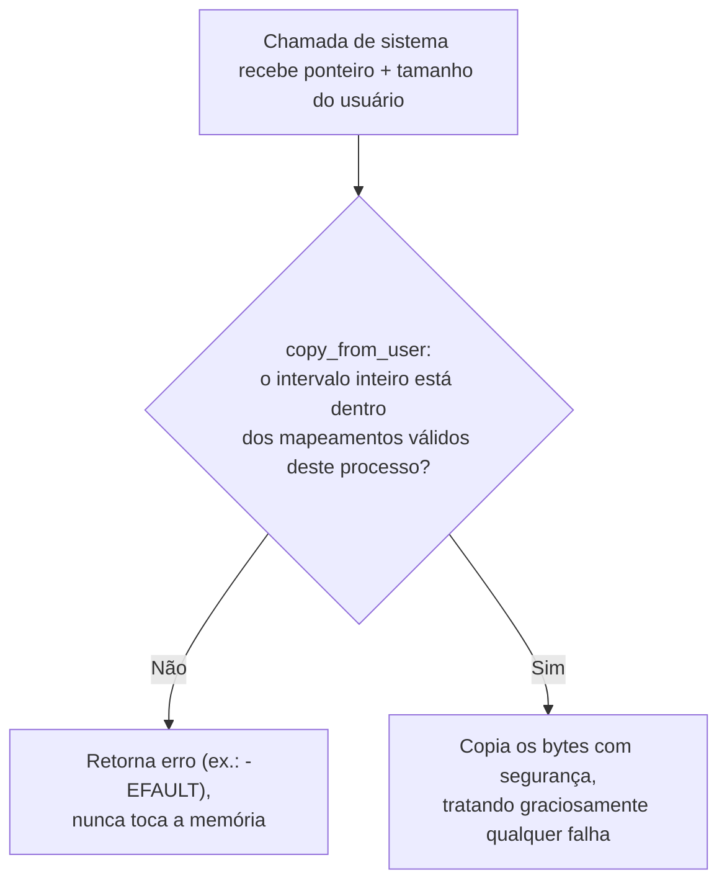

## Objetivos de Aprendizagem

- Explicar por que todo ponteiro, tamanho e inteiro que uma chamada de sistema recebe do modo usuário precisa ser tratado como entrada não confiável, não importa quão bem-comportado se espera que seja o programa chamador.
- Descrever o mecanismo concreto (rotinas no estilo `copy_from_user`/`copy_to_user`) que kernels reais usam para ler de ou escrever em endereços fornecidos pelo usuário com segurança, e por que o kernel não pode simplesmente desreferenciar esse ponteiro diretamente.
- Reconhecer uma corrida time-of-check-to-time-of-use (TOCTOU) como um risco distinto, além de um único ponteiro ruim, onde um valor validado se torna inválido entre a checagem e o seu uso.
- Conectar este conceito ao modo de falha de segurança de memória já coberto em `c-and-assembly` e `security-cryptography`, explicando por que a mesma classe de bug subjacente se torna mais perigosa na fronteira do kernel.

## Contexto e Motivação

O conceito anterior rastreou os argumentos de uma chamada de sistema chegando em registradores, incluindo ponteiros para o próprio espaço de endereçamento do processo chamador, e terminou observando que o kernel não pode simplesmente confiar nesses valores. Este conceito torna essa preocupação precisa e completa: tudo o que uma chamada de sistema recebe do modo usuário (ponteiros, tamanhos, descritores de arquivo, os próprios números de syscall) é, do ponto de vista do kernel, uma alegação não verificada feita por código que o kernel não controla e que ele não pode presumir ser bem-comportado, seja esse código cheio de bugs ou ativamente malicioso.

Isso importa mais aqui do que em quase qualquer outro lugar desta disciplina, porque o código que (potencialmente) confia agora está rodando com privilégio total de kernel. `c-and-assembly` e `security-cryptography` já estabeleceram que um buffer overflow ou um ponteiro não checado é perigoso em código de aplicação comum, mas um bug de segurança de memória no nível da aplicação tipicamente corrompe a própria memória dessa aplicação, ou derruba esse único processo. Um kernel que confia num ponteiro ruim fornecido pelo usuário sem validação pode ser enganado a ler ou escrever memória que o processo chamador nunca teve direito de tocar, com privilégio de kernel, transformando o que seria um crash no nível da aplicação num comprometimento completo do próprio isolamento de processos.

## Teoria Central

### Por que um ponteiro bruto do usuário não pode simplesmente ser desreferenciado

Suponha que uma chamada de sistema como `read(fd, buf, count)` recebe `buf` como um ponteiro de espaço de usuário. A implementação ingênua faria o kernel simplesmente escrever os bytes do arquivo diretamente nesse endereço: `memcpy(buf, kernel_data, count)`. Isso é inseguro por pelo menos três razões independentes, e um kernel real precisa se proteger contra cada uma delas:

1. **O ponteiro pode nem pertencer ao processo chamador.** Um programa com bug ou malicioso poderia passar um endereço inteiramente fora dos seus próprios mapeamentos válidos, incluindo, em princípio, um endereço que calha de cair dentro de uma estrutura completamente diferente que o próprio kernel usa internamente, se o kernel não tomar cuidado com qual espaço de endereçamento está ativo no momento em que ele realiza a cópia.
2. **O ponteiro pode ser um endereço de usuário legítimo, mas o `count` pode alegar muito mais bytes do que o buffer apontado de fato comporta**: um bug de buffer overflow no nível da aplicação, agora acontecendo porque o *kernel* escreveu além do fim real do buffer, e não o próprio código da aplicação.
3. **O endereço pode ser um endereço de kernel disfarçado de ponteiro de usuário.** Se a rotina de cópia do kernel não checar que o endereço alvo genuinamente cai dentro do intervalo de endereços de modo usuário do processo chamador, um programa poderia potencialmente enganar o kernel a sobrescrever a sua própria memória de kernel em nome do programa.

### O mecanismo real: rotinas de cópia com checagem de limites

Kernels reais resolvem isso com um par pequeno e cuidadosamente escrito de rotinas (comumente chamadas `copy_from_user()` e `copy_to_user()` no Linux, e os seus equivalentes em todo outro kernel de produção) que o resto do kernel é obrigado a usar para cada acesso a memória fornecida pelo usuário, nunca uma desreferência de ponteiro bruta. Estas rotinas fazem duas coisas que um `memcpy` ingênuo não faria: verificam que o intervalo inteiro pedido (de `address` até `address + count`) cai dentro do espaço de endereçamento legítimo do processo chamador *antes* de tocar um único byte, e são escritas para tratar graciosamente uma page fault que ocorra no meio da cópia (se a página alvo acabar não estando residente, ou acabar mapeada como somente leitura quando uma escrita foi pedida) retornando um erro ao código do kernel chamador em vez de derrubar o kernel inteiro.



Esta é precisamente a lição do material de buffer overflow de `c-and-assembly` e do material de vulnerabilidades de injeção de `security-cryptography`, aplicada uma camada mais fundo: nunca confie num tamanho ou num ponteiro fornecido por uma parte que você não controla, e sempre valide antes de agir. Só que aqui a "parte que você não controla" é código comum de modo usuário, e o código que confia tem privilégio total de hardware, e é exatamente por isso que o que está em jogo é categoricamente maior.

### Time-of-check-to-time-of-use (TOCTOU): um valor validado ainda pode se tornar inseguro

Um segundo risco, mais sutil, existe mesmo quando toda checagem acima é implementada corretamente: o valor sendo checado pode mudar entre o momento em que é checado e o momento em que é de fato usado, se outra thread (no mesmo processo multi-threaded) ou outra CPU puder modificar a memória subjacente concorrentemente. Um exemplo real clássico: uma chamada de sistema checa que uma string de caminho de arquivo, lida da memória do usuário, se refere a um arquivo que o processo chamador tem permissão de acessar; então, antes que o kernel de fato abra o arquivo usando esse mesmo caminho, uma segunda thread do mesmo processo reescreve a string (ou, num exploit real mais elaborado, remapeia a memória subjacente) para apontar para um arquivo diferente e não autorizado. A checagem do kernel estava correta no momento em que rodou; o uso, instantes depois, opera sobre dados diferentes do que foi checado. Defender-se disso exige ou copiar o valor para memória privada do kernel imediatamente, atomicamente, no momento da checagem (para que ele genuinamente não possa mudar depois), ou revalidar imediatamente antes do uso. Bugs TOCTOU são uma categoria real e recorrente na história da segurança de kernels, não uma preocupação hipotética.

## Exemplos Resolvidos

### Exemplo 1: Uma implementação segura versus insegura de `read()`, lado a lado

```c
// INSEGURO: confia diretamente no ponteiro e no tamanho do usuário
ssize_t sys_read_unsafe(int fd, void *buf, size_t count) {
    // buf pode ser inválido, curto demais ou um endereço de kernel --
    // esta linha pode corromper memória arbitrária ou derrubar o kernel.
    return read_from_file(fd, buf, count);
}

// SEGURO: valida antes de tocar a memória do usuário
ssize_t sys_read_safe(int fd, void *user_buf, size_t count) {
    char kernel_tmp[MAX_CHUNK];
    size_t n = read_from_file_into_kernel_buffer(fd, kernel_tmp, count);
    if (copy_to_user(user_buf, kernel_tmp, n) != 0) {
        return -EFAULT;  // o intervalo de user_buf era inválido; desiste com segurança
    }
    return n;
}
```

O modo de falha da versão insegura é exatamente a classe de buffer overflow/injeção já coberta em outras partes desta plataforma, agora acontecendo com privilégio de kernel em vez de privilégio de aplicação.

### Exemplo 2: Uma tentativa concreta de acesso fora dos limites, checada e rejeitada

```text
Intervalo de endereços válido do processo: 0x1000_0000 - 0x1000_2000  (8 KB)
Chamada de sistema recebe: buf = 0x1000_1F00, count = 1024

Intervalo pedido:        0x1000_1F00 - 0x1000_2300
Intervalo válido termina: 0x1000_2000

copy_to_user detecta que o intervalo pedido se estende 0x300 bytes
ALÉM do fim do mapeamento válido do processo -> retorna -EFAULT
SEM escrever um único byte, em vez de escrever 256 bytes com
segurança e depois corromper 768 bytes de memória adjacente sem relação.
```

### Exemplo 3: Uma corrida TOCTOU mínima, tornada concreta

```text
Thread A (no processo chamador):
  1. Chama open_file_by_path(user_supplied_path)
  2. O kernel checa: este processo tem permissão para abrir
     "/home/alice/report.txt"?  Sim -- a checagem passa.

Thread B (mesmo processo, rodando concorrentemente):
  Entre o término dos passos 1 e 2 e o kernel de fato realizar
  a abertura, a Thread B reescreve a mesma posição de memória
  para a qual user_supplied_path aponta, mudando o seu conteúdo
  para "/etc/shadow".

Kernel (continuando o passo 2): de fato abre qualquer caminho que
esteja ATUALMENTE naquele endereço de memória -- que pode não ser
mais o caminho que foi checado.
```

Um kernel real fecha esta corrida específica copiando a string do caminho para memória privada do kernel uma vez, atomicamente, bem no início da chamada de sistema, e realizando toda checagem seguinte e a abertura de fato contra essa cópia privada, sem nunca reler o endereço fornecido pelo usuário uma segunda vez.

## Equívocos Comuns e Armadilhas

- **"Um ponteiro chegando num registrador de argumento de chamada de sistema é seguro de desreferenciar, já que o programa chamador presumivelmente o configurou corretamente."** O kernel nunca pode presumir isso. "Presumivelmente correto" é exatamente a suposição que um bug de segurança de memória ou um ataque deliberado viola, e a consequência com privilégio de kernel é categoricamente pior do que um crash no nível da aplicação.
- **"Checar os limites do tamanho basta; o próprio endereço não precisa de validação separada."** Os dois precisam ser checados juntos. Um tamanho que cabe dentro de algum buffer não significa nada se o próprio endereço base não cair dentro do espaço de endereçamento legítimo do processo chamador, para começo de conversa.
- **"Se um valor foi validado uma vez, é seguro usá-lo depois na mesma chamada de sistema."** Não se qualquer outra coisa (outra thread, outra CPU) puder modificar a memória subjacente no meio do caminho. Este é exatamente o risco TOCTOU, e a correção real é copiar o valor para memória privada do kernel no momento da checagem, e não apenas checá-lo uma vez e confiar nele depois.
- **"Esta é a mesma classe de bug que um buffer overflow no nível da aplicação, então não vale um conceito separado na disciplina."** É a mesma classe de bug subjacente, mas a consequência difere categoricamente: uma instância no nível da aplicação corrompe a própria memória dessa aplicação; uma instância no nível do kernel, sem proteção, pode corromper ou expor a memória de todo processo na máquina, justamente porque o código que comete o erro agora roda com privilégio total de hardware.

## Resumo

Todo valor que uma chamada de sistema recebe do modo usuário (ponteiros, tamanhos, números de syscall) é entrada não confiável do ponto de vista do kernel, e precisa ser validado antes do uso, exatamente como `c-and-assembly` e `security-cryptography` já estabeleceram para o tratamento comum de entrada no nível da aplicação, mas com riscos categoricamente maiores porque o código que (potencialmente) confia agora roda com privilégio total de kernel. Kernels reais impõem isso com rotinas de cópia dedicadas e cuidadosamente escritas (`copy_from_user`/`copy_to_user`) que checam os limites do intervalo inteiro pedido contra o espaço de endereçamento legítimo do processo chamador antes de tocar qualquer memória, e tratam graciosamente page faults durante a cópia em vez de derrubar o kernel. Um segundo risco, mais sutil (a corrida time-of-check-to-time-of-use), mostra que mesmo um valor corretamente validado pode se tornar inseguro se puder mudar entre a checagem e o seu uso, o que kernels reais fecham copiando os valores para memória privada do kernel no momento da checagem em vez de reler a memória do usuário repetidamente.

## Documentation Links

- [MIT 6.S081 xv6 book: Traps, Interrupts, and Drivers](https://pdos.csail.mit.edu/6.S081/2021/xv6/book-riscv-rev2.pdf): cobre a mecânica real de copiar com segurança entre os espaços de endereçamento de usuário e de kernel sobre a qual este conceito constrói.
- [OSTEP: Intro to Security](https://pages.cs.wisc.edu/~remzi/OSTEP/security-intro.pdf): enquadra a validação de entrada não confiável como uma preocupação fundamental de segurança de SO, o mesmo enquadramento que este conceito aplica especificamente à fronteira do kernel.
