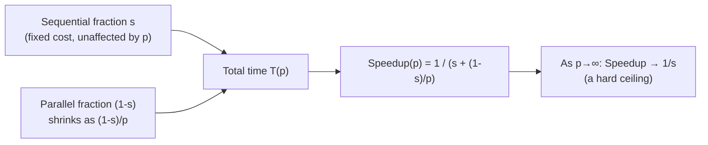

## Learning Objectives

- State Amdahl's Law and derive the maximum achievable speedup from a program's sequential fraction.
- Compute the speedup limit for a given sequential fraction, both as processors approach infinity and at a specific finite processor count.
- Explain why Amdahl's Law implies that even a small sequential fraction imposes a surprisingly low speedup ceiling.
- Identify the sequential fraction in a decomposed program by inspecting which parts cannot be parallelized.

## Context & Motivation

The previous concept's worked example showed efficiency declining steadily as processors were added to a real sorting program, even as speedup kept rising — a pattern that looks like a law of diminishing returns, but without a name or a mathematical explanation yet. Amdahl's Law, formulated by Gene Amdahl in 1967 and covered by essentially every real parallel-computing course and tutorial, including LLNL's, supplies exactly that explanation: it is the single most important governing formula for predicting the limits of parallel speedup from the structure of a program alone, before running any code.

Amdahl's Law is also, historically, a genuinely sobering result — it was originally used to argue *against* the practicality of massively parallel computing, on the grounds that even a small unparallelizable fraction of a program caps its achievable speedup far below what naive intuition (twice the processors, twice the speed) would suggest. Gustafson's Law, covered in the next concept, is best understood as a direct response to exactly this pessimism.

## Core Theory

### Deriving the law

Suppose a program's execution time has two parts: a fraction `s` that is inherently sequential (cannot be parallelized at all, no matter how many processors are available) and a fraction `(1 - s)` that is perfectly parallelizable (splits evenly across any number of processors with no overhead). On p processors, the total time becomes:

```text
T(p) = s · T(1)  +  (1 - s) · T(1) / p
```

The sequential part takes the same time no matter how many processors are used; the parallel part's time shrinks in proportion to p. Substituting into the speedup formula from the previous concept, Speedup(p) = T(1) / T(p):

```text
Speedup(p) = T(1) / [ s·T(1) + (1-s)·T(1)/p ]
           = 1 / [ s + (1-s)/p ]
```

This is Amdahl's Law. The crucial behavior appears by taking the limit as p approaches infinity: the `(1-s)/p` term shrinks to zero, leaving:

```text
Speedup(∞) = 1 / s
```

No matter how many processors are thrown at the problem, speedup can never exceed `1/s` — a hard ceiling set entirely by the sequential fraction, independent of processor count.

### Why even a small sequential fraction matters enormously

This ceiling is far more restrictive than intuition suggests. If only 5% of a program is sequential (`s = 0.05`), the maximum possible speedup — even with infinite processors — is `1/0.05 = 20×`. If the sequential fraction is 10%, the ceiling drops to `10×`. Doubling the sequential fraction from 5% to 10% cuts the achievable ceiling in half, regardless of how many processors are added beyond the point of diminishing returns. This is exactly the mathematical explanation for the declining efficiency observed in the previous concept's sorting example: as processors are added, the parallel portion's time keeps shrinking toward zero, but the sequential portion's time (unaffected by processor count) increasingly dominates the total, and efficiency (Speedup/p) correspondingly falls.



### The practical lesson: find and shrink the sequential fraction first

Amdahl's Law's real, actionable consequence is that identifying and minimizing the sequential fraction of a program is usually far more valuable than simply adding more processors to a program whose sequential fraction has not been examined. A program with a large sequential setup phase, a single unparallelizable I/O step, or a global synchronization point that serializes otherwise-parallel work will hit its Amdahl ceiling quickly, and no amount of additional hardware will push past it — the fix has to be algorithmic (reduce `s` itself), not merely a bigger cluster.

## Worked Examples

### Example 1: Computing the speedup ceiling for two real sequential fractions

```text
If s = 0.10 (10% sequential):
  Speedup(∞) = 1 / 0.10 = 10×          — hard ceiling, any p

  Speedup(4)  = 1 / (0.10 + 0.90/4)  = 1 / 0.325  ≈ 3.08×
  Speedup(16) = 1 / (0.10 + 0.90/16) = 1 / 0.15625 ≈ 6.40×
  Speedup(64) = 1 / (0.10 + 0.90/64) = 1 / 0.1141  ≈ 8.77×

If s = 0.01 (1% sequential):
  Speedup(∞) = 1 / 0.01 = 100×

  Speedup(4)  = 1 / (0.01 + 0.99/4)  = 1 / 0.2575  ≈ 3.88×
  Speedup(16) = 1 / (0.01 + 0.99/16) = 1 / 0.0719  ≈ 13.92×
  Speedup(64) = 1 / (0.01 + 0.99/64) = 1 / 0.0255  ≈ 39.28×
```

Notice how, even for the much smaller 1% sequential fraction, speedup at 64 processors (≈39×) is still far below the processor count itself — and even further below its own theoretical ceiling of 100×. Diminishing returns set in well before the ceiling is approached, which is exactly why practical HPC performance reports (a topic in strong/weak scaling, an upcoming concept) always report speedup at specific, realistic processor counts, not just the theoretical infinite-processor limit.

### Example 2: Finding the sequential fraction from a decomposition

A weather simulation program: 2% of its time is spent reading initial condition files sequentially at the start, 3% is spent writing final results sequentially at the end, and the remaining 95% is the grid-update computation, fully data-parallelizable via domain decomposition (already covered).

```text
Sequential fraction s = 2% + 3% = 5% = 0.05

Speedup(∞) = 1 / 0.05 = 20×
```

Even though 95% of the program is parallelizable — a number that sounds like it should support enormous speedups — the 5% sequential I/O caps total achievable speedup at 20×, regardless of whether the simulation runs on 100 or 100,000 processors. Reducing that ceiling further would require parallelizing the I/O itself (e.g., having multiple processors read/write different parts of the files concurrently), not simply adding more compute processors.

## Common Misconceptions & Pitfalls

- **"Amdahl's Law says parallelism doesn't help much."** It says parallelism's benefit is *bounded* by the sequential fraction, not that it doesn't help — going from 1 processor to a well-chosen finite number (as Example 1 shows) can still deliver substantial, real speedup well before the theoretical ceiling matters.
- **"A 95% parallelizable program should get close to a 95×-ish speedup with enough processors."** This is exactly the intuition Amdahl's Law corrects — a 5% sequential fraction caps speedup at 1/0.05 = 20×, not 95× or anything close to the processor count, no matter how many processors are used.
- **"Amdahl's Law assumes something unrealistic and doesn't apply to real programs."** Its core assumption — that some fraction of any given problem, as fixed, resists parallelization — is realistic for a huge range of real programs (setup, I/O, final aggregation); Gustafson's Law, the next concept, doesn't contradict Amdahl's Law, it changes a different assumption (whether the problem size itself is held fixed).
- **"The sequential fraction is a fixed, unchangeable property of a problem."** It's a property of a specific *implementation and algorithm*, not the problem in the abstract — restructuring an algorithm to parallelize a previously-sequential step (like splitting I/O across processors) genuinely reduces `s` and raises the achievable ceiling.

## Summary

Amdahl's Law, `Speedup(p) = 1 / (s + (1-s)/p)`, shows that a program's maximum achievable speedup is capped at `1/s` as processors approach infinity, where `s` is the fraction of the program that is inherently sequential — a ceiling that even small sequential fractions (5-10%) restrict surprisingly severely, and one that no amount of additional hardware can push past. The practical consequence is that reducing the sequential fraction itself — through better algorithms or parallelizing previously-sequential steps like I/O — is usually more valuable than simply adding processors to an already-fixed decomposition. Amdahl's Law's pessimistic framing, holding problem size fixed while processors grow, is exactly the assumption Gustafson's Law, covered next, challenges.

## Documentation Links

- [LLNL — Introduction to Parallel Computing Tutorial](https://hpc.llnl.gov/documentation/tutorials/introduction-parallel-computing-tutorial) — source for Amdahl's Law and its formulation and examples.
