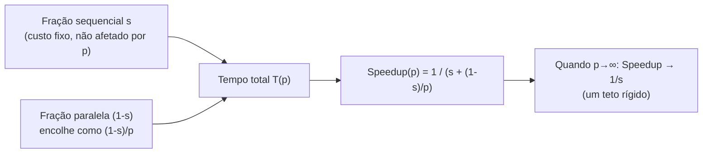

## Objetivos de Aprendizagem

- Enunciar a Lei de Amdahl e derivar o speedup máximo alcançável a partir da fração sequencial de um programa.
- Computar o limite de speedup para uma dada fração sequencial, tanto quando os processadores tendem ao infinito quanto num número finito específico de processadores.
- Explicar por que a Lei de Amdahl implica que mesmo uma pequena fração sequencial impõe um teto de speedup surpreendentemente baixo.
- Identificar a fração sequencial num programa decomposto inspecionando quais partes não podem ser paralelizadas.

## Contexto e Motivação

O exemplo resolvido do conceito anterior mostrou a eficiência declinando de forma constante conforme processadores eram adicionados a um programa de ordenação real, mesmo com o speedup continuando a subir, um padrão que parece uma lei de retornos decrescentes, mas ainda sem um nome ou uma explicação matemática. A Lei de Amdahl, formulada por Gene Amdahl em 1967 e coberta por essencialmente todo curso e tutorial real de computação paralela, incluindo o do LLNL, fornece exatamente essa explicação: é a fórmula governante mais importante para prever os limites do speedup paralelo a partir da estrutura de um programa sozinha, antes de rodar qualquer código.

A Lei de Amdahl é também, historicamente, um resultado genuinamente sóbrio, originalmente usado para argumentar *contra* a praticidade da computação massivamente paralela, sob o fundamento de que mesmo uma pequena fração não paralelizável de um programa limita o speedup alcançável muito abaixo do que a intuição ingênua (o dobro dos processadores, o dobro da velocidade) sugeriria. A Lei de Gustafson, coberta no próximo conceito, é melhor entendida como uma resposta direta a exatamente esse pessimismo.

## Teoria Central

### Derivando a lei

Suponha que o tempo de execução de um programa tem duas partes: uma fração `s` que é inerentemente sequencial (não pode ser paralelizada de forma alguma, não importa quantos processadores estejam disponíveis) e uma fração `(1 - s)` que é perfeitamente paralelizável (divide-se uniformemente por qualquer número de processadores sem nenhum overhead). Em p processadores, o tempo total torna-se:

```text
T(p) = s · T(1)  +  (1 - s) · T(1) / p
```

A parte sequencial leva o mesmo tempo não importa quantos processadores sejam usados; o tempo da parte paralela encolhe em proporção a p. Substituindo na fórmula de speedup do conceito anterior, Speedup(p) = T(1) / T(p):

```text
Speedup(p) = T(1) / [ s·T(1) + (1-s)·T(1)/p ]
           = 1 / [ s + (1-s)/p ]
```

Esta é a Lei de Amdahl. O comportamento crucial aparece ao tomar o limite quando p tende ao infinito: o termo `(1-s)/p` encolhe para zero, deixando:

```text
Speedup(∞) = 1 / s
```

Não importa quantos processadores sejam lançados ao problema, o speedup nunca pode exceder `1/s`, um teto rígido fixado inteiramente pela fração sequencial, independente da contagem de processadores.

### Por que mesmo uma pequena fração sequencial importa enormemente

Este teto é muito mais restritivo do que a intuição sugere. Se apenas 5% de um programa é sequencial (`s = 0.05`), o speedup máximo possível, mesmo com infinitos processadores, é `1/0.05 = 20×`. Se a fração sequencial é 10%, o teto cai para `10×`. Dobrar a fração sequencial de 5% para 10% corta o teto alcançável pela metade, independentemente de quantos processadores sejam adicionados além do ponto de retornos decrescentes. Esta é exatamente a explicação matemática para a eficiência declinante observada no exemplo de ordenação do conceito anterior: conforme processadores são adicionados, o tempo da porção paralela continua encolhendo em direção a zero, mas o tempo da porção sequencial (não afetado pela contagem de processadores) domina cada vez mais o total, e a eficiência (Speedup/p) correspondentemente cai.



### A lição prática: ache e encolha a fração sequencial primeiro

A consequência real e acionável da Lei de Amdahl é que identificar e minimizar a fração sequencial de um programa é geralmente muito mais valioso do que simplesmente adicionar mais processadores a um programa cuja fração sequencial não foi examinada. Um programa com uma grande fase de setup sequencial, um único passo de E/S não paralelizável, ou um ponto de sincronização global que serializa trabalho que de outra forma seria paralelo, atingirá o seu teto de Amdahl rapidamente, e nenhuma quantidade de hardware adicional empurrará além dele. A correção tem que ser algorítmica (reduzir o próprio `s`), não meramente um cluster maior.

## Exemplos Resolvidos

### Exemplo 1: Computando o teto de speedup para duas frações sequenciais reais

```text
Se s = 0.10 (10% sequencial):
  Speedup(∞) = 1 / 0.10 = 10×          (teto rígido, qualquer p)

  Speedup(4)  = 1 / (0.10 + 0.90/4)  = 1 / 0.325  ≈ 3.08×
  Speedup(16) = 1 / (0.10 + 0.90/16) = 1 / 0.15625 ≈ 6.40×
  Speedup(64) = 1 / (0.10 + 0.90/64) = 1 / 0.1141  ≈ 8.77×

Se s = 0.01 (1% sequencial):
  Speedup(∞) = 1 / 0.01 = 100×

  Speedup(4)  = 1 / (0.01 + 0.99/4)  = 1 / 0.2575  ≈ 3.88×
  Speedup(16) = 1 / (0.01 + 0.99/16) = 1 / 0.0719  ≈ 13.92×
  Speedup(64) = 1 / (0.01 + 0.99/64) = 1 / 0.0255  ≈ 39.28×
```

Note como, mesmo para a fração sequencial muito menor de 1%, o speedup com 64 processadores (≈39×) ainda está muito abaixo da própria contagem de processadores, e ainda mais abaixo do seu próprio teto teórico de 100×. Os retornos decrescentes se instalam bem antes de o teto ser alcançado, que é exatamente por que relatórios práticos de desempenho de HPC (um tópico em escalabilidade forte/fraca, um conceito futuro) sempre reportam o speedup em contagens de processadores específicas e realistas, não apenas o limite teórico de infinitos processadores.

### Exemplo 2: Encontrando a fração sequencial a partir de uma decomposição

Um programa de simulação do tempo: 2% do seu tempo é gasto lendo arquivos de condição inicial sequencialmente no início, 3% é gasto escrevendo resultados finais sequencialmente no fim, e os 95% restantes são a computação de atualização da grade, totalmente paralelizável por dados via decomposição de domínio (já coberta).

```text
Fração sequencial s = 2% + 3% = 5% = 0.05

Speedup(∞) = 1 / 0.05 = 20×
```

Mesmo que 95% do programa seja paralelizável, um número que soa como se devesse sustentar speedups enormes, os 5% de E/S sequencial limitam o speedup total alcançável a 20×, independentemente de a simulação rodar em 100 ou 100.000 processadores. Reduzir esse teto ainda mais exigiria paralelizar a própria E/S (por exemplo, fazer múltiplos processadores lerem/escreverem partes diferentes dos arquivos concorrentemente), não simplesmente adicionar mais processadores de computação.

## Equívocos Comuns e Armadilhas

- **"A Lei de Amdahl diz que o paralelismo não ajuda muito."** Ela diz que o benefício do paralelismo é *limitado* pela fração sequencial, não que ele não ajuda. Ir de 1 processador para um número finito bem escolhido (como o Exemplo 1 mostra) ainda pode entregar um speedup substancial e real bem antes de o teto teórico importar.
- **"Um programa 95% paralelizável deveria alcançar um speedup de algo como 95× com processadores suficientes."** Esta é exatamente a intuição que a Lei de Amdahl corrige. Uma fração sequencial de 5% limita o speedup a 1/0.05 = 20×, não 95× ou nada próximo da contagem de processadores, não importa quantos processadores sejam usados.
- **"A Lei de Amdahl assume algo irrealista e não se aplica a programas reais."** A sua suposição central, de que alguma fração de qualquer problema dado, como fixa, resiste à paralelização, é realista para uma enorme gama de programas reais (setup, E/S, agregação final); a Lei de Gustafson, o próximo conceito, não contradiz a Lei de Amdahl, ela muda uma suposição diferente (se o próprio tamanho do problema é mantido fixo).
- **"A fração sequencial é uma propriedade fixa e imutável de um problema."** É uma propriedade de uma *implementação e um algoritmo* específicos, não do problema no abstrato. Reestruturar um algoritmo para paralelizar um passo antes sequencial (como dividir a E/S entre processadores) genuinamente reduz `s` e eleva o teto alcançável.

## Resumo

A Lei de Amdahl, `Speedup(p) = 1 / (s + (1-s)/p)`, mostra que o speedup máximo alcançável de um programa é limitado em `1/s` conforme os processadores tendem ao infinito, onde `s` é a fração do programa que é inerentemente sequencial, um teto que mesmo pequenas frações sequenciais (5-10%) restringem de forma surpreendentemente severa, e que nenhuma quantidade de hardware adicional consegue ultrapassar. A consequência prática é que reduzir a própria fração sequencial, por meio de melhores algoritmos ou paralelizando passos antes sequenciais como E/S, é geralmente mais valioso do que simplesmente adicionar processadores a uma decomposição já fixa. O enquadramento pessimista da Lei de Amdahl, mantendo o tamanho do problema fixo enquanto os processadores crescem, é exatamente a suposição que a Lei de Gustafson, coberta a seguir, desafia.

## Documentation Links

- [LLNL: Introduction to Parallel Computing Tutorial](https://hpc.llnl.gov/documentation/tutorials/introduction-parallel-computing-tutorial): fonte para a Lei de Amdahl e a sua formulação e exemplos.
