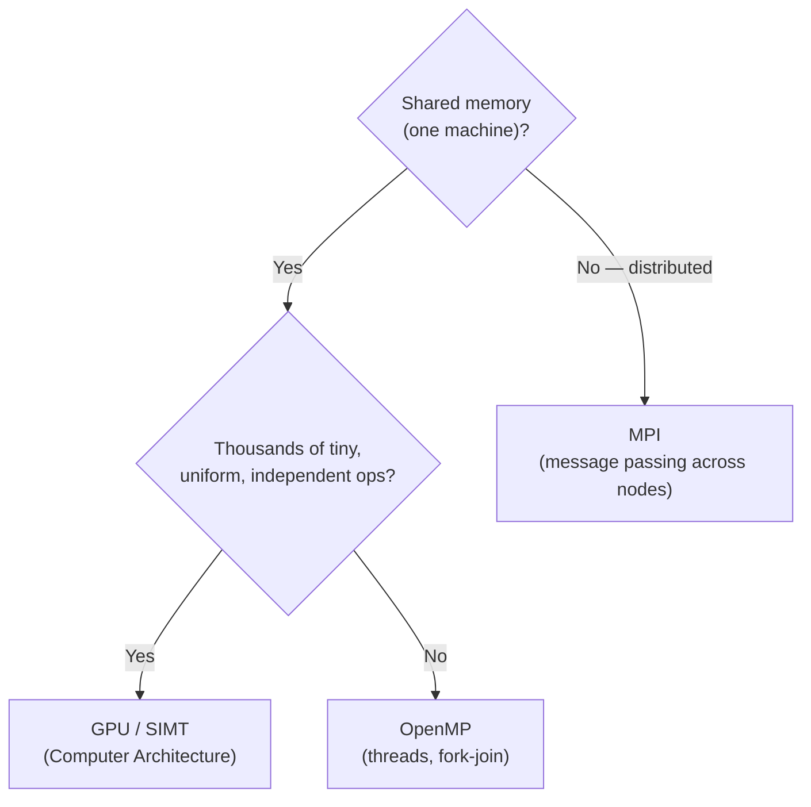

## Learning Objectives

- Given a real parallel-computing problem, choose a defensible programming model (OpenMP, MPI, GPU/SIMD, or a hybrid combination) using the design vocabulary this discipline covered.
- Trace one problem through the discipline's full arc: memory architecture, decomposition, performance bound, and concrete programming model.
- Explain why real large-scale HPC code very often combines more than one of these models rather than choosing exactly one.
- Summarize the specific handoff this discipline leaves to `distributed-systems-i`, and why that handoff exists.

## Context & Motivation

Every concept in this discipline has been building toward one practical, recurring decision: given a real computational problem and real hardware, which parallel programming approach should actually be used? This capstone does not introduce new mechanics — it ties together the memory architectures, decomposition techniques, performance laws, and the two concrete programming models (OpenMP, MPI) this discipline covered, plus the GPU/SIMD hardware model already covered in Computer Architecture, into one decision framework, applied honestly to realistic scenarios rather than treated as a simple flowchart with one right answer.

## Core Theory

### The decision framework, built from this discipline's own concepts

Four questions, each corresponding to a cluster already covered in this discipline, together determine the right approach:

1. **What memory architecture is available?** (from Parallel Computer Memory Architectures) — one machine's shared memory, a cluster's distributed memory, or a hybrid of both.
2. **What kind of parallelism does the problem have?** (from Task vs. Data Parallelism, and Domain vs. Functional Decomposition) — a large uniform data domain, or a set of distinct functional roles, or (for GPU-worthy problems) thousands of tiny, uniform, independent operations.
3. **What does Amdahl's/Gustafson's Law say about the achievable payoff?** (from the Performance & Scalability cluster) — is the sequential fraction small enough to make parallelizing worthwhile, and is the real use case a fixed-size problem (favoring strong-scaling thinking) or a problem that will grow to use available hardware (favoring weak-scaling thinking)?
4. **Given all of the above, which concrete model fits?** — OpenMP for shared memory with moderate-to-fine granularity; MPI for distributed memory, especially with coarser granularity (given its higher communication cost, from the granularity concept); the GPU/SIMT model from Computer Architecture for extremely fine-grained, massively data-parallel, largely independent operations.



### Real HPC code usually combines more than one

The realistic answer, for any sufficiently large real workload, is very often "more than one of these together" — exactly the hybrid distributed-shared memory architecture this discipline's second concept described. A large climate simulation cluster commonly uses MPI to distribute work across nodes (distributed memory, coarse granularity, matching the network communication cost), OpenMP within each node to use that node's own multiple cores (shared memory, finer granularity, cheap cache-coherent communication), and, on nodes equipped with them, GPU kernels for the most uniformly data-parallel inner loops (the SIMT model from Computer Architecture). This is not an exotic edge case — it is the standard architecture of essentially every large-scale scientific-computing code running on a modern supercomputer today.

### What this discipline deliberately leaves for later

This discipline's parallelism is tightly-coupled and synchronous: a fixed, known set of processes or threads, all launched (or forked) together, cooperating on one computation, without needing to reason about any process failing partway through, or about unpredictable network delays between geographically distant machines. `distributed-systems-i`, not yet written, picks up exactly where this discipline's assumptions stop holding: independent machines that can fail on their own, clocks that can't be perfectly synchronized, and a need for consensus about which machines are even still participating — a genuinely different (and generally harder) set of problems than anything MPI's point-to-point or collective operations, as covered here, were designed to solve. Recognizing this boundary honestly — rather than assuming "distributed memory" and "distributed systems" are the same subject just because both use the word "distributed" — is itself one of this capstone's most important takeaways.

## Worked Examples

### Example 1: Full decision trace for a realistic problem

**Problem**: simulate ocean currents across a 10,000×10,000×50 3D grid, over 1,000 timesteps, on a 256-node cluster where each node has 32 CPU cores and one GPU.

```text
1. Memory architecture: Hybrid — distributed across 256 nodes,
   shared (NUMA) within each node's 32 cores, plus a GPU per node.

2. Parallelism kind: Domain decomposition — the 3D grid splits
   naturally into contiguous 3D blocks, one per node, each running
   identical update code (data parallelism) on its own block.

3. Performance law: This is naturally a weak-scaling problem —
   a finer-resolution ocean model (bigger grid) is the realistic
   reason to use more nodes, matching Gustafson's framing rather
   than "run this exact grid faster."

4. Concrete model: MPI across the 256 nodes (each holding one 3D
   block, exchanging boundary faces with neighboring blocks every
   timestep via point-to-point sends, exactly as this discipline's
   boundary-exchange example described); OpenMP within each node's
   32 cores to parallelize the update loop over each node's own
   block; the innermost, most uniform arithmetic (e.g., updating
   millions of individual grid cells with the same equation) offloaded
   to the GPU where the workload is regular enough to benefit from
   SIMT execution.
```

This is a realistic hybrid MPI+OpenMP+GPU design, not a hypothetical exercise — it is exactly the architecture real ocean and climate models use in production today.

### Example 2: When NOT to use MPI, even on a cluster

**Problem**: a single, quick data-cleaning script that runs once, processes a 50-megabyte CSV file, and needs to finish in under a second, occasionally run on a shared research cluster.

```text
Even though a cluster (distributed-memory hardware) is technically
available, this problem's data is small enough to comfortably fit
and process on a single machine's single core in well under a second.
The overhead of launching multiple MPI processes, exchanging any
messages, and coordinating a result would very likely cost MORE
wall-clock time than the sequential version, especially once process
launch and MPI initialization overhead is counted — and Amdahl's Law
gives no benefit at all if there's no meaningful parallel fraction
to exploit in a problem this small and this fast already.

Right choice: plain sequential code. Parallelism is a tool for
problems where the compute or data volume genuinely justifies its
real coordination overhead — not a default to reach for just because
distributed or shared-memory hardware happens to be sitting there.
```

This example is a deliberate, honest counterpoint to the rest of the discipline: recognizing when *not* to parallelize at all is as much a part of this decision framework as choosing correctly between OpenMP, MPI, and GPU when parallelism genuinely is warranted.

## Common Misconceptions & Pitfalls

- **"A real HPC program should pick exactly one of OpenMP, MPI, or GPU and use only that."** Real large-scale scientific computing code very often combines all three at different levels (MPI across nodes, OpenMP within a node, GPU for the innermost uniform arithmetic) — treating the choice as strictly either/or misses how production HPC systems are actually built.
- **"Distributed memory (MPI) and distributed systems are the same topic."** MPI's distributed-memory model assumes a fixed, known, synchronously-cooperating set of processes with no partial-failure handling; distributed systems (a later discipline) specifically deals with independent machines that can fail on their own, unpredictable network delays, and the need for consensus — a related but genuinely harder and different problem.
- **"More parallelism (more processors, more granularity) is always the goal."** Example 2 shows a case where the right answer is no parallelism at all — the decision framework this capstone builds should always start by asking whether the problem's scale genuinely justifies the real coordination and communication cost parallelism introduces.
- **"Choosing a programming model is a one-time decision that doesn't need revisiting."** As problem size, available hardware, or performance requirements change, a program originally well-served by pure OpenMP might later benefit from adding MPI (to scale beyond one machine) or GPU offloading (as more uniform sub-computations are identified) — the decision framework in this capstone applies just as much to evolving an existing program as to designing a new one.

## Summary

Choosing a parallel programming model is a decision built directly from this discipline's own concepts: the available memory architecture (shared, distributed, or hybrid), the kind of parallelism the problem has (data, task, or extremely fine-grained-and-uniform), what Amdahl's and Gustafson's Laws say about the realistic payoff, and finally the concrete model that fits — OpenMP for shared memory, MPI for distributed memory, GPU/SIMT (from Computer Architecture) for massively uniform data parallelism, and very often some real combination of all three for large-scale production HPC code. This discipline's tightly-coupled, synchronous parallelism deliberately stops short of the harder problems of process failure, network unpredictability, and consensus, which `distributed-systems-i` takes up next — and knowing when a problem simply doesn't need parallelism at all is as much a part of this discipline's judgment as knowing how to apply it when it does.

## Documentation Links

- [LLNL — Introduction to Parallel Computing Tutorial](https://hpc.llnl.gov/documentation/tutorials/introduction-parallel-computing-tutorial) — source for the parallel programming models overview this capstone's decision framework is built from.
- [UC Berkeley CS267 — Applications of Parallel Computers](https://sites.google.com/lbl.gov/cs267-spr2024) — real course context confirming that hybrid MPI+OpenMP+GPU designs are the standard architecture for large-scale scientific computing.
