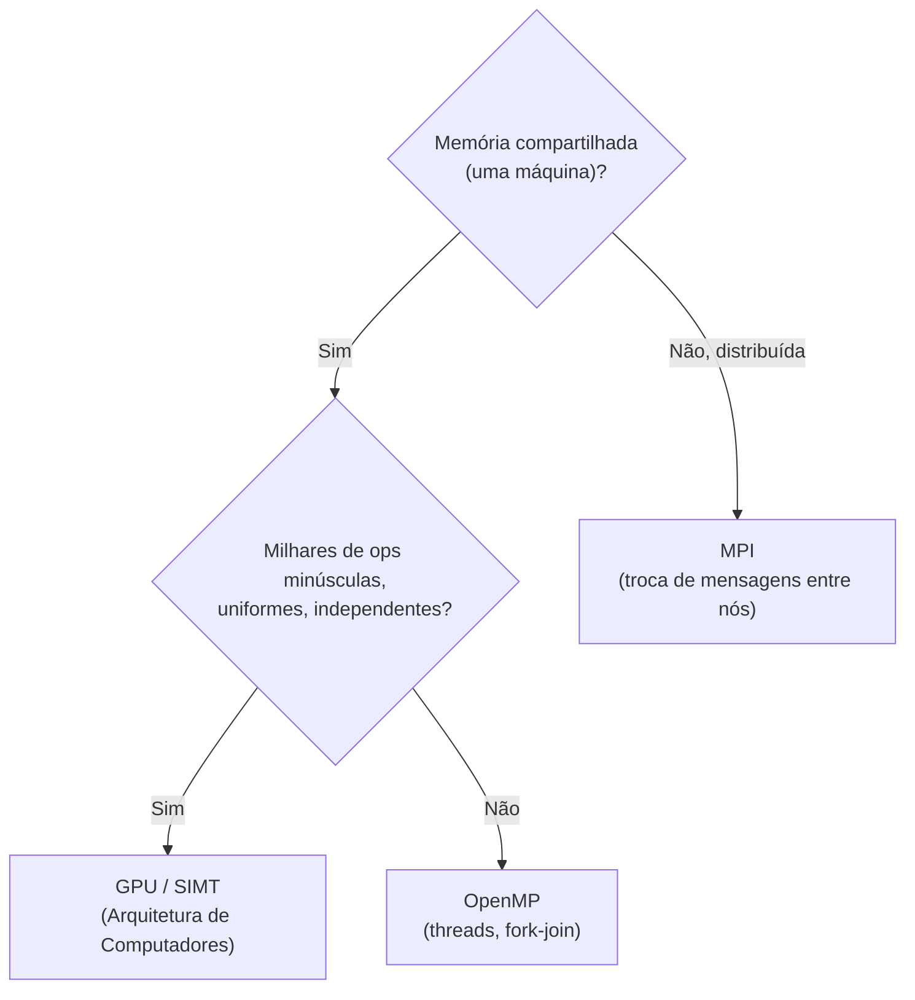

## Objetivos de Aprendizagem

- Dado um problema real de computação paralela, escolher um modelo de programação defensável (OpenMP, MPI, GPU/SIMD, ou uma combinação híbrida) usando o vocabulário de projeto que esta disciplina cobriu.
- Traçar um problema por todo o arco da disciplina: arquitetura de memória, decomposição, limite de desempenho e modelo de programação concreto.
- Explicar por que o código de HPC real em larga escala muito frequentemente combina mais de um desses modelos em vez de escolher exatamente um.
- Resumir a passagem específica que esta disciplina deixa para `distributed-systems-i`, e por que essa passagem existe.

## Contexto e Motivação

Todo conceito nesta disciplina vinha construindo rumo a uma decisão prática e recorrente: dado um problema computacional real e hardware real, qual abordagem de programação paralela deveria de fato ser usada? Este capstone não introduz nova mecânica, ele amarra as arquiteturas de memória, as técnicas de decomposição, as leis de desempenho e os dois modelos de programação concretos (OpenMP, MPI) que esta disciplina cobriu, mais o modelo de hardware GPU/SIMD já coberto em Arquitetura de Computadores, num único arcabouço de decisão, aplicado honestamente a cenários realistas em vez de tratado como um fluxograma simples com uma única resposta certa.

## Teoria Central

### O arcabouço de decisão, construído a partir dos próprios conceitos desta disciplina

Quatro perguntas, cada uma correspondendo a um agrupamento já coberto nesta disciplina, determinam juntas a abordagem certa:

1. **Qual arquitetura de memória está disponível?** (de Arquiteturas de Memória de Computadores Paralelos): a memória compartilhada de uma máquina, a memória distribuída de um cluster, ou um híbrido de ambas.
2. **Que tipo de paralelismo o problema tem?** (de Paralelismo de Tarefas vs. de Dados, e Decomposição de Domínio vs. Funcional): um grande domínio de dados uniforme, ou um conjunto de papéis funcionais distintos, ou (para problemas dignos de GPU) milhares de operações minúsculas, uniformes e independentes.
3. **O que a Lei de Amdahl/Gustafson diz sobre o ganho alcançável?** (do agrupamento de Desempenho e Escalabilidade): a fração sequencial é pequena o bastante para tornar a paralelização valiosa, e o caso de uso real é um problema de tamanho fixo (favorecendo o pensamento de escalabilidade forte) ou um problema que crescerá para usar o hardware disponível (favorecendo o pensamento de escalabilidade fraca)?
4. **Dado tudo acima, qual modelo concreto se encaixa?** OpenMP para memória compartilhada com granularidade de moderada a fina; MPI para memória distribuída, especialmente com granularidade mais grossa (dado o seu custo de comunicação mais alto, do conceito de granularidade); o modelo GPU/SIMT de Arquitetura de Computadores para operações extremamente finas, massivamente paralelas por dados e majoritariamente independentes.



### O código de HPC real geralmente combina mais de um

A resposta realista, para qualquer carga de trabalho real suficientemente grande, é muito frequentemente "mais de um desses juntos", exatamente a arquitetura híbrida de memória distribuída-compartilhada que o segundo conceito desta disciplina descreveu. Um grande cluster de simulação climática comumente usa MPI para distribuir trabalho entre nós (memória distribuída, granularidade grossa, casando com o custo de comunicação da rede), OpenMP dentro de cada nó para usar os múltiplos núcleos daquele nó (memória compartilhada, granularidade mais fina, comunicação barata e coerente em cache), e, em nós equipados com elas, kernels de GPU para os laços internos mais uniformemente paralelos por dados (o modelo SIMT de Arquitetura de Computadores). Este não é um caso de borda exótico, é a arquitetura padrão de essencialmente todo código de computação científica em larga escala rodando num supercomputador moderno hoje.

### O que esta disciplina deliberadamente deixa para depois

O paralelismo desta disciplina é fortemente acoplado e síncrono: um conjunto fixo e conhecido de processos ou threads, todos lançados (ou bifurcados) juntos, cooperando numa única computação, sem precisar raciocinar sobre qualquer processo falhando no meio do caminho, ou sobre atrasos de rede imprevisíveis entre máquinas geograficamente distantes. `distributed-systems-i`, ainda não escrito, retoma exatamente onde as suposições desta disciplina deixam de valer: máquinas independentes que podem falhar por conta própria, relógios que não podem ser perfeitamente sincronizados, e uma necessidade de consenso sobre quais máquinas estão sequer ainda participando, um conjunto de problemas genuinamente diferente (e geralmente mais difícil) do que qualquer coisa que as operações ponto a ponto ou coletivas do MPI, como cobertas aqui, foram projetadas para resolver. Reconhecer essa fronteira honestamente, em vez de supor que "memória distribuída" e "sistemas distribuídos" são o mesmo assunto só porque ambos usam a palavra "distribuído", é em si uma das lições mais importantes deste capstone.

## Exemplos Resolvidos

### Exemplo 1: Rastreamento completo de decisão para um problema realista

**Problema**: simular correntes oceânicas numa grade 3D de 10.000×10.000×50, ao longo de 1.000 passos de tempo, num cluster de 256 nós onde cada nó tem 32 núcleos de CPU e uma GPU.

```text
1. Arquitetura de memória: Híbrida, distribuída entre 256 nós,
   compartilhada (NUMA) dentro dos 32 núcleos de cada nó, mais uma GPU por nó.

2. Tipo de paralelismo: Decomposição de domínio, a grade 3D se divide
   naturalmente em blocos 3D contíguos, um por nó, cada um rodando
   código de atualização idêntico (paralelismo de dados) no seu próprio bloco.

3. Lei de desempenho: Este é naturalmente um problema de escalabilidade fraca,
   um modelo oceânico de resolução mais fina (grade maior) é a razão
   realista para usar mais nós, casando com o enquadramento de Gustafson em vez
   de "rodar esta exata grade mais rápido."

4. Modelo concreto: MPI entre os 256 nós (cada um guardando um bloco
   3D, trocando faces de fronteira com blocos vizinhos a cada
   passo de tempo via envios ponto a ponto, exatamente como o exemplo
   de troca de fronteira desta disciplina descreveu); OpenMP dentro dos
   32 núcleos de cada nó para paralelizar o laço de atualização sobre o próprio
   bloco de cada nó; a aritmética mais interna e mais uniforme (por exemplo, atualizar
   milhões de células de grade individuais com a mesma equação) delegada
   à GPU onde a carga de trabalho é regular o bastante para se beneficiar da
   execução SIMT.
```

Este é um projeto híbrido realista MPI+OpenMP+GPU, não um exercício hipotético, é exatamente a arquitetura que modelos oceânicos e climáticos reais usam em produção hoje.

### Exemplo 2: Quando NÃO usar MPI, mesmo num cluster

**Problema**: um único script rápido de limpeza de dados que roda uma vez, processa um arquivo CSV de 50 megabytes, e precisa terminar em menos de um segundo, rodado ocasionalmente num cluster de pesquisa compartilhado.

```text
Mesmo que um cluster (hardware de memória distribuída) esteja tecnicamente
disponível, os dados deste problema são pequenos o bastante para caber e
processar confortavelmente num único núcleo de uma única máquina em bem menos de um segundo.
O overhead de lançar múltiplos processos MPI, trocar quaisquer
mensagens, e coordenar um resultado muito provavelmente custaria MAIS
tempo de relógio do que a versão sequencial, especialmente uma vez que o overhead
de lançamento de processos e de inicialização do MPI seja contado, e a Lei de Amdahl
não dá benefício algum se não há nenhuma fração paralela significativa
a explorar num problema tão pequeno e tão rápido assim.

Escolha certa: código sequencial simples. O paralelismo é uma ferramenta para
problemas onde o volume de computação ou de dados genuinamente justifica o seu
custo real de coordenação, não um padrão a recorrer só porque
hardware de memória distribuída ou compartilhada por acaso está ali disponível.
```

Este exemplo é um contraponto deliberado e honesto ao resto da disciplina: reconhecer quando *não* paralelizar de forma alguma é tão parte deste arcabouço de decisão quanto escolher corretamente entre OpenMP, MPI e GPU quando o paralelismo genuinamente é justificado.

## Equívocos Comuns e Armadilhas

- **"Um programa de HPC real deveria escolher exatamente um entre OpenMP, MPI ou GPU e usar só aquele."** O código de computação científica em larga escala real muito frequentemente combina os três em níveis diferentes (MPI entre nós, OpenMP dentro de um nó, GPU para a aritmética uniforme mais interna). Tratar a escolha como estritamente ou-um-ou-outro ignora como os sistemas de HPC de produção são de fato construídos.
- **"Memória distribuída (MPI) e sistemas distribuídos são o mesmo tópico."** O modelo de memória distribuída do MPI assume um conjunto fixo, conhecido e cooperando de forma síncrona de processos, sem tratamento de falha parcial; os sistemas distribuídos (uma disciplina posterior) lidam especificamente com máquinas independentes que podem falhar por conta própria, atrasos de rede imprevisíveis, e a necessidade de consenso, um problema relacionado mas genuinamente mais difícil e diferente.
- **"Mais paralelismo (mais processadores, mais granularidade) é sempre o objetivo."** O Exemplo 2 mostra um caso onde a resposta certa é nenhum paralelismo, o arcabouço de decisão que este capstone constrói deveria sempre começar perguntando se a escala do problema genuinamente justifica o custo real de coordenação e comunicação que o paralelismo introduz.
- **"Escolher um modelo de programação é uma decisão única que não precisa ser revista."** Conforme o tamanho do problema, o hardware disponível, ou os requisitos de desempenho mudam, um programa originalmente bem servido por OpenMP puro pode mais tarde se beneficiar de adicionar MPI (para escalar além de uma máquina) ou delegação à GPU (conforme mais subcomputações uniformes são identificadas), o arcabouço de decisão neste capstone se aplica tanto a evoluir um programa existente quanto a projetar um novo.

## Resumo

Escolher um modelo de programação paralela é uma decisão construída diretamente a partir dos próprios conceitos desta disciplina: a arquitetura de memória disponível (compartilhada, distribuída, ou híbrida), o tipo de paralelismo que o problema tem (de dados, de tarefas, ou extremamente fino-e-uniforme), o que as Leis de Amdahl e de Gustafson dizem sobre o ganho realista, e, finalmente, o modelo concreto que se encaixa: OpenMP para memória compartilhada, MPI para memória distribuída, GPU/SIMT (de Arquitetura de Computadores) para paralelismo de dados massivamente uniforme, e muito frequentemente alguma combinação real dos três para código de HPC de produção em larga escala. O paralelismo fortemente acoplado e síncrono desta disciplina deliberadamente para antes dos problemas mais difíceis de falha de processo, imprevisibilidade de rede e consenso, que `distributed-systems-i` toma a seguir, e saber quando um problema simplesmente não precisa de paralelismo algum é tão parte do julgamento desta disciplina quanto saber como aplicá-lo quando precisa.

## Documentation Links

- [LLNL: Introduction to Parallel Computing Tutorial](https://hpc.llnl.gov/documentation/tutorials/introduction-parallel-computing-tutorial): fonte para a visão geral dos modelos de programação paralela a partir da qual o arcabouço de decisão deste capstone é construído.
- [UC Berkeley CS267: Applications of Parallel Computers](https://sites.google.com/lbl.gov/cs267-spr2024): contexto de curso real confirmando que projetos híbridos MPI+OpenMP+GPU são a arquitetura padrão para computação científica em larga escala.
