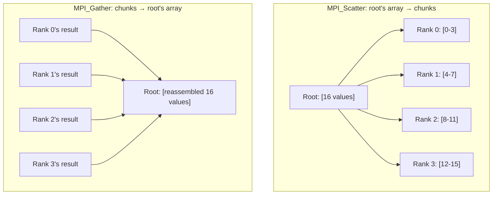

## Learning Objectives

- Use `MPI_Bcast` to send one process's data to every process, and explain why this is more efficient than a loop of point-to-point sends.
- Use `MPI_Reduce` to combine every process's data into one with an operator, and relate it directly to OpenMP's `reduction` clause.
- Use `MPI_Scatter` and `MPI_Gather` to split and reassemble an array across ranks, and connect this to the domain-decomposition concept from earlier in this discipline.
- Explain why collective operations, unlike point-to-point ones, require every process in the communicator to participate.

## Context & Motivation

Point-to-point communication, just covered, expresses exactly one relationship: one sender, one receiver. But most real MPI programs spend the overwhelming majority of their communication on patterns that involve *every* process at once — distributing one array across all of them, or combining every process's partial result back into one — and writing these patterns by hand as a loop of individual `MPI_Send`/`MPI_Recv` calls would be both verbose and, more importantly, far less efficient than necessary. MPI's **collective communication** routines express these whole-communicator patterns directly, letting the underlying implementation use genuinely faster communication topologies (like a tree-shaped broadcast, reaching all N processes in roughly log(N) steps instead of N sequential sends) that a hand-written loop would not automatically get.

## Core Theory

### `MPI_Bcast`: one-to-all

`MPI_Bcast` sends one process's data to every process in the communicator, replacing what a rank's data would otherwise take, in one call:

```c
int value;
if (rank == 0) {
    value = 42;   // rank 0 is the "root" — it has the data to distribute
}
MPI_Bcast(&value, 1, MPI_INT, 0, MPI_COMM_WORLD);
// After this call, every rank's `value` variable holds 42 —
// including rank 0's, which already had it.
```

Every rank calls the identical `MPI_Bcast` line (matching the SPMD pattern already established), specifying rank 0 as the **root** — the source of the data being distributed. A hand-written alternative (`if (rank == 0) { for each other rank, MPI_Send(...) }`) would work correctly but would take time proportional to the number of ranks; real MPI implementations typically implement `MPI_Bcast` using a tree-shaped propagation (rank 0 sends to ranks 1 and 2, who each then send to two more ranks, and so on), completing in time proportional to the logarithm of the rank count instead.

### `MPI_Reduce`: all-to-one, combined by an operator

`MPI_Reduce` is the direct MPI analogue of OpenMP's `reduction` clause, but across separate processes instead of threads within one process:

```c
int local_sum = compute_local_partial_sum();   // each rank computes its own share
int global_sum;
MPI_Reduce(&local_sum, &global_sum, 1, MPI_INT, MPI_SUM, 0, MPI_COMM_WORLD);
// After this call, rank 0's `global_sum` holds the sum of every
// rank's `local_sum`. Every OTHER rank's `global_sum` is undefined —
// only the root rank receives the combined result.
```

Every rank supplies its own `local_sum` as input; the operator `MPI_SUM` (MPI also supports `MPI_MAX`, `MPI_MIN`, `MPI_PROD`, and others, exactly paralleling OpenMP's reduction operators) combines all of them, and the single combined result lands only in the specified root rank's output buffer. `MPI_Allreduce` is a close variant that delivers the combined result to *every* rank instead of just the root, useful when every process needs to know the global total to continue its own computation.

### `MPI_Scatter` and `MPI_Gather`: splitting and reassembling an array

`MPI_Scatter` distributes distinct, contiguous chunks of one array (held by a root rank) to different ranks — one chunk per rank — the direct MPI realization of domain decomposition, done in a single call instead of a manual loop of sends:

```c
int full_array[16];    // only meaningful on the root rank before scatter
int my_chunk[4];        // every rank's own local chunk after scatter

if (rank == 0) { /* fill full_array with 16 values */ }

MPI_Scatter(full_array, 4, MPI_INT,   // send 4 ints per rank, from root's array
            my_chunk,   4, MPI_INT,   // into each rank's own 4-int buffer
            0, MPI_COMM_WORLD);
```

`MPI_Gather` is the exact reverse: it collects each rank's own local data back into one contiguous array on a single root rank:

```c
int my_result[4];        // each rank's own computed result
int full_result[16];     // only meaningful on the root rank after gather

MPI_Gather(my_result,  4, MPI_INT,
           full_result, 4, MPI_INT,
           0, MPI_COMM_WORLD);
```



A very common real pattern is scatter, then local computation, then gather in sequence — distribute a large array's chunks, let every rank independently process its own chunk (using its own local computation, or even its own nested OpenMP parallelism, the hybrid pattern this discipline's earlier memory-architecture concept anticipated), then collect all the processed chunks back together — the exact domain-decomposition workflow this discipline described in the abstract, now expressed as three concrete MPI calls.

### Collective operations require every process to participate

Every collective call — `MPI_Bcast`, `MPI_Reduce`, `MPI_Scatter`, `MPI_Gather`, and others — is, by the MPI standard, required to be called by *every* process in the specified communicator, in the same relative order, even though only some of them (like the root in `Bcast`) supply or receive the "interesting" data. A process that skips a collective call any other process in the same communicator is waiting on will cause that other process to block indefinitely — a variant of the same barrier-like synchronization already discussed earlier in this discipline, now embedded implicitly inside every collective operation.

## Worked Examples

### Example 1: A complete scatter-compute-gather-reduce pipeline

Computing the sum of squares of a 16-element array across 4 ranks, combining scatter, local computation, and a final reduce:

```c
int full_array[16];      // filled on rank 0 only
int my_chunk[4];
double local_sum = 0.0, global_sum;

if (rank == 0) { /* fill full_array */ }

MPI_Scatter(full_array, 4, MPI_INT, my_chunk, 4, MPI_INT, 0, MPI_COMM_WORLD);

for (int i = 0; i < 4; i++) {
    local_sum += my_chunk[i] * my_chunk[i];   // each rank's own local work
}

MPI_Reduce(&local_sum, &global_sum, 1, MPI_DOUBLE, MPI_SUM, 0, MPI_COMM_WORLD);

if (rank == 0) {
    printf("Sum of squares: %f\n", global_sum);
}
```

This traces the full domain-decomposition life cycle already described in the abstract earlier in this discipline: split the data (`Scatter`), have each rank compute independently on its own share (no communication needed here, since squaring is fully independent per element), and combine the partial results (`Reduce`) — three MPI calls replacing what would otherwise require a hand-written loop of individual sends and receives.

### Example 2: Why `MPI_Bcast` beats a hand-written send loop

```text
Hand-written broadcast (rank 0 sends to each other rank in a loop):
  Time ≈ (N - 1) × (one message latency)     — linear in N

MPI_Bcast (typical tree-based implementation):
  Time ≈ log2(N) × (one message latency)     — logarithmic in N

For N = 1,024 ranks:
  Hand-written: ≈ 1,023 × latency
  MPI_Bcast:    ≈ 10 × latency     (since log2(1024) = 10)
```

At large process counts, this difference is not a minor optimization — it is the difference between a broadcast that scales acceptably and one that becomes the dominant cost of the entire program, which is exactly why real MPI programs almost always prefer the built-in collective over a hand-written equivalent whenever one exists.

## Common Misconceptions & Pitfalls

- **"Only the root rank needs to call a collective operation like `MPI_Bcast` or `MPI_Reduce`."** Every rank in the specified communicator must call the collective operation — even ranks that are only receiving (in a `Bcast`) or only contributing without receiving the combined result (non-root ranks in `Reduce`) must still make the call, or the other ranks calling it will block waiting for them.
- **"`MPI_Reduce` and `MPI_Allreduce` do the same thing."** `MPI_Reduce` delivers the combined result to one specified root rank only; `MPI_Allreduce` delivers it to every rank — choosing the wrong one either leaves most ranks without a result they needed, or does unnecessary extra communication delivering a result nothing but the root actually needed.
- **"Collective communication is just a convenience wrapper with no real performance benefit over hand-written point-to-point loops."** Real MPI implementations use genuinely more efficient communication topologies (tree-based, pipelined, or otherwise) for collectives, exactly as Example 2 quantified — the performance difference at scale can be enormous, not merely cosmetic.
- **"`MPI_Scatter` and `MPI_Gather` require the data to already be evenly divisible among ranks."** The basic forms shown here do assume equal-sized chunks; MPI also provides `MPI_Scatterv`/`MPI_Gatherv` variants (not covered in depth here) specifically for uneven chunk sizes, relevant whenever load-balancing concerns (from earlier in this discipline) mean different ranks should legitimately get different amounts of data.

## Summary

Collective communication expresses whole-communicator patterns in a single call, more efficiently than an equivalent hand-written loop of point-to-point messages: `MPI_Bcast` distributes one rank's data to all ranks; `MPI_Reduce` (the direct MPI analogue of OpenMP's `reduction` clause) combines every rank's data into one, at a specified root, using an operator like sum or max; `MPI_Scatter` and `MPI_Gather` split and reassemble an array across ranks, directly realizing the domain-decomposition workflow described earlier in this discipline. Every collective call must be made by every process in the communicator, a rule that embeds an implicit synchronization point into each one. This closes this discipline's MPI cluster, and the practical programming-model material overall; the discipline's capstone ties OpenMP, MPI, and the GPU/SIMD model from Computer Architecture together into one real decision framework.

## Documentation Links

- [LLNL HPC Tutorials — MPI](https://hpc-tutorials.llnl.gov/mpi/) — source for the collective communication routines (`MPI_Bcast`, `MPI_Reduce`, `MPI_Scatter`, `MPI_Gather`) covered in this concept.
