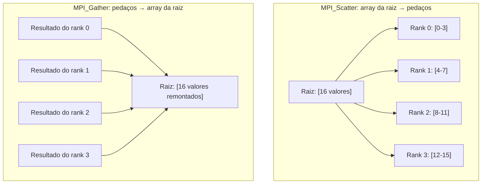

## Objetivos de Aprendizagem

- Usar `MPI_Bcast` para enviar os dados de um processo a todos os processos, e explicar por que isto é mais eficiente do que um laço de envios ponto a ponto.
- Usar `MPI_Reduce` para combinar os dados de todos os processos num só com um operador, e relacioná-lo diretamente com a cláusula `reduction` do OpenMP.
- Usar `MPI_Scatter` e `MPI_Gather` para dividir e remontar um array por entre os ranks, e conectar isto ao conceito de decomposição de domínio de antes nesta disciplina.
- Explicar por que as operações coletivas, ao contrário das ponto a ponto, exigem que todo processo no comunicador participe.

## Contexto e Motivação

A comunicação ponto a ponto, recém-coberta, expressa exatamente uma relação: um remetente, um receptor. Mas a maioria dos programas MPI reais gasta a esmagadora maioria da sua comunicação em padrões que envolvem *todo* processo de uma vez, distribuindo um array por todos eles, ou combinando o resultado parcial de todo processo de volta num só, e escrever esses padrões à mão como um laço de chamadas individuais `MPI_Send`/`MPI_Recv` seria tanto verboso quanto, mais importante, muito menos eficiente do que o necessário. As rotinas de **comunicação coletiva** do MPI expressam esses padrões de comunicador inteiro diretamente, deixando a implementação subjacente usar topologias de comunicação genuinamente mais rápidas (como um broadcast em forma de árvore, alcançando todos os N processos em cerca de log(N) passos em vez de N envios sequenciais) que um laço escrito à mão não obteria automaticamente.

## Teoria Central

### `MPI_Bcast`: um-para-todos

`MPI_Bcast` envia os dados de um processo a todo processo no comunicador, numa única chamada:

```c
int value;
if (rank == 0) {
    value = 42;   // o rank 0 é a "raiz": ele tem os dados a distribuir
}
MPI_Bcast(&value, 1, MPI_INT, 0, MPI_COMM_WORLD);
// Após esta chamada, a variável `value` de todo rank guarda 42,
// incluindo a do rank 0, que já a tinha.
```

Todo rank chama a linha `MPI_Bcast` idêntica (casando com o padrão SPMD já estabelecido), especificando o rank 0 como a **raiz**, a fonte dos dados sendo distribuídos. Uma alternativa escrita à mão (`if (rank == 0) { para cada outro rank, MPI_Send(...) }`) funcionaria corretamente mas levaria tempo proporcional ao número de ranks; as implementações MPI reais tipicamente implementam `MPI_Bcast` usando uma propagação em forma de árvore (o rank 0 envia aos ranks 1 e 2, que então cada um envia a mais dois ranks, e assim por diante), completando em tempo proporcional ao logaritmo da contagem de ranks.

### `MPI_Reduce`: todos-para-um, combinados por um operador

`MPI_Reduce` é o análogo MPI direto da cláusula `reduction` do OpenMP, mas através de processos separados em vez de threads dentro de um processo:

```c
int local_sum = compute_local_partial_sum();   // cada rank computa a sua própria parcela
int global_sum;
MPI_Reduce(&local_sum, &global_sum, 1, MPI_INT, MPI_SUM, 0, MPI_COMM_WORLD);
// Após esta chamada, o `global_sum` do rank 0 guarda a soma do
// `local_sum` de todo rank. O `global_sum` de todo OUTRO rank é indefinido:
// só o rank raiz recebe o resultado combinado.
```

Todo rank fornece o seu próprio `local_sum` como entrada; o operador `MPI_SUM` (o MPI também suporta `MPI_MAX`, `MPI_MIN`, `MPI_PROD`, e outros, exatamente em paralelo aos operadores de redução do OpenMP) combina todos eles, e o único resultado combinado aterrissa só no buffer de saída do rank raiz especificado. `MPI_Allreduce` é uma variante próxima que entrega o resultado combinado a *todo* rank em vez de só à raiz, útil quando todo processo precisa saber o total global para continuar a sua própria computação.

### `MPI_Scatter` e `MPI_Gather`: dividindo e remontando um array

`MPI_Scatter` distribui pedaços distintos e contíguos de um array (guardado por um rank raiz) a ranks diferentes, um pedaço por rank, a realização MPI direta da decomposição de domínio, feita numa única chamada em vez de um laço manual de envios:

```c
int full_array[16];    // só significativo no rank raiz antes do scatter
int my_chunk[4];        // o próprio pedaço local de cada rank após o scatter

if (rank == 0) { /* preenche full_array com 16 valores */ }

MPI_Scatter(full_array, 4, MPI_INT,   // envia 4 ints por rank, do array da raiz
            my_chunk,   4, MPI_INT,   // para o próprio buffer de 4 ints de cada rank
            0, MPI_COMM_WORLD);
```

`MPI_Gather` é o reverso exato: ele coleta os próprios dados locais de cada rank de volta num único array contíguo num único rank raiz:

```c
int my_result[4];        // o próprio resultado computado de cada rank
int full_result[16];     // só significativo no rank raiz após o gather

MPI_Gather(my_result,  4, MPI_INT,
           full_result, 4, MPI_INT,
           0, MPI_COMM_WORLD);
```



Um padrão real muito comum é scatter, depois computação local, depois gather em sequência: distribuir os pedaços de um array grande, deixar todo rank processar independentemente o seu próprio pedaço (usando a sua própria computação local, ou até o seu próprio paralelismo OpenMP aninhado, o padrão híbrido que o conceito de arquitetura de memória anterior desta disciplina antecipou), depois coletar todos os pedaços processados de volta juntos, o exato fluxo de trabalho de decomposição de domínio que esta disciplina descreveu no abstrato, agora expresso como três chamadas MPI concretas.

### Operações coletivas exigem que todo processo participe

Toda chamada coletiva (`MPI_Bcast`, `MPI_Reduce`, `MPI_Scatter`, `MPI_Gather`, e outras) é, pelo padrão MPI, obrigada a ser chamada por *todo* processo no comunicador especificado, na mesma ordem relativa, mesmo que só alguns deles (como a raiz no `Bcast`) forneçam ou recebam os dados "interessantes". Um processo que pule uma chamada coletiva pela qual qualquer outro processo no mesmo comunicador esteja esperando fará aquele outro processo bloquear indefinidamente, uma variante da mesma sincronização tipo barreira já discutida antes nesta disciplina, agora embutida implicitamente dentro de toda operação coletiva.

## Exemplos Resolvidos

### Exemplo 1: Um pipeline completo de scatter-computação-gather-reduce

Computando a soma dos quadrados de um array de 16 elementos através de 4 ranks, combinando scatter, computação local, e um reduce final:

```c
int full_array[16];      // preenchido só no rank 0
int my_chunk[4];
double local_sum = 0.0, global_sum;

if (rank == 0) { /* preenche full_array */ }

MPI_Scatter(full_array, 4, MPI_INT, my_chunk, 4, MPI_INT, 0, MPI_COMM_WORLD);

for (int i = 0; i < 4; i++) {
    local_sum += my_chunk[i] * my_chunk[i];   // o próprio trabalho local de cada rank
}

MPI_Reduce(&local_sum, &global_sum, 1, MPI_DOUBLE, MPI_SUM, 0, MPI_COMM_WORLD);

if (rank == 0) {
    printf("Sum of squares: %f\n", global_sum);
}
```

Isto traça o ciclo de vida completo de decomposição de domínio já descrito no abstrato antes nesta disciplina: dividir os dados (`Scatter`), fazer cada rank computar independentemente na sua própria parcela (nenhuma comunicação necessária aqui, já que elevar ao quadrado é totalmente independente por elemento), e combinar os resultados parciais (`Reduce`), três chamadas MPI substituindo o que de outra forma exigiria um laço escrito à mão de envios e recebimentos individuais.

### Exemplo 2: Por que `MPI_Bcast` supera um laço de envio escrito à mão

```text
Broadcast escrito à mão (rank 0 envia a cada outro rank num laço):
  Tempo ≈ (N - 1) × (uma latência de mensagem)     (linear em N)

MPI_Bcast (implementação típica baseada em árvore):
  Tempo ≈ log2(N) × (uma latência de mensagem)     (logarítmico em N)

Para N = 1.024 ranks:
  Escrito à mão: ≈ 1.023 × latência
  MPI_Bcast:     ≈ 10 × latência     (já que log2(1024) = 10)
```

Em grandes contagens de processos, esta diferença não é uma otimização menor, é a diferença entre um broadcast que escala aceitavelmente e um que se torna o custo dominante do programa inteiro, que é exatamente por que os programas MPI reais quase sempre preferem a coletiva embutida a um equivalente escrito à mão sempre que uma existe.

## Equívocos Comuns e Armadilhas

- **"Só o rank raiz precisa chamar uma operação coletiva como `MPI_Bcast` ou `MPI_Reduce`."** Todo rank no comunicador especificado deve chamar a operação coletiva, até ranks que estão só recebendo (num `Bcast`) ou só contribuindo sem receber o resultado combinado (ranks não raiz num `Reduce`) ainda devem fazer a chamada, ou os outros ranks que a chamam bloquearão esperando por eles.
- **"`MPI_Reduce` e `MPI_Allreduce` fazem a mesma coisa."** `MPI_Reduce` entrega o resultado combinado a só um rank raiz especificado; `MPI_Allreduce` o entrega a todo rank, escolher o errado ou deixa a maioria dos ranks sem um resultado de que precisavam, ou faz comunicação extra desnecessária entregando um resultado de que nada além da raiz de fato precisava.
- **"A comunicação coletiva é só um invólucro de conveniência sem benefício real de desempenho sobre laços ponto a ponto escritos à mão."** As implementações MPI reais usam topologias de comunicação genuinamente mais eficientes (baseadas em árvore, em pipeline, ou de outra forma) para as coletivas, exatamente como o Exemplo 2 quantificou, a diferença de desempenho em escala pode ser enorme, não meramente cosmética.
- **"`MPI_Scatter` e `MPI_Gather` exigem que os dados já sejam uniformemente divisíveis entre os ranks."** As formas básicas mostradas aqui de fato assumem pedaços de tamanho igual; o MPI também fornece as variantes `MPI_Scatterv`/`MPI_Gatherv` (não cobertas em profundidade aqui) especificamente para tamanhos de pedaço desiguais, relevantes sempre que preocupações de balanceamento de carga (de antes nesta disciplina) signifiquem que ranks diferentes deveriam legitimamente receber quantidades diferentes de dados.

## Resumo

A comunicação coletiva expressa padrões de comunicador inteiro numa única chamada, de forma mais eficiente do que um laço equivalente escrito à mão de mensagens ponto a ponto: `MPI_Bcast` distribui os dados de um rank a todos os ranks; `MPI_Reduce` (o análogo MPI direto da cláusula `reduction` do OpenMP) combina os dados de todo rank num só, numa raiz especificada, usando um operador como soma ou máximo; `MPI_Scatter` e `MPI_Gather` dividem e remontam um array por entre os ranks, realizando diretamente o fluxo de trabalho de decomposição de domínio descrito antes nesta disciplina. Toda chamada coletiva deve ser feita por todo processo no comunicador, uma regra que embute um ponto de sincronização implícito em cada uma. Isto encerra o agrupamento de MPI desta disciplina, e o material prático de modelo de programação no geral; o capstone da disciplina amarra OpenMP, MPI e o modelo GPU/SIMD de Arquitetura de Computadores num único arcabouço de decisão real.

## Documentation Links

- [LLNL HPC Tutorials: MPI](https://hpc-tutorials.llnl.gov/mpi/): fonte para as rotinas de comunicação coletiva (`MPI_Bcast`, `MPI_Reduce`, `MPI_Scatter`, `MPI_Gather`) cobertas neste conceito.
