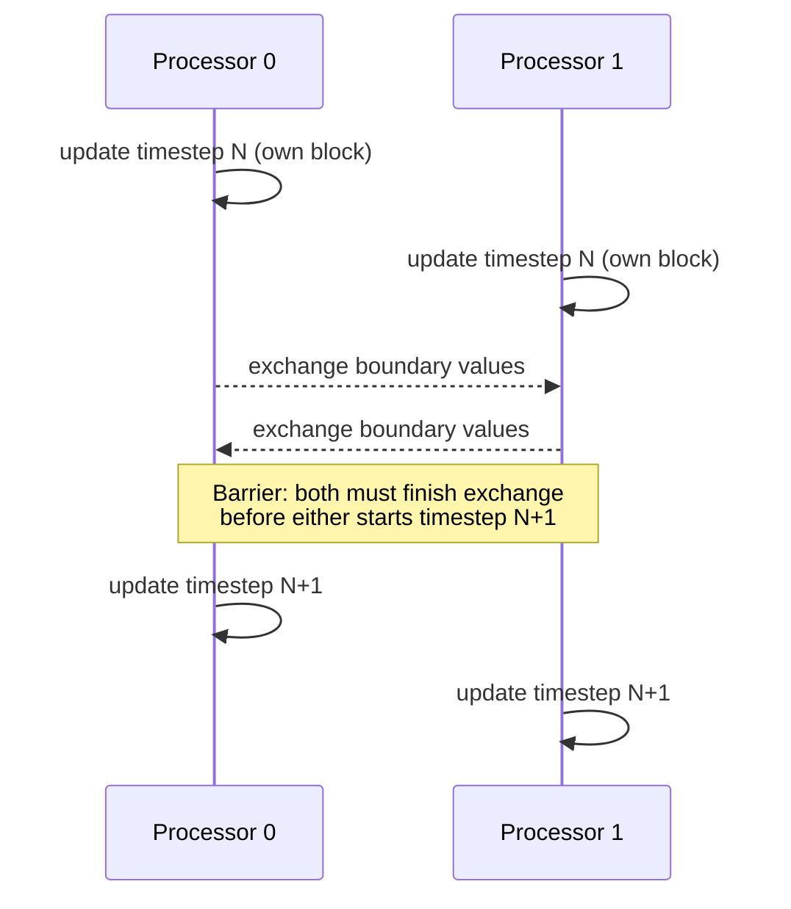

## Learning Objectives

- Define communication, synchronization, and data dependencies as three distinct costs a decomposed parallel program must pay, per LLNL's design framework.
- Identify a true data dependency in a piece of code, and explain why it constrains how that code can be parallelized.
- Distinguish communication cost in shared-memory (implicit, via cache coherence traffic) from distributed-memory (explicit, via messages).
- Explain why synchronization is needed even when there is no explicit data dependency, using a concrete boundary-exchange example.

## Context & Motivation

The previous concept showed that decomposing a problem — whether by domain or by function — almost always introduces new costs that did not exist in the original sequential version: pieces of the computation now need to exchange data (communication), some operations must wait for others to finish before proceeding correctly (synchronization), and some pairs of operations simply cannot be reordered or run concurrently at all without changing the answer (data dependencies). LLNL's Introduction to Parallel Computing tutorial treats these as three closely related but genuinely distinct concerns in designing a parallel program, and this concept develops each one before granularity and load balancing (which are direct consequences of communication cost) are introduced next.

Understanding these three costs precisely — not just as a vague sense that "parallel programs are harder" — is what lets a programmer predict, before writing any code, whether a given decomposition will actually perform well, or whether it will spend more time coordinating than computing.

## Core Theory

### Data dependencies: when order cannot be changed

A data dependency exists between two operations when one operation's result is needed as an input to the other, which means their relative order cannot be changed (or the two cannot run truly concurrently) without risking an incorrect result. The classic taxonomy, already familiar in spirit from pipeline hazards in Computer Architecture, transfers directly to software:

- **Flow (true) dependency**: operation B reads a value that operation A writes. B must happen after A.
- **Anti-dependency**: operation B writes a value that operation A reads. B must not overwrite it before A has read it.
- **Output dependency**: both A and B write the same location; the final value must reflect whichever should logically happen last.

A data dependency is a property of the *problem itself*, not of the hardware or programming model — no amount of clever engineering can make two operations with a genuine flow dependency execute correctly out of order. The practical skill this discipline builds is recognizing which apparent dependencies are real (and must be respected) and which are merely accidents of how sequential code happened to be written (and can be safely removed by restructuring, exactly as data-hazard forwarding in Computer Architecture worked around dependencies at the hardware level rather than eliminating them).

### Communication: moving data between the pieces

Whenever a decomposition creates pieces that need each other's data — the boundary problem from the previous concept's domain decomposition, or a pipeline stage from functional decomposition — that data has to move. In shared memory, communication happens implicitly: one processor writes a value, another reads it, and the cache-coherence protocol (MESI, already covered in Computer Architecture) is responsible for making sure the reader sees the correct, up-to-date value. In distributed memory, there is no such implicit mechanism at all — communication must be an explicit act, a message sent by one process and received by another, which is precisely what MPI, covered later in this discipline, exists to do.

The cost asymmetry matters enormously for design: a shared-memory "communication" (a cache-coherent read) costs on the order of the memory-hierarchy latencies already quantified in Computer Architecture's AMAT material; a distributed-memory communication (a network message) costs orders of magnitude more, as the previous concept's worked example showed concretely. A decomposition that looks efficient on paper can become communication-bound in practice if it requires too much data to cross that gap too often.

### Synchronization: agreeing on when, not just what

Even when two pieces of work have no data dependency on each other's *values*, they may still need to agree on *timing* — this is synchronization. The clearest example: in a domain-decomposed simulation, every processor must finish updating its current timestep's boundary values before any processor reads a neighbor's boundary for the *next* timestep's computation. No single value here has a classic flow dependency in the traditional sense across processors within one timestep, but the overall computation is still only correct if every processor's timestep-N work completes before any processor begins using timestep-N's results to compute timestep-N+1 — a **barrier**, the simplest and most common synchronization primitive in parallel computing, forcing every participant to reach a point before any can proceed past it.



### Why all three costs together determine feasibility

A decomposition that looks perfectly balanced in terms of raw computation can still perform badly if it requires too much communication, too much synchronization, or has data dependencies that force long serial chains instead of true concurrency. Recognizing all three costs, together, before choosing a decomposition, is the practical skill LLNL's tutorial frames "Designing Parallel Programs" around — and it is exactly what the next concept, granularity and load balancing, gives a name and a set of tradeoffs to.

## Worked Examples

### Example 1: Classifying dependencies in a small code fragment

```c
int a = compute_x();      // (1)
int b = a + 1;             // (2) reads a, written in (1): flow dependency on (1)
a = compute_y();           // (3) writes a again, after (2) already read it:
                            //     anti-dependency between (2) and (3)
int c = a * 2;              // (4) reads a, written in (3): flow dependency on (3)
```

Statements (1) and (2) cannot be reordered or parallelized against each other — (2) genuinely needs (1)'s result. Statements (2) and (3), despite touching the same variable `a`, have no flow dependency between them (neither reads what the other most recently wrote in that direction) — but (3) must not execute before (2) has read the old value of `a`, an anti-dependency that would silently corrupt the computation if violated. This kind of line-by-line dependency analysis, applied to a whole loop body, is exactly what determines whether a loop can be safely data-parallelized (an upcoming OpenMP concept) or must remain sequential.

### Example 2: Quantifying communication cost in a boundary exchange

A 2D grid, 1,000×1,000 cells, domain-decomposed into 10 horizontal strips (one per processor), each strip 1,000×100 cells. Each timestep, every processor must exchange its top and bottom row (1,000 cells each) with its two vertical neighbors:

```text
Computation per processor per timestep:  100 rows × 1,000 cols = 100,000
                                          cell updates
Communication per processor per timestep: 2 boundary rows × 1,000 cells
                                          = 2,000 cells exchanged

Ratio of computation to communication: 100,000 : 2,000 = 50 : 1
```

A 50:1 computation-to-communication ratio is generally favorable — most of each processor's time is spent on useful work, not exchanging boundary data. If the same grid were instead split into 500 very thin horizontal strips (2 rows each), the ratio would collapse to roughly 2:2 = 1:1, meaning half the work per timestep would be communication overhead — a direct illustration of why granularity, the next concept, is not a minor tuning detail but a first-order design decision.

## Common Misconceptions & Pitfalls

- **"If there's no explicit shared variable, there's no need for synchronization."** Synchronization can be purely about timing (a barrier ensuring one phase finishes before the next begins), independent of whether any single variable is shared — the boundary-exchange example needs a barrier even though each processor's own memory is private.
- **"All dependencies in sequential code are real and must be preserved."** Some apparent dependencies (anti- and output-dependencies caused by variable reuse, as in Example 1) are artifacts of how the sequential code happened to reuse storage, not genuine ordering requirements of the underlying computation — recognizing and removing these (e.g., by using separate variables) is a real and common parallelization technique.
- **"Communication cost is the same regardless of memory architecture."** It is not remotely the same — implicit shared-memory communication via cache coherence is roughly two orders of magnitude cheaper than an explicit distributed-memory network message, a difference that should directly shape which decomposition granularity is acceptable on each kind of hardware.
- **"More frequent synchronization is always safer."** It's always more correct with respect to the specific hazard it addresses, but excessive synchronization (a barrier every single operation, rather than only where genuinely needed) can serialize a parallel program so heavily that it performs no better than — or worse than — the sequential version.

## Summary

Every decomposition pays three related but distinct costs: data dependencies (true ordering constraints between operations, which no engineering can safely violate, though apparent-but-not-real dependencies can often be removed by restructuring), communication (moving data between pieces — implicit and cheap via cache coherence in shared memory, explicit and expensive via messages in distributed memory), and synchronization (agreeing on timing, needed even without a value dependency, most simply enforced with a barrier). Recognizing all three, together, for a candidate decomposition — before writing any parallel code — is what predicts whether that decomposition will actually perform well, and sets up the next concept's granularity and load-balancing tradeoffs directly.

## Documentation Links

- [LLNL — Introduction to Parallel Computing Tutorial](https://hpc.llnl.gov/documentation/tutorials/introduction-parallel-computing-tutorial) — source for the communication, synchronization, and data-dependencies design framework.
