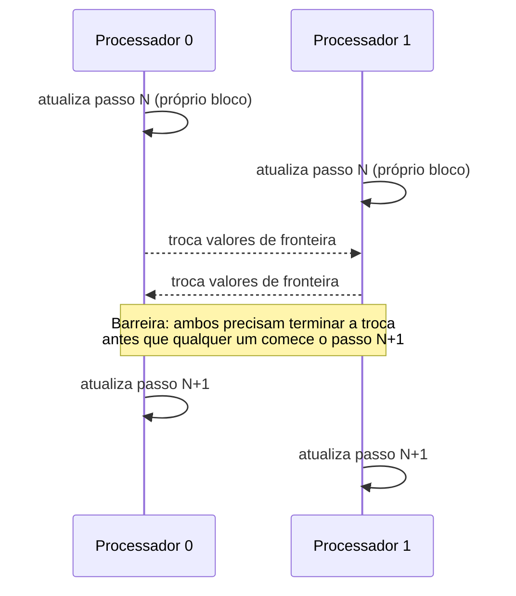

## Objetivos de Aprendizagem

- Definir comunicação, sincronização e dependências de dados como três custos distintos que um programa paralelo decomposto precisa pagar, segundo o framework de projeto do LLNL.
- Identificar uma dependência de dados verdadeira num trecho de código, e explicar por que ela restringe como esse código pode ser paralelizado.
- Distinguir o custo de comunicação em memória compartilhada (implícito, via tráfego de coerência de cache) do custo em memória distribuída (explícito, via mensagens).
- Explicar por que a sincronização é necessária mesmo quando não há dependência de dados explícita, usando um exemplo concreto de troca de fronteiras.

## Contexto e Motivação

O conceito anterior mostrou que decompor um problema, seja por domínio ou por função, quase sempre introduz custos novos que não existiam na versão sequencial original: pedaços da computação agora precisam trocar dados (comunicação), algumas operações precisam esperar que outras terminem antes de prosseguir corretamente (sincronização), e alguns pares de operações simplesmente não podem ser reordenados ou rodar concorrentemente sem mudar a resposta (dependências de dados). O tutorial Introduction to Parallel Computing do LLNL trata estes como três preocupações intimamente relacionadas, mas genuinamente distintas, no projeto de um programa paralelo, e este conceito desenvolve cada uma antes que granularidade e balanceamento de carga (que são consequências diretas do custo de comunicação) sejam introduzidos a seguir.

Entender estes três custos com precisão, e não apenas como uma sensação vaga de que "programas paralelos são mais difíceis", é o que permite a um programador prever, antes de escrever qualquer código, se uma dada decomposição vai de fato ter bom desempenho, ou se vai gastar mais tempo coordenando do que computando.

## Teoria Central

### Dependências de dados: quando a ordem não pode ser mudada

Existe uma dependência de dados entre duas operações quando o resultado de uma operação é necessário como entrada para a outra, o que significa que a ordem relativa delas não pode ser mudada (ou as duas não podem rodar verdadeiramente em concorrência) sem arriscar um resultado incorreto. A taxonomia clássica, já familiar em espírito dos hazards de pipeline em Arquitetura de Computadores, se transfere diretamente para o software:

- **Dependência de fluxo (verdadeira)**: a operação B lê um valor que a operação A escreve. B precisa acontecer depois de A.
- **Antidependência**: a operação B escreve um valor que a operação A lê. B não pode sobrescrevê-lo antes que A o tenha lido.
- **Dependência de saída**: A e B escrevem na mesma posição; o valor final precisa refletir aquela que logicamente deveria acontecer por último.

Uma dependência de dados é uma propriedade do *próprio problema*, não do hardware ou do modelo de programação: nenhuma engenharia esperta consegue fazer duas operações com uma dependência de fluxo genuína executarem corretamente fora de ordem. A habilidade prática que esta disciplina constrói é reconhecer quais dependências aparentes são reais (e precisam ser respeitadas) e quais são meros acidentes de como o código sequencial calhou de ser escrito (e podem ser removidas com segurança por reestruturação, exatamente como o forwarding de hazards de dados em Arquitetura de Computadores contornava dependências no nível do hardware em vez de eliminá-las).

### Comunicação: movendo dados entre os pedaços

Sempre que uma decomposição cria pedaços que precisam dos dados uns dos outros (o problema da fronteira da decomposição de domínio do conceito anterior, ou um estágio de pipeline da decomposição funcional), esses dados precisam se mover. Em memória compartilhada, a comunicação acontece implicitamente: um processador escreve um valor, outro o lê, e o protocolo de coerência de cache (MESI, já coberto em Arquitetura de Computadores) é responsável por garantir que o leitor veja o valor correto e atualizado. Em memória distribuída, não existe nenhum mecanismo implícito desse tipo: a comunicação precisa ser um ato explícito, uma mensagem enviada por um processo e recebida por outro, que é exatamente o que o MPI, coberto mais adiante nesta disciplina, existe para fazer.

A assimetria de custo importa enormemente para o projeto: uma "comunicação" em memória compartilhada (uma leitura coerente com o cache) custa na ordem das latências da hierarquia de memória já quantificadas no material de AMAT de Arquitetura de Computadores; uma comunicação em memória distribuída (uma mensagem de rede) custa ordens de grandeza a mais, como o exemplo resolvido do conceito anterior mostrou concretamente. Uma decomposição que parece eficiente no papel pode se tornar limitada por comunicação na prática se exigir que dados demais atravessem essa distância com frequência demais.

### Sincronização: concordar sobre quando, não só sobre o quê

Mesmo quando dois trabalhos não têm dependência de dados sobre os *valores* um do outro, eles ainda podem precisar concordar sobre o *momento*: isso é sincronização. O exemplo mais claro: numa simulação decomposta por domínio, todo processador precisa terminar de atualizar os valores de fronteira do passo de tempo atual antes que qualquer processador leia a fronteira de um vizinho para a computação do *próximo* passo de tempo. Nenhum valor isolado aqui tem uma dependência de fluxo clássica no sentido tradicional entre processadores dentro de um passo de tempo, mas a computação como um todo só é correta se o trabalho do passo N de todo processador terminar antes que qualquer processador comece a usar os resultados do passo N para calcular o passo N+1. Isso é uma **barreira**, a primitiva de sincronização mais simples e mais comum em computação paralela, que força todo participante a alcançar um ponto antes que qualquer um possa prosseguir além dele.



### Por que os três custos juntos determinam a viabilidade

Uma decomposição que parece perfeitamente balanceada em termos de computação bruta ainda pode ter desempenho ruim se exigir comunicação demais, sincronização demais, ou tiver dependências de dados que forçam longas cadeias seriais em vez de concorrência verdadeira. Reconhecer os três custos, juntos, antes de escolher uma decomposição, é a habilidade prática em torno da qual o tutorial do LLNL enquadra "Designing Parallel Programs", e é exatamente o que o próximo conceito, granularidade e balanceamento de carga, nomeia e organiza num conjunto de trade-offs.

## Exemplos Resolvidos

### Exemplo 1: Classificando dependências num pequeno trecho de código

```c
int a = compute_x();      // (1)
int b = a + 1;             // (2) lê a, escrito em (1): dependência de fluxo em (1)
a = compute_y();           // (3) escreve a de novo, depois que (2) já o leu:
                            //     antidependência entre (2) e (3)
int c = a * 2;              // (4) lê a, escrito em (3): dependência de fluxo em (3)
```

As instruções (1) e (2) não podem ser reordenadas ou paralelizadas uma contra a outra: (2) genuinamente precisa do resultado de (1). As instruções (2) e (3), apesar de tocarem a mesma variável `a`, não têm dependência de fluxo entre elas (nenhuma lê o que a outra escreveu mais recentemente nessa direção), mas (3) não pode executar antes que (2) tenha lido o valor antigo de `a`, uma antidependência que corromperia silenciosamente a computação se violada. Este tipo de análise de dependências linha a linha, aplicada a todo o corpo de um loop, é exatamente o que determina se um loop pode ser paralelizado por dados com segurança (um conceito próximo de OpenMP) ou precisa continuar sequencial.

### Exemplo 2: Quantificando o custo de comunicação numa troca de fronteiras

Uma grade 2D de 1.000×1.000 células, decomposta por domínio em 10 faixas horizontais (uma por processador), cada faixa com 1.000×100 células. A cada passo de tempo, todo processador precisa trocar a sua linha de cima e a de baixo (1.000 células cada) com os seus dois vizinhos verticais:

```text
Computação por processador por passo:    100 linhas × 1.000 colunas = 100.000
                                          atualizações de célula
Comunicação por processador por passo:   2 linhas de fronteira × 1.000 células
                                          = 2.000 células trocadas

Razão entre computação e comunicação: 100.000 : 2.000 = 50 : 1
```

Uma razão de computação para comunicação de 50:1 é geralmente favorável: a maior parte do tempo de cada processador é gasta em trabalho útil, não trocando dados de fronteira. Se a mesma grade fosse dividida em 500 faixas horizontais muito finas (2 linhas cada), a razão desabaria para aproximadamente 2:2 = 1:1, significando que metade do trabalho por passo de tempo seria overhead de comunicação, uma ilustração direta de por que a granularidade, o próximo conceito, não é um detalhe menor de ajuste, mas uma decisão de projeto de primeira ordem.

## Equívocos Comuns e Armadilhas

- **"Se não há variável compartilhada explícita, não há necessidade de sincronização."** A sincronização pode tratar puramente de tempo (uma barreira garantindo que uma fase termine antes que a próxima comece), independentemente de qualquer variável isolada ser compartilhada. O exemplo da troca de fronteiras precisa de uma barreira mesmo que a memória de cada processador seja privada.
- **"Todas as dependências em código sequencial são reais e precisam ser preservadas."** Algumas dependências aparentes (antidependências e dependências de saída causadas por reuso de variáveis, como no Exemplo 1) são artefatos de como o código sequencial calhou de reusar armazenamento, não requisitos genuínos de ordem da computação subjacente. Reconhecê-las e removê-las (por exemplo, usando variáveis separadas) é uma técnica de paralelização real e comum.
- **"O custo de comunicação é o mesmo independentemente da arquitetura de memória."** Não é nem de longe o mesmo: a comunicação implícita em memória compartilhada via coerência de cache é cerca de duas ordens de grandeza mais barata do que uma mensagem de rede explícita em memória distribuída, uma diferença que deveria moldar diretamente qual granularidade de decomposição é aceitável em cada tipo de hardware.
- **"Sincronização mais frequente é sempre mais segura."** É sempre mais correta com relação ao hazard específico que ela trata, mas sincronização excessiva (uma barreira a cada operação, em vez de só onde é genuinamente necessária) pode serializar um programa paralelo tão pesadamente que ele não tem desempenho melhor que a versão sequencial, ou tem pior.

## Resumo

Toda decomposição paga três custos relacionados, mas distintos: dependências de dados (restrições de ordem verdadeiras entre operações, que nenhuma engenharia pode violar com segurança, embora dependências aparentes mas não reais possam frequentemente ser removidas por reestruturação), comunicação (mover dados entre pedaços: implícita e barata via coerência de cache em memória compartilhada, explícita e cara via mensagens em memória distribuída) e sincronização (concordar sobre o momento, necessária mesmo sem uma dependência de valor, imposta da forma mais simples com uma barreira). Reconhecer os três, juntos, para uma decomposição candidata, antes de escrever qualquer código paralelo, é o que prevê se essa decomposição vai de fato ter bom desempenho, e prepara diretamente os trade-offs de granularidade e balanceamento de carga do próximo conceito.

## Documentation Links

- [LLNL: Introduction to Parallel Computing Tutorial](https://hpc.llnl.gov/documentation/tutorials/introduction-parallel-computing-tutorial): fonte para o framework de projeto de comunicação, sincronização e dependências de dados.
