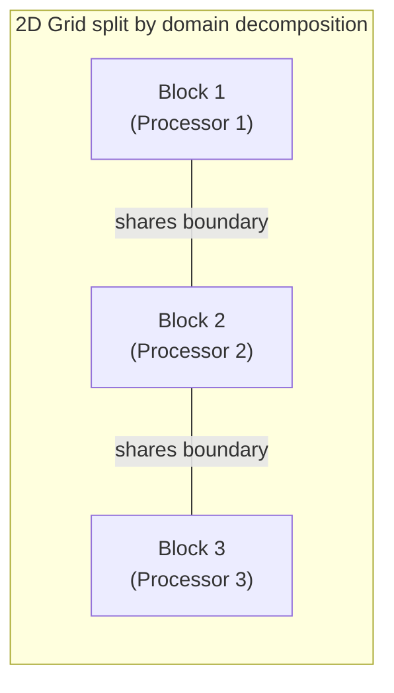

## Learning Objectives

- Define domain decomposition and functional decomposition, per LLNL's tutorial, and identify which one a given parallel program uses.
- Relate domain decomposition to data parallelism and functional decomposition to task parallelism.
- Connect functional decomposition to the divide-and-conquer paradigm already covered in Algorithms, and explain the real difference between the two.
- Design a simple domain decomposition for a 2D grid problem, including how to handle boundary data between chunks.

## Context & Motivation

Task parallelism and data parallelism named two *kinds* of parallelism a problem can have; domain decomposition and functional decomposition are the two concrete *techniques* LLNL's Introduction to Parallel Computing tutorial names for actually partitioning a problem's work among processors. The two pairs of terms line up closely — domain decomposition is essentially how data parallelism gets carried out in practice, and functional decomposition is essentially how task parallelism gets carried out — but the practical, hands-on framing here (how do you literally divide *this* problem?) is what a programmer needs before writing real parallel code.

This concept also revisits ground already covered from a different angle: `algorithms-software/algorithms` taught divide-and-conquer as a way to recursively split a problem into independent subproblems, solved separately and combined. Functional decomposition asks the same partitioning question — how do I split this problem into pieces? — but for parallel *processors* rather than recursive *calls*, and often produces a pipeline of persistent, communicating roles rather than a tree of independent recursive calls that terminate. Seeing the connection, and the real difference, sharpens understanding of both.

## Core Theory

### Domain decomposition: split the data, replicate the code

In domain decomposition, the *data* associated with a problem is divided into pieces, and each parallel task works on its own piece using largely the same code. LLNL's tutorial gives this as the natural strategy for problems structured around a large data domain — for example, dividing a 2D grid (used in heat diffusion, fluid simulation, or image processing) into contiguous blocks, one block per processor, each processor running the identical update code on its own block.

The recurring complication with domain decomposition is the **boundary**: a grid cell near the edge of one processor's block often needs the value of a neighboring cell that belongs to a different processor's block. This forces explicit communication of boundary data between neighboring processors at each computation step — a cost that did not exist in the original sequential version, and one that later concepts on communication and granularity address directly.



### Functional decomposition: split the problem into distinct roles

In functional decomposition, the *problem itself* is broken into distinct functional pieces — different operations or stages — each assigned to a different task, with data flowing between them. LLNL's tutorial's own example is a climate model, where separate program components handle atmosphere modeling, ocean modeling, land-surface modeling, and so on, each a functionally distinct piece of the overall simulation, communicating results to each other as needed.

Functional decomposition is a natural fit for pipeline-shaped problems — the video-decode/filter/encode example from the previous concept is a textbook functional decomposition, where each stage is a persistent, distinct role rather than a replicated copy of the same code.

### Functional decomposition vs. divide-and-conquer: the real difference

`the-divide-and-conquer-paradigm`, already covered in Algorithms, recursively splits a problem into smaller, structurally *identical* subproblems (sort the left half, sort the right half — same algorithm, smaller input), solved independently and then combined. Functional decomposition instead splits a problem into pieces that are *not* smaller copies of the same problem — they are qualitatively different roles (decode vs. filter vs. encode), often not recursive at all, and often communicating with each other continuously rather than only at a single combine step at the end. The two techniques are both, at heart, ways of answering "how do I split this problem into parts?" — but divide-and-conquer's parts are self-similar and independent until the final merge, while functional decomposition's parts are heterogeneous and often interdependent throughout execution.

### Choosing between the two

Neither technique is universally superior; the right choice follows from the problem's own structure. A problem with one large, uniform data structure and one operation applied broadly across it (matrix operations, image filters, grid simulations) fits domain decomposition naturally. A problem with several genuinely different processing stages, or several different physical/logical subsystems being modeled together, fits functional decomposition naturally. Many real applications, as the previous concept's video-pipeline-plus-brightness example showed, use a functional decomposition at a coarse level with domain decomposition inside each functional piece.

## Worked Examples

### Example 1: Domain-decomposing a 1D array sum

Summing a 1,000,000-element array across 4 processors via domain decomposition:

```text
Processor 0: sums elements   0 .. 249,999  → partial sum S0
Processor 1: sums elements 250,000 .. 499,999  → partial sum S1
Processor 2: sums elements 500,000 .. 749,999  → partial sum S2
Processor 3: sums elements 750,000 .. 999,999  → partial sum S3

Final result = S0 + S1 + S2 + S3  (combined by one processor,
                                    or via a collective reduction —
                                    covered later in this discipline)
```

This is domain decomposition in its simplest, boundary-free form: because summation has no dependency between elements, no processor ever needs another processor's data mid-computation, only the small final partial sums at the very end.

### Example 2: A functional decomposition pipeline

A search-engine indexing pipeline, decomposed functionally into three persistent roles:

```text
Role: Crawler        → fetches raw web pages, hands them to...
Role: Parser          → extracts text and links from raw pages, hands
                        extracted text to...
Role: Indexer         → builds the searchable index from parsed text

Each role runs continuously and concurrently; pages flow through all
three stages, with different pages at different stages simultaneously
(the same pipelining idea already familiar from CPU pipelining in
Computer Architecture, applied to software tasks instead of instructions).
```

Unlike the domain-decomposed array sum, these three roles run genuinely different code, and slow performance in any one stage (say, the parser) directly limits the throughput of the whole pipeline — a very different set of performance concerns than balancing equal-sized data chunks.

## Common Misconceptions & Pitfalls

- **"Domain decomposition and functional decomposition are the same as data and task parallelism, just different names for identical things."** They line up closely and usually correspond, but domain/functional describes the *technique used to split the work*, while data/task describes the *nature of the resulting parallelism* — the distinction is subtle but real, and CS2013 and LLNL's tutorial use both pairs for a reason: technique and resulting structure are related but not identical questions.
- **"Functional decomposition is the same thing as divide-and-conquer."** Divide-and-conquer's subproblems are smaller, self-similar instances of the same problem, combined once at the end; functional decomposition's pieces are heterogeneous roles that often communicate continuously, not just at a final merge.
- **"Domain decomposition never requires communication."** It very often does — the boundary problem is the norm, not the exception, for any domain-decomposed problem where neighboring elements interact (simulations, image filters with a kernel radius, etc.); only truly independent-element problems (like the array sum) avoid it.
- **"One decomposition technique is always better."** The right choice depends entirely on whether the problem's structure is one large uniform data domain (favoring domain decomposition) or several distinct functional roles (favoring functional decomposition) — and many real systems combine both.

## Summary

Domain decomposition splits a problem's *data* into chunks, running the same code on each chunk (the practical realization of data parallelism), and typically requires handling boundary communication between chunks. Functional decomposition splits the *problem* into distinct, often heterogeneous roles running different code and communicating continuously (the practical realization of task parallelism), related to but distinct from the divide-and-conquer paradigm already covered in Algorithms, whose subproblems are self-similar rather than heterogeneous. Neither technique is universally better; the choice follows from whether a problem is naturally one large uniform domain or a set of distinct functional stages — and real systems frequently combine both at different levels.

## Documentation Links

- [LLNL — Introduction to Parallel Computing Tutorial](https://hpc.llnl.gov/documentation/tutorials/introduction-parallel-computing-tutorial) — source for the domain decomposition and functional decomposition terminology and examples.
