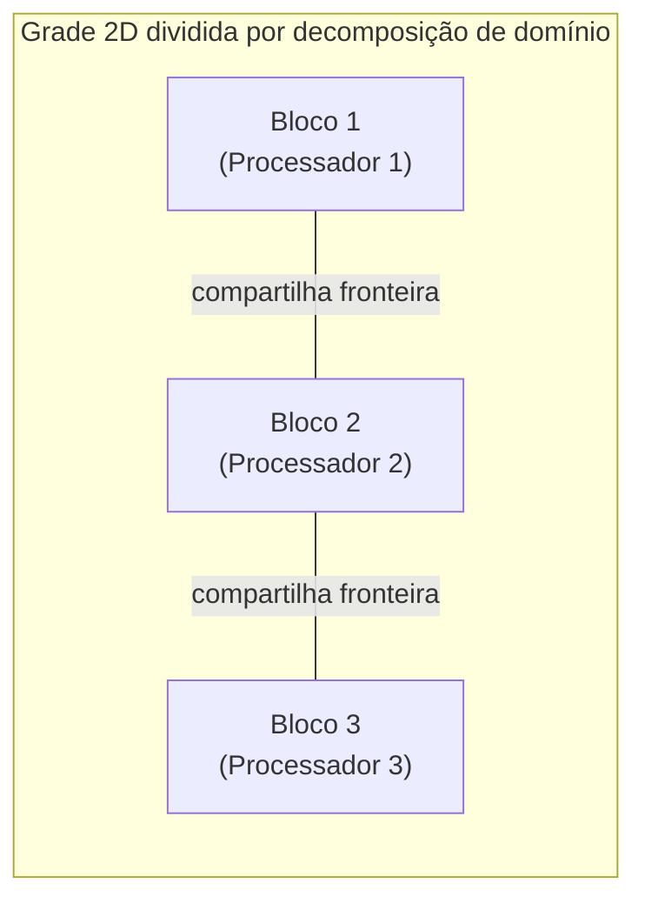

## Objetivos de Aprendizagem

- Definir decomposição de domínio e decomposição funcional, segundo o tutorial do LLNL, e identificar qual delas um dado programa paralelo usa.
- Relacionar a decomposição de domínio ao paralelismo de dados e a decomposição funcional ao paralelismo de tarefas.
- Conectar a decomposição funcional ao paradigma de dividir-para-conquistar já coberto em Algoritmos, e explicar a diferença real entre os dois.
- Projetar uma decomposição de domínio simples para um problema de grade 2D, incluindo como tratar os dados de fronteira entre pedaços.

## Contexto e Motivação

Paralelismo de tarefas e paralelismo de dados nomearam dois *tipos* de paralelismo que um problema pode ter; decomposição de domínio e decomposição funcional são as duas *técnicas* concretas que o tutorial Introduction to Parallel Computing do LLNL nomeia para de fato particionar o trabalho de um problema entre processadores. Os dois pares de termos se alinham de perto (a decomposição de domínio é essencialmente como o paralelismo de dados é executado na prática, e a decomposição funcional é essencialmente como o paralelismo de tarefas é executado), mas o enquadramento prático e mão na massa aqui (como você literalmente divide *este* problema?) é o que um programador precisa antes de escrever código paralelo real.

Este conceito também revisita terreno já coberto por um ângulo diferente: `algorithms-software/algorithms` ensinou dividir-para-conquistar como uma forma de dividir recursivamente um problema em subproblemas independentes, resolvidos separadamente e combinados. A decomposição funcional faz a mesma pergunta de particionamento (como divido este problema em pedaços?), mas para *processadores* paralelos em vez de *chamadas* recursivas, e frequentemente produz um pipeline de papéis persistentes que se comunicam, em vez de uma árvore de chamadas recursivas independentes que terminam. Ver a conexão, e a diferença real, aguça o entendimento de ambos.

## Teoria Central

### Decomposição de domínio: divida os dados, replique o código

Na decomposição de domínio, os *dados* associados a um problema são divididos em pedaços, e cada tarefa paralela trabalha no seu próprio pedaço usando basicamente o mesmo código. O tutorial do LLNL apresenta esta como a estratégia natural para problemas estruturados em torno de um grande domínio de dados, por exemplo, dividir uma grade 2D (usada em difusão de calor, simulação de fluidos ou processamento de imagens) em blocos contíguos, um bloco por processador, com cada processador rodando o código de atualização idêntico no seu próprio bloco.

A complicação recorrente da decomposição de domínio é a **fronteira**: uma célula da grade perto da borda do bloco de um processador frequentemente precisa do valor de uma célula vizinha que pertence ao bloco de outro processador. Isso força a comunicação explícita dos dados de fronteira entre processadores vizinhos a cada passo da computação, um custo que não existia na versão sequencial original, e que conceitos posteriores sobre comunicação e granularidade tratam diretamente.



### Decomposição funcional: divida o problema em papéis distintos

Na decomposição funcional, o *próprio problema* é quebrado em pedaços funcionais distintos (operações ou estágios diferentes), cada um atribuído a uma tarefa diferente, com dados fluindo entre eles. O próprio exemplo do tutorial do LLNL é um modelo climático, onde componentes separados do programa cuidam da modelagem da atmosfera, da modelagem do oceano, da modelagem da superfície terrestre e assim por diante, cada um uma parte funcionalmente distinta da simulação geral, comunicando resultados uns aos outros conforme necessário.

A decomposição funcional é um encaixe natural para problemas em formato de pipeline: o exemplo de decodificar/filtrar/codificar vídeo do conceito anterior é uma decomposição funcional de livro-texto, onde cada estágio é um papel persistente e distinto em vez de uma cópia replicada do mesmo código.

### Decomposição funcional vs. dividir-para-conquistar: a diferença real

`the-divide-and-conquer-paradigm`, já coberto em Algoritmos, divide recursivamente um problema em subproblemas menores e estruturalmente *idênticos* (ordenar a metade esquerda, ordenar a metade direita: mesmo algoritmo, entrada menor), resolvidos independentemente e depois combinados. A decomposição funcional, em vez disso, divide um problema em pedaços que *não* são cópias menores do mesmo problema: são papéis qualitativamente diferentes (decodificar vs. filtrar vs. codificar), frequentemente nada recursivos, e frequentemente comunicando-se entre si continuamente em vez de apenas num único passo de combinação no final. As duas técnicas são, no fundo, formas de responder "como divido este problema em partes?", mas as partes do dividir-para-conquistar são autossimilares e independentes até o merge final, enquanto as partes da decomposição funcional são heterogêneas e frequentemente interdependentes durante toda a execução.

### Escolhendo entre as duas

Nenhuma das técnicas é universalmente superior; a escolha certa decorre da própria estrutura do problema. Um problema com uma estrutura de dados grande e uniforme e uma operação aplicada amplamente sobre ela (operações de matriz, filtros de imagem, simulações em grade) se encaixa naturalmente na decomposição de domínio. Um problema com vários estágios de processamento genuinamente diferentes, ou vários subsistemas físicos/lógicos diferentes sendo modelados juntos, se encaixa naturalmente na decomposição funcional. Muitas aplicações reais, como o exemplo do pipeline de vídeo mais brilho do conceito anterior mostrou, usam uma decomposição funcional num nível grosso com decomposição de domínio dentro de cada pedaço funcional.

## Exemplos Resolvidos

### Exemplo 1: Decompondo por domínio a soma de um array 1D

Somando um array de 1.000.000 de elementos entre 4 processadores via decomposição de domínio:

```text
Processador 0: soma elementos   0 .. 249.999  → soma parcial S0
Processador 1: soma elementos 250.000 .. 499.999  → soma parcial S1
Processador 2: soma elementos 500.000 .. 749.999  → soma parcial S2
Processador 3: soma elementos 750.000 .. 999.999  → soma parcial S3

Resultado final = S0 + S1 + S2 + S3  (combinado por um processador,
                                      ou via uma redução coletiva,
                                      coberta mais adiante nesta disciplina)
```

Esta é a decomposição de domínio na sua forma mais simples, sem fronteiras: como a soma não tem dependência entre elementos, nenhum processador jamais precisa dos dados de outro processador no meio da computação, apenas das pequenas somas parciais finais bem no fim.

### Exemplo 2: Um pipeline de decomposição funcional

Um pipeline de indexação de um mecanismo de busca, decomposto funcionalmente em três papéis persistentes:

```text
Papel: Crawler       → busca páginas web brutas, entrega-as ao...
Papel: Parser         → extrai texto e links das páginas brutas, entrega
                        o texto extraído ao...
Papel: Indexer        → constrói o índice pesquisável a partir do texto
                        analisado

Cada papel roda contínua e concorrentemente; as páginas fluem pelos três
estágios, com páginas diferentes em estágios diferentes simultaneamente
(a mesma ideia de pipelining já familiar do pipeline de CPU em Arquitetura
de Computadores, aplicada a tarefas de software em vez de instruções).
```

Diferente da soma de array decomposta por domínio, estes três papéis rodam código genuinamente diferente, e um desempenho lento em qualquer estágio (digamos, o parser) limita diretamente a vazão de todo o pipeline, um conjunto de preocupações de desempenho muito diferente do que balancear pedaços de dados de tamanho igual.

## Equívocos Comuns e Armadilhas

- **"Decomposição de domínio e decomposição funcional são o mesmo que paralelismo de dados e de tarefas, só nomes diferentes para coisas idênticas."** Elas se alinham de perto e geralmente correspondem, mas domínio/funcional descreve a *técnica usada para dividir o trabalho*, enquanto dados/tarefas descreve a *natureza do paralelismo resultante*. A distinção é sutil, mas real, e o CS2013 e o tutorial do LLNL usam os dois pares por um motivo: técnica e estrutura resultante são perguntas relacionadas, mas não idênticas.
- **"Decomposição funcional é a mesma coisa que dividir-para-conquistar."** Os subproblemas do dividir-para-conquistar são instâncias menores e autossimilares do mesmo problema, combinadas uma vez no final; os pedaços da decomposição funcional são papéis heterogêneos que frequentemente se comunicam continuamente, não só num merge final.
- **"Decomposição de domínio nunca exige comunicação."** Muito frequentemente exige. O problema da fronteira é a norma, não a exceção, para qualquer problema decomposto por domínio onde elementos vizinhos interagem (simulações, filtros de imagem com um raio de kernel, etc.); apenas problemas com elementos verdadeiramente independentes (como a soma de array) o evitam.
- **"Uma técnica de decomposição é sempre melhor."** A escolha certa depende inteiramente de se a estrutura do problema é um grande domínio de dados uniforme (favorecendo a decomposição de domínio) ou vários papéis funcionais distintos (favorecendo a decomposição funcional), e muitos sistemas reais combinam as duas.

## Resumo

A decomposição de domínio divide os *dados* de um problema em pedaços, rodando o mesmo código em cada pedaço (a realização prática do paralelismo de dados), e tipicamente exige tratar a comunicação de fronteira entre pedaços. A decomposição funcional divide o *problema* em papéis distintos e frequentemente heterogêneos, rodando código diferente e comunicando-se continuamente (a realização prática do paralelismo de tarefas), relacionada mas distinta do paradigma de dividir-para-conquistar já coberto em Algoritmos, cujos subproblemas são autossimilares em vez de heterogêneos. Nenhuma das técnicas é universalmente melhor; a escolha decorre de se um problema é naturalmente um grande domínio uniforme ou um conjunto de estágios funcionais distintos, e sistemas reais frequentemente combinam as duas em níveis diferentes.

## Documentation Links

- [LLNL: Introduction to Parallel Computing Tutorial](https://hpc.llnl.gov/documentation/tutorials/introduction-parallel-computing-tutorial): fonte para a terminologia e os exemplos de decomposição de domínio e decomposição funcional.
