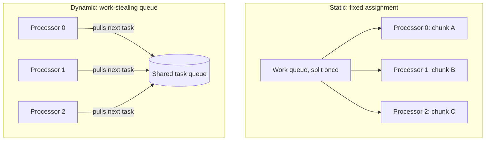

## Learning Objectives

- Define granularity as the ratio of computation to communication, and classify a decomposition as fine-grained or coarse-grained.
- Explain why both extremely fine and extremely coarse granularity can hurt performance, and where the right balance lies.
- Define load balancing and identify a realistic scenario where equal-sized chunks still produce an unbalanced load.
- Describe static and dynamic load balancing as two different strategies for keeping processors equally busy.

## Context & Motivation

The previous concept's boundary-exchange example already hinted at the core tension this concept names directly: splitting a problem into more, smaller pieces increases parallelism (more independent units of work to spread across processors) but also increases the relative cost of communication and synchronization per unit of useful computation. LLNL's tutorial calls this ratio **granularity**, and treats it, alongside its close companion **load balancing**, as a central, unavoidable tuning decision in designing any parallel program — not a minor implementation detail to worry about only after the "real" design is done.

Getting granularity and load balancing wrong doesn't just cost some performance at the margins; it can produce a parallel program that, despite using many processors, runs no faster (or even slower) than the original sequential version, because the processors spend more time coordinating than computing, or because most processors sit idle waiting for one slow straggler to finish.

## Core Theory

### Granularity: the computation-to-communication ratio

Granularity measures how much computation a task does relative to how much communication it requires. A **fine-grained** decomposition breaks work into many small tasks, each doing relatively little computation between communication events; a **coarse-grained** decomposition uses fewer, larger tasks, each doing substantially more computation between communication events.

The tradeoff runs in both directions:

- **Too fine-grained**: communication and synchronization overhead can dominate the actual useful work, exactly as this discipline's earlier boundary-exchange example showed collapsing from a 50:1 to a roughly 1:1 computation-to-communication ratio as strip width shrank.
- **Too coarse-grained**: with too few, too-large tasks, there may not be enough independent units of work to keep every available processor busy, and any imbalance between the (few) large tasks becomes harder to correct.

The right granularity depends on the actual hardware's communication cost relative to its computation speed — a cluster with slow interconnects needs coarser granularity than a tightly-coupled shared-memory machine with cheap, cache-coherent communication, which is exactly why OpenMP (shared memory, covered next) can typically afford much finer-grained parallelism than MPI (distributed memory, covered after it) can.

### Load balancing: keeping every processor equally busy

Load balancing is the problem of distributing work so that every processor finishes at roughly the same time, with none left significantly more or less busy than the others. LLNL's tutorial makes an important, easy-to-miss point: equal-sized chunks of data do not automatically mean equal amounts of *work*. A domain-decomposed grid split into equal-area blocks will be perfectly load-balanced only if the computation cost is uniform across the whole grid — but many real problems have non-uniform cost:

- An N-body gravitational simulation split into equal-volume spatial regions will have wildly different amounts of work per region if particles cluster unevenly (a dense region has far more particle-pair interactions to compute than a sparse one).
- A ray-tracing renderer split into equal-area image tiles will have far more computation in tiles containing complex reflective geometry than in tiles showing a flat, empty sky.

In both cases, an equal *data* split produces an unequal *work* split — the slowest processor determines the total time, since every other processor sits idle waiting for it to finish (unless the algorithm is explicitly designed to let faster processors help with unfinished work, which dynamic load balancing, below, does).

### Static vs. dynamic load balancing

- **Static load balancing** assigns work to processors once, in advance, before execution begins, based on some prediction or heuristic about relative cost (for example, weighting chunk sizes inversely to expected particle density). It has essentially zero runtime overhead, but only works well when the workload's imbalance is predictable ahead of time.
- **Dynamic load balancing** assigns work incrementally at runtime, often via a shared work queue that idle processors pull new tasks from as soon as they finish their current one — a pattern commonly called **work stealing** when idle processors pull unfinished work directly from busy ones. This adapts automatically to unpredictable or data-dependent imbalance, at the cost of real runtime coordination overhead for managing the queue.



### Granularity and load balancing interact

Finer granularity (more, smaller tasks) generally makes load balancing easier, because there are more independent units to redistribute if one processor falls behind — a large imbalance in one huge task cannot be corrected mid-flight, but an imbalance across many small tasks can be smoothed out by giving idle processors more of the remaining small tasks. This is one honest argument for finer granularity even where it costs more communication overhead: the improved load balance it enables can more than pay for that overhead when the workload is genuinely unpredictable.

## Worked Examples

### Example 1: Quantifying the granularity tradeoff

Suppose computing one unit of work takes 10 microseconds, and one communication event (sending a boundary value) takes 5 microseconds. Compare fine-grained (100 units of work per communication event) against coarse-grained (10,000 units of work per communication event):

```text
Granularity     Computation time   Communication time   Overhead fraction
--------------  -----------------  --------------------  -------------------
Fine (100)      100 × 10µs = 1ms   5µs                    5µs / 1005µs ≈ 0.5%
Coarse (10,000) 10,000×10µs=100ms  5µs                    5µs / 100,005µs
                                                            ≈ 0.005%
```

Coarser granularity here has a much smaller relative communication overhead — but recall from the previous section that coarse granularity also makes load imbalance harder to correct. If the coarse case's 10,000-unit tasks vary in actual cost by 20% due to data-dependent work (as in the N-body example), a processor stuck with a slow task will idle everyone else waiting for it, likely costing far more total time than the tiny 0.5% communication overhead the fine-grained version paid instead.

### Example 2: Static vs. dynamic load balancing for an uneven workload

Rendering 1,000 image tiles across 4 processors, where 950 tiles take 1ms each (empty sky) and 50 tiles take 40ms each (complex reflective geometry), randomly scattered through the image:

```text
Static (250 tiles per processor, assigned by position):
  If the 50 expensive tiles happen to cluster in Processor 2's range,
  Processor 2's total time = 200×1ms + 50×40ms = 2,200ms
  while Processor 0's total time = 250×1ms = 250ms
  → Total wall-clock time = 2,200ms (bounded by the slowest processor)

Dynamic (shared queue, processors pull the next tile when idle):
  Total work = 950×1ms + 50×40ms = 950ms + 2,000ms = 2,950ms
  Spread evenly across 4 processors ≈ 2,950ms / 4 ≈ 738ms
  → Total wall-clock time ≈ 738ms (close to the theoretical best)
```

The static assignment, unlucky in how the expensive tiles happened to fall, finishes nearly 3× slower than the dynamic version — a concrete illustration of why dynamic load balancing is the standard choice whenever a workload's cost per unit is unpredictable or data-dependent, despite its extra runtime coordination overhead.

## Common Misconceptions & Pitfalls

- **"Equal-sized chunks always mean balanced load."** Only when the cost per unit of data is uniform — many real problems (N-body simulation, ray tracing, sparse matrix operations) have highly non-uniform cost per data element, making equal-size splits a poor proxy for equal-work splits.
- **"Finer granularity is always better because it improves load balance."** Finer granularity improves the *ability* to load-balance, but it also increases communication and synchronization overhead per unit of computation — the right granularity balances both effects against each other, and depends on the actual communication cost of the target hardware.
- **"Dynamic load balancing has no downsides."** The shared work queue itself is a point of contention and communication overhead, and coordinating it (especially in distributed memory, where "shared queue" must be implemented via messages) is a real engineering cost, not a free upgrade over static assignment.
- **"Granularity is purely an implementation detail, not a design decision."** It directly determines whether a decomposition, otherwise sound, will actually perform well on real hardware — treating it as an afterthought is one of the most common reasons a "parallelized" program disappoints in practice.

## Summary

Granularity measures the ratio of computation to communication in a parallel decomposition — too fine, and overhead dominates; too coarse, and there may be too few independent units to balance work across processors, especially under unpredictable per-unit cost. Load balancing is the closely related problem of keeping every processor equally busy, made harder by the common but easy-to-miss fact that equal-sized data chunks do not guarantee equal amounts of work. Static load balancing assigns work once in advance (cheap, but only as good as its prediction); dynamic load balancing assigns work incrementally at runtime via a shared queue or work-stealing (adaptive, at the cost of real coordination overhead) — and finer granularity generally makes dynamic load balancing more effective, since there are more small units available to redistribute when imbalance appears.

## Documentation Links

- [LLNL — Introduction to Parallel Computing Tutorial](https://hpc.llnl.gov/documentation/tutorials/introduction-parallel-computing-tutorial) — source for the granularity and load-balancing design concepts, including the fine/coarse-grained terminology.
