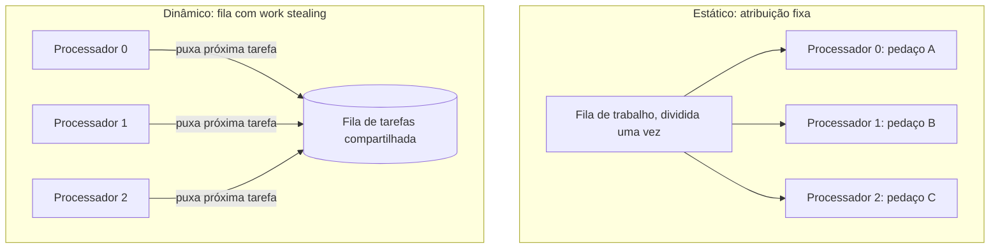

## Objetivos de Aprendizagem

- Definir granularidade como a razão entre computação e comunicação, e classificar uma decomposição como de granularidade fina ou grossa.
- Explicar por que tanto uma granularidade extremamente fina quanto uma extremamente grossa podem prejudicar o desempenho, e onde está o equilíbrio certo.
- Definir balanceamento de carga e identificar um cenário realista onde pedaços de tamanho igual ainda produzem uma carga desbalanceada.
- Descrever o balanceamento de carga estático e o dinâmico como duas estratégias diferentes para manter os processadores igualmente ocupados.

## Contexto e Motivação

O exemplo de troca de fronteiras do conceito anterior já insinuava a tensão central que este conceito nomeia diretamente: dividir um problema em mais pedaços, menores, aumenta o paralelismo (mais unidades independentes de trabalho para espalhar entre processadores), mas também aumenta o custo relativo de comunicação e sincronização por unidade de computação útil. O tutorial do LLNL chama essa razão de **granularidade**, e a trata, junto com a sua companheira próxima, o **balanceamento de carga**, como uma decisão de ajuste central e inevitável no projeto de qualquer programa paralelo, e não um detalhe menor de implementação com o qual se preocupar só depois que o projeto "de verdade" estiver pronto.

Errar a granularidade e o balanceamento de carga não custa só um pouco de desempenho nas margens; pode produzir um programa paralelo que, apesar de usar muitos processadores, não roda mais rápido (ou roda até mais devagar) do que a versão sequencial original, porque os processadores gastam mais tempo coordenando do que computando, ou porque a maioria dos processadores fica ociosa esperando que um único retardatário lento termine.

## Teoria Central

### Granularidade: a razão entre computação e comunicação

A granularidade mede quanta computação uma tarefa faz em relação a quanta comunicação ela exige. Uma decomposição de **granularidade fina** quebra o trabalho em muitas tarefas pequenas, cada uma fazendo relativamente pouca computação entre eventos de comunicação; uma decomposição de **granularidade grossa** usa menos tarefas, maiores, cada uma fazendo substancialmente mais computação entre eventos de comunicação.

O trade-off corre nas duas direções:

- **Fina demais**: o overhead de comunicação e sincronização pode dominar o trabalho útil de fato, exatamente como o exemplo anterior de troca de fronteiras desta disciplina mostrou, desabando de uma razão de computação para comunicação de 50:1 para aproximadamente 1:1 conforme a largura das faixas encolhia.
- **Grossa demais**: com tarefas de menos e grandes demais, pode não haver unidades independentes de trabalho suficientes para manter ocupado todo processador disponível, e qualquer desequilíbrio entre as (poucas) tarefas grandes fica mais difícil de corrigir.

A granularidade certa depende do custo real de comunicação do hardware em relação à sua velocidade de computação: um cluster com interconexões lentas precisa de granularidade mais grossa do que uma máquina de memória compartilhada fortemente acoplada, com comunicação barata e coerente com o cache, e é exatamente por isso que o OpenMP (memória compartilhada, coberto a seguir) tipicamente consegue bancar um paralelismo de granularidade muito mais fina do que o MPI (memória distribuída, coberto depois dele).

### Balanceamento de carga: mantendo todo processador igualmente ocupado

Balanceamento de carga é o problema de distribuir o trabalho de forma que todo processador termine aproximadamente ao mesmo tempo, sem nenhum ficar significativamente mais ou menos ocupado do que os outros. O tutorial do LLNL faz uma observação importante e fácil de passar despercebida: pedaços de dados de tamanho igual não significam automaticamente quantidades iguais de *trabalho*. Uma grade decomposta por domínio em blocos de área igual só estará perfeitamente balanceada se o custo de computação for uniforme em toda a grade, mas muitos problemas reais têm custo não uniforme:

- Uma simulação gravitacional de N corpos dividida em regiões espaciais de volume igual terá quantidades de trabalho por região muito diferentes se as partículas se agruparem de forma desigual (uma região densa tem muito mais interações entre pares de partículas para calcular do que uma esparsa).
- Um renderizador de ray tracing dividido em ladrilhos de imagem de área igual terá muito mais computação em ladrilhos contendo geometria reflexiva complexa do que em ladrilhos mostrando um céu plano e vazio.

Nos dois casos, uma divisão igual de *dados* produz uma divisão desigual de *trabalho*: o processador mais lento determina o tempo total, já que todo outro processador fica ocioso esperando que ele termine (a menos que o algoritmo seja explicitamente projetado para deixar processadores mais rápidos ajudarem com trabalho inacabado, que é o que o balanceamento de carga dinâmico, abaixo, faz).

### Balanceamento de carga estático vs. dinâmico

- **Balanceamento de carga estático** atribui o trabalho aos processadores uma vez, de antemão, antes que a execução comece, com base em alguma previsão ou heurística sobre o custo relativo (por exemplo, ponderando os tamanhos dos pedaços inversamente à densidade de partículas esperada). Ele tem essencialmente zero overhead em tempo de execução, mas só funciona bem quando o desequilíbrio da carga de trabalho é previsível com antecedência.
- **Balanceamento de carga dinâmico** atribui o trabalho incrementalmente em tempo de execução, frequentemente via uma fila de trabalho compartilhada da qual processadores ociosos puxam novas tarefas assim que terminam a atual, um padrão comumente chamado de **work stealing** quando processadores ociosos puxam trabalho inacabado diretamente dos ocupados. Isso se adapta automaticamente a desequilíbrios imprevisíveis ou dependentes dos dados, ao custo de um overhead real de coordenação em tempo de execução para gerenciar a fila.



### Granularidade e balanceamento de carga interagem

Uma granularidade mais fina (mais tarefas, menores) geralmente torna o balanceamento de carga mais fácil, porque há mais unidades independentes para redistribuir se um processador ficar para trás: um grande desequilíbrio numa única tarefa enorme não pode ser corrigido no meio do caminho, mas um desequilíbrio entre muitas tarefas pequenas pode ser suavizado dando aos processadores ociosos mais das tarefas pequenas restantes. Este é um argumento honesto a favor de uma granularidade mais fina mesmo onde ela custa mais overhead de comunicação: o melhor balanceamento de carga que ela permite pode mais do que pagar esse overhead quando a carga de trabalho é genuinamente imprevisível.

## Exemplos Resolvidos

### Exemplo 1: Quantificando o trade-off de granularidade

Suponha que calcular uma unidade de trabalho leva 10 microssegundos, e um evento de comunicação (enviar um valor de fronteira) leva 5 microssegundos. Compare granularidade fina (100 unidades de trabalho por evento de comunicação) com granularidade grossa (10.000 unidades de trabalho por evento de comunicação):

```text
Granularidade   Tempo de computação  Tempo de comunicação  Fração de overhead
--------------  -------------------  --------------------  -------------------
Fina (100)      100 × 10µs = 1ms     5µs                    5µs / 1005µs ≈ 0,5%
Grossa (10.000) 10.000×10µs=100ms    5µs                    5µs / 100.005µs
                                                              ≈ 0,005%
```

A granularidade mais grossa aqui tem um overhead relativo de comunicação muito menor, mas lembre da seção anterior que a granularidade grossa também torna o desequilíbrio de carga mais difícil de corrigir. Se as tarefas de 10.000 unidades do caso grosso variarem em custo real em 20% devido a trabalho dependente dos dados (como no exemplo de N corpos), um processador preso com uma tarefa lenta deixará todos os outros ociosos esperando por ele, provavelmente custando muito mais tempo total do que o minúsculo overhead de comunicação de 0,5% que a versão de granularidade fina pagou no lugar.

### Exemplo 2: Balanceamento de carga estático vs. dinâmico para uma carga desigual

Renderizando 1.000 ladrilhos de imagem entre 4 processadores, onde 950 ladrilhos levam 1ms cada (céu vazio) e 50 ladrilhos levam 40ms cada (geometria reflexiva complexa), espalhados aleatoriamente pela imagem:

```text
Estático (250 ladrilhos por processador, atribuídos por posição):
  Se os 50 ladrilhos caros calharem de se agrupar na faixa do Processador 2,
  tempo total do Processador 2 = 200×1ms + 50×40ms = 2.200ms
  enquanto o tempo total do Processador 0 = 250×1ms = 250ms
  → Tempo total de relógio = 2.200ms (limitado pelo processador mais lento)

Dinâmico (fila compartilhada, processadores puxam o próximo ladrilho quando ociosos):
  Trabalho total = 950×1ms + 50×40ms = 950ms + 2.000ms = 2.950ms
  Espalhado igualmente entre 4 processadores ≈ 2.950ms / 4 ≈ 738ms
  → Tempo total de relógio ≈ 738ms (perto do melhor teórico)
```

A atribuição estática, sem sorte na forma como os ladrilhos caros calharam de cair, termina quase 3× mais devagar do que a versão dinâmica, uma ilustração concreta de por que o balanceamento de carga dinâmico é a escolha padrão sempre que o custo por unidade de uma carga de trabalho é imprevisível ou dependente dos dados, apesar do seu overhead extra de coordenação em tempo de execução.

## Equívocos Comuns e Armadilhas

- **"Pedaços de tamanho igual sempre significam carga balanceada."** Só quando o custo por unidade de dados é uniforme. Muitos problemas reais (simulação de N corpos, ray tracing, operações com matrizes esparsas) têm custo por elemento de dados altamente não uniforme, o que torna divisões de tamanho igual um mau substituto para divisões de trabalho igual.
- **"Granularidade mais fina é sempre melhor porque melhora o balanceamento de carga."** Uma granularidade mais fina melhora a *capacidade* de balancear a carga, mas também aumenta o overhead de comunicação e sincronização por unidade de computação. A granularidade certa equilibra os dois efeitos um contra o outro, e depende do custo real de comunicação do hardware alvo.
- **"Balanceamento de carga dinâmico não tem desvantagens."** A própria fila de trabalho compartilhada é um ponto de contenção e de overhead de comunicação, e coordená-la (especialmente em memória distribuída, onde a "fila compartilhada" precisa ser implementada via mensagens) é um custo de engenharia real, não um upgrade gratuito em relação à atribuição estática.
- **"Granularidade é puramente um detalhe de implementação, não uma decisão de projeto."** Ela determina diretamente se uma decomposição, de resto sólida, vai de fato ter bom desempenho em hardware real. Tratá-la como algo secundário é uma das razões mais comuns pelas quais um programa "paralelizado" decepciona na prática.

## Resumo

A granularidade mede a razão entre computação e comunicação numa decomposição paralela: fina demais, e o overhead domina; grossa demais, e pode haver unidades independentes de menos para balancear o trabalho entre processadores, especialmente sob custo por unidade imprevisível. O balanceamento de carga é o problema intimamente relacionado de manter todo processador igualmente ocupado, dificultado pelo fato comum, mas fácil de passar despercebido, de que pedaços de dados de tamanho igual não garantem quantidades iguais de trabalho. O balanceamento de carga estático atribui o trabalho uma vez, de antemão (barato, mas só tão bom quanto a sua previsão); o balanceamento de carga dinâmico atribui o trabalho incrementalmente em tempo de execução via uma fila compartilhada ou work stealing (adaptativo, ao custo de um overhead real de coordenação), e uma granularidade mais fina geralmente torna o balanceamento de carga dinâmico mais eficaz, já que há mais unidades pequenas disponíveis para redistribuir quando o desequilíbrio aparece.

## Documentation Links

- [LLNL: Introduction to Parallel Computing Tutorial](https://hpc.llnl.gov/documentation/tutorials/introduction-parallel-computing-tutorial): fonte para os conceitos de projeto de granularidade e balanceamento de carga, incluindo a terminologia de granularidade fina/grossa.
