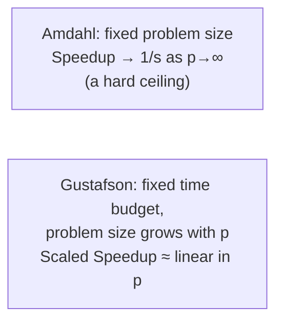

## Learning Objectives

- State Gustafson's Law and explain how it differs from Amdahl's Law in its core assumption about problem size.
- Compute scaled speedup under Gustafson's model and contrast it with Amdahl's fixed-size speedup for the same sequential fraction.
- Explain, using the framing of scientists and engineers wanting bigger answers rather than the same answer faster, why Gustafson's Law is not a refutation of Amdahl's Law but a change of question.
- Identify which of the two laws applies to a given real-world scaling scenario.

## Context & Motivation

Amdahl's Law delivered a genuinely pessimistic result: even a small sequential fraction imposes a speedup ceiling that no amount of additional hardware can overcome. This was, historically, taken seriously as an argument against investing in massively parallel machines — if a 5% sequential fraction caps speedup at 20× no matter what, why build a machine with 10,000 processors?

John Gustafson's 1988 response, published while working on real massively parallel machines at Sandia National Laboratories that were, in practice, achieving speedups far beyond what Amdahl's Law seemed to permit, identified the resolution: Amdahl's Law implicitly assumes the problem size is fixed while the number of processors grows. But LLNL's tutorial states the practical observation directly — in real scientific and engineering practice, when more processors become available, users do not usually keep solving the exact same fixed-size problem faster; they solve a larger, more detailed, more ambitious problem in the same amount of time. Gustafson's Law re-derives the speedup formula under this different, and often more realistic, assumption.

## Core Theory

### The assumption that changes: fixed time, not fixed size

Amdahl's Law asks: "given a fixed problem, how much faster can more processors make it?" Gustafson's Law asks a different question: "given a fixed amount of *time* the user is willing to wait, how much *bigger* a problem can be solved as processors are added?" This is not a mathematical trick — it reflects how many real HPC users actually behave: a climate scientist with access to a bigger cluster doesn't usually run the same climate model faster just to finish sooner; they run a finer-resolution model, or simulate a longer time period, in the same wall-clock time they were already budgeting.

### Deriving scaled speedup

Under Gustafson's framing, the *parallel* run's time is what's held fixed, split into a sequential fraction `s` and a parallel fraction `(1-s)` — measured as it actually happens on p processors, not scaled back to a hypothetical single-processor run. The question becomes: if this same amount of parallel work were instead run on a single processor, sequentially, how much longer would it take?

```text
Scaled Speedup(p) = s + (1 - s) · p
                   = p - s·(p - 1)
```

This is Gustafson's Law (sometimes called Gustafson-Barsis's Law). Notice its shape: it is linear in `p`, not asymptotically bounded by a fixed ceiling the way Amdahl's `1/s` is. As `p` grows, scaled speedup grows essentially in proportion to `p`, only reduced by the (typically small, and often shrinking as problem size grows) sequential fraction's contribution.



### Why both laws are correct — they answer different questions

Gustafson's Law does not disprove or contradict Amdahl's Law mathematically; both formulas are correct under their own stated assumption. Amdahl's Law correctly describes what happens if a program's problem size is held fixed while processors are added — a real and important scenario (strong scaling, covered next). Gustafson's Law correctly describes what happens if the problem size grows to fill a fixed time budget as processors are added — an equally real and, for much of scientific computing, more representative scenario (weak scaling, also covered next). Recognizing which assumption actually matches a given real situation is more useful than treating one law as universally "correct" and the other as merely a rebuttal.

### Why the sequential fraction often shrinks as problems grow

A further, often-overlooked reason Gustafson's Law tends to be optimistic in practice: many real algorithms' sequential fractions do not scale up proportionally with problem size — a fixed sequential setup or I/O cost (reading one configuration file, say) becomes a *smaller* fraction of the total time as the parallel portion of the work grows to fill a bigger problem, which further favors the scaled-speedup framing over the fixed-size one for large-scale scientific computing.

## Worked Examples

### Example 1: Comparing Amdahl's and Gustafson's speedup for the same sequential fraction

Using `s = 0.05` (5% sequential) at `p = 20` processors:

```text
Amdahl's Law (fixed problem size):
  Speedup(20) = 1 / (0.05 + 0.95/20) = 1 / 0.0975 ≈ 10.26×
  (well below the theoretical ceiling of 1/0.05 = 20×, and rising
   only slowly toward it as p grows further)

Gustafson's Law (fixed time, problem size grows with p):
  Scaled Speedup(20) = 0.05 + 0.95 × 20 = 0.05 + 19 = 19.05×
  (nearly linear in p, and not capped by any fixed ceiling)
```

The two numbers, 10.26× and 19.05×, are not contradictory measurements of the same thing — they answer two different questions about the same 5% sequential fraction: "how much faster does the same-size problem run?" (Amdahl, 10.26×) versus "how much bigger a problem, solved in the same time, could this many processors handle?" (Gustafson, 19.05×).

### Example 2: Classifying a real scenario by which law applies

```text
Scenario                                              Applicable law
-----------------------------------------------------  -----------------
Rerun last year's exact simulation faster, using       Amdahl's Law
  more processors, to get the identical result
  sooner
Use a bigger cluster to run a higher-resolution        Gustafson's Law
  version of the same simulation, in the same
  overnight batch window as before
Render the same fixed-resolution video faster by       Amdahl's Law
  throwing more render nodes at it
Use additional GPU nodes to simulate a larger          Gustafson's Law
  protein, in the same lab-meeting-deadline
  timeframe as a smaller one was simulated before
```

The distinguishing question, in every case: is the problem size held fixed while processors grow (Amdahl), or is the problem size expected to grow to make use of the available time budget as processors grow (Gustafson)?

## Common Misconceptions & Pitfalls

- **"Gustafson's Law proves Amdahl's Law wrong."** Both are mathematically correct; they answer different questions under different assumptions about whether problem size is held fixed (Amdahl) or allowed to grow with available processors (Gustafson) — Gustafson's Law is a reframing, not a refutation.
- **"Scaled speedup is 'better' or 'more real' than Amdahl's speedup."** Neither number is inherently more correct — which one is the relevant question depends entirely on how the problem is actually going to be used: rerunning the same fixed problem faster (Amdahl) or solving a bigger problem in the same time (Gustafson) are both legitimate real-world goals, just different ones.
- **"Gustafson's Law means speedup is unbounded."** Scaled speedup grows roughly linearly with `p` under Gustafson's assumption, but it's still reduced by the sequential fraction's contribution, and real-world limits (memory capacity, network bandwidth, load imbalance at scale) still apply — Gustafson's Law removes Amdahl's specific *fixed-problem-size* ceiling, not every possible limit on scaling.
- **"You should always design for Gustafson-style scaling instead of Amdahl-style."** The right framing depends on the actual user need — some problems (compiling a fixed program, rendering a fixed video) genuinely have a fixed size that users want done faster, which is squarely Amdahl's domain, not Gustafson's.

## Summary

Gustafson's Law reframes Amdahl's Law's core assumption: instead of holding problem size fixed while processors grow (Amdahl), it holds the *time budget* fixed and lets problem size grow with the number of processors — the realistic pattern for much of scientific computing, where more hardware is used to solve bigger, more detailed problems rather than the same problem faster. Under this assumption, scaled speedup, `s + (1-s)·p`, grows roughly linearly with `p` rather than hitting Amdahl's `1/s` ceiling. The two laws do not contradict each other; they describe two genuinely different real scenarios, formalized in the next concept as strong scaling (Amdahl's regime) and weak scaling (Gustafson's regime).

## Documentation Links

- [LLNL — Introduction to Parallel Computing Tutorial](https://hpc.llnl.gov/documentation/tutorials/introduction-parallel-computing-tutorial) — covers both Amdahl's and Gustafson's laws as complementary performance concepts.
- [UC Berkeley CS267 — Applications of Parallel Computers](https://sites.google.com/lbl.gov/cs267-spr2024) — real course context for how scaled speedup is used in practice for large scientific-computing workloads.
